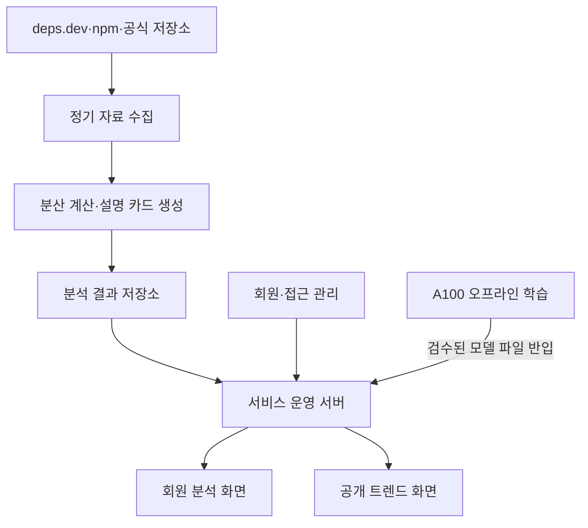
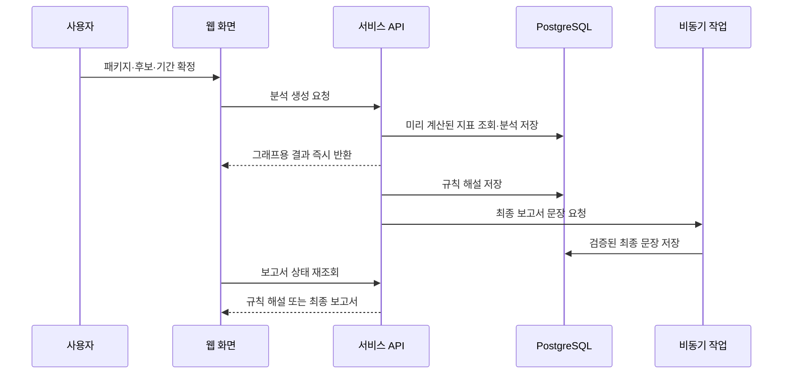
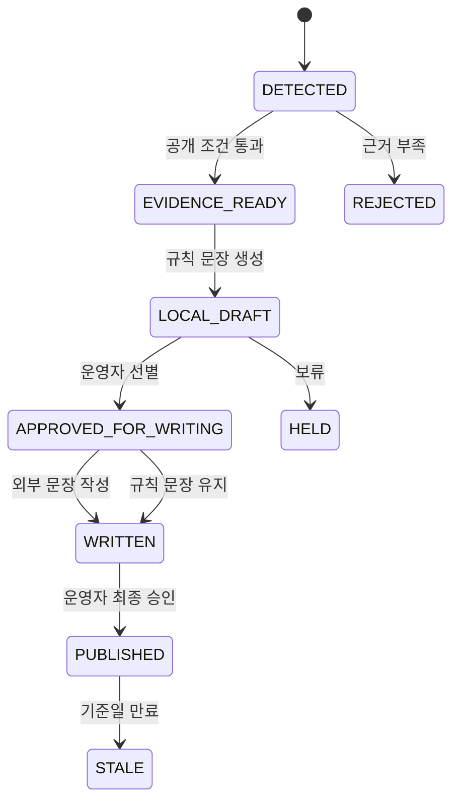
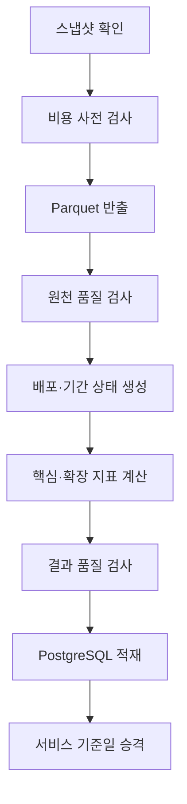

# OSS_Shift_기능별_개발_구상안_0831

작성 기준일: 2026-08-31  
문서 상태: 요구사항 명세서 작성 전 기술 구상안

이 문서는 `OSS_Shift_서비스_기획서.md`의 기능-01~16과 확장-01~09를 실제로 어떻게 만들지 정리한 초안이다. 제품 요구사항이나 기술 명세를 확정하기 전에, 사용할 자료·계산 방법·AI의 역할·실패 처리·검증 순서를 먼저 맞추는 데 목적이 있다.

## 목차

1. [결론](#결론)
2. [자료 분석에서 확인된 사실](#자료-분석에서-확인된-사실)
3. [권장 전체 구조](#권장-전체-구조)
4. [공통 자료 처리 방식](#공통-자료-처리-방식)
5. [MVP 기능별 개발 구상](#mvp-기능별-개발-구상)
6. [AI 비교 묶음 생성 구상](#ai-비교-묶음-생성-구상)
7. [확장 분석 기능 개발 구상](#확장-분석-기능-개발-구상)
8. [공개 패키지 트렌드 개발 구상](#공개-패키지-트렌드-개발-구상)
9. [분산 시스템 개발 구상](#분산-시스템-개발-구상)
10. [저장 구조와 연결 규격](#저장-구조와-연결-규격)
11. [개발 순서](#개발-순서)
12. [먼저 증명해야 할 것](#먼저-증명해야-할-것)

## 결론

OSS Shift는 사용자 요청이 들어올 때마다 4,600만 건이 넘는 배포 이력을 다시 계산하는 구조로 만들면 안 된다. 자료 수집과 대용량 계산은 정기 작업으로 미리 수행하고, 사용자가 화면에서 묶음과 기간을 정하면 이미 계산된 패키지별 결과를 빠르게 조합하는 구조가 적합하다.

AI도 전체 계산을 맡기면 안 된다. 역할은 다음 세 가지로 제한한다.

1. 대회에서 제공한 A100 학습 환경에서 패키지 설명의 유사성과 두 패키지의 관계를 판정하는 소형 모델을 학습한다.
2. 학습을 마친 모델 파일을 서비스 서버로 옮겨, 후보 검색과 관계 판정을 서비스 안에서 자체 실행한다.
3. 외부 토큰형 언어 모델은 서버가 확정한 수치와 경고를 최종 보고서·공개 글의 쉬운 문장으로 바꾸는 데만 사용한다.

현재 가장 현실적인 AI 비교 묶음 방식은 npm 전체를 한 번에 군집화하는 것이 아니다. 사용자가 입력한 패키지를 기준으로 후보를 넓게 찾은 뒤, 각 후보가 실제 대체재인지 하나씩 판정하는 **검색 후 재판정 방식**이다. 이 방식이 플러그인·연결 도구·다른 계층의 패키지가 섞이는 문제를 더 잘 통제한다.

학습 환경과 서비스 환경은 다음처럼 완전히 분리한다.

| **환경** | **하는 일** | **하지 않는 일** |
|---|---|---|
| 대회 A100 JupyterLab | 밖에서 준비한 학습 자료를 받아 모델 학습, 학습 결과 검증, 서비스용 모델 파일 내보내기 | 자료 수집, 서비스 요청 처리, 실시간 추론, 서비스 서버의 보조 장치 역할 |
| OSS Shift 서비스 서버 | 전달받은 모델 파일을 읽어 패키지 벡터 생성과 후보 관계 판정 | 재학습, 대회 A100 환경 호출 |
| 외부 토큰형 언어 모델 | 최종 보고서 문장, 운영자가 선별한 공개 이슈 글 작성 | 후보 검색, 패키지별 관계 판정, 숫자 계산, 사건 탐지 |

학습 장비와 서비스 사이에는 실시간 연결을 만들지 않는다. 학습이 끝나면 모델·글자 분해기·판정 기준점·학습 자료 해시·평가 결과·파일 해시를 하나의 배포 묶음으로 내보내고, 검수된 파일만 서비스 서버에 직접 반입한다.

모델명보다 중요한 것은 평가 자료다. 운영자 정의 묶음 3개만으로는 부족하므로, 30개 이상 역할에서 사람이 직접 정한 대체재·보조 도구·관련 없음 답안을 만들어 후보 검색률과 잘못 포함한 비율을 측정한 뒤 모델과 기준점을 확정해야 한다.

## 자료 분석에서 확인된 사실

### 이미 확인된 것

- 2026-08-24 deps.dev 자료에서 조건에 맞는 npm 정식 배포 버전 46,898,217건과 패키지 4,046,511개가 확인됐다.

- 배포 버전과 일반 의존 관계 요구 정보는 `(패키지명, 버전)`으로 연결할 수 있고, 검증 대상 46,898,217개 키에서 연결 누락이 없었다.

- 배포 버전별로 패키지명, 버전, 공개 시각, npm 의미 순서, 일반 의존 패키지명, 버전 조건을 얻을 수 있다.

- 날짜·시간, 기록, 통신의 3개 운영자 정의 묶음 12개 패키지는 실제 비교 계산을 수행할 자료가 존재한다.

- BigQuery 결과를 Parquet 파일로 내보내고 다시 읽는 경로는 작은 범위에서 확인됐다.

- 마이그레이션 계산은 260개 패키지 표본에서 전 과정을 실행했고 실제 이름 변경 쌍을 찾았다.

### 아직 확인되지 않은 것

- 전체 자료를 정기적으로 내보낼 때의 파일 크기, 처리 시간과 비용

- 전체 npm 규모에서 신규 선택·유지·이탈을 계산했을 때의 실제 결과와 분산 처리 성능

- 버전 조건 전체의 해석 가능 비율

- 전체 npm에서 의미 있는 마이그레이션 쌍이 얼마나 자주 나오는지

- AI 비교 묶음의 정확도와 역할별 편차

- 커뮤니티 자료의 최종 출처, 이용 조건과 갱신 주기

따라서 핵심 시계열 기능은 **자료 원천이 확인된 개발 과제**이고, AI 묶음·버전 고착·마이그레이션·공개 트렌드는 **계산법은 설계할 수 있으나 공개 전 별도 검증이 필요한 과제**다.

## 권장 전체 구조



### 온라인 서비스와 정기 계산을 분리한다

| **부분** | **하는 일** | **권장 구현** |
|---|---|---|
| 정기 자료 수집 | 같은 기준일의 deps.dev 자료를 고정하고 필요한 열만 반출 | BigQuery → Parquet와 실행 기록 |
| 분산 계산 | 배포 이력, 기간 상태, 신규 선택·유지·이탈, 확장 지표 계산 | Spark 작업 |
| 결과 제공용 저장 | 화면이 읽을 작은 집계 결과와 개인 분석 조건 보관 | PostgreSQL |
| AI 자료 검색 | 패키지 설명 벡터와 검색용 문장 저장 | PostgreSQL + pgvector로 시작 |
| 자체 모델 추론 | 반입된 소형 모델로 벡터 생성·후보 관계 판정 | ONNX Runtime 기반 별도 내부 서비스 |
| 서비스 운영 | 입력 확인, 회원 권한, 분석 생성, 상태와 오류 관리 | Python 기반 API 서버 권장 |
| 비동기 작업 | 자체 모델의 묶음 판정, 최종 보고서 문장, PDF 생성과 재시도 | Redis 기반 작업 대기열 또는 같은 역할의 관리형 서비스 |
| 외부 문장 작성 | 승인된 사실 묶음만 보내 최종 글 작성 | 용도·호출량이 제한된 외부 언어 모델 연결부 |
| 화면 | 랜딩, 입력, 비교 묶음, 보고서, 공개 트렌드 | React 계열 웹 화면 권장 |

핵심 원칙은 **사용자 요청 시 Spark를 새로 돌리지 않는 것**이다. Spark는 정기 작업에서 패키지별·기간별 지표를 미리 만들고, 사용자 지정 비교 묶음의 비중은 서비스 서버가 저장된 값들을 합쳐 계산한다.

### 기본 기술 조합

4주 안에 한 팀이 연결할 수 있고 이후 분산 구조로 확장할 수 있는 기본 조합은 다음과 같다.

| **영역** | **기본 선택안** | **구체적인 책임** |
|---|---|---|
| 웹 화면 | Next.js + TypeScript | 공개 랜딩, 회원 분석, 그래프, 인쇄 보고서, 공개 트렌드 |
| 서비스 API | FastAPI + Pydantic | 입력 검사, 권한, 분석 조합, AI 요청, 공개 API |
| 회원 인증 | 외부 OIDC 인증 + 서버 세션 쿠키 | 회원 식별, 로그인 유지, 보고서 소유권 확인 |
| 서비스 저장소 | PostgreSQL | 회원·묶음·분석·집계 결과·트렌드 게시 상태 |
| 벡터 검색 | PostgreSQL의 pgvector | 패키지 설명 카드의 의미 검색 |
| 자체 AI 실행 | ONNX Runtime CPU | 학습해 반입한 검색·관계 판정 모델 실행 |
| 짧은 비동기 작업 | Redis + Celery | 묶음 판정·최종 보고서 문장·PDF 생성·재시도·시간 제한 |
| 대용량 계산 | Apache Spark | 기간 상태, 행동 지표, 버전 고착, 마이그레이션, 트렌드 계산 |
| 작업 순서 관리 | Airflow | 자료 고정부터 품질 검사·결과 승격까지 작업 흐름 관리 |
| 분석 파일 | Google Cloud Storage의 Parquet | 원천 고정본·중간 결과·최종 집계 파일 |
| 원천 조회 | deps.dev BigQuery | npm 배포·의존 관계의 같은 기준일 자료 추출 |

웹·API·자체 모델 실행 코드는 하나의 저장소에서 시작해도 되지만, 실행 과정은 분리한다. Spark 계산과 자체 모델 추론은 각각 별도 실행 단위로 두며, API 서버가 내부 함수를 직접 실행하지 않고 내부 연결 규격으로 요청한다. 대회 A100 학습 환경을 가리키는 주소나 인증 정보는 서비스 설정에 두지 않는다.

### 온라인 요청의 실제 흐름



그래프용 숫자·규칙 해설·외부 언어 모델이 쓰는 최종 문장의 상태를 분리한다. 숫자 조회가 성공하면 외부 모델이 늦거나 호출 예산이 없어도 사용자는 그래프, 근거와 규칙 해설을 바로 볼 수 있어야 한다.

## 공통 자료 처리 방식

### 자료 층을 세 단계로 나눈다

| **자료 층** | **내용** | **주요 열** |
|---|---|---|
| 원천 고정 자료 | deps.dev에서 가져온 변경하지 않은 자료 | 기준일, 패키지, 버전, 공개 시각, 순서, 의존 이름·조건, 처리 오류 |
| 계산용 정리 자료 | 패키지별 배포 흐름과 기간 말 의존 상태 | 사용 주체, 대상 의존 패키지, 기간, 이전 상태, 현재 상태 |
| 화면용 결과 | 패키지별 시계열과 근거 수 | 현재 규모, 신규 선택, 유지, 이탈, 분모, 자료 상태 |

원천 추출은 다음 두 자료를 같은 `snapshot_date`로 고정해 수행한다.

| **원천 묶음** | **필수 값** | **사용처** |
|---|---|---|
| npm 배포 버전 | `Name`, `Version`, `VersionInfo.IsRelease`, `VersionInfo.Ordinal`, `UpstreamPublishedAt`, `DependenciesProcessed`, `DependencyError` | 배포 흐름, 정식 배포 판정, 오류 구분 |
| npm 의존 요구 | `Name`, `Version`, `Dependencies.Name`, `Dependencies.Requirement` | 일반 의존 상태와 버전 조건 복원 |
| 판정 보조 의존 | `PeerDependencies`, `OptionalDependencies` | 마이그레이션에서 일반 의존의 종류 이동 판정에만 사용 |

BigQuery 조회 작업은 아래 절차를 지켜야 한다.

1. 사용할 기준일을 `source_snapshot`에 먼저 예약한다.
2. 실행할 SQL과 예상 처리량을 dry-run으로 기록한다.
3. 허용 처리량을 넘으면 실제 쿼리를 실행하지 않는다.
4. 필요한 열만 Parquet으로 내보낸다.
5. 파일 수·전체 바이트·행 수·SQL 해시·BigQuery 작업 번호를 manifest에 저장한다.
6. 두 원천의 `(package_name, package_version)` 중복과 연결 누락을 검사한다.
7. 검사를 통과한 원천만 Spark 입력 위치로 승격한다.

중간 자료의 권장 경로는 다음과 같다.

```text
bronze/snapshot_date=YYYY-MM-DD/source=package_versions/*.parquet
bronze/snapshot_date=YYYY-MM-DD/source=npm_requirements/*.parquet
silver/snapshot_date=YYYY-MM-DD/dataset=release_state/package_bucket=000/*.parquet
silver/snapshot_date=YYYY-MM-DD/dataset=package_period_state/period=YYYY-QN/*.parquet
gold/snapshot_date=YYYY-MM-DD/metric=package_period/*.parquet
gold/snapshot_date=YYYY-MM-DD/metric=version_adoption/*.parquet
gold/snapshot_date=YYYY-MM-DD/metric=migration_pair/*.parquet
gold/snapshot_date=YYYY-MM-DD/metric=trend_window/*.parquet
gold/snapshot_date=YYYY-MM-DD/metric=trend_event/*.parquet
```

`bronze`는 다시 계산할 수 있는 원천 고정본, `silver`는 여러 지표가 함께 쓰는 계산용 상태, `gold`는 서비스가 읽을 최종 결과다. 서비스 API는 `bronze`와 `silver`를 직접 읽지 않는다.

각 결과에는 최소한 다음 기록을 붙인다.

- 자료 기준일
- 원천 SQL의 고정값 또는 해시값
- 계산 규칙 버전
- 비교 묶음 버전
- 작업 실행 번호와 완료 상태
- 포함·제외·오류 건수

### 핵심 시계열 상태를 만드는 방법

1. `System='NPM'`, 정식 배포, 공개 시각 존재 조건으로 배포 버전을 고정한다.
2. `DependenciesProcessed`와 `DependencyError`를 읽어 정상·빈 목록·처리 오류를 구분한다.
3. 패키지별 배포를 공개 시각과 npm 의미 순서로 정리한다.
4. 각 기간 말까지 공개된 배포 가운데 가장 높은 npm 의미 순서의 정식 배포를 그 기간의 대표 상태로 삼는다.
5. 그 대표 배포의 일반 의존 목록을 이전 기간 상태와 비교한다.
6. 한 사용 주체·대상 의존 패키지·기간은 한 표만 갖게 한다.

기간 대표 상태는 `Ordinal`을 이용한 주 흐름 근사 방식으로 만든다. 실제 개발 전에는 시간 순서와 의미 순서가 충돌하는 비율을 측정하고, 오래된 주버전의 뒤늦은 유지 배포가 현재 상태를 덮지 않는지 확인해야 한다.

구현할 때는 배포별 의존 목록을 `array<package_name, requirement>` 형태로 유지한 뒤 기간 대표 배포를 고른다. 먼저 모든 의존 관계를 행으로 펼치면 같은 배포 정보가 의존 수만큼 복제되어 정렬·셔플 양이 크게 늘어난다. 대표 배포가 정해진 뒤 비교 대상 의존 이름만 펼치는 편이 효율적이다.

기간 상태는 다음 상태값을 가진다.

| **상태값** | **판정** | **지표 처리** |
|---|---|---|
| `PRESENT` | 대표 배포의 일반 의존에 대상이 있음 | 규모·신규 선택·유지 계산 가능 |
| `ABSENT` | 요구 정보는 정상이고 대상이 없음 | 신규 선택·이탈 계산 가능 |
| `EMPTY` | 요구 정보는 정상이며 일반 의존 목록이 비어 있음 | 정상적인 없음 상태로 처리 |
| `UNKNOWN` | 요구 정보 연결 누락 또는 판정할 자료 부족 | 신규 선택·유지·이탈에서 제외 |
| `PROCESSING_ERROR` | 원천의 의존 처리 오류 | 제외 수로 기록하고 지표 분모에서 제외 |

상태 전이 표는 아래처럼 고정한다.

| **이전** | **현재** | **결과** |
|---|---|---|
| 없음·`ABSENT`·`EMPTY` | `PRESENT` | 신규 선택 |
| `PRESENT` | `PRESENT` | 유지 |
| `PRESENT` | `ABSENT`·`EMPTY` | 이탈 |
| `UNKNOWN`·`PROCESSING_ERROR` | 모든 상태 | 계산 제외 |
| 모든 상태 | `UNKNOWN`·`PROCESSING_ERROR` | 계산 제외 |

### 핵심 지표의 계산식

| **지표** | **계산** |
|---|---|
| 현재 규모 | 최근 대표 상태에서 대상 패키지를 일반 의존으로 가진 서로 다른 공개 패키지 수 |
| 신규 선택 | 이전 대표 상태에는 없고 현재 대표 상태에는 있는 사용 주체 수 |
| 유지 | 이전과 현재 대표 상태에 모두 있는 사용 주체 수 |
| 이탈 | 이전에는 있고 현재에는 없는 사용 주체 수. 처리 오류·관측 불가는 제외 |
| 유지율 | `유지 ÷ 이전 기간의 관측 가능한 기존 사용 주체` |
| 이탈률 | `이탈 ÷ 이전 기간의 관측 가능한 기존 사용 주체` |
| 묶음 내 신규 선택 비중 | `해당 패키지 신규 선택 ÷ 선택한 후보 전체 신규 선택` |

유지율과 이탈률은 같은 분모와 같은 관측 대상을 쓸 때만 함께 표시한다. 분모가 0이면 0%로 만들지 않고 계산 불가로 둔다.

## MVP 기능별 개발 구상

### 접근과 입력 기능

| **기능** | **개발 방법** | **저장·출력** | **실패 처리** |
|---|---|---|---|
| 기능-15 공개 랜딩 | 정적 내용을 우선 사용하고 검증된 서비스 설명·자료 범위·예시 그래프만 제공 | 페이지 내용 버전, 회원가입·로그인 이동 | 실제 계산 전 예시에는 ‘예시’ 표시 |
| 기능-16 회원가입·로그인 | 4주 일정에서는 직접 인증 체계를 만들지 말고 검증된 관리형 인증을 연결. 모든 분석 API에서 회원과 보고서 소유자 확인 | 사용자 식별값, 가입 시각, 동의 상태 | 화면 숨김이 아니라 서버에서 401·403 처리 |
| 기능-01 패키지명 입력 | npm 이름 규칙을 먼저 검사하고 정확한 이름으로 조회. 입력 중 추천은 캐시된 공개 패키지명에서 제공 | 정규화한 패키지명 | 오타, 형식 오류, 사설 주소를 분리 |
| 기능-02 존재·자료 확인 | npm 공개 레지스트리 또는 deps.dev API로 존재 확인 후 내부 자료 지원표 조회 | 존재 여부, 최신 공개 버전, 관측 시작·종료, 지원 상태 | ‘없는 패키지’와 ‘존재하지만 분석 자료 부족’을 구분 |
| 기능-03 비교 묶음 제안 | MVP는 버전이 붙은 운영자 정의 묶음 테이블에서 정확히 조회 | 묶음 이름, 후보, 선정 이유, 확인일 | 묶음이 없으면 직접 입력으로 이동 |
| 기능-04 후보 수정 | 사용자가 후보를 추가·제외하면 다시 존재·자료 확인. 원본 묶음은 바꾸지 않고 분석별 복사본 저장 | 최종 후보 목록과 수정 내용 | 후보 2개 미만이면 비교 시작 불가 |
| 기능-05 기간 선택 | 화면에서는 최근 1년·2년·3년과 직접 범위를 제공하되 MVP 그래프 단위는 분기를 기본으로 권장 | 시작·종료 기간, 분기 단위 | 공통 관측 기간이 없으면 가능한 범위 제안 |

패키지 존재 확인에는 공개 npm 패키지의 설명·주요 검색어·저장소 주소를 함께 저장한다. 이 값은 AI 비교 묶음 자료에도 재사용한다. 단, 존재 확인과 분석 자료 지원 여부는 별도 값이어야 한다.

#### 기능-15 공개 랜딩 구현 상세

- 자료: 운영자가 작성한 서비스 한 문장, 관측 범위, 기능 설명, 회원가입 문구, 검증된 예시 화면을 `landing_content`에 저장한다.
- API: 첫 화면은 정적 생성으로 제공하고, 변경이 필요한 내용만 `GET /public/landing`에서 읽는다.
- 화면: 문제 설명 → 입력 예시 → 결과 예시 → 관측 범위 → 회원가입 버튼 순서로 구성한다.
- 수치: 실제 분석 결과를 쓰려면 `snapshot_date`와 산출 작업 번호가 있는 값만 허용한다. 그렇지 않은 그래프에는 ‘화면 예시’ 표시를 붙인다.
- 측정: 회원가입 버튼 클릭률과 랜딩에서 이탈한 구간만 수집하며, 입력 패키지나 개인 분석 정보는 공개 분석 도구에 보내지 않는다.
- 검증: 로그인하지 않은 브라우저에서 랜딩 외의 분석 주소를 직접 열었을 때 분석 내용이 한 줄도 내려오지 않아야 한다.

#### 기능-16 회원가입·로그인 구현 상세

- 로그인: 외부 OIDC 인증에서 받은 사용자 식별값을 내부 `user_account.id`와 연결한다.
- 세션: 브라우저 자바스크립트가 읽을 수 없는 `HttpOnly`, `Secure`, `SameSite=Lax` 쿠키를 사용한다.
- 권한: `analysis.owner_user_id`, `report.owner_user_id`를 모든 조회 조건에 포함한다.
- API: 비로그인 요청은 `401`, 다른 회원의 자료 요청은 `404`로 처리해 존재 여부도 감춘다.
- 로그아웃: 서버 세션과 새로 고침 토큰을 폐기하고 브라우저 쿠키를 삭제한다.
- 검증: 회원 A의 분석 주소를 회원 B와 비회원이 요청하는 자동 검사를 필수로 둔다.

#### 기능-01·02 패키지명 입력과 존재 확인 구현 상세

1. 화면은 입력값의 앞뒤 공백을 제거하고 300ms 동안 추가 입력이 없을 때만 추천 요청을 보낸다.
2. 일반 이름과 `@scope/name` 형식을 구분하고 URL·파일 경로·버전이 붙은 입력은 패키지명으로 오해하지 않는다.
3. API는 `package_catalog` 캐시를 먼저 보고, 없거나 24시간이 지난 경우 npm Registry에서 정확한 이름을 조회한다.
4. npm에 존재하면 deps.dev API 또는 내부 `package_data_support`에서 배포 수·관측 시작일·관측 종료일을 확인한다.
5. 결과를 아래 네 상태로 반환한다.

| **상태** | **뜻** | **화면 처리** |
|---|---|---|
| `READY` | npm에 존재하고 비교할 관측 자료가 충분함 | 분석 진행 |
| `LIMITED` | 존재하지만 기간·배포·의존 근거가 적음 | 가능한 기간과 경고 표시 |
| `NO_DATA` | npm에는 존재하지만 내부 분석 자료 없음 | 분석 중단, 직접 자료 없음 안내 |
| `NOT_FOUND` | 공개 npm에서 확인되지 않음 | 철자 재확인과 비슷한 이름 제안 |

추천 목록에는 `package_name`, 설명 한 줄, 최신 공개 버전, 폐기 표시만 보여 준다. 추천 결과를 AI가 임의 생성하지 않으며, 서버가 확인한 패키지만 선택할 수 있다.

#### 기능-03·04 비교 묶음 제안과 수정 구현 상세

- 운영자 묶음은 `cohort`, `cohort_version`, `cohort_package` 세 표로 관리한다.
- 입력 패키지가 여러 묶음에 속하면 역할 이름과 선정 이유를 함께 보여 주고 사용자가 하나를 고른다.
- 후보마다 `포함 이유`, `공식 확인일`, `분석 가능한 최초·최종 기간`, `자료 상태`를 제공한다.
- 사용자가 후보를 추가하면 기능-01·02와 같은 존재·자료 검사를 다시 수행한다.
- 사용자가 수정한 목록은 원본 묶음을 바꾸지 않고 `analysis_candidate`에 복사한다.
- 분석 생성 시 `cohort_version_id`와 최종 후보 순서를 저장해 나중에 운영자 묶음이 바뀌어도 기존 보고서가 달라지지 않게 한다.
- 같은 후보 중복, 입력 패키지 제외, 후보 2개 미만, 자료가 겹치는 기간 없음은 서버에서 거부한다.

#### 기능-05 기간 선택 구현 상세

- 기본 단위는 분기다. 월 단위는 모든 후보의 월별 근거가 공개 기준을 충족할 때만 확장한다.
- 기본 선택은 최근 8개 완결 분기다. 진행 중인 분기는 화면에서 별도 표시하고 기본 비교에서는 제외한다.
- 사용자 직접 범위는 모든 후보의 공통 관측 시작일 이후, 원천 기준일 이전으로 제한한다.
- API는 `available_from`, `available_to`, `complete_periods`, `partial_periods`를 반환한다.
- 기간을 바꾸면 Spark 작업을 다시 실행하지 않고 `package_period_metric`의 조회 범위만 바꾼다.

### 계산과 화면 기능

| **기능** | **개발 방법** | **화면에 반드시 함께 표시** |
|---|---|---|
| 기능-06 현재 규모 | 미리 계산한 최신 패키지별 규모 조회 | 기준일, 서로 다른 사용 주체 수 |
| 기능-07 신규 선택 | 이전·현재 기간 상태 차이에서 없음→있음 집계 | 기간별 원값, 묶음 내 비중, 근거 수 |
| 기능-08 유지 | 있음→있음 집계 | 유지 수, 기존 사용 주체 분모, 유지율 |
| 기능-09 이탈 | 있음→없음 집계. 오류·관측 불가 제외 | 이탈 수, 분모, 제외 수 |
| 기능-10 시계열 그래프 | 서버가 후보별 동일 기간 배열을 반환하고 화면은 같은 축으로 그림 | 단위, 분모, 빈 기간, 부분 관측 표시 |

#### 기능-06 현재 규모 구현 상세

- Spark가 가장 최근 완결 기간의 `PRESENT` 상태를 대상 의존 패키지별로 합산한다.
- 동일한 공개 패키지가 여러 배포 버전을 가져도 한 번만 센다.
- API는 원값, 전체 관측 가능 패키지 수, 처리 오류 제외 수, 기준일을 함께 반환한다.
- 화면은 후보별 막대그래프와 정확한 원값을 함께 보여 준다. 내려받기 수나 실제 실행량으로 표현하지 않는다.

#### 기능-07 신규 선택 구현 상세

- `ABSENT 또는 EMPTY → PRESENT` 전이만 센다.
- 공개 패키지가 한 분기에 여러 번 추가·제거해도 기간 말 상태 기준 한 표만 갖는다.
- 후보별 원값과 묶음 신규 선택 합계로 묶음 내 비중을 계산한다.
- 묶음 전체 신규 선택이 0이면 비중을 0%로 만들지 않고 `null`과 ‘계산할 신규 선택 없음’을 반환한다.

#### 기능-08 유지 구현 상세

- `PRESENT → PRESENT` 전이를 유지로 센다.
- 분모는 이전 기간에 `PRESENT`였고 현재 기간도 정상 관측 가능한 공개 패키지다.
- 유지율은 `retained / previous_observable_adopters`로 계산한다.
- 화면에서는 유지 원값·유지율·분모를 함께 보여 주고, 분모가 다른 후보의 비율만 단순 비교하지 않도록 한다.

#### 기능-09 이탈 구현 상세

- `PRESENT → ABSENT 또는 EMPTY`만 이탈로 센다.
- 현재 기간이 `UNKNOWN` 또는 `PROCESSING_ERROR`인 항목은 이탈로 세지 않는다.
- 이탈률은 유지율과 동일한 분모를 사용한다. 같은 분모라면 `유지 + 이탈 = 이전의 관측 가능한 기존 사용 주체`가 되어야 한다.
- 일반 의존에서 peer·optional로 옮긴 관계는 MVP 핵심 지표에서는 이탈로 보일 수 있으므로, 화면에 일반 의존만 본다는 한계를 표시한다. 확장 마이그레이션에서는 이를 별도 종류 이동으로 바로잡는다.

#### 기능-10 시계열 그래프 구현 상세

- API는 모든 후보에 동일한 `periods[]` 배열을 사용하고 값이 없는 기간은 행 자체를 빼지 않고 `status`를 함께 둔다.
- 현재 규모는 막대 또는 면, 신규 선택·유지·이탈은 선 그래프로 분리해 서로 다른 분모의 지표를 한 축에 억지로 겹치지 않는다.
- 후보 색상은 분석 안에서 고정하고 표·그래프·인쇄물에서 동일하게 사용한다.
- 마우스 도움말에는 원값, 비중, 분모, 제외 수, 기준일을 표시한다.
- 범례에서 후보를 끄더라도 계산 결과나 보고서 문장은 바뀌지 않는다.
- 화면이 그리는 숫자와 보고서가 사용하는 숫자는 동일한 API 응답의 `metric_result_id`를 참조한다.

화면용 연결 규격은 그래프 모양이 아니라 사실을 기준으로 만든다.

```json
{
  "package": "winston",
  "period": "2026-Q2",
  "current_presence": 0,
  "switch_in": 0,
  "retained": 0,
  "exited": 0,
  "previous_observable_adopters": 0,
  "cohort_switch_in_share": null,
  "support_status": "OK",
  "source_snapshot_date": "YYYY-MM-DD"
}
```

위 숫자는 형식 예시이며 실제 결과가 아니다.

### 설명·보고서·작업 상태

| **기능** | **개발 방법** | **안전 장치** |
|---|---|---|
| 기능-11 결과 해설 | 서버가 숫자 차이·방향·자료 부족을 판정하고 정해진 문장 틀로 즉시 설명 | 외부 언어 모델 호출 없이 같은 숫자에는 같은 설명 생성 |
| 기능-12 보고서 | 웹 보고서 화면을 인쇄용 스타일로 구성하고 같은 내용을 인쇄·PDF 저장에 사용 | 화면과 인쇄 결과의 숫자 출처를 하나로 유지 |
| 기능-13 근거와 한계 | 모든 지표에 기준일·기간·분모·제외 수·규칙 버전·묶음 버전 제공 | 근거가 없는 문장을 표시하지 않음 |
| 기능-14 작업 상태·오류 | 분석, 규칙 해설과 최종 보고서 문장 작업을 별도 상태로 관리 | 외부 모델 실패·예산 소진 시 규칙 문장으로 완료 |

AI에 보내기 전에 서버가 다음과 같은 사실 묶음을 만든다.

```json
{
  "allowed_facts": [
    {"fact_id": "F1", "text": "최근 기간의 신규 선택 비중이 기준 기간보다 높다"},
    {"fact_id": "F2", "text": "근거 패키지 수가 표시 기준을 충족한다"}
  ],
  "forbidden_claims": ["기술적으로 우수하다", "곧 사라진다", "교체 원인이 이것이다"],
  "warnings": []
}
```

외부 언어 모델을 쓰는 최종 보고서 출력은 `제목`, `핵심 변화`, `주의사항`, `사용한 fact_id` 구조로 받는다. 입력에 없는 fact_id가 나오거나 숫자가 원값과 다르면 폐기하고 규칙 문장으로 되돌린다.

#### 기능-11 결과 해설 처리 순서

1. API가 후보별 최근 기간과 기준 기간의 원값·비중·차이를 읽는다.
2. 규칙 엔진이 `증가`, `감소`, `변화 작음`, `자료 부족`, `누적 규모와 최근 흐름 불일치` 사실을 생성한다.
3. 사실마다 `fact_id`, 숫자, 단위, 근거 기간을 붙인다.
4. 문장 틀이 사실 종류·수치·후보명을 조합해 화면용 3~5문장을 즉시 만든다.
5. 같은 사실 묶음을 최종 보고서 글 작성 작업의 입력으로 저장한다.
6. 사용자가 보고서를 처음 열거나 PDF를 요청할 때만 외부 언어 모델 작업을 한 번 등록한다.
7. 외부 모델은 화면의 모든 구역을 한 요청으로 작성하며, 서버가 숫자와 `fact_id`를 다시 검사한다.
8. 검사 실패·시간 초과·예산 보류 시 규칙 문장을 그대로 사용한다.

외부 호출의 고유키는 `fact_pack_hash + prompt_version + external_model_id`로 만든다. 성공 결과를 영구 재사용하고 같은 분석의 화면·인쇄·PDF가 각각 다시 호출하지 않게 한다. 입력은 축약된 사실 JSON만 보내며, 초기 제한은 입력 4,000토큰, 출력 1,200토큰, 재시도 1회로 둔다. 일별·월별 금액 한도와 용도별 허용 목록을 넘으면 작업을 만들지 않는다.

#### 기능-12 보고서 생성 방식

- 보고서는 별도 편집 문서가 아니라 분석 결과 API를 읽는 웹 경로 `/analyses/{id}/report`로 만든다.
- 보고서 구성은 분석 조건 → 비교 묶음 → 핵심 수치 → 시계열 그래프 → 해설 → 계산 방법과 한계 순서로 고정한다.
- 인쇄용 CSS에서 화면용 메뉴·버튼을 숨기고 A4 폭, 페이지 나눔, 그래프 최소 높이를 지정한다.
- PDF 다운로드가 필요하면 Celery 작업이 Playwright로 같은 보고서 경로를 열어 PDF로 만든다.
- PDF에는 `analysis_id`, 자료 기준일, 묶음 버전, 계산 규칙 버전을 바닥글에 표시한다.
- 보고서 숫자는 HTML을 다시 읽어 계산하지 않고 저장된 분석 결과 JSON을 그대로 사용한다.

#### 기능-13 근거와 한계 표시 방식

- 분석 결과 화면 안에 ‘방법과 근거’ 접이 영역을 둔다. 별도 페이지로 이동시키지 않는다.
- 지표마다 계산 대상, 분자, 분모, 제외 수, 빈 값 이유를 제공한다.
- 전체 분석에는 자료 기준일, 공통 관측 기간, 비교 묶음 생성 방식, 사용자가 수정한 후보를 표시한다.
- 외부 원천의 전체 행이나 회원이 입력한 원문은 노출하지 않는다.
- 사용자가 CSV로 근거를 내려받을 경우 화면에 사용된 집계 행만 제공한다.

#### 기능-14 작업 상태와 재시도 방식

분석과 해설 상태를 분리한다.

| **상태** | **뜻** | **화면** |
|---|---|---|
| `RULE_EXPLANATION_READY` | 숫자·그래프·규칙 해설 완료 | 결과 즉시 표시 |
| `REPORT_TEXT_QUEUED` | 최종 보고서 문장 대기 | 규칙 해설과 함께 ‘문장 정리 중’ 표시 |
| `REPORT_TEXT_READY` | 검증된 최종 문장 완료 | 최종 보고서 표시 |
| `BUDGET_HOLD` | 호출 예산 한도 도달 | 규칙 문장으로 보고서 완료 |
| `FALLBACK_TEMPLATE` | 외부 모델 실패 또는 검증 실패 | 규칙 문장으로 보고서 완료 |
| `PARTIAL` | 숫자는 있으나 일부 후보·기간 자료 부족 | 가능한 결과와 경고 표시 |
| `FAILED` | 숫자 조회 자체 실패 | 재시도 버튼과 오류 번호 |

외부 문장 작업은 최대 실행 시간과 재시도 1회를 둔다. 같은 호출 고유키의 중복 작업은 하나로 합친다. 실패해도 규칙 해설이 있으므로 보고서는 완료 상태로 전환한다. 자동으로 더 비싼 모델을 호출하거나, 묶음 판정용 자체 모델이 실패했다는 이유로 외부 언어 모델을 대신 호출하지 않는다.

## AI 비교 묶음 생성 구상

적용 기능: **확장-02 AI 비교 묶음 제안**

### 묶음의 정의부터 고정한다

같은 비교 묶음은 단순히 관련 있는 패키지 모음이 아니다. 다음 조건을 만족하는 **직접 대안 집합**으로 정의한다.

- 주된 사용 목적이 같다.
- 같은 실행 환경에서 사용된다. 예: Node.js 서버, 브라우저, 둘 다.
- 같은 기술 계층에 있다. 예: 기록 도구와 기록 전송 플러그인을 섞지 않는다.
- 일반적인 사용 상황에서 한 후보를 다른 후보 대신 선택할 수 있다.
- 입력 패키지를 반드시 필요로 하는 플러그인·연결 도구는 제외한다.
- 이름이 비슷하거나 함께 설치된다는 이유만으로 포함하지 않는다.

AI 판정값은 다음 중 하나로 제한한다.

| **판정값** | **뜻** | **묶음 처리** |
|---|---|---|
| 직접 대안 | 같은 핵심 일을 대신 수행 | 포함 후보 |
| 일부 대안 | 특정 환경·범위에서만 대체 | 별도 표시 후 사용자 선택 |
| 후속·이름 변경 | 사실상 이어지는 패키지 | 포함 가능, 관계 표시 |
| 플러그인·연결 도구 | 입력 패키지를 확장하거나 연결 | 제외 |
| 함께 쓰는 보조 도구 | 대체가 아니라 조합 관계 | 제외 |
| 다른 역할 | 관련 단어는 있으나 핵심 일이 다름 | 제외 |
| 판단 자료 부족 | 근거 부족 | 자동 포함 금지 |

### 어디서 어떤 자료를 가져오는가

| **원천** | **가져올 정보** | **사용 목적** | **주의점** |
|---|---|---|---|
| npm 공개 레지스트리 | 이름, 최신 버전, 설명, 주요 검색어, 저장소, 홈페이지, 폐기 표시, README | 존재 확인, 검색 후보 생성, 역할 파악 | 작성자가 적은 설명이므로 과장·누락 가능 |
| deps.dev API·BigQuery | 버전 목록, 공개 시각, 의존 관계 지원, 현재·과거 관측 | 분석 가능 여부와 계산 | 기능 유사성 판단의 주 자료로 사용하지 않음 |
| 공식 저장소 | 저장소 설명, 주제, README | 실행 환경·핵심 기능·플러그인 관계 확인 | npm이 연결한 저장소만 사용 |
| 운영자 정의 묶음 | 역할, 포함·제외 이유, 변경 이력 | AI의 기준 답안과 예시 | 3개 묶음만으로는 평가 부족 |
| 마이그레이션 결과 | X 제거와 Y 추가의 높은 배수 | 후속·실제 교체 후보의 보조 근거 | 기능이 같다는 단독 증거가 아님 |

GitHub 전체에서 패키지명으로 무작정 검색하지 않는다. 동명이인과 우연한 언급이 많기 때문이다. npm 정보에 연결된 공식 저장소만 읽는다.

자료 수집기는 아래 호출 단위를 사용한다.

| **수집기** | **호출·입력** | **저장 결과** | **갱신** |
|---|---|---|---|
| npm 패키지 정보 | `GET https://registry.npmjs.org/{url_encoded_package_name}` | 설명, 주요 검색어, 저장소, 홈페이지, 버전, 폐기 표시, README 해시 | 신규 후보 즉시, 기존 후보 7일 |
| npm 후보 검색 | `GET https://registry.npmjs.org/-/v1/search?text={role_terms}&size=100` | 검색어별 실제 후보명·설명·검색 점수 | AI 묶음 요청 시, 결과 24시간 캐시 |
| deps.dev 패키지 확인 | `GET /v3/systems/npm/packages/{url_encoded_package_name}` | 버전 존재와 기본 버전 | 신규 후보 즉시, 7일 |
| GitHub 저장소 | npm의 `repository.url`을 `owner/repo`로 정규화 후 저장소 조회 | 설명, topics, 기본 브랜치, 보관 여부 | 7일 |
| GitHub README | 확인된 `owner/repo`의 README 조회 | 추출한 소개·기능·실행 환경 문장과 원문 해시 | 7일 또는 저장소 갱신 시 |

HTTP 응답의 `ETag`와 `Last-Modified`를 저장해 바뀌지 않은 자료를 다시 내려받지 않는다. `404`, 비공개 전환, 사용 제한, 시간 초과를 서로 다른 상태로 기록한다.

첫 AI 확장에서는 공개 npm 전체 400만 개를 미리 벡터화하지 않는다. 역할 검색어로 npm 후보를 요청하고, 실제로 반환된 후보의 설명 카드와 벡터를 생성해 캐시한다. 기존에 처리한 후보·운영자 묶음·마이그레이션 후보가 쌓이면 로컬 벡터 검색 범위가 점차 넓어진다. 검색 재현율이 부족하다고 확인된 뒤에만 별도의 전체 활성 패키지 색인을 검토한다.

후보는 아래 조건을 확인한다.

- 공개 npm에 현재 존재한다.
- 이름과 설명 가운데 하나 이상이 있다.
- npm 폐기 표시 여부를 알고 있다. 폐기 패키지는 검색에서 지우지 않고 경고를 붙인다.
- deps.dev에서 비교 기간에 필요한 관측 자료가 있는지 상태를 계산한다.
- 플러그인·타입 정의·설정 묶음 여부를 설명 카드에 별도 표시한다.

역할 유사성과 분석 가능성을 분리한다. 기능은 같지만 관측 자료가 적은 새 패키지는 ‘직접 대안·자료 부족’으로 보여 줄 수 있고, 분석 그래프 후보에는 자동 포함하지 않는다.

### 패키지 설명 카드 만들기

원문 전체를 모델에 넣지 않고 패키지마다 짧은 설명 카드를 만든다. 이 과정은 운영 중 외부 언어 모델을 호출하지 않는다. npm 설명·주요 검색어와 README의 정해진 위치에서 문장을 그대로 뽑고, 사전과 규칙으로 실행 환경·패키지 종류·플러그인 흔적을 표시한다.

```json
{
  "package_name": "winston",
  "description": "npm description 원문",
  "keywords": [],
  "repository_url": "공식 저장소 주소",
  "card_text": "description, keywords, README 소개·제목을 정해진 순서로 합친 문장",
  "runtime_hints": ["node"],
  "kind_hints": ["library"],
  "peer_or_plugin_targets": [],
  "evidence": [
    {"source_id": "NPM_DESCRIPTION", "text": "근거 문장", "position": 1}
  ],
  "fetched_at": "YYYY-MM-DD",
  "content_hash": "..."
}
```

카드 생성 순서는 다음과 같다.

1. npm 설명, 주요 검색어와 공식 저장소 topics를 원문 그대로 저장한다.
2. README에서 첫 소개 문단, `features`, `usage`, `why`, `about`, 실행 환경 제목 아래의 첫 1~3문장을 추출한다.
3. 배지·목차·변경 기록·기여 안내·후원·긴 코드 블록·설치 명령 반복은 제거한다.
4. `plugin`, `transport`, `adapter`, `preset`, `types` 같은 말과 대상 패키지명이 함께 나오면 패키지 종류의 규칙 신호로 저장한다.
5. 각 문장에 원천 ID와 위치를 붙이고, 정제 결과의 해시를 만든다.
6. `package_name`, `description`, `keywords`, `topics`, 추출 문장을 구분 기호로 합쳐 `card_text`를 만든다.

학습 자료를 만들 때 사람이 `core_job`, `runtime`, `package_kind`를 붙일 수 있지만, 서비스의 새 카드에서 생성형 모델이 이 값을 새로 지어내게 하지 않는다. 검색 모델과 관계 판정 모델이 원문 카드 자체를 읽게 한다. README는 신뢰하지 않는 외부 입력으로 취급하며, 그 안의 명령을 실행하거나 모델 지시로 해석하지 않는다.

### 검색 후 재판정 절차

1. 입력 패키지의 공개 존재와 공식 저장소를 확인한다.
2. 입력 패키지의 설명·주요 검색어·README 제목에서 명사와 역할 표현을 규칙으로 뽑는다.
3. 역할 표현과 주요 검색어로 npm 검색 후보를 모은다.
4. 서비스 서버의 자체 검색 모델로 설명 카드 벡터를 만들고 가까운 후보를 모은다.
5. 운영자 정의 묶음과 마이그레이션 결과에서 알려진 후보를 추가한다.
6. 중복을 없애고 존재하지 않음·폐기·설명 없음 상태를 표시한다.
7. 서비스 서버의 자체 쌍 판정 모델이 입력 패키지와 각 후보를 직접 대안·일부 대안·플러그인·다른 역할 등으로 판정한다.
8. 서버가 후보의 존재, 공식 근거, 분석 자료 지원 여부를 다시 확인한다.
9. 통과 후보만 사용자에게 이유와 함께 보여 주고 사용자가 최종 확정한다.

검색 후보 합치기는 다음 순서로 한다.

1. 입력 패키지 역할 문장·주요 검색어로 npm 검색 상위 100개
2. 이미 만들어진 패키지 설명 카드의 전체 문장 검색 상위 50개
3. 캐시된 패키지 설명 벡터의 코사인 유사도 상위 50개
4. 기존 운영자 묶음의 같은 역할 후보
5. 검증된 마이그레이션 상위 후보 최대 20개
6. 이름 기준 중복 제거 후 최대 150개로 제한
7. 설명 카드와 벡터가 없는 후보를 서비스 서버에서 비동기로 생성
8. 1차 규칙으로 입력 패키지 자신, 명백한 타입 정의, 입력 패키지에 의존하는 플러그인을 표시
9. 벡터·문장 검색으로 30개까지 줄인 뒤 자체 쌍 판정 모델로 관계 판정
10. 직접 대안·일부 대안 상위 10개에 규칙 검증과 기준점 적용
11. 최종 3~7개를 사용자에게 제안

입력 패키지에 직접 의존하는 후보는 플러그인일 가능성이 높으므로 자동 포함하지 않는다. 다만 `depends_on_target=true`만으로 완전히 제외하지 않고 쌍 판정 모델의 입력 신호와 서버 검증에 사용한다. 이름 변경 패키지처럼 예외가 있을 수 있기 때문이다.

### 왜 전체 npm 군집화를 주 방식으로 쓰지 않는가

전체 문장 벡터를 자동 군집화하면 ‘기록’, ‘서버’, ‘HTTP’처럼 넓은 말이 비슷한 패키지를 한데 모을 수 있다. 그러나 사용자가 원하는 것은 관련 패키지가 아니라 **바로 비교할 수 있는 대체 후보**다. 또한 플러그인과 본체는 공개 설명에서 같은 단어를 많이 쓰기 때문에 벡터 거리만으로는 자주 붙는다.

따라서 군집화는 새 역할을 탐색하거나 운영자가 묶음을 정리할 때만 보조적으로 사용한다. 사용자 요청에는 입력 패키지를 중심으로 한 후보 검색과 쌍별 판정을 사용한다.

### 모델별 역할

외부 토큰형 모델이 아니라 A100에서 학습하고 서비스 서버로 반입할 두 개의 소형 모델을 사용한다.

| **단계** | **시작 모델·방법** | **학습 위치** | **서비스 실행 위치** | **출력** |
|---|---|---|---|---|
| 설명 카드 | 원문 추출·정제 규칙 | 학습 없음 | 서비스 서버 | 근거 ID가 붙은 검색 문장 |
| 넓은 후보 검색 | `BAAI/bge-small-en-v1.5` 계열 문장 검색 모델 | 필요할 때만 A100에서 추가 학습 | 서비스 서버 CPU | 384차원 벡터와 상위 후보 |
| 문장·단어 합산 | PostgreSQL 문장 검색 + pgvector | 학습 없음 | 서비스 서버 | 최대 30개 후보 |
| 후보 관계 판정 | `cross-encoder/ms-marco-MiniLM-L6-v2`의 마지막 판정부를 7가지 관계로 교체 | A100에서 전체 추가 학습 | 서비스 서버 CPU | 관계값과 관계별 점수 |
| 포함·제외 이유 | 관계값·규칙 신호·원문 근거를 문장 틀에 대입 | 학습 없음 | 서비스 서버 | 사용자용 짧은 이유 |

두 시작 모델은 영어 npm 설명과 README를 다루기 쉽고 서비스 CPU에서 실행 가능한 크기를 우선한 선택이다. 실제 채택은 다른 소형 공개 모델과 같은 정답 자료로 비교한 뒤 결정한다. 생성형 모델을 후보마다 실행하는 구조는 채택하지 않는다.

### 학습 자료를 만드는 방법

최소 30개 역할에서 역할당 4~10개 패키지를 고르고 두 명이 독립적으로 관계를 붙인다. 학습용 한 행은 대상 패키지 카드, 후보 패키지 카드, 관계값, 양쪽 근거 ID로 구성한다. 수집·정제·사람 판정은 OSS Shift의 별도 자료 준비 환경에서 끝내며, 확정한 학습 파일만 대회 A100 JupyterLab로 가져간다.

| **관계 표본** | **만드는 방법** | **이유** |
|---|---|---|
| 직접 대안·일부 대안 | 운영자 묶음과 사람이 확인한 역할별 패키지의 모든 쌍 | 포함해야 할 관계 학습 |
| 후속·이름 변경 | 폐기 안내, 공식 저장소 안내와 검증된 마이그레이션 관계 | 교체와 단순 유사를 구분 |
| 플러그인·연결 도구 | 대상 패키지에 직접 의존하며 이름·설명에 plugin, transport, adapter가 있는 후보를 사람이 확인 | 가장 위험한 잘못 포함 학습 |
| 함께 쓰는 보조 도구 | 같은 역할 검색에 잡히지만 다른 계층에서 함께 사용하는 후보 | 관련 있음과 대체 가능 구분 |
| 다른 역할 | npm 검색 상위, 벡터 검색 상위의 어려운 오답과 무작위 비관련 후보 | 쉬운 오답만 학습하는 문제 방지 |
| 판단 자료 부족 | 설명·README·공식 저장소 근거가 부족한 실제 사례 | 모를 때 자동 포함하지 않도록 학습 |

첫 학습 목표량은 중복을 제거한 5,000~20,000쌍으로 둔다. 이는 확정 요구량이 아니라 학습 곡선을 확인하기 위한 시작 범위다. 한 패키지 또는 같은 역할의 거의 동일한 쌍이 학습·시험 양쪽에 섞이지 않도록 **역할 단위로** 학습·검증·시험 자료를 나눈다. 임의의 쌍 단위 분할은 같은 패키지 설명을 미리 본 모델을 시험해 성능이 부풀 수 있으므로 쓰지 않는다.

검색 모델 추가 학습 자료는 `(대상 카드, 직접 대안 카드, 검색 상위의 어려운 오답 카드)` 세 문장으로 만든다. 관계 판정 모델은 `(대상 카드, 후보 카드, 7가지 관계값)`으로 학습한다. 모든 표본에는 자료 기준일, 카드 해시, 작성자, 합의 상태와 관계 기준 버전을 남긴다.

### A100 학습 순서와 중단 기준

1. 추가 학습 없이 시작 모델의 후보 찾기 성공률과 관계 판정 정확도를 먼저 측정한다.
2. 관계 판정 모델을 먼저 7가지 관계 분류로 학습한다. 시작값은 최대 512토큰, 유효 묶음 크기 64, 학습률 `1e-5~2e-5`, 2~4회 반복으로 두고 검증 손실과 위험한 잘못 포함을 함께 본다.
3. 검색 상위 20개의 후보 찾기 성공률이 95%에 못 미칠 때만 검색 모델을 추가 학습한다. 시작값은 최대 512토큰, 유효 묶음 크기 128, 학습률 `2e-5`, 1~3회 반복이다.
4. 매 반복이 끝날 때 모델, 설정, 자료 해시와 평가표를 JupyterLab 세션 밖의 지속 저장 공간에 저장한다.
5. 시험 역할의 상위 5개 직접 대안 정확도 90% 이상, 플러그인·다른 역할의 잘못 포함 5% 이하를 함께 만족하는 가장 작은 모델을 배포 후보로 고른다.
6. 목표를 만족하지 못하면 더 큰 생성형 모델로 바로 바꾸지 않고, 틀린 표본을 플러그인·다른 계층·근거 부족·후속 패키지로 나눠 학습 자료와 관계 기준을 고친다.

위 학습률·묶음 크기·반복 횟수는 첫 실험값이며 성능을 보장하는 값이 아니다. A100에서는 확정 자료 읽기, 학습, 학습 결과 검증과 파일 내보내기까지만 수행한다. npm·GitHub 자료 수집기를 돌리거나 서비스 요청을 받지 않는다.

### 모델 파일 내보내기와 서비스 반입

학습을 마친 뒤 아래 파일을 하나의 버전 폴더로 만든다.

```text
models/cohort-model-YYYYMMDD-vN/
  retriever/model.onnx
  retriever/tokenizer/*
  classifier/model.onnx
  classifier/tokenizer/*
  labels.json
  thresholds.json
  model-manifest.json
  evaluation.json
  SHA256SUMS
```

`model-manifest.json`에는 기본 모델, 학습 설정, 자료 해시, 관계 기준 버전, 입력 최대 길이, 출력 차원, 양자화 여부, 사용 허가와 생성 시각을 기록한다. 원본 정확도 비교용 파일과 CPU 실행용 ONNX 정수 8비트 파일을 함께 만들고, 경량화 후 후보 찾기 성공률·관계 정확도가 각각 1%p를 넘게 나빠지면 정수 8비트 파일을 승격하지 않는다.

서비스 반입 절차는 다음과 같다.

1. 전송한 폴더의 `SHA256SUMS`와 파일 수를 검증한다.
2. 서비스와 분리된 시험 환경에서 모델을 읽고 고정된 100개 입력의 출력 해시·평가값을 다시 확인한다.
3. `model_registry`에 버전, 파일 위치, 해시, 기준점, 평가값을 `CANDIDATE`로 등록한다.
4. 내부 자체 모델 서비스가 후보 버전을 미리 읽어 메모리 사용량, 한 건·30쌍의 처리 시간과 동시 요청을 측정한다.
5. 검사 통과 뒤 새 요청만 새 버전을 쓰도록 `ACTIVE` 포인터를 한 번에 바꾼다.
6. 문제가 생기면 파일을 다시 학습하지 않고 직전 `ACTIVE` 버전으로 포인터를 되돌린다.

서비스에는 `POST /internal/models/embed`와 `POST /internal/models/classify` 두 내부 연결만 둔다. API가 후보마다 새 실행 파일을 띄우지 않고, 자체 모델 서비스가 시작할 때 모델을 한 번 읽어 여러 문장을 묶음 처리한다. 기본 실행 장치는 CPU이며 ONNX Runtime을 사용한다. 서비스 서버에 GPU가 있는 경우에만 같은 모델의 실행 장치를 바꾸는 별도 성능 검증을 한다.

### 후보 점수는 이렇게 사용한다

후보 점수는 내부 순서를 정하는 데만 사용하고 사용자에게 ‘유사도 87%’처럼 사실인 것처럼 보여 주지 않는다.

기본 점수안은 다음과 같다. 아래 비중은 초기 실험을 시작하기 위한 값이며 평가 결과에 따라 바꾸되, 변경 전후와 이유를 기록한다.

```text
기본 점수 = 문장 벡터 유사성 40%
          + 역할 단어 검색 점수 20%
          + 자체 쌍 판정 모델의 직접 대안 점수 40%

선택 보너스 = 검증된 마이그레이션 관계 최대 10%
```

마이그레이션 자료가 없다고 감점하지 않는다. 새 패키지에는 이력이 적기 때문이다. 내려받기 수·별표·현재 규모는 기능 유사성 점수에 넣지 않는다. 인기와 같은 역할인지는 다른 질문이기 때문이다.

최종 통과 기준점은 임의로 정하지 않는다. 사람이 만든 정답 자료에서 **잘못 포함하는 후보를 줄이는 방향**으로 기준점을 고른다.

자체 쌍 판정 모델의 점수는 서로 다른 관계 사이의 내부 정렬값이지 사실 확률로 표시하지 않는다. 학습에 쓰지 않은 시험 역할에서 관계별 기준점을 정하며, 판정 점수가 기준점 주변의 보류 구간에 있으면 `needs_human_review=true`로 둔다. 내부 순서는 다음 키로 정한다.

1. `DIRECT_ALTERNATIVE` 점수가 공개 기준점을 통과
2. 근거 문장이 입력·후보 양쪽에 존재
3. 같은 실행 환경과 같은 패키지 종류
4. 기본 점수
5. 분석 자료 지원 상태

모델이 `DIRECT_ALTERNATIVE`로 판정해도 서버 검증에서 후보가 없거나 공식 근거가 비어 있으면 사용자에게 노출하지 않는다. 모델이 가리키는 근거 문장을 생성하게 하지 않고, 양쪽 카드에서 단어 겹침과 역할 표현이 큰 원문 1~2개를 규칙으로 골라 함께 표시한다.

### AI 결과의 정해진 출력

```json
{
  "target": "winston",
  "retriever_model_version": "...",
  "classifier_model_version": "...",
  "threshold_version": "...",
  "candidates": [
    {
      "package_name": "pino",
      "relationship": "DIRECT_ALTERNATIVE",
      "decision_band": "AUTO_INCLUDE",
      "evidence_ids": ["TARGET_NPM_DESCRIPTION", "CANDIDATE_README_INTRO"],
      "analysis_support": "SUPPORTED"
    }
  ],
  "excluded": [],
  "needs_human_review": false
}
```

자체 모델은 새로운 패키지명을 만들지 않는다. 서버가 앞 단계에서 확인한 후보 쌍의 관계만 계산한다.

#### AI 묶음 요청과 캐시

```text
POST /cohort-suggestions
GET  /cohort-suggestions/{job_id}
```

요청 고유키:

```text
target_package
+ target_card_hash
+ candidate_catalog_version
+ retriever_model_version
+ classifier_model_version
+ relationship_schema_version
+ threshold_version
```

동일 고유키의 성공 결과는 재사용한다. 상태는 `COLLECTING`, `EMBEDDING`, `CLASSIFYING`, `VERIFYING`, `READY`, `NEEDS_REVIEW`, `FAILED`로 나눈다.

- npm 후보 검색이 실패하면 운영자 묶음·캐시 후보만 사용하고 범위가 좁다는 경고를 붙인다.
- README를 가져오지 못하면 npm 설명과 주요 검색어만으로 판단하되 `evidence_level=LOW`로 둔다.
- 자체 검색 모델이 실패하면 PostgreSQL 문장 검색만으로 후보를 고르되 자동 묶음으로 승격하지 않는다.
- 자체 관계 판정 모델이 실패하면 운영자 묶음, 이전에 검수된 캐시 또는 직접 입력으로 돌아간다.
- 후보 수집·판정 전체가 정한 시간 안에 끝나지 않으면 화면은 작업 상태를 보여 주고 사용자가 직접 후보를 입력할 수 있게 한다.
- 자체 모델 실패 시 외부 토큰형 언어 모델을 대신 호출하지 않는다.

대회 A100 환경의 접속 실패나 종료는 서비스 장애가 아니다. 서비스는 이미 반입해 `ACTIVE`로 승격한 모델 파일만 사용하며, 다음 학습본을 반입하기 전까지 기존 버전을 계속 사용한다.

### AI 묶음 평가 기준

먼저 30개 이상 역할과 역할당 4~10개 패키지를 사람이 분류한다. 두 명이 독립적으로 판단하고 불일치 항목만 합의한다.

| **평가 항목** | **초기 공개 목표안** |
|---|---|
| 후보 찾기 성공률 | 정답 대체재의 95% 이상이 검색 상위 20개 안에 존재 |
| 최종 후보 정확도 | 상위 5개 중 직접 대안이 90% 이상 |
| 위험한 잘못 포함 | 플러그인·관련 없음 포함이 5% 이하 |
| 존재하지 않는 이름 | 0건 |
| 반복 안정성 | 같은 자료·모델·기준점에서 최종 묶음이 100% 동일 |
| 사용자 수정률 | 자동 후보의 대규모 수정이 20% 미만 |
| 서비스 CPU 처리 | 카드가 준비된 요청에서 30쌍 관계 판정의 p95가 정한 서비스 시간 안에 완료 |
| 경량화 손실 | 원본 대비 후보 찾기·관계 정확도 하락이 각각 1%p 이하 |

이 수치는 검증 전 제품 목표안이며, 실제 정확도가 아니다. 목표에 못 미치면 AI 묶음을 기본 방식으로 전환하지 않는다.

## 확장 분석 기능 개발 구상

### 확장-01 package.json 입력

가장 안전한 방식은 브라우저에서 파일을 읽고 `dependencies`의 이름만 추출하는 것이다. 서버에는 사용자가 최종 선택한 공개 npm 패키지명만 보낸다.

처리 순서는 다음과 같다.

1. JSON 형식과 파일 크기를 브라우저에서 확인한다.
2. 최상위 `dependencies`만 읽는다.
3. `npm-package-arg`와 npm 이름 규칙으로 공개 이름·별칭·주소·사설 항목을 구분한다.
4. 공개 npm에서 확인되는 이름만 선택 목록에 표시한다.
5. 사설 주소·공개 확인 실패 이름은 AI와 서버 분석 요청에서 제외한다.
6. 사용자가 하나를 선택하면 기존 패키지명 입력 흐름으로 보낸다.

원문 저장은 기본적으로 하지 않는다. 분석 대상이 여러 개일 때도 한 번에 전수 분석하지 않고 사용자가 하나씩 선택하게 한다.

구현 상세:

- 화면은 파일 선택과 붙여넣기 두 방식을 제공한다.
- 초기 파일 크기 제한은 1MB로 두고 초과 시 서버로 전송하지 않은 채 브라우저에서 안내한다.
- JSON 최상위 객체와 `dependencies` 객체 여부를 검사한다. 주석이 있는 JSON이나 문법 오류는 자동 보정하지 않는다.
- 각 항목을 `PUBLIC_NPM`, `NPM_ALIAS`, `TAG_OR_RANGE`, `GIT_URL`, `FILE_PATH`, `PRIVATE_OR_UNKNOWN`으로 분류한다.
- `npm:real-package@^1` 별칭은 화면에 별칭과 실제 공개 이름을 함께 보여 주되 분석 대상은 실제 공개 이름으로 확인한다.
- 서버 호출은 사용자가 체크한 이름만 `POST /packages/bulk-resolve`에 최대 50개씩 보낸다.
- 브라우저 오류 기록에는 전체 파일 내용이나 패키지 목록을 넣지 않고 오류 코드·파일 크기·행 위치만 남긴다.
- 분석은 한 번에 한 패키지만 시작하고, 나머지는 ‘다음 분석 후보’ 목록으로만 유지한다.

검증 항목:

- 정상 JSON, 빈 dependencies, 1MB 초과, 문법 오류, scoped 패키지, npm alias, Git 주소, 로컬 경로
- 브라우저 네트워크 기록에 원문이 남지 않는지
- 공개 확인 실패 이름이 AI 묶음 요청으로 넘어가지 않는지

### 확장-03 버전 고착

버전 조건을 문자열 앞자리만 잘라 분류하면 안 된다. `^`, `~`, 범위 결합, 별칭, 태그, 저장소 주소가 있기 때문이다.

권장 처리 순서:

1. `npm-package-arg`로 조건 종류를 버전·범위·태그·별칭·주소·기타로 분류한다.
2. 버전과 범위는 npm이 사용하는 `node-semver`로 해석한다.
3. 대상 패키지가 기준일 이전에 실제 공개한 정식 버전 목록과 조건을 대조한다.
4. 허용 가능한 주버전이 하나면 해당 주버전에 한 표를 준다.
5. 여러 주버전을 허용하면 ‘여러 주버전’, 해석할 수 없으면 ‘알 수 없음’으로 둔다.
6. 사용 주체별 최신 대표 상태만 한 표로 센다.
7. 최신 주버전 공개 뒤 경과 기간, 이전·최신 주버전 비중, 해석 불가 비중과 근거 수를 함께 표시한다.

0.x 패키지는 첫째 자리만으로 묶으면 변화가 가려질 수 있으므로 부버전까지 주요 계열로 본다. 예를 들어 0.3과 0.4를 서로 다른 전환 계열로 집계한다.

‘고착’이라는 이름은 화면 제목으로 쓸 수 있지만, 업데이트하지 않은 이유나 위험을 뜻하지 않는다고 명시한다.

#### 버전 조건 처리 구조

전체 Spark 행에서 Node.js 도구를 매번 실행하지 않는다. 먼저 `(dependency_name, requirement_string)`의 서로 다른 조합을 뽑아 파싱 캐시를 만든다.

```text
requirement_parse_cache
- dependency_name
- requirement_string
- spec_type
- parse_status
- allowed_major_lines[]
- parser_version
- parsed_at
```

처리 순서:

1. Spark가 최신 대표 상태에서 서로 다른 조건 문자열을 추출한다.
2. Node.js 배치 작업이 `npm-package-arg`로 조건 종류를 분류한다.
3. semver 버전·범위는 `node-semver`로 실제 공개 버전 목록과 교차한다.
4. 허용하는 정식 버전이 없으면 `NO_MATCHING_RELEASE`, 여러 계열이면 `MULTI_LINE`, 주소·별칭·태그를 안전하게 역사 시점으로 풀 수 없으면 `UNRESOLVED_SPEC`로 둔다.
5. Spark가 파싱 캐시를 broadcast join해 사용 주체별 버전 계열 표를 만든다.
6. 사용 주체·대상 패키지별 최신 대표 상태 한 건만 집계한다.

초기 화면:

- 대상 패키지의 최신 정식 주버전과 공개일
- 최신 계열·이전 계열·여러 계열·해석 불가의 가로 막대
- 각 비중의 공개 패키지 수
- 새 주버전 공개 후 경과 개월
- 파싱 성공률과 해석 불가 예시

검증에는 `^5.0.0`, `~5.1.0`, `>=4 <6`, `4 || 5`, 정확한 버전, `*`, `latest`, npm alias, Git 주소, file 경로, 0.x 범위를 포함한다. 파서 버전이 바뀌면 같은 조건 표본의 결과를 이전 버전과 대조한다.

### 확장-04 마이그레이션 현황

마이그레이션은 아래 순서와 규칙으로 계산한다.

1. 사용 주체의 배포를 주버전 계열로 나눈다. 0.x는 부버전까지 같은 계열 기준으로 삼는다.
2. 계열 안에서 공개 시각 순으로 연속 배포를 연결한다.
3. 일반 의존의 제거 목록과 추가 목록을 구한다.
4. 제거된 이름이 다음 배포의 peer·optional 의존으로 옮겨갔으면 ‘종류 이동’으로 분리한다.
5. 제거 한 건의 1표를 같은 배포의 추가 개수로 나눈다.
6. `X 제거 시 Y 추가 비율 ÷ 전체 변경에서 Y 추가 비율`로 배수를 구한다.
7. 같은 배포 주체가 한 달에 같은 변경을 반복하면 한 표로 줄인다.
8. 최소 제거 사건·표·배수 기준을 통과한 쌍만 제공한다.

분산 계산은 `사용 주체 패키지` 기준으로 나눠 릴리즈 이력을 같은 작업에 모은다. 이후 `제거 패키지` 기준 집계에서 인기 패키지 쏠림이 생길 수 있으므로 두 단계 집계와 소금값 분할을 검토한다.

공개 전에는 다음 5개 알려진 관계를 정답지로 검증한다.

- `request` → `axios` 또는 `got`
- `node-sass` → `sass`
- `tslint` → `eslint`
- `enzyme` → `@testing-library/react`
- `moment` → `dayjs` 또는 `date-fns`

같은 배포에서 제거와 추가가 함께 나타났다는 뜻이지 실제 전환 완료나 원인을 증명하는 것은 아니다.

#### 마이그레이션 계산 산출물

```text
migration_transition
- actor_package
- actor_group
- release_line
- from_version
- to_version
- published_at
- removed_packages[]
- added_packages[]
- reclassified_packages[]

migration_pair_metric
- from_package
- to_package
- weighted_votes
- removal_events
- unique_actor_groups
- conditional_rate
- background_add_rate
- lift
- period_start
- period_end
- evidence_status
```

`actor_group`은 다음 우선순위로 만든다.

1. `@scope/package`이면 scope
2. npm Registry에 연결된 저장소가 있으면 `owner/repo`
3. 둘 다 없으면 개별 패키지명

동일 `actor_group`, `from_package`, `to_package`, 달의 반복 전환은 한 표로 줄인다.

저장소 정보를 전체 400만 패키지에 미리 요청하지 않는다. 분산 계산이 먼저 제거·추가 후보 사건을 만들면, 그 사건에 등장한 배포 주체만 npm Registry 등록 정보를 묶음 조회해 `actor_group` 연결표를 완성한다. 이 연결표는 스냅샷별로 공유하고, 저장소 주소가 바뀐 패키지만 다시 확인한다.

초기 공개 후보 조건안:

- 제거 사건 20건 이상
- 가중 표 5표 이상
- 고유 배포 주체 3곳 이상
- 배수 5 이상
- peer·optional 종류 이동 제외 완료

위 값은 전체 분포를 확인하기 위한 시작값이다. 임계값별로 알려진 관계 재현율과 우연 쌍 수를 표로 비교한 뒤 확정한다.

보고서에는 다음을 보여 준다.

- ‘X 제거가 관측된 배포 주체 N곳’
- 함께 추가된 Y별 가중 비중과 고유 주체 수
- 대체 후보 없이 제거된 비중
- 배수와 배경 추가 비율
- 같은 배포에서 함께 바뀐 관계라는 한계
- 근거가 적거나 한 조직에 집중된 경우 경고

사용자가 한 쌍을 열면 공개 패키지명·버전·변경 시각까지만 근거 예시로 보여 주고, 원인을 AI가 추정하지 않는다.

## 공개 패키지 트렌드 개발 구상

공개 트렌드는 인터넷 기사를 수집해 다시 쓰는 기능이 아니다. deps.dev에서 계산한 선택 변화와 npm에 연결된 공식 저장소의 공개 논의를 정해진 규칙으로 탐지하고, 그 결과를 소식 형태로 보여 주는 기능이다.

### 공개 트렌드의 네 가지 사건

| **사건 종류** | **답하려는 질문** | **주요 원천** | **기본 비교 기간** |
|---|---|---|---|
| `FIRST_RELEASE_CHOICE` | 처음 공개된 패키지는 같은 역할 후보 중 무엇을 선언했는가 | 배포 버전·일반 의존 | 최근 180일 대 이전 180일 |
| `SWITCH_IN_RISE` | 같은 역할 후보 중 신규 선택 비중이 빠르게 늘었는가 | 기간별 신규 선택 | 최근 90일 대 이전 90일 |
| `SWITCH_IN_FALL` | 신규 선택이 줄었거나 이탈이 늘었는가 | 기간별 신규 선택·이탈 | 최근 90일 대 이전 90일 |
| `COMMUNITY_SURGE` | 공식 저장소의 새 논의와 참여자가 평소보다 늘었는가 | GitHub Issues·Discussions | 최근 30일 대 이전 90일의 30일 환산값 |

기간은 초기 기준안이다. 실제 자료 갱신 주기와 근거 분포를 확인한 뒤 `trend_rule_version`으로 고정한다. 사건을 본 뒤 특정 패키지가 올라오도록 기간을 바꾸지 않는다.

이 장의 30·90·180일은 분기 집계를 나눠 근사하지 않는다. `release_state`에서 UTC 00:00:00 경계로 날짜 창을 직접 잘라 `trend_window_metric`을 만든다. 예를 들어 기준일이 2026-08-31이면 최근 90일은 2026-06-03부터 2026-08-31까지, 이전 90일은 2026-03-05부터 2026-06-02까지로 두고 시작일은 포함·종료일은 포함하는 규칙을 전 작업에 동일하게 적용한다.

### 트렌드 자료 수집기

#### 1. 패키지·저장소 연결 수집기

1. npm Registry에서 `name`, `description`, `keywords`, `repository`, `homepage`, `deprecated`, 최신 버전을 가져온다.
2. `repository.url`의 `git+`, `.git`, 하위 경로를 정리해 `github_owner`, `github_repo`로 변환한다.
3. GitHub 저장소가 실제로 존재하는지 확인하고 보관 상태·기본 브랜치·마지막 갱신 시각을 저장한다.
4. 하나의 저장소에 여러 npm 패키지가 연결되면 `mapping_scope=REPOSITORY`로 표시한다.
5. npm 정보에 연결되지 않은 저장소를 패키지명 검색으로 임의 연결하지 않는다.

저장 결과:

```text
package_source_map
- package_name
- npm_repository_url
- github_owner
- github_repo
- mapping_scope: PACKAGE | REPOSITORY
- mapping_status: VERIFIED | MISSING | INVALID | PRIVATE
- verified_at
```

#### 2. GitHub Issues 수집기

- 대상: `mapping_status=VERIFIED`인 공개 저장소
- 주기: 하루 1회
- 가져올 값: 이슈 번호, 제목, 생성·종료·갱신 시각, 작성자, 댓글 수, 반응 수, 라벨, 원문 주소
- 제외: 응답에 `pull_request` 항목이 있는 Pull Request
- 봇 처리: 작성자 유형이 Bot이거나 이름이 `[bot]`으로 끝나면 `is_bot=true`
- 저장: 이슈 번호를 저장소 안의 고유키로 사용해 중복 갱신
- 삭제·접근 불가: 원문을 복제하지 않고 상태만 `SOURCE_UNAVAILABLE`로 변경

#### 3. GitHub Discussions 수집기

- 대상: Discussions 기능이 켜진 검증 저장소
- 주기: 하루 1회
- 가져올 값: 토론 번호, 제목, 범주, 생성·갱신 시각, 작성자, 댓글 수, 반응 수, 답변 여부, 원문 주소
- 기능 미사용: 오류로 보지 않고 `DISCUSSIONS_NOT_ENABLED`로 저장
- 페이지 처리: 마지막 수집 시각 이후 생성·갱신된 항목을 커서 방식으로 끝까지 읽음

#### 4. 수집량과 호출 제한 관리

- 저장소별 `last_collected_at`과 다음 커서를 보관한다.
- HTTP 조건부 요청을 사용해 바뀌지 않은 저장소의 응답 본문을 다시 받지 않는다.
- 남은 호출량이 기준 아래로 내려가면 중요도가 낮은 저장소 수집을 다음 실행으로 미룬다.
- 한 저장소 실패가 전체 수집을 멈추지 않도록 저장소 단위 작업으로 나눈다.
- 실패 상태는 `RATE_LIMITED`, `NOT_FOUND`, `FORBIDDEN`, `TIMEOUT`, `PARSE_ERROR`로 구분한다.

수집 대상은 무조건 전체 npm이 아니다. 1차는 운영자가 승인한 역할 묶음의 패키지와 해당 저장소, 2차는 최근 선택 변화 규칙에서 후보로 올라온 패키지다. 대상 목록은 `source_collection_target`에 선정 이유·우선순위·다음 수집 시각을 저장한다. 그런 다음 100~500개 저장소로 하루 호출량·재시도·비용을 먼저 측정하고 단계적으로 늘린다.

### 확장-06 지금 시작하는 패키지의 선택

#### 계산 대상

1. `System=NPM`, 정식 배포, 공개 시각 존재 조건을 충족한다.
2. 공개 패키지마다 가장 이른 정식 배포 한 건을 고른다.
3. 첫 배포의 일반 의존 처리 상태가 정상이거나 빈 목록이어야 한다.
4. 첫 배포 시각이 최근 180일 또는 그 이전 180일에 포함돼야 한다.
5. 승인된 역할 묶음의 후보를 하나 이상 일반 의존으로 선언해야 역할별 비중의 분모에 포함한다.

#### 표 계산

역할 묶음 `C`에 후보가 `K`개 있고, 첫 배포 패키지 `q`가 그중 `m`개를 선언했다면 각 후보는 `1/m`표를 받는다.

```text
candidate_vote(q, p) = 1 / m
recent_share(p) = recent_votes(p) / recent_total_votes(C)
baseline_share(p) = baseline_votes(p) / baseline_total_votes(C)
change_pp(p) = (recent_share - baseline_share) × 100
```

같은 첫 배포가 HTTP 후보 두 개를 함께 선언하면 각각 0.5표를 받는다. 한 공개 패키지가 역할 묶음 전체에서 갖는 표의 합은 1을 넘지 않는다.

#### 첫 배포 선택의 초기 공개 조건

- 최근 기간에 묶음 후보를 하나 이상 선언한 첫 배포 30개 이상
- 후보별 최근 가중 표 5표 이상 또는 비교 화면에서 ‘근거 적음’ 표시
- 첫 배포 전체 수, 후보 선언 첫 배포 수와 두 값의 비율을 함께 표시
- 정식 배포 처리 오류가 있는 첫 배포는 제외 수로 표시

30개·5표는 개발을 시작하기 위한 기준안이다. 전체 분포를 확인해 역할별로 너무 많은 결과가 사라지거나 작은 수가 과대 표시되지 않는지 검증한 뒤 확정한다.

#### 첫 배포 선택 화면 표시

목록 카드는 다음 값을 보여 준다.

- 역할 이름: 예) HTTP 통신
- 제목: ‘처음 공개된 패키지에서 undici 선택 비중이 커졌습니다’
- 최근 비중과 이전 비중
- 변화한 퍼센트포인트
- 최근 첫 배포 근거 수
- 자료 기준일
- ‘처음 공개된 npm 패키지 기준’ 표시

상세 화면에는 후보 전체 막대그래프, 최근·이전 표, 계산 방법, 포함·제외 수를 제공한다. ‘신규 회사 프로젝트’나 ‘전체 개발팀의 선택’으로 표현하지 않는다.

### 확장-07 빠르게 증가·감소하는 패키지

#### 역할별 신규 선택 증가 탐지

승인된 묶음 안에서 패키지 `p`의 신규 선택 비중을 최근 90일과 이전 90일로 비교한다.

작은 분모를 보정하기 위해 후보가 `K`개인 묶음에 디리클레 사전값 1을 사용한다.

```text
recent_adjusted_share(p) = (recent_switch_in(p) + 1) / (recent_cohort_switch_in + K)
baseline_adjusted_share(p) = (baseline_switch_in(p) + 1) / (baseline_cohort_switch_in + K)
adjusted_change_pp = (recent_adjusted_share - baseline_adjusted_share) × 100
```

최근·이전 비중을 각각 베타 분포로 보고 고정된 난수 씨앗으로 10,000회 표본을 만들어 `최근 비중 > 이전 비중`일 가능성을 계산한다. 같은 입력에서는 항상 같은 결과가 나오게 한다.

초기 증가 사건 조건:

- 최근과 이전 묶음 신규 선택 합계 30 이상
- 최근 패키지 신규 선택 5 이상
- 보정 비중 차이 3퍼센트포인트 이상
- `최근 비중 > 이전 비중` 가능성 95% 이상
- 직전 월 단위 비교에서도 같은 방향이거나, ‘한 기간 급등’ 표시

#### 신규 선택 감소와 이탈 증가를 분리한다

‘빠르게 감소’는 한 종류로 합치지 않는다.

| **표시** | **탐지 조건** | **뜻** |
|---|---|---|
| 신규 선택 감소 | 최근 비중이 이전보다 낮을 가능성 95% 이상, 차이 -3퍼센트포인트 이하 | 새로 선언되는 경쟁 비중 감소 |
| 이탈 증가 | 최근 이탈률이 이전보다 높을 가능성 95% 이상, 근거 수 충족 | 기존 선언이 빠지는 비율 증가 |
| 둘 다 발생 | 두 조건을 모두 충족 | 신규 선택과 기존 관계가 함께 약해지는 관측 |

이탈 증가는 후보 묶음 내 비중이 아니라 각 패키지의 이전 관측 가능한 사용 주체를 분모로 계산한다. 신규 선택 감소와 이탈 증가는 서로 분모가 다르므로 하나의 선 그래프로 합치지 않는다.

#### 순위 정렬

불투명한 100점 점수를 사용자에게 제공하지 않는다. 내부 목록 순서는 다음 기준으로 정한다.

1. 증가·감소 가능성
2. 보정 비중의 절대 변화
3. 최근 원값과 전체 근거 수
4. 두 연속 기간에서 같은 방향인지
5. 자료 기준일

각 카드는 순위를 만든 원값을 그대로 보여 준다. 역할이 다른 패키지는 같은 비중 순위에 섞지 않고, 역할 이름과 함께 묶는다.

#### 선택 증가·감소 화면 표시

- 상단 탭: ‘새 선택 증가’, ‘새 선택 감소’, ‘이탈 증가’
- 필터: 역할, 최근 기간, 최소 근거 상태
- 카드: 패키지명, 역할, 최근·이전 값, 변화, 근거 수, 지속 여부
- 상세: 시계열, 후보 전체 비교, 현재 규모, 신규 선택·이탈을 분리한 해설
- 주의: 기술 품질·미래 성공·추천을 뜻하지 않는다는 고정 문구

### 확장-08 커뮤니티 논의

#### 계산 단위

패키지와 공식 저장소가 일대일이면 패키지 단위로 표시한다. 하나의 저장소가 여러 패키지를 관리하면 제목과 카드에 ‘저장소 전체 논의’라고 표시하고 특정 패키지의 문제로 단정하지 않는다.

최근 30일과 이전 90일을 비교한다. 이전 90일 값은 30일 기준으로 환산한다.

```text
baseline_30d_threads = baseline_90d_threads / 3
thread_ratio = (recent_30d_threads + 3) / (baseline_30d_threads + 3)
baseline_30d_comments = baseline_90d_comments / 3
comment_ratio = (recent_30d_comments + 5) / (baseline_30d_comments + 5)
```

3과 5는 작은 값의 과도한 배수를 줄이기 위한 초기 보정값이다.

#### 참여자와 봇 보정

- 새 이슈·토론의 고유 작성자 수를 계산한다.
- 댓글 작성자의 고유 수를 별도로 계산한다.
- 봇이 만든 글·댓글은 전체 원값에는 기록하지만 사람 참여자 수와 공개 급증 판정에서는 제외한다.
- 한 작성자가 최근 새 글의 40%를 넘으면 `AUTHOR_CONCENTRATION` 경고를 붙인다.
- 저장소 이전·대량 가져오기처럼 하루에 비정상적으로 많은 과거 글이 생성된 경우 운영자 검토로 보낸다.

#### 커뮤니티 사건의 초기 공개 조건

- 최근 30일 새 이슈·토론 합계 10개 이상
- 봇을 제외한 고유 작성자 5명 이상
- `thread_ratio >= 1.5` 또는 `comment_ratio >= 1.5`
- 저장소 연결 상태 `VERIFIED`
- 최근 수집 성공 시각이 48시간 이내

조건을 만족해도 긍정·부정 감정이나 품질 점수를 계산하지 않는다. 제목은 ‘논의량 증가’로만 표현한다.

#### 원문 선정

상세 페이지에는 최근 원문 최대 5개를 보여 준다.

1. 봇 작성 글 제외
2. 댓글 수와 고유 참여자 수가 높은 순
3. 같은 제목·같은 작성자의 반복 글은 하나로 축약
4. 제목, 종류, 생성일, 댓글 수, 원문 주소만 표시
5. 최종 문장 작성기가 원문 내용을 인용하거나 원인을 요약할 경우 반드시 해당 원문 ID를 결과에 포함

### 확장-09 트렌드 이슈 리포트

#### 사건 생성과 게시 흐름



`trend_event`는 탐지 규칙이 만들고, 외부 언어 모델은 사건을 새로 만들거나 공개 조건을 바꾸지 않는다. 사건을 탐지할 때마다 호출하지 않고, 운영자가 실제 게시 후보로 고른 사건에만 한 번 호출한다.

#### AI에 전달할 사실 묶음

```json
{
  "event_type": "SWITCH_IN_RISE",
  "package_name": "example-package",
  "cohort_name": "HTTP 통신",
  "recent_period": "YYYY-MM-DD/YYYY-MM-DD",
  "baseline_period": "YYYY-MM-DD/YYYY-MM-DD",
  "facts": [
    {"fact_id": "F1", "metric": "recent_share", "value": 0.0, "unit": "ratio"},
    {"fact_id": "F2", "metric": "baseline_share", "value": 0.0, "unit": "ratio"},
    {"fact_id": "F3", "metric": "support", "value": 0, "unit": "packages"}
  ],
  "source_ids": [],
  "forbidden_claims": ["원인 단정", "품질 평가", "미래 예측", "최종 추천"]
}
```

위 값은 연결 형식 예시이며 실제 수치가 아니다.

자료 검사 직후에는 서버의 문장 틀이 `title`, `summary`, `why_detected`, `caution`을 채워 `LOCAL_DRAFT`를 만든다. 운영자가 `APPROVED_FOR_WRITING`으로 바꾼 사건만 외부 언어 모델에 보낸다. 한 요청에서 제목과 본문 전체를 작성하며, 출력은 `title`, `summary`, `why_detected`, `caution`, `used_fact_ids`, `used_source_ids`로 제한한다. 서버는 모든 ID가 입력에 있는지 검사하고 숫자 문자열을 원값과 대조한다.

호출 고유키는 `event_fact_hash + writing_prompt_version + external_model_id`다. 성공 글은 다시 호출하지 않는다. 예산 한도, 시간 초과나 검증 실패가 발생하면 `LOCAL_DRAFT`를 그대로 최종 검토 화면에 올리며 사건 공개를 막지 않는다.

#### 트렌드 목록 화면 - 확장-05

공개 주소는 `/trends`로 두고 회원 여부와 관계없이 읽게 한다.

화면 구성:

1. 상단: ‘npm 패키지 선택 변화’ 설명과 최근 자료 기준일
2. 사건 탭: 전체·첫 배포 선택·새 선택 증가·새 선택 감소·이탈 증가·커뮤니티 논의
3. 역할 필터: 운영자 승인 묶음의 역할 이름
4. 최신 사건 카드 목록
5. 자료 갱신 상태와 계산 범위
6. 회원 분석으로 이동하는 패키지 분석 버튼

카드 공통 항목:

- 사건 종류와 역할
- 패키지명 또는 저장소명
- 규칙 문장 또는 운영자가 승인한 최종 제목
- 최근 값, 이전 값, 변화
- 근거 수
- 자료 기준일
- ‘분석 보기’ 또는 ‘원문 보기’ 버튼

목록 API:

```text
GET /public/trends
  ?event_type=SWITCH_IN_RISE
  &cohort_id=...
  &cursor=...
  &limit=20
```

응답은 공개 승인된 `PUBLISHED` 상태만 반환한다. 정렬은 `published_at DESC, event_id DESC`로 고정해 커서 페이지가 중복되지 않게 한다.

#### 트렌드 상세 화면

1. 제목·자료 기준일·사건 종류
2. 최근 값과 이전 값 요약 카드
3. 최근 8개 기간의 시계열
4. 같은 역할 후보 전체 비교
5. 사건을 탐지한 계산식과 공개 조건
6. 포함·제외·오류 수
7. 커뮤니티 사건이면 원문 목록
8. 해석 한계
9. 해당 패키지를 회원 분석 화면에 넣는 버튼

상세 페이지는 `trend_rule_version`, `source_snapshot_id`, `metric_result_id`를 내부적으로 보관한다. 동일 URL의 과거 사건 내용은 새 자료로 덮어쓰지 않고 새 사건으로 발행한다.

### 트렌드 작업 주기

| **작업** | **권장 주기** | **결과** |
|---|---|---|
| npm·저장소 연결 확인 | 7일, 신규 후보는 즉시 | `package_source_map` |
| GitHub Issues·Discussions 수집 | 매일 | `community_source_item` |
| deps.dev 핵심 지표 갱신 | 새 스냅샷 확인 시 | `package_period_metric` |
| 첫 배포·증가·감소 탐지 | 핵심 지표 갱신 직후 | `trend_event=DETECTED` |
| 커뮤니티 급증 탐지 | 매일 수집 직후 | `trend_event=DETECTED` |
| 규칙 초안 | 탐지·근거 검사 통과 직후 | `trend_article=LOCAL_DRAFT` |
| 최종 문장 작성 | 운영자가 게시 후보로 선별한 뒤 1회 | `trend_article=WRITTEN` 또는 규칙 초안 유지 |
| 오래된 글 표시 | 매일 | `PUBLISHED → STALE` |

새 deps.dev 스냅샷을 받지 못하면 선택 변화 사건을 새로 만들지 않는다. GitHub 수집만 성공했을 때는 커뮤니티 사건만 갱신한다.

## 분산 시스템 개발 구상

### 개발 환경과 운영 환경

4주 검증 환경은 한 컴퓨터 또는 소수 서버에서 Docker Compose로 다음 구성요소를 띄운다.

- Airflow scheduler·webserver·worker
- Spark master와 worker 1~4개
- PostgreSQL
- Redis
- FastAPI
- Next.js
- 분석 파일을 위한 GCS 연결 또는 로컬 MinIO 대체 저장소

운영 환경에서는 같은 역할을 관리형 서비스로 바꿀 수 있다.

| **역할** | **4주 검증 환경** | **운영 전환안** |
|---|---|---|
| Spark | Spark Standalone 1 master + 1/2/4 worker | Dataproc Serverless 또는 관리형 Spark |
| 파일 저장 | GCS 또는 MinIO | GCS |
| 작업 순서 | Docker Airflow | 관리형 Airflow 또는 같은 기능의 작업 관리 서비스 |
| PostgreSQL | Docker PostgreSQL | 관리형 PostgreSQL |
| API·웹 | Docker | 컨테이너 실행 서비스 |
| Redis | Docker Redis | 관리형 Redis |

4주 안에는 운영 환경을 모두 구성하는 것보다 1·2·4 worker에서 같은 결과가 나고 실제 셔플·쏠림·spill을 측정하는 데 우선순위를 둔다.

### 정기 계산 작업 흐름



Airflow DAG `snapshot_metric_pipeline`은 다음 작업으로 나눈다.

| **순서** | **작업 ID** | **입력** | **출력** | **재시도 단위** |
|---|---|---|---|---|
| 1 | `discover_snapshot` | deps.dev 스냅샷 목록 | 사용할 기준일 | 전체 작업 |
| 2 | `dry_run_guard` | SQL·기준일·허용 바이트 | 예상 처리량·승인 상태 | 쿼리별 |
| 3 | `export_package_versions` | 배포 버전 원천 | bronze Parquet | BigQuery 작업 |
| 4 | `export_requirements` | 의존 요구 원천 | bronze Parquet | BigQuery 작업 |
| 5 | `validate_bronze` | 두 원천 manifest | 행 수·중복·연결 검사 | 검사별 |
| 6 | `build_release_state` | bronze | 배포별 의존 배열 | package bucket |
| 7 | `build_period_state` | 배포 상태 | 기간 말 상태 | package bucket |
| 8 | `build_behavior_metric` | 기간 상태 | 규모·신규·유지·이탈 | period·bucket |
| 9 | `build_extension_metric` | 배포·기간 상태 | 버전·마이그레이션·트렌드 | 기능별 |
| 10 | `validate_gold` | gold 결과 | 검사 보고와 체크값 | 지표별 |
| 11 | `load_serving_db` | 검증된 gold | PostgreSQL staging | 표별 |
| 12 | `promote_snapshot` | staging 검사 | 서비스 기준일 변경 | 전체 작업 |

`promote_snapshot` 전에는 화면이 새 결과를 읽지 않는다. 일부 파일만 성공한 기준일이 사용자에게 노출되는 일을 막는다.

### Spark 자료 나누기

#### 배포 흐름 계산

배포 순서를 계산할 때 같은 공개 패키지의 모든 버전은 같은 Spark partition에 있어야 한다.

```text
package_bucket = pmod(xxhash64(package_name), 256)
repartition(package_bucket)
sortWithinPartitions(package_name, upstream_published_at, ordinal)
```

256은 초기 bucket 수다. 실제 파일 크기와 worker 수를 측정해 변경하되 경로 규칙과 `pipeline_version`을 함께 바꾼다.

#### 인기 의존 패키지 쏠림 대응

`axios`, `react`처럼 많은 공개 패키지가 선언하는 의존 이름으로 바로 집계하면 한 partition에 일이 몰린다. 두 단계로 합산한다.

```text
salt = pmod(xxhash64(dependent_package), salt_count)

1단계 key: dependency_name, period, salt
2단계 key: dependency_name, period
```

`salt_count`는 사전 빈도 계산으로 정한다.

- 일반 키: 1
- 예상 행 수가 중앙 partition의 5배를 넘는 키: 8
- 20배를 넘는 키: 32
- 최대값: 64

고정된 해시를 사용해 worker 수가 달라도 같은 행이 같은 소금값으로 간다.

#### 작은 묶음 계산

운영자 정의 후보와 사용자 후보 목록은 작으므로 Spark에 작은 표로 전달해 broadcast join을 사용한다. 전체 의존 이름을 먼저 집계한 `package_period_metric`이 준비되면 사용자 묶음 비중은 Spark가 아니라 API가 계산한다.

#### 파일 크기

- 중간·최종 Parquet 한 파일은 128~512MB 범위를 목표로 한다.
- 작업마다 작은 파일 수와 평균 크기를 기록한다.
- 결과 행이 적은 gold 표는 쓰기 전에 partition 수를 줄인다.
- 파일 수를 줄이기 위해 원천 추출 단계에서 패키지명별 디렉터리를 만들지 않는다.

### 전체 재계산과 증분 계산

첫 구현은 같은 기준일의 전체 원천으로 전 계산한다. 새 스냅샷이 이전 스냅샷의 단순 추가분이라는 사실이 검증되기 전에는 증분 계산을 가정하지 않는다.

증분 방식은 다음 조건을 모두 확인한 뒤 도입한다.

1. 이전·새 스냅샷에서 과거 동일 버전의 의존 정보 변경률 측정
2. 새로 추가된 패키지·버전과 수정된 기존 버전 분리 가능
3. 수정된 패키지만 기간 상태를 다시 계산해도 전체 계산과 체크값 일치
4. 삭제·오류 수정이 전파되는 범위 확인

증분 작업도 일정 횟수마다 전체 재계산과 대조한다.

### 작업 재시도와 중복 방지

모든 작업의 고유키는 아래 값으로 만든다.

```text
job_key = snapshot_date + pipeline_version + task_id + partition_key
```

- 동일 `job_key`가 성공 상태면 다시 실행하지 않는다.
- 쓰기는 `tmp/run_id=...` 경로에 먼저 수행한다.
- 행 수·스키마·체크값 검사를 통과한 뒤 최종 경로에 manifest를 쓴다.
- 실패 partition만 재시도한다.
- 최대 재시도 후 실패하면 전체 기준일 승격을 막고 성공한 다른 partition은 보존한다.
- 작업 취소 시 임시 파일은 수명 정책으로 정리한다.

PostgreSQL 적재도 `snapshot_id`, `metric_key`에 고유 제약을 두고 staging 표에 먼저 적재한다. 새 snapshot을 읽는 포인터를 한 트랜잭션에서 바꾼다.

### 결과 일치 검사

각 gold 행을 열 순서가 고정된 문자열로 만든 뒤 행 해시를 계산한다.

```text
row_hash = sha256(metric_key | period | values | support | status)
```

큰 결과는 다음 값을 함께 기록한다.

- 전체 행 수
- `row_hash` 정렬 후 구간별 SHA-256
- 핵심 수치 합계
- 최소·최대 기간
- 상태별 행 수

1·2·4 worker 실행에서 이 값들이 모두 같아야 한다. 성능 최적화 전후에도 동일 검사를 통과해야 한다.

### 분산 계산 품질 검사

| **검사** | **실패 조건** |
|---|---|
| 원천 키 중복 | `(package_name, version)`이 원천별로 2개 이상 |
| 원천 연결 | 배포 버전과 요구 정보 연결 누락이 허용 기준 초과 |
| 상태 합계 | `PRESENT+ABSENT+EMPTY+UNKNOWN+ERROR`가 대상 수와 다름 |
| 유지·이탈 | 같은 분모에서 `retained + exited != previous_observable_adopters` |
| 묶음 비중 | 분모가 있을 때 후보 비중 합이 허용 오차에서 1이 아님 |
| 음수 값 | 수·분모·기간 값이 음수 |
| 첫 배포 표 | 한 첫 배포·역할 묶음의 가중 표 합이 1 초과 |
| 마이그레이션 표 | 제거 사건 하나에서 분배한 가중 표 합이 1 초과 |
| worker 결과 | 1·2·4 worker 체크값 불일치 |

원천 연결 누락의 허용 기준은 첫 검증 결과를 보고 확정한다. 누락이 0이었다는 과거 관측만 믿고 코드에서 0을 당연한 값으로 가정하지 않는다.

### 성능 측정 항목

Spark Event Log와 작업 manifest에 다음 값을 저장한다.

- 전체 처리 시간과 단계별 처리 시간
- 입력·출력 행 수와 바이트
- worker별 처리 행 수
- task 실행 시간 p50·p95·최대
- shuffle read·write 바이트
- memory spill·disk spill
- 가장 큰 partition과 중앙 partition의 크기 비율
- 실패·재시도 task 수
- 초당 처리 행 수
- 출력 파일 수와 평균 크기

쏠림 대응은 실제 최대 partition이 중앙값의 5배 이상이거나 일부 task가 p50의 5배 이상일 때 적용한다. 문제를 확인하기 전에 무조건 salting을 넣지 않는다.

### 분산 작업과 온라인 서비스의 경계

| **작업** | **Spark** | **서비스 API** |
|---|---|---|
| 전체 배포 이력 정렬 | 수행 | 수행하지 않음 |
| 패키지별 기간 상태 | 수행 | 조회만 함 |
| 신규 선택·유지·이탈 원값 | 수행 | 조회만 함 |
| 사용자 후보 묶음 비중 | 원값까지만 제공 | 선택 후보 합계로 계산 |
| AI 묶음 후보 검색 | 수행하지 않음 | 검색 저장소와 반입된 자체 모델로 실행 |
| 관계 판정 모델 학습 | 수행하지 않음 | 서비스에서도 수행하지 않으며 대회 A100 학습 환경에서만 수행 |
| 결과 해설 | 수행하지 않음 | 규칙 문장은 즉시 생성, 최종 보고서만 제한된 외부 호출 |
| 공개 트렌드 사건 탐지 | 정기 계산 | 게시 상태·화면 제공 |
| 개인 보고서 | 수행하지 않음 | 회원 권한 아래 생성 |

Spark 장애가 나도 마지막으로 승격된 기준일의 분석은 계속 제공한다. 화면에는 자료 기준일을 표시하며 새 자료처럼 보이게 하지 않는다.

## 저장 구조와 연결 규격

### 최소 저장 표

| **표** | **핵심 열** | **주요 제약·색인** |
|---|---|---|
| `source_snapshot` | `id`, `snapshot_date`, `pipeline_version`, `status`, `manifest_uri`, `row_counts`, `checksums` | `(snapshot_date,pipeline_version)` 고유 |
| `serving_snapshot` | `service_name`, `source_snapshot_id`, `promoted_at` | 서비스별 한 행, 트랜잭션 갱신 |
| `package_catalog` | `package_name`, 설명, 주요 검색어, 저장소, 폐기 상태, 수집 시각 | `package_name` 고유, 설명 전체 문장 색인 |
| `package_data_support` | `package_name`, 최초·최종 기간, 배포 수, 사용 주체 수, 상태 | `(package_name,snapshot_id)` 고유 |
| `package_period_metric` | `package_name`, `period`, 규모·신규·유지·이탈·분모·오류 수 | `(snapshot_id,package_name,period)` 고유, 기간 색인 |
| `trend_window_metric` | 사건 종류, 역할·패키지, 최근·이전 날짜 경계, 원값·분모·제외 수 | `(snapshot_id,rule_version,event_type,cohort_id,package_name)` 고유 |
| `cohort` | `id`, 역할 이름, 생성 방식, 상태 | 역할 이름 검색 색인 |
| `cohort_version` | `id`, `cohort_id`, 버전, 확인일, 생성 방식·자체 모델 버전·기준점 버전 | `(cohort_id,version)` 고유 |
| `cohort_package` | `cohort_version_id`, 패키지명, 관계, 포함·제외 이유, 순서 | `(cohort_version_id,package_name)` 고유 |
| `analysis` | `id`, 회원, 입력 패키지, 기간, 묶음 버전, 결과·해설 상태 | 회원·생성일 색인 |
| `analysis_candidate` | 분석 ID, 후보, 사용자 추가·제외, 최종 순서 | `(analysis_id,package_name)` 고유 |
| `analysis_metric_result` | 분석 ID, 스냅샷, 그래프 JSON, 결과 해시 | `analysis_id` 고유 |
| `report` | 분석 ID, 사실 묶음, 규칙 문장, 최종 문장, 경고, 작성 방식·모델·지시문 버전 | `analysis_id` 고유 |
| `package_semantic_card` | 패키지명, 역할·환경·종류·근거·원문 해시 | `(package_name,content_hash)` 고유 |
| `package_embedding` | 카드 ID, 벡터, 모델·차원 | HNSW 코사인 색인 |
| `model_registry` | 모델 버전, 작업, 기본 모델, 자료·파일 해시, 형식·경량화, 기준점·평가값, 상태 | 모델 버전 고유, 상태 색인 |
| `cohort_suggestion` | 요청 해시, 대상·후보 카드 해시, 검색·판정 모델 버전, 관계값·점수·근거·상태 | 요청 해시 고유 |
| `external_llm_usage` | 용도, 호출 고유키, 입력·출력 토큰, 비용, 상태, 모델, 생성 시각 | 호출 고유키 고유, 일자·용도 색인 |
| `requirement_parse_cache` | 패키지, 조건 원문, 종류, 계열, 파서 버전 | `(dependency_name,requirement,parser_version)` 고유 |
| `migration_pair_metric` | 제거·추가 쌍, 표, 배수, 주체 수, 기간 | 제거 패키지·기간 색인 |
| `version_adoption_metric` | 대상 패키지, 계열, 선언 수, 해석 불가 수, 기준일 | 패키지·기준일 색인 |
| `package_source_map` | 패키지, 저장소, 연결 범위·상태, 확인 시각 | 패키지 고유, 저장소 역색인 |
| `source_collection_target` | 저장소, 선정 이유, 우선순위, 다음·마지막 수집 시각, 수집 상태 | `(repo_id,source_type)` 고유, 다음 수집 시각 색인 |
| `community_source_item` | 저장소, 종류, 외부 번호, 시각, 작성자·봇, 댓글·반응, 주소 | `(repo_id,item_type,external_number)` 고유 |
| `community_period_metric` | 저장소, 기간, 글·댓글·고유 참여자·봇 수 | `(repo_id,period)` 고유 |
| `trend_rule` | 사건 종류, 기간, 공개 조건, 버전 | `(event_type,version)` 고유 |
| `trend_event` | 사건 종류, 패키지·묶음, 근거 JSON, 규칙 버전, 상태 | 상태·게시일·사건 종류 색인 |
| `trend_article` | 사건 ID, 규칙 초안, 최종 제목·요약, 사실 ID, 작성 방식·모델 버전, 게시 시각 | `trend_event_id` 고유 |
| `job_run` | 작업키, 스냅샷, task·partition, 상태, 실행 시간, 오류 | `job_key` 고유 |

### 주요 서비스 연결 규격

| **요청** | **역할** |
|---|---|
| `GET /packages/resolve?name=` | 존재·자료 지원 확인 |
| `GET /packages/{name}/cohort` | 운영자 또는 AI 제안 묶음 조회 |
| `POST /analyses` | 후보·기간을 확정하고 분석 생성 |
| `GET /analyses/{id}` | 계산·해설 상태와 결과 조회 |
| `GET /analyses/{id}/report` | 화면·인쇄용 보고서 조회 |
| `GET /public/trends` | 공개 트렌드 목록 |
| `GET /public/trends/{id}` | 공개 이슈 리포트와 근거 조회 |

추가 연결 규격:

| **요청** | **입력** | **응답·처리** |
|---|---|---|
| `POST /packages/bulk-resolve` | 공개 후보명 최대 50개 | 존재·자료 상태 목록 |
| `POST /analyses/{id}/report-text/retry` | 분석 ID | 소유권·호출 예산 확인 후 실패한 최종 문장만 1회 재시도 |
| `GET /analyses/{id}/evidence` | 분석 ID | 화면에 사용한 집계 근거와 규칙 버전 |
| `GET /admin/trends?status=LOCAL_DRAFT` | 운영자 권한 | 검토 대기 규칙 초안 |
| `POST /admin/trends/{id}/approve-writing` | 검토한 사건 ID | 외부 최종 문장 작업을 1회 등록 |
| `POST /admin/trends/{id}/publish` | 승인·수정 제목 | 게시 상태 변경과 감사 기록 |
| `POST /admin/cohorts` | 역할·후보·근거 | 새 묶음 버전 생성 |

분석 생성 요청 예시:

```json
{
  "target_package": "winston",
  "candidate_packages": ["winston", "pino", "bunyan", "log4js"],
  "cohort_version_id": "...",
  "period_from": "YYYY-QN",
  "period_to": "YYYY-QN"
}
```

서버는 후보 순서와 권한을 다시 확인하고, 현재 `serving_snapshot`에서 모든 후보의 공통 기간을 조회한다. 동일 회원·동일 스냅샷·동일 후보·동일 기간 요청은 요청 해시로 기존 결과를 재사용한다.

회원 분석 요청은 소유자를 확인하고, 공개 트렌드는 개인 분석 입력이나 보고서를 참조하지 않게 저장 영역을 분리한다.

## 개발 순서

### 4주 MVP 안에서의 작업 순서

4주는 별도의 축소판을 여러 번 만드는 기간이 아니라 하나의 완성 흐름을 만드는 기간이다. 다만 선행 관계 때문에 구현 순서는 필요하다.

| **기간** | **중심 작업** | **그 기간에 끝낼 연결** |
|---|---|---|
| 1주차 | 자료 기준일 고정, Parquet 반출, 기간 상태·핵심 지표 작은 범위 계산, 결과 표 설계 | BigQuery → Spark → PostgreSQL 한 줄 연결 |
| 2주차 | 3개 운영자 정의 묶음 전수 계산, 패키지 확인, 회원·분석 API, 후보 수정·기간 선택 | 로그인 → 입력 → 묶음 확정 |
| 3주차 | 그래프·근거·오류 상태, 규칙 해설, 제한된 최종 문장 호출, 보고서 인쇄 | 분석 생성 → 결과·보고서 확인 |
| 4주차 | 여러 작업 장치 실행, 재시도·결과 일치·쏠림 측정, 전체 사용자 흐름 검수 | 공개 랜딩 → 회원 분석 → 보고서 완결 |

AI 비교 묶음, package.json, 버전 고착, 마이그레이션과 공개 트렌드는 MVP 핵심 흐름을 흔들지 않게 별도 작업으로 둔다.

### 4주 개발의 기능별 완료 기준

| **영역** | **완료로 볼 조건** |
|---|---|
| 자료 처리 | 하나의 기준일에서 원천 반출, 품질 검사, 3개 운영자 정의 묶음의 전 기간 계산, PostgreSQL 승격이 한 번의 재현 가능한 작업으로 끝남 |
| 회원·입력 | 비회원은 랜딩과 공개 정보만 보고, 회원은 정확한 npm 패키지 이름을 확인해 지원 여부를 알 수 있음 |
| 묶음·기간 | 입력 패키지가 포함된 운영자 정의 묶음을 보고 후보를 추가·제외하며, 공통 관측 가능 기간 안에서 기간을 확정할 수 있음 |
| 분석 | 정확히 같은 입력이면 규모·신규 선택·유지·이탈 그래프와 근거 수가 같고, 오류·자료 부족은 0으로 숨기지 않음 |
| 결과 해설 | 규칙 문장이 서버의 숫자만 설명하며, 외부 최종 문장 호출이 실패하거나 예산이 없어도 같은 보고서가 완료됨 |
| 보고서 | 사용자가 확정한 패키지·기간·묶음 버전, 수치, 해설, 기준일, 한계가 한 화면과 인쇄물에 같이 나옴 |
| 분산 실행 | 1·2·4개 worker에서 결과 체크값이 같고, 실패 partition 재시도·부분 결과 미게시·지난 승격 결과 계속 제공이 실제로 확인됨 |

### 확장 기능의 권장 착수 순서

1. package.json의 브라우저 내 추출
2. 버전 조건 해석률 측정과 버전 고착
3. 마이그레이션 전체 규모 신호 밀도와 정답지 검증
4. 패키지 설명 카드·학습 정답 제작·A100 오프라인 학습·모델 파일 반입·AI 비교 묶음 내부 평가
5. 첫 배포 선택과 최근 증가·감소 탐지
6. GitHub 기반 커뮤니티 논의
7. 운영자 확인이 붙은 공개 이슈 리포트

AI 묶음보다 버전 고착·마이그레이션을 먼저 적은 이유는 데이터와 계산 규칙이 더 명확하고, 결과가 맞는지 기계적으로 확인할 수 있기 때문이다. AI 묶음은 사람이 만든 평가 자료가 준비돼야 공개 여부를 판단할 수 있다.

## 먼저 증명해야 할 것

### 핵심 분석

- npm 의미 순서로 고른 기간 대표 상태가 backport와 병렬 유지 배포를 얼마나 줄이는지
- 처리 오류를 제외했을 때 신규 선택·유지·이탈 분모가 안정적인지
- 월·분기 중 어떤 단위가 3개 묶음 모두에서 충분한 근거를 제공하는지
- 사용자 요청 시 계산 없이 조회·조합만으로 응답할 수 있는지
- 작업 장치 수가 달라도 결과 체크값이 같은지

### AI 묶음

- npm 설명·주요 검색어·공식 README만으로 직접 대안과 플러그인을 구분할 수 있는지
- 검색 상위 20개에 사람이 정한 대체재가 충분히 들어오는지
- 검색 모델과 쌍 판정 모델을 바꿨을 때 정확도·메모리·CPU 응답 시간이 어떻게 달라지는지
- A100에서 내보낸 같은 모델 파일을 서비스 CPU에서 실행했을 때 출력과 평가값이 재현되는지
- ONNX 정수 8비트 경량화 전후 후보 찾기·관계 정확도 차이가 각각 1%p 이내인지
- 카드가 준비된 30쌍 요청의 p50·p95 처리 시간과 동시 요청 시 메모리가 허용 범위인지
- 같은 카드·모델·기준점에서 후보 결과가 항상 같은지
- 근거가 부족할 때 자동 포함 대신 보류하는지
- 자체 모델 장애 시 외부 토큰형 언어 모델을 대신 호출하지 않고 검수된 캐시·운영자 묶음으로 돌아가는지

### 외부 문장 작성 예산

- 후보 검색·벡터 생성·관계 판정·트렌드 사건 탐지에서 외부 토큰 사용량이 0인지
- 한 분석 보고서가 화면·인쇄·PDF를 반복해도 외부 호출은 성공 결과 기준 한 번뿐인지
- 운영자가 게시 후보로 선별하지 않은 트렌드 사건에서 외부 호출이 0인지
- 일별·월별 예산이 소진되면 규칙 문장으로 자동 완료되는지
- 저장한 입력·출력 토큰 수와 공급자 청구량을 대조할 수 있는지

### 확장 지표

- 전체 버전 조건 중 버전·범위로 안전하게 해석되는 비율
- 일반 의존에서 peer·optional로 옮겨간 비율
- 전체 규모 마이그레이션 신호 밀도와 알려진 5개 관계 재현
- 첫 배포 선택과 빠른 증가·감소에서 필요한 최소 근거 수
- 공식 저장소가 없는 패키지와 Discussions가 없는 저장소를 어떻게 표시할지

> **최종 판단** MVP의 핵심 분석은 미리 계산한 패키지별 기간 지표를 조회·조합하는 방식으로 개발한다. AI 비교 묶음은 npm과 공식 저장소에서 만든 설명 카드를 바탕으로 후보를 검색한 뒤 쌍별로 직접 대안인지 판정하며, 사람 정답 자료에서 정확도가 증명되기 전에는 운영자 정의 묶음을 대체하지 않는다.
