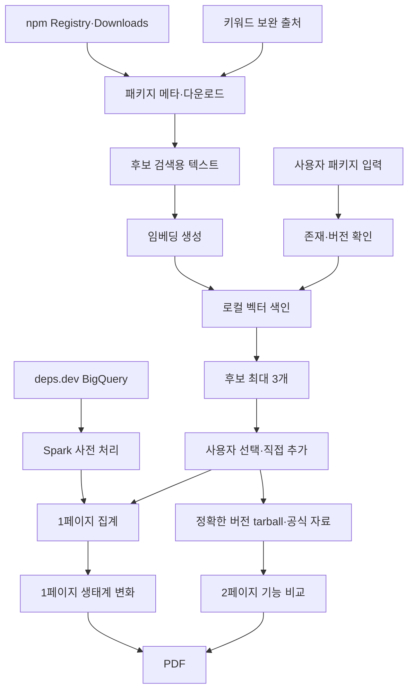

# OSS_Shift_기능별_개발_구상안_0901

작성 기준일: 2026-09-01  
문서 상태: 개발팀 참고용 구현 구상안  
최상위 기준: `OSS_Shift_피드백_의견_대응방안_통합설계_0831.md`

이 문서는 확정된 제품 요구사항을 실제 개발로 옮길 때 참고할 수 있는 구현 흐름을 제안한다. 특정 프레임워크·모델·라이브러리를 반드시 사용해야 하는 기술 명세가 아니다.

표기 원칙:

- **확정 요구**: 제품이 반드시 만족해야 하는 조건
- **구현 예시**: 요구를 만족할 수 있는 한 가지 방법
- **실험 필요**: 개발팀이 실제 환경에서 측정·검증한 뒤 결정할 항목

## 목차

1. 결론
2. 현재 확인된 외부 사실
3. 권장 전체 구조
4. 후보 검색 색인 구상
5. MVP 기능별 개발 구상
6. 보고서 1페이지 개발 구상
7. 보고서 2페이지 개발 구상
8. PDF와 근거 연결
9. 확장 기능 개발 구상
10. 분산 처리와 저장 원칙
11. 비용·호출 제한·보안
12. 개발 순서
13. 먼저 증명해야 할 것
14. 공식 자료

## 1. 결론

OSS Shift의 개발 흐름은 크게 두 부분으로 나눈다.

OSS Shift의 보고서 이름은 다른 문서와 동일하게 다음으로 고정한다.

- MVP 1페이지: **생태계 변화 분석**
- MVP 2페이지: **기능 비교 분석**
- 확장 3페이지: **GitHub 커뮤니티 현황**

1. **미리 처리하는 부분**
   - 후보 검색용 패키지 정보·임베딩 색인 생성
   - BigQuery와 Spark를 이용한 1페이지 의존 관계 사전 집계
   - 다운로드 자료의 필요한 범위 캐시

2. **사용자 요청 때 처리하는 부분**
   - 입력 패키지·버전 확인
   - 로컬 벡터 색인에서 후보 최대 3개 검색
   - 사용자가 비교 대상 확정
   - 1페이지 사전 집계 조회
   - 정확한 `패키지@버전`의 Registry 정보와 tarball 기반 2페이지 기능 근거 수집
   - 근거 기반 비교 설명
   - PDF 생성

### 확정 요구

- 후보 추천 단계에 생성형 AI 또는 LLM을 사용하지 않는다.
- 후보는 실제 수집된 npm 패키지만 사용한다.
- 설명·키워드 임베딩과 벡터 유사도를 후보 검색의 기본으로 사용한다.
- 후보 검색 색인은 MVP 10만 패키지를 목표로 한다.
- 1페이지 사전 집계는 MVP 3만 패키지로 한다.
- 1페이지 확장 규모는 10만 패키지 이상으로 둔다.
- 두 EC2가 Spark 작업을 실제로 나누어 처리해야 한다.
- 외부 공유 저장소가 지급되지 않았다는 조건을 기본 구조에 반영한다.
- 2페이지는 모든 패키지의 모든 버전을 미리 저장하지 않고 요청한 정확한 버전만 분석·캐시한다.

### 구현 예시

- 관계형 DB에 패키지 메타데이터와 벡터를 저장하고 벡터 검색 기능을 함께 사용할 수 있다.
- Spark는 BigQuery에서 필요한 열만 읽어 두 EC2에 작업을 나눌 수 있다.
- 기능 근거는 짧은 근거 조각과 출처 위치를 저장하고, 생성형 AI에는 이 근거만 전달하는 RAG 방식(검색한 근거만 모델에 제공하는 방식)을 사용할 수 있다.
- 웹 보고서와 같은 데이터를 PDF 생성기에 전달할 수 있다.

특정 DB, 벡터 확장, 웹 프레임워크, AI 모델명은 제품 요구사항이 아니다.

## 2. 현재 확인된 외부 사실

### deps.dev BigQuery

공식 스키마 기준으로 다음 사실을 확인할 수 있다.

- `PackageVersions` 계열에는 패키지 버전과 `Description` 정보가 있다.
- 후보 키워드 전용 `Keywords` 열은 deps.dev BigQuery 스키마에서 확인되지 않는다.
- `Dependencies`는 직접·간접 의존 관계를 모두 포함한다.
- npm의 선언된 요구 관계는 `NPMRequirements` 계열에서 확인할 수 있다.

따라서:

- 후보 설명 대량 수집은 deps.dev BigQuery를 기본으로 사용할 수 있다.
- 키워드는 npm Registry 또는 Libraries.io 등 별도 허용 출처로 보완한다.
- 직접 의존 선언과 직접·간접 의존 그래프는 같은 값으로 취급하지 않는다.

### BigQuery Storage Read API

공식 문서는 병렬 읽기 스트림을 지원한다. 두 EC2의 Spark 작업이 실제 데이터를 나누어 처리하는 구현에 활용할 수 있다.

### npm Registry

정확한 버전 응답에서 배포 정보와 tarball 위치를 확인할 수 있다.

`dist.tarball`, `dist.integrity`, `dist.fileCount`, `dist.unpackedSize`는 Registry 응답의 `dist` 정보로 취급한다. tarball 내부 `package.json`의 필드로 기록하지 않는다.

### npm Downloads

공식 다운로드 API를 사용한다. 제품 요구사항에서는 MVP 기간을 최대 18개월로 두며, 세부 호출 제한은 개발 시 공식 문서에 맞춰 적용한다.

### GitHub

확장 3페이지는 GitHub 공식 API를 사용한다. 구체적인 호출 제한과 비용 정책은 개발 시 공식 문서를 확인하고 실제 호출량을 측정한다.

## 3. 권장 전체 구조



### 역할 분리

| 부분 | 확정 책임 | 구현 예시 |
|---|---|---|
| 후보 색인 배치 | 패키지 설명·키워드 정제, 임베딩 생성 | Spark 또는 일반 배치 작업 |
| 로컬 검색 | 입력 벡터와 가까운 패키지 검색 | 벡터 DB 또는 관계형 DB 벡터 확장 |
| Spark 집계 | 1페이지 의존 관계 사전 계산 | Spark standalone |
| 서비스 API | 입력 확인, 후보 조회, 결과 조합 | Python/Node 등 |
| 기능 근거 추출 | tarball·README·타입·진입점 정적 분석 | 별도 작업 프로세스 |
| 근거 기반 설명 | 선택 이후 근거 정리와 문장 생성 | RAG + 생성형 AI |
| PDF | 화면 데이터 재사용 | 서버 PDF 생성기 |

## 기능 번호 연결 요약

| 번호 | 기능 | 개발 구상 위치 |
|---|---|---|
| 기능-01 | 패키지·버전 입력 | 5장 |
| 기능-02 | 존재·분석 버전 확인 | 5장 |
| 기능-03 | 후보 추천 | 4·5장 |
| 기능-04 | 비교 대상 확정 | 5장 |
| 기능-05 | 분석 기간·기준일 | 5·6장 |
| 기능-06 | 다운로드 변화 | 6장 |
| 기능-07 | 직접·간접 의존 변화 | 6장 |
| 기능-08 | 유지·유입·이탈 | 6장 |
| 기능-09 | 생태계 변화 분석 | 6장 |
| 기능-10 | 기능 근거 수집 | 7장 |
| 기능-11 | 공통 환경·설치 조건 | 7장 |
| 기능-12 | 발견 기능 비교 | 7장 |
| 기능-13 | 근거 기반 설명 | 7장 |
| 기능-14 | PDF 생성 | 8장 |
| 기능-15 | 서비스 소개 | 5장 |
| 기능-16 | 자료 상태·오류 | 5장 |
| 확장-01 | 버전 고착 | 9장 |
| 확장-02 | 관측된 교체 흐름 | 9장 |
| 확장-03 | GitHub 커뮤니티 현황 | 9장 |

## 4. 후보 검색 색인 구상

### 4.1 데이터 구성

#### 확정 요구

후보 임베딩 본문에는 다음 정보를 사용한다.

- `description`
- 확보 가능한 `keywords`

패키지 이름은 식별에 사용한다. 이름 자체를 임베딩 본문에 넣을지는 실험으로 정할 수 있다.

#### 기본 출처

| 정보 | 기본 출처 | 용도 |
|---|---|---|
| 패키지명·버전·설명 | deps.dev BigQuery | 대량 색인 기본 |
| 키워드 | npm Registry 또는 Libraries.io 등 | 설명 보완 |
| 폐기 상태 | deps.dev 또는 Registry | 후보 제외·경고 |
| 배포일 | deps.dev 또는 Registry | 후보 카드 |
| 직접 의존 신호 | Spark 집계 | 필터·동률 정리에 참고 가능 |

### 4.2 사전 처리

구현 예시는 다음 순서다.

1. BigQuery에서 npm 패키지명, 최신 안정 버전 후보, 설명, 상태와 필요한 링크를 읽는다.
2. 설명이 없고 키워드도 확보할 수 없는 패키지는 후보 색인에서 제외한다.
3. 키워드가 있으면 설명과 함께 짧은 텍스트를 만든다.
4. 동일한 전처리 버전으로 텍스트를 정리한다.
5. 두 EC2가 패키지 범위를 나누어 임베딩을 계산한다.
6. 패키지 메타데이터와 벡터를 로컬 색인에 저장한다.
7. 원천 기준일, 전처리 버전, 임베딩 버전을 기록한다.

예시:

```text
DESCRIPTION: Fast JSON logger for Node.js
KEYWORDS: logger json logging node
```

### 4.3 사용자 검색

구현 예시:

1. 입력 패키지가 색인에 있으면 저장된 벡터를 사용한다.
2. 색인에 없으면 Registry에서 필요한 메타데이터를 확인하고 해당 패키지만 임베딩할 수 있다.
3. 벡터 유사도가 높은 후보를 넉넉히 조회한다.
4. 다음 규칙으로 명백한 후보를 제거할 수 있다.
   - 입력 패키지 자신
   - 폐기된 패키지
   - 정상 분석 버전을 정하기 어려운 패키지
   - 입력 패키지의 플러그인·어댑터·프리셋 가능성이 높은 패키지
5. 남은 후보를 벡터 유사도 기준으로 정렬한다.
6. 사용자 시험에서 정한 기준 이상인 후보만 최대 3개 반환한다.

### 4.4 후보 카드

예시 응답:

```json
{
  "package": "pino",
  "version": "x.y.z",
  "description_similarity": 0.0,
  "shared_keywords": ["logger", "json"],
  "published_at": "YYYY-MM-DD",
  "data_status": "READY"
}
```

숫자는 형식 예시다. 실제 유사도 기준은 실험으로 확정한다.

### 4.5 규모

- 후보 검색 색인: MVP 10만 목표
- 확장: 20만 이상 확대 가능

후보 검색 색인 규모와 1페이지 Spark 집계 규모는 별도로 관리한다.

## 5. MVP 기능별 개발 구상

### 기능-15 서비스 소개

**구현 예시**

- 정적 페이지로 먼저 제공한다.
- 서비스 한 문장, 입력 예시, 후보 카드 예시, 1·2페이지 예시와 관측 한계를 보여 준다.
- 실제 분석 수치가 아닌 예시에는 `예시` 표시를 붙인다.

### 기능-01·02 패키지·버전 입력과 확인

**확정 요구**

- `package`와 `package@version`을 구분한다.
- 정확한 npm Registry 존재 여부를 확인한다.
- 버전이 없으면 분석 버전을 확정해 저장한다.
- 이후 보고서에서 자동으로 다른 버전으로 바꾸지 않는다.

**구현 예시**

```text
GET /packages/resolve?name=winston
GET /packages/resolve?name=zod&version=4.0.0
```

응답 예시:

```json
{
  "package": "zod",
  "requested_version": "4.0.0",
  "resolved_version": "4.0.0",
  "exists": true,
  "page1_status": "READY",
  "page2_status": "READY"
}
```

### 기능-03 후보 추천

**확정 요구**

- 로컬 벡터 검색
- 생성형 AI 또는 LLM 호출 없음
- 실제 npm 패키지만
- 최대 3개
- 기준 미달이면 3개 미만
- 계산 가능한 추천 근거 표시

**구현 예시**

```text
GET /packages/{name}/candidates?version=...
```

입력이 색인 밖이면 필요한 메타데이터를 한 번 보완하고 단일 임베딩을 계산하는 경로를 둘 수 있다.

### 기능-04 비교 대상 확정

**구현 예시**

사용자가 선택·직접 추가한 각 패키지를 다시 Registry에서 확인한 뒤 다음 형태로 분석 조건을 만든다.

```json
{
  "packages": [
    {"name": "winston", "version": "A"},
    {"name": "pino", "version": "B"}
  ]
}
```

목적이 다른 패키지를 사용자가 선택했다고 서버가 임의로 제외하지 않는다. 2페이지에서 비교 가능한 기능이 부족할 수 있음을 결과로 반환한다.

### 기능-05 분석 기간·기준일

1페이지에서 출처별 가능한 기간을 별도로 관리한다.

- 다운로드 조회 기간
- 의존 관계 기준일·관측 기간

두 출처의 시작·종료일이 다르면 화면에서 각각 표시한다.

### 기능-16 자료 상태·오류

추천 상태와 보고서 상태를 분리한다.

예시 상태:

```text
READY
LIMITED
NO_DATA
NOT_FOUND
PROCESSING_ERROR
CONFIRMATION_UNAVAILABLE
```

상태 이름은 구현 예시다. 중요한 것은 값 0과 자료 없음·확인 불가·오류를 구분하는 것이다.

## 6. 보고서 1페이지 개발 구상

### 6.1 분산 처리 역할

#### 확정 요구

- deps.dev BigQuery와 Spark를 핵심으로 사용한다.
- 두 EC2 서버가 실제 작업을 나누어 처리한다.
- MVP 1페이지 사전 집계 규모는 3만 패키지다.
- 확장 규모는 10만 패키지 이상이다.
- 외부 공유 저장소를 기본 구조로 가정하지 않는다.

#### 구현 예시

1. 같은 deps.dev 스냅샷을 선택한다.
2. 필요한 열과 npm 데이터만 읽는다.
3. Spark가 패키지 범위를 분할한다.
4. EC2 1·2가 실제 partition을 나누어 처리한다.
5. 최종 집계만 로컬 DB 또는 로컬 파일에 저장한다.
6. 작업 번호, 기준일, 처리 범위, 서버별 처리량과 실패·재시도 기록을 남긴다.
7. 원본 전체와 대용량 임시 파일은 장기 보관하지 않는다.

### 6.2 직접 의존과 간접 의존

공식 스키마의 의미를 기준으로 출처를 분리한다.

- 직접 선언: npm 요구 관계 자료를 기본으로 집계
- 직접·간접 그래프: deps.dev 의존 관계 자료를 사용
- 화면에서는 직접과 간접을 구분해 제공

간접 의존 전체를 직접 사용 주체 수처럼 부르지 않는다.

### 6.3 유지·유입·이탈

구현 예시:

- 유지: 이전·현재 관측 모두 직접 의존 선언이 있음
- 유입: 이전에는 없고 현재에는 있음
- 이탈: 이전에는 있고 현재에는 없음
- 자료 없음·처리 오류는 변화 계산에서 제외

기간별 대표 상태와 중복 제거 방식은 기존 검증 자료의 계산 규칙을 유지하되, 실제 Spark 구현에서 동일 입력의 재현성을 확인한다.

### 6.4 다운로드 변화

- 공식 npm Downloads API 사용
- MVP 최대 18개월
- 조회 결과를 출처·기간과 함께 캐시할 수 있음
- 자료가 없는 기간은 0으로 보정하지 않음

세부 호출 제한과 캐시 주기는 개발 시 공식 문서와 실제 요청량으로 정한다.

### 6.5 출력 예시

```json
{
  "package": "winston",
  "version": "x.y.z",
  "period": "YYYY-MM-DD/YYYY-MM-DD",
  "downloads": [],
  "direct_dependency": [],
  "indirect_dependency": [],
  "retained": [],
  "inflow": [],
  "outflow": [],
  "source_snapshot_date": "YYYY-MM-DD",
  "warnings": []
}
```

## 7. 보고서 2페이지 개발 구상

### 7.1 확정 원칙

- 사용자가 선택한 정확한 `패키지@버전`만 분석한다.
- 모든 패키지의 모든 버전을 미리 수집하지 않는다.
- 캐시 키는 정확한 버전과 배포 무결성 정보를 포함한다.
- npm Registry의 배포 정보와 tarball 내부 파일 정보를 분리한다.
- 패키지 코드를 실행하지 않고 정적으로 분석한다.
- 고정된 HTTP 기능표를 사용하지 않는다.
- 기능 주장은 근거와 연결한다.
- 기본 판정은 `지원`, `제한적 지원`, `확인 불가`다.
- `지원하지 않음`은 공식 미지원 근거가 있을 때만 제한적으로 사용한다.

### 7.2 자료 수집 흐름

구현 예시:

1. Registry에서 정확한 버전 응답을 받는다.
2. `dist.tarball`과 `dist.integrity`를 확인한다.
3. 캐시에 같은 `패키지@버전 + 무결성` 자료가 있는지 확인한다.
4. 없으면 tarball을 임시 저장한다.
5. 압축을 안전하게 해제한다.
6. 실제 `package.json`, README, 타입 선언, 공개 진입점을 읽는다.
7. 버전이 검증된 공식 문서·태그·커밋이 있으면 필요할 때 보완한다.
8. 필요한 기능 근거와 출처 위치만 저장한다.
9. tarball과 압축 해제 파일은 장기 저장하지 않는다.

### 7.3 Registry 정보와 package.json 분리

예시 데이터:

```text
registry_distribution
- package
- version
- dist_tarball
- dist_integrity
- dist_file_count
- dist_unpacked_size

package_manifest
- package
- version
- engines
- type
- main
- exports
- types
- dependencies
- peer_dependencies
- optional_dependencies
- license
```

이 구조는 예시다. 중요한 요구는 두 출처를 섞지 않는 것이다.

### 7.4 공통 환경·설치 조건

프로그램으로 우선 추출할 수 있는 항목 예시:

- 정확한 버전
- Node.js 등 `engines` 조건
- ESM·CommonJS 관련 정보
- `main`·`exports` 등 공개 진입 경로
- `types`·`typings` 등 타입 위치
- 직접·동료·선택 의존 조건
- 브라우저·React Native 등 명시된 환경 정보
- 배포 파일 수·압축 해제 크기
- 라이선스

`exports`만으로 전체 함수·클래스·기능 목록을 확정하지 않는다.

### 7.5 기능 근거 카드

README·타입·공개 진입점에서 기능 설명에 필요한 짧은 단위를 만든다.

예시:

```json
{
  "package": "pino",
  "version": "x.y.z",
  "feature_label": "자식 로거와 문맥 상속",
  "source_type": "TARBALL_README",
  "file_path": "package/README.md",
  "section": "Child loggers",
  "evidence": "짧은 근거",
  "evidence_hash": "sha256:..."
}
```

### 7.6 RAG 기반 비교 흐름

RAG는 검색한 원자료 근거를 생성형 AI에 함께 제공하는 방식이다.

구현 예시:

1. 패키지별 기능 근거 카드를 만든다.
2. 비슷한 사용자 목적의 카드들을 검색한다.
3. 생성형 AI가 기능 질문을 정리하되 사용한 근거 ID를 반드시 반환한다.
4. 각 패키지의 관련 근거를 다시 검색한다.
5. 생성형 AI가 제공된 근거 안에서 판정·조건·차이 설명을 만든다.
6. 서버가 근거 ID, 패키지, 버전과 허용 판정값을 검사한다.
7. 근거가 없는 항목을 삭제하거나 `확인 불가`로 돌린다.

후보 추천 단계와 이 과정은 분리한다.

### 7.7 분야 비종속 처리

다음 예시는 “항상 나오는 기능”이 아니라 분야별로 나올 수 있는 항목이다.

| 비교 분야 | 문서에서 발견될 수 있는 기능 예 |
|---|---|
| HTTP | 요청 취소, 요청 기본값, 스트림 |
| 로깅 | 구조화 로그, 자식 로거, 출력 대상 |
| 검증 | 형 변환, 비동기 검증, 타입 연계 |
| 테스트 | 모킹, 감시 실행, 코드 커버리지 |
| ORM | 관계 표현, 마이그레이션, 트랜잭션 |
| CLI | 명령 구조, 옵션 파싱, 도움말 생성 |

실제 보고서에는 선택한 정확한 버전에서 근거가 발견된 항목만 넣는다.

### 7.8 목적이 다른 패키지

공통 환경·설치 조건은 제공할 수 있다.

기능 근거를 묶을 수 있는 공통 목적이 부족하면 다음 상태를 반환한다.

```text
COMPARISON_LIMITED: 기능 목적이 달라 직접 비교 가능한 항목이 부족함
```

상태명은 구현 예시다.

## 8. PDF와 근거 연결

### 확정 요구

- PDF는 화면과 같은 데이터로 만든다.
- PDF에서 패키지 버전·기준일·근거가 바뀌지 않는다.
- MVP PDF는 1·2페이지를 포함한다.
- 확장 시 가능한 3페이지를 추가한다.

### 구현 예시

- 웹 보고서의 구조화된 결과 JSON을 PDF 생성에도 재사용한다.
- 화면 HTML을 다시 읽어 숫자를 계산하지 않는다.
- 보고서 ID에 다음을 연결할 수 있다.
  - 최종 비교 대상
  - 정확한 버전
  - 1페이지 기준일
  - 2페이지 근거 버전
  - 설명 생성 버전
  - PDF 생성 시각

## 9. 확장 기능 개발 구상

### 확장-01 버전 고착

정확한 버전 조건 해석은 개발팀 검증이 필요하다.

구현 예시:

1. 직접 의존의 버전 조건 원문을 모은다.
2. npm의 버전 조건 규칙에 맞는 파서를 사용한다.
3. 해석 가능한 조건을 허용 주버전으로 분류한다.
4. 여러 주버전·태그·주소 등 안전하게 분류하기 어려운 조건은 별도 상태로 둔다.
5. 이전·현재 주버전과 해석 불가 비중을 표시한다.

실제 설치된 버전이나 업데이트 이유로 해석하지 않는다.

### 확장-02 관측된 교체 흐름

구현 예시:

1. 같은 공개 패키지의 연속 배포 사이에서 직접 의존 추가·제거를 계산한다.
2. 제거와 같은 변화에서 함께 추가된 패키지를 찾는다.
3. 직접 의존에서 peer·optional로 종류만 바뀐 경우를 별도로 분리한다.
4. 같은 주체가 반복해서 만든 변화를 과도하게 세지 않도록 중복을 줄인다.
5. 충분한 근거가 있는 관계만 결과로 제공한다.

이는 교체 원인이나 완전한 전환 증거가 아니라 관측 신호다.

### 확장-03 GitHub 커뮤니티 현황

#### 확정 요구

- npm 패키지와 저장소 연결을 검증한 경우만 제공
- 모노레포의 범위 구분
- 기본 브랜치 최신 문서를 과거 패키지 버전의 확정 근거로 사용하지 않음
- 호출 제한·실패를 고려

#### 구현 예시

저장소 연결 검증에 사용할 수 있는 자료:

- npm Registry의 `repository`
- 배포 provenance 또는 `gitHead`가 있을 때의 보조 연결
- 검증된 GitHub 태그·커밋
- 저장소 내부 패키지 구조

표시 가능한 항목은 실제 호출량 시험 후 범위를 확정한다. 초기에는 최근 릴리스, 최근 커밋, 열린 이슈·PR 수, 보관 여부처럼 비교적 명확한 항목부터 검토할 수 있다.

## 10. 분산 처리와 저장 원칙

### 10.1 두 EC2의 실제 작업 분담

#### 확정 요구

- 두 서버가 Spark 작업을 실제로 나누어 처리한다.
- 서버별 처리량·작업 기록을 남긴다.
- 한 서버만 계산하고 다른 서버가 대기하는 구조를 분산 처리 완료로 보지 않는다.

#### 구현 예시

- 패키지 이름 해시 또는 안정적인 bucket으로 partition을 나눈다.
- 같은 패키지의 버전 이력은 같은 처리 단위에 모이도록 한다.
- 인기 의존 이름으로 집계가 치우치는 경우에만 추가 분할 방식을 검토한다.
- 작업 성공 후 최종 집계만 서비스 DB에 적재한다.

### 10.2 규모

| 범위 | MVP | 확장 |
|---|---:|---:|
| 후보 검색 색인 | 10만 | 20만 이상 |
| 1페이지 사전 집계 | 3만 | 10만 이상 |
| 2페이지 기능 자료 | 요청 버전만 | 요청·캐시 확대 |

후보 검색 색인 규모와 1페이지 사전 집계 규모를 같은 숫자로 표현하지 않는다.

### 10.3 저장

#### 장기 저장 대상

- 후보 검색용 최소 메타데이터
- 후보 임베딩·색인
- 1페이지 최종 집계
- 다운로드 집계
- 요청 버전의 기능 메타데이터·근거
- 보고서·PDF
- 작업 기준일·버전·검증 기록

#### 장기 저장하지 않는 기본 대상

- BigQuery 원본 전체
- 모든 npm 패키지의 모든 버전 복제본
- 모든 tarball
- 모든 압축 해제 결과
- GitHub 원문 전체
- Spark 임시 셔플 데이터

외부 공유 저장소가 없으므로 두 EC2의 로컬 디스크를 하나의 공유 공간처럼 가정하지 않는다.

## 11. 비용·호출 제한·보안

### 비용과 호출 제한

제품 문서에서 세부 숫자를 확정하지 않는다.

개발팀은 다음을 실제 측정한다.

- BigQuery 조회·전송량
- 후보 색인 생성 시간
- 1페이지 Spark 처리 시간·디스크·메모리
- Registry·Downloads 호출 수
- tarball 전송량
- 기능 분석 캐시 적중률
- AI 입력·출력량
- GitHub 호출량

공식 API 제한은 개발 시 해당 공급자의 최신 공식 문서를 확인한다.

### tarball 안전

구체적인 파일 크기·시간 상한은 개발팀 시험으로 정한다.

반드시 지킬 원칙:

- Registry가 돌려준 tarball 주소만 허용
- 무결성 정보 확인
- 임의 URL·내부 네트워크 주소 읽기 금지
- 상위 경로 이동·절대 경로·위험한 심볼릭 링크 방지
- 압축 해제 크기·파일 수 상한 적용
- `npm install`, 빌드, `postinstall` 실행 금지
- JavaScript 실행 금지
- README 지시문은 데이터로만 처리

## 12. 개발 순서

### 4주 MVP 예시 순서

| 주차 | 중심 작업 | 완료 연결 |
|---|---|---|
| 1주차 | 패키지·버전 확인, 후보 데이터 수집, 1페이지 3만 집계 최소 흐름 | Registry/BigQuery → 로컬 결과 |
| 2주차 | 10만 후보 검색 색인, 최대 3개 추천, 사용자 선택·직접 추가 | 입력 → 후보 선택 |
| 3주차 | 1페이지 화면, 정확한 버전 tarball 수집, 공통 환경·기능 근거 추출 | 선택 → 1·2페이지 |
| 4주차 | 근거 기반 설명, PDF, 두 EC2 분산 기록, 오류·자료 부족 검수 | 전체 MVP 완결 |

일정은 예시이며 팀 진행 상황에 맞춰 조정할 수 있다. 제품 완료 조건은 순서가 아니라 기능 요구사항 충족 여부다.

## 13. 먼저 증명해야 할 것

### 후보 추천

- 10만 색인을 생성·조회할 수 있는지
- 여러 패키지 분야에서 관련 후보가 상위 결과에 들어오는지
- 플러그인·어댑터 오추천을 규칙으로 어느 정도 줄일 수 있는지
- 기준 이하 후보를 3개로 채우지 않는지
- 후보 처리 과정에 생성형 AI 호출이 없는지

유사도 기준과 임베딩 모델은 실험으로 정한다.

### 1페이지

- 두 EC2가 실제 행과 작업 시간을 나누어 갖는지
- 3만 패키지 집계를 반복 실행할 수 있는지
- 같은 기준일·규칙에서 결과가 재현되는지
- 직접·간접 의존을 혼용하지 않는지
- 누락·오류가 이탈로 들어가지 않는지

10만 이상 확장은 개발팀이 성능 시험 후 진행한다.

### 2페이지

- HTTP·로깅·검증·테스트·빌드·ORM·CLI 등 서로 다른 분야에서 같은 처리 흐름이 동작하는지
- 정확한 버전 tarball과 Registry 정보가 섞이지 않는지
- 기능 주장마다 근거가 연결되는지
- 검색 실패를 `지원하지 않음`으로 오판하지 않는지
- 목적이 다른 패키지에서 억지 기능표를 만들지 않는지
- 후보 추천이 끝난 이후에만 생성형 AI를 호출하는지

### 저장과 보안

- 전체 tarball을 장기 보관하지 않고도 반복 요청을 처리할 수 있는지
- 로컬 디스크 사용량이 안정적인지
- 악성 압축 파일·경로 이동·코드 실행을 막는지
- 두 EC2 동시 손실에는 외부 백업이 없다는 한계를 운영 환경에서 어떻게 보완할지

## 14. 공식 자료

- deps.dev BigQuery dataset  
  https://docs.deps.dev/bigquery/v1/

- BigQuery Storage Read API  
  https://cloud.google.com/bigquery/docs/reference/storage

- Spark BigQuery connector  
  https://github.com/GoogleCloudDataproc/spark-bigquery-connector

- npm Registry API  
  https://github.com/npm/registry/blob/main/docs/REGISTRY-API.md

- npm Registry package metadata  
  https://github.com/npm/registry/blob/main/docs/responses/package-metadata.md

- npm Downloads API  
  https://github.com/npm/registry/blob/main/docs/download-counts.md

- npm package.json  
  https://docs.npmjs.com/cli/v11/configuring-npm/package-json/

- Node.js package entry points  
  https://nodejs.org/api/packages.html

- GitHub REST API rate limits  
  https://docs.github.com/en/rest/using-the-rest-api/rate-limits-for-the-rest-api

> **최종 판단** MVP는 `패키지·버전 입력 → 로컬 후보 최대 3개 → 사용자 비교 대상 확정 → 1페이지 생태계 변화 → 2페이지 정확한 버전 기능 비교 → PDF`를 완성한다. 후보 추천에는 생성형 AI를 사용하지 않고, 생성형 AI는 사용자가 비교 대상을 확정한 뒤 원자료 근거를 정리하고 설명하는 단계에만 제한적으로 사용한다.
