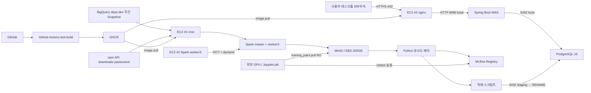

# Pickage 기능별 개발 구상안 0909

작성 기준일: 2026-09-04 (본문 §1.3/§3.5/§4.1/§4.2/§4.2.1 랭커, §3.2/§3.8 Spring/GMS 예외, §12.4는 2026-09-09 확정 반영)  
문서 상태: Approved (2026-09-09 갱신 — effective_at: 2026-09-09. `S15P21A506-284`: GitHub 커뮤니티(확장-03) 패키지 선택을 기준 패키지 단일 대상으로 축소하고 Spring→GMS 직접 호출을 확장-03 한정 예외로 명시(`DEC-COMMUNITY-20260909-01`). `S15P21A506-285`: 후보 ranking을 `DEC-RANK-20260909-01`로 갱신 — deprecated 후보는 지목 가산이 아니라 코퍼스 단계에서 완전 제외, top-K/Recall 목표를 50에서 20으로 하향(Recall@10·MRR은 변경 없음). supersedes: `Pickage_기능별_개발_구상안_0904.md`의 `DEC-RANK-20260907-01` top-K 50/deprecated 가산/Recall@50 조항과 §12.4 "첫 AVAILABLE 패키지" 서술)  
연결 문서: `Pickage_요구사항_명세서_0909.md`, `Pickage_메뉴구조_IA_0909.md`, `Pickage_서비스_기획서_0909.md`

이 문서는 확정된 사용자 경험을 개발 가능한 데이터·상태·처리 계약으로 옮긴다. 0904 시스템 아키텍처 확정안에 따라 v1의 서버·배치·저장·모델·배포 구조와 주요 기술 스택까지 개발 기준으로 고정한다. 화면에서 요구하는 결과와 상태를 누락해서는 안 된다.

표기:

- **시스템 확정안**: v1에서 구현 기준으로 고정된 인프라·프로세스·데이터 흐름
- **제품 계약**: 구현 방식과 무관하게 반드시 만족해야 하는 사용자·데이터 조건
- **튜닝 가능**: 구조는 유지하되 운영 측정에 따라 threshold·자원량·주기 등을 조정할 수 있는 항목

## 1. 0904 핵심 결론

### 1.1 처리 구조

Pickage는 한 방식으로 모든 데이터를 실시간 수집하지 않는다. 사용자 클라이언트 제공 범위는 **데스크톱 웹 브라우저**로 고정하며, 별도 소형 화면 전용 클라이언트 계층은 두지 않는다.

| 구역 | v1 처리 | 이유 |
|---|---|---|
| 후보 검색 | 배치 임베딩 + top-K 20 + v1 재랭킹 결과를 PostgreSQL에서 조회 | 서빙 요청에서 모델 추론을 제거하고 결과 재현성 확보 |
| 후보 생태계 신호 | BigQuery deps.dev Snapshot + npm API를 EC2 #1 배치에서 수집·집계 | 외부 호출과 무거운 변환을 서빙 경로에서 분리 |
| 보고서 1페이지 | Spark S1~S7 사전 변환·집계 → PostgreSQL 적재 | 모든 화면을 사전 집계 조회 중심으로 유지 |
| Downloads | npm API 독립 cron 수집·PostgreSQL 적재 | 놓친 기간을 복구하기 어려운 데이터이므로 별도 주기 관리 |
| Version Share | 최신 기준일 Snapshot 집계 | 시계열이 아니라 현재 공개 의존 조건 분포를 제공 |
| 기능 비교 [확장] | Data + AI + RAG 우선, 불가 시 AI + RAG | 고비용 기능 분석을 MVP와 분리 |
| GitHub 커뮤니티 [확장] | 짧은 TTL 갱신 캐시 | 최신성과 API 제한 균형 |
| PDF | 완료 생태계 ReportSnapshot 재사용 | 화면과 다른 재계산 방지; 서빙 노드에서 사전 결과만 사용 |

### 1.2 MVP 버전 상태

1. 후보 단계: 버전 없음
2. Dependency 표시 버전: 직접 의존 그래프의 `Total` 또는 특정 버전
3. Version Share: 버전 선택 상태가 아니라 최신 Snapshot 기준일과 버전 계열 분포

기능 비교 버전은 확장 기능 내부 상태이며 MVP 상태 모델과 분리한다.

### 1.3 후보 ranking 원칙

**제품 계약**

- description·keywords의 의미 유사도만으로 최종 후보를 정하지 않는다.
- 후보 ranking은 기술 품질 점수나 최종 추천이 아니다.
- 생성형 AI를 후보 검색·정렬에 사용하지 않는다.
- 사용자 요청 시점에는 모델을 호출하지 않고 사전 계산된 후보 결과를 조회한다.
- 내부 score·계수·필터는 사용자에게 품질 점수로 노출하지 않는다.

**시스템 확정안 — v1 랭커** (임베딩 유사도 측정 파이프라인 확정, 2026-09-07)

1. 코퍼스 자격 필터: dependents 하한, 최근 12개월 내 릴리스, deprecated 제외(자격 미달로 처리 — 서비스가 종료된 패키지는 후보 코퍼스에 들어오지 않는다)
2. MLflow `@production` 모델로 `text_hash`가 바뀐 description만 ONNX 재임베딩(주간 변경분 수 %); 전수 재임베딩은 모델 승격 시에만 수행
3. 정규화 벡터 행렬곱으로 패키지별 top-K 20 후보 생성
4. cos 유사도를 기본 score로 두고 dependents 교집합 `> 0.3`인 보완재 감점·자격 미달 drop을 적용 (`move_lift` 항은 배제 확정 — 대체 이동 쌍 관측 가산은 더 이상 사용하지 않는다)
5. 채점 게이트: deprecated 51K 홀드아웃으로 Recall@20(임베딩·후보 생성 성적)·Recall@10(파이프라인 전체 성적)을 측정해 직전 운영값과 비교하고, 하락 시 적재를 중단하고 알림을 발생시킨다
6. 게이트 통과분만 `similar_packages`를 `model_ver` 병렬 적재하고 행수 가드 후 `model_production` 포인터를 전환
7. 화면에는 최종 유효 후보 최대 3개만 전달하고 상위 2개를 기본 선택

**학습 개시 판정 기준**: Recall@20. 정답이 top-20 후보에 반복적으로 못 들면 score 조정으로 해결할 수 없는 문제이므로 그 시점에 아래 3.5절 학습 트랙을 연다(Recall@10·MRR 기반 승격 게이트와는 별개 판단 시점).

**알려진 한계**: Live 경쟁자(예: express↔fastify)처럼 이미 널리 쓰이는 대안 간 비교 영역은 임베딩 단독 성능에 의존하며, 이 한계는 감춘 채로 보완하려 하지 않고 한계로 명시한다.

신호가 5개 이상으로 늘어나는 고도화 단계에서는 같은 모델 사이클 안에서 GBDT LTR로 교체할 수 있으나 v1 구조 자체는 유지한다.

### 1.4 기능 비교 확장 원칙

우선 구현안은 `구조화 데이터 + AI + RAG`다. 정확한 버전의 Registry·배포 산출물 등에서 안정적으로 구조화 가능한 데이터는 별도 데이터 계층으로 제공하고, README·버전 문서·타입 선언 등 검색 가능한 근거는 RAG corpus로 사용한다.

구조화 데이터 계층이 수집 가능성·정확도·비용 측면에서 실용적이지 않다면 `AI + RAG`로 축소한다. 이 경우에도 검색된 근거 식별자와 생성 결과를 연결하고 근거 없는 기능 생성·추천을 허용하지 않는다.

## 2. 사용자 여정과 시스템 책임

| 단계 | 시스템 책임 | 주요 결과 | 범위 |
|---|---|---|---|
| 패키지 입력 | npm 패키지 존재 확인 | package, exists, status | MVP |
| 후보 탐색 | 의미 후보 pool 검색 | semantic candidates | MVP |
| 후보 ranking | 의미 관련성 + 공개 생태계 신호 결합 | ranked candidates, signal status | MVP |
| 비교 대상 확정 | 최대 3개·중복·존재 검증 | comparisonPackages | MVP |
| 생태계 변화 | 직접 의존 사전 집계·기간 자료 결합 | Direct Dependency, Downloads, Version Share Snapshot | MVP |
| PDF | 생태계 적격성 검사·스냅샷·문서 생성 | reportSnapshot, pdfJob | MVP |
| 기능 비교 | 정확한 버전 근거 retrieval·선택적 구조화·AI 분석 | assessment, evidence, narrative | 확장 |
| 재분석 | 이전 결과 보존·새 실행·차이 생성 | analysisRun, diff | 확장 |
| Evidence Drawer | 셀 단위 근거 응답 | assessment + grouped evidence | 확장 |
| 간접 Dependency | 전이 관계 집계·범위 표시 | indirect dependency series | 확장 |
| GitHub 커뮤니티 | 저장소 검증·분석 Issue 집계·핵심 쟁점·실제 댓글 흐름 구성 | repository scope, community snapshot, topics, discussion messages | 확장 |

### 기능 번호 연결

| 기능 | 개발 구상 위치 | 범위 |
|---|---|---|
| 기능-01 패키지 입력 | 2·4장 | MVP |
| 기능-02 패키지 존재 확인 | 2·4장 | MVP |
| 기능-03 후보 제공 | 4장 | MVP |
| 기능-04 비교 대상 확정 | 4장 | MVP |
| 기능-05 기간·기준일 | 5장 | MVP |
| 기능-06 Downloads | 5.3장 | MVP |
| 기능-07 Dependency | 5.1·5.2장 | MVP 직접 의존 |
| 기능-08 유지·유입·이탈 | 5.1·5.2장 | MVP 직접 의존 |
| 기능-09 생태계 변화 통합 | 5장 | MVP |
| 기능-14 PDF | 13장 | MVP |
| 기능-15 서비스 소개 | 정적 화면, 사용자 문서 기준 | MVP |
| 기능-16 자료 상태·오류 | 4·5·13장 및 확장 오류 | 공통 |
| 기능-17 Version Share | 5.4장 | MVP Snapshot |
| 기능-10 기능 버전·근거 수집 | 6·9장 | 확장 |
| 기능-11 환경·설치 조건 | 6~8장 | 확장 |
| 기능-12 기능 비교 | 7·8장 | 확장 |
| 기능-13 근거·해설·Drawer | 7·8·10장 | 확장 |
| 확장-01 버전 고착 심화 | 12.1장 | 확장 |
| 확장-02 관측된 교체 흐름 | 12.2장 | 확장 |
| 확장-03 Issues·GitHub 커뮤니티 | 5.5·12.3·12.4장 | 확장 |
| 확장-04 간접·전이 Dependency | 12.5장 | 확장 |

## 3. 시스템 아키텍처 확정안

### 3.1 v1 인프라 경계

관리형 서비스는 권한 제약으로 사용하지 않는다. AWS에서 사용할 수 있는 자원은 **EC2·EBS**이며, v1은 두 대의 `t4g.xlarge` EC2와 외부 GPU 학습 서버를 중심으로 자체 호스팅한다.



### 3.2 EC2 #2 — 서빙 노드

| 구성 | 확정 역할 |
|---|---|
| nginx | 외부 인바운드 `443` 단일 진입점, TLS 종단 |
| Spring Boot WAS | 카드·비교·유사 후보·보고서 API. **PostgreSQL 조회만 수행하며 모델·MinIO에 접촉하지 않음**(단, 아래 예외 참고) |
| PostgreSQL 16 | 집계 결과, `similar_packages`, `model_production` 포인터, MLflow 메타데이터 저장 |
| Spark worker② | 배치 시간에만 #1 master에 등록, `2 core / 6G` 기준 |

**예외 — GitHub 커뮤니티 확장(확장-03)**: 이 확장 한 기능의 refresh 경로에 한해 Spring Boot가 bounded 실행 단위로 GMS(외부 LLM 요약) API를 직접 호출한다. 팀원이 못 챙기는 확장 범위를 담당자가 단독으로 미리 개발하는 것이라, 새 배치 노드나 별도 worker를 두지 않고 Spring 내부의 제한된 실행 단위로 처리한다. 나머지 v1 서빙 경로(카드·비교·유사 후보·보고서 API)는 위 원칙(PostgreSQL 조회 전용)을 그대로 유지한다(`DEC-COMMUNITY-20260909-01`).

### 3.3 EC2 #1 — 배치·모델 운영 노드

| 구성 | 확정 역할 |
|---|---|
| cron | `P1 ETL`과 `P2 downloads` 실행. downloads는 별도 주기로 운영 |
| Spark master + worker① | `S1~S7` 변환·집계·학습쌍 생성, 무상태 처리, `3 core / 10G` 기준 |
| MinIO | EBS 200GB. `raw`, `curated(training_pairs)`, `pkg_vectors`, `mlflow-artifacts` 저장 |
| Python 유사도 배치 | 후보 정제 → 추론 → top-K → 재랭킹 → 스왑 |
| MLflow Registry | `@production`/`@candidate` 모델·평가·승격 흐름 관리, `:5000` |
| 적재 스크립트 | `\copy → staging → RENAME` 스왑으로 PostgreSQL 무중단 갱신 |

### 3.4 외부 데이터와 학습

- BigQuery: deps.dev 주간 Snapshot을 #1에서 HTTPS로 조회한다. 일 폴링·주 실행을 기본으로 하고 dry-run 로그와 max-bytes cap을 둔다.
- npm API: downloads와 packument를 수집한다. downloads는 독립 cron으로 관리한다.
- GPU 서버: JupyterLab 학습 전용이다. Tailscale로 접속하며 MinIO `training_pairs`는 읽기 전용 pull만 허용한다.
- GPU는 MLflow에 ONNX 모델을 **등록**할 수 있으나 production 승격 권한은 없다. 승격 토큰은 #1 평가 배치에만 존재한다.

### 3.5 모델 학습·스위칭 사이클

0. **개시 조건**: 1.3절 v1 랭커 채점 게이트에서 Recall@20이 정답을 top-20에 반복적으로 담지 못하는 수준으로 나오면 이 학습 트랙을 연다. score 조정(가산·감점 계수 튜닝)으로는 해결되지 않는 문제라는 뜻이기 때문이다.
1. S7이 매 Snapshot에서 학습쌍을 갱신한다.
2. GPU가 `training_pairs`를 pull하여 학습 후 MLflow에 ONNX를 등록한다.
3. #1 평가 배치가 홀드아웃 `Recall@10`·`MRR` 개선을 확인하면 `@candidate`로 둔다.
4. candidate로 전수 재임베딩 후 `similar_packages(vN+1)`를 병렬 적재하고 shadow 비교한다.
5. 승격 시 `@production` alias와 `model_production` 포인터만 전환한다. 서빙 재기동은 필요하지 않으며 롤백도 같은 포인터 전환으로 수행한다.

0번 개시 조건의 Recall@20과 3번 승격 게이트의 `Recall@10`·`MRR`은 서로 다른 판단 시점이다 — 전자는 "학습 트랙을 열지" 여부, 후자는 "이미 학습된 candidate 모델을 승격할지" 여부를 가른다.

### 3.6 배포 경로

`GitHub → GitHub Actions(test·build) → GHCR → EC2 ×2`로 고정한다. 배포 시 Actions가 SSH로 접속하여 `Flyway migrate → compose pull → compose up`을 수행한다. 두 EC2는 동일 이미지 태그를 사용해 Spark 버전 불일치를 차단한다.

### 3.7 네트워크·보안 규칙

- 외부 인바운드: `EC2 #2:443`만 허용한다.
- SSH `22`: 관리 IP와 GitHub Actions만 허용한다.
- 내부 `5432`, `9000`, `7077 + 동적 포트`, `5000`: EC2 상호 사설 IP와 Tailscale 대역만 허용한다.
- GPU 자격: MinIO curated 읽기 전용 키 + MLflow 등록 권한 토큰만 제공한다. production 승격 토큰은 #1에만 둔다.
- BigQuery 최소 권한 서비스 계정 키는 #1에만 두고 파일 권한 `600`을 적용한다.

### 3.8 v1에서 제외되는 운영·AI 구성

다음은 **확장**이며 v1 시스템 아키텍처에 포함하지 않는다.

- Prometheus·Grafana·healthchecks.io 모니터링 스택
- `rag-svc` + 외부 LLM
- 문헌 체인 `J1~J6`
- Spark History Server
- blue-green 배포
- Redis·Loki

기능 비교 확장의 `Data + AI + RAG / AI + RAG`는 이 확장 단계에서 `rag-svc + 외부 LLM`을 추가하는 구조로 연결한다. GitHub 커뮤니티 확장(확장-03)의 GMS 직접 호출 예외는 §3.2를 참고 — `rag-svc` 같은 별도 서비스를 새로 두지 않고 Spring 내부 bounded 실행 단위로 처리하는 한정 예외다.

### 3.9 클라이언트 경계

- 사용자 클라이언트는 데스크톱 웹 브라우저 1종으로 한정한다.
- 별도 소형 화면 전용 화면 구조나 클라이언트 상태 계약을 두지 않는다.
- 서버·배치 계약은 화면 크기별 분기를 전제로 설계하지 않는다.

## 4. 후보 검색과 선택

### 4.1 후보 배치 파이프라인

후보 생성은 사용자 요청 시 실시간 모델 호출이 아니라 **EC2 #1의 배치 결과**를 사용한다.

1. **후보군 정제**: dependents 하한, 최근 12개월 내 릴리스, deprecated 제외로 코퍼스 자격을 판단한다(서비스가 종료된 패키지는 자격 미달로 제외).
2. **추론**: MLflow `@production` 모델을 pull하고 `text_hash`가 바뀐 description만(주간 변경분 수 %) ONNX 재임베딩한다. 전수 재임베딩은 모델 승격 시에만 수행한다.
3. **top-K 생성**: 정규화 벡터 행렬곱으로 패키지당 20개를 만든다.
4. **재랭킹**: cos 유사도를 기본 score로 두고 dependents 교집합 `> 0.3`인 보완재 감점, 자격 미달 drop을 적용한다.
5. **채점 게이트**: deprecated 51K 홀드아웃으로 Recall@20·Recall@10을 측정해 직전 운영값과 비교한다. 하락하면 6번 적재를 중단하고 알림을 발생시킨다.
6. **스왑**: 게이트를 통과한 결과만 `similar_packages`를 `model_ver`별로 병렬 적재하고 행수 가드 통과 후 `model_production` 포인터를 전환한다.

### 4.2 v1 재랭킹 규칙

**시스템 확정안**

- 감점: dependents 교집합 `> 0.3`인 보완재 신호
- drop: 자격 미달(코퍼스 자격 필터 미통과 — deprecated 완전 제외 포함)
- score: cos 유사도 기반 (`move_lift` 항 없음 — 배제 확정, 대체 이동 쌍 관측은 가산 신호로 쓰지 않는다)
- 내부 top-K: 20
- 사용자 노출 후보: 최대 3
- 기본 선택: 최종 후보 상위 2개

score·계수는 **v1 내부 구현 계약**이며 사용자에게 기술 품질 점수로 노출하지 않는다. 후보 화면에는 사람이 이해할 수 있는 관련성 근거와 자료 상태만 제공한다.

### 4.2.1 채점 게이트와 지표 정의

- **Recall@20** = 임베딩(후보 생성) 단계만의 성적. 정답이 top-20 후보 안에 들었는지로 측정한다.
- **Recall@10** = 재랭킹까지 마친 파이프라인 전체의 성적. 사용자에게 실제 노출되는 순서에 정답이 있는지로 측정한다.
- 두 지표 모두 deprecated 51K 홀드아웃 셋으로 매 배치 실행마다 측정하고, 직전 운영값 대비 하락하면 해당 배치 결과의 `similar_packages` 적재를 중단하고 알림을 보낸다 — 저품질 결과가 `model_production`으로 스왑되는 것을 막는 안전장치다.
- Recall@20이 반복적으로 하락하면 3.5절의 모델 학습 트랙을 여는 판단 기준이 된다(재랭킹 계수 튜닝으로 해결 가능한 문제가 아니라는 신호이므로).
- **알려진 한계**: Live 경쟁자(예: express↔fastify)처럼 이미 널리 쓰이는 대안 간 비교는 임베딩 단독 성능에 의존한다. 이 한계는 보완하지 않고 한계로 명시한다.

신호 수가 5개 이상으로 늘어나는 고도화 단계에서는 재랭킹 4단계를 GBDT LTR로 교체할 수 있다. 이 경우에도 MLflow 모델 사이클과 서빙 조회 구조는 유지한다.

### 4.3 후보 응답 계약 예시

정확한 가중치를 API 계약에 노출하지 않고 후보 선정 근거와 신호 상태를 전달한다.

```json
{
  "basePackage": "winston",
  "maxComparisonPackages": 3,
  "candidates": [
    {
      "package": "pino",
      "description": "Fast JSON logger for Node.js",
      "sharedKeywords": ["logger", "json"],
      "rankingReason": ["SEMANTIC_RELEVANCE"],
      "signalStatus": {
        "semanticVector": "AVAILABLE"
      },
      "dataStatus": "READY",
      "defaultSelected": true
    }
  ]
}
```

예시는 사용자 응답 필드 역할을 보여주기 위한 것이다. 내부 score·계수는 API 응답에 노출하지 않는다.

후보 응답에 기능 비교 버전을 포함하지 않는다. `candidates`에는 `basePackage`를 포함하지 않는다.

### 4.4 비교 대상 확정 계약

- 기준 패키지는 항상 포함
- 기준 패키지 해제 요청은 거부
- 최종 패키지 수 1~3
- 패키지명 중복 금지
- 네 번째 패키지 요청은 기존 선택을 자동 제거하지 않고 `MAX_SELECTION_REACHED` 반환
- 직접 추가 패키지는 존재 확인 후 `manualSelection`으로 추가하고 후보 ranking은 변경하지 않음
- 후보 retrieval 실패, ranking 처리 실패, 유효 후보 0개를 서로 다른 상태로 반환

## 5. 보고서 1페이지

### 5.1 사전 집계

**제품 계약**

- MVP는 직접 의존 관계만 집계한다.
- 유지·유입·이탈도 직접 의존 기준으로 계산한다.
- 자료 없음과 오류를 이탈에 포함하지 않는다.
- 같은 기준일·규칙으로 재실행할 때 결과를 재현할 수 있어야 한다.
- 패키지별 직접 의존 시계열과 자료 상태를 함께 저장한다.
- 간접·전이 의존은 MVP 완료 조건이 아니며 확장 파이프라인으로 분리한다.

**시스템 확정안**

- EC2 #1 cron이 deps.dev BigQuery를 조회하고 Spark master + worker①/②가 S1~S7 변환·집계를 수행한다.
- 상태와 중간 산출물은 MinIO에 저장하며 Spark 자체는 무상태로 운용한다.
- 배치 말미에는 `\copy → staging → RENAME` 스왑으로 PostgreSQL의 서빙 테이블을 무중단 갱신한다.
- 필요한 partition 수와 실제 처리량은 `t4g.xlarge` 두 노드의 확정 자원 범위 안에서 튜닝한다.

### 5.2 Dependency 표시 계약

MVP에서 `relationshipType`은 `DIRECT`로 고정한다. 사용자에게 직접/간접 전환 API를 제공하지 않는다.

```json
{
  "relationshipType": "DIRECT",
  "packages": [
    {
      "package": "winston",
      "availableDisplayVersions": ["3.19.0", "3.18.3"],
      "selectedDisplayVersion": "TOTAL",
      "series": [],
      "summary": {
        "retained": 12481,
        "inflow": 2143,
        "outflow": 1395
      },
      "dataStatus": "COMPLETE"
    }
  ]
}
```

각 패키지의 `selectedDisplayVersion`은 독립적이며 UI 세션 또는 보고서 필터 상태에 저장한다.

### 5.3 Downloads

- npm 공식 Downloads API 경로만 사용
- npmjs.com 웹 화면, npmtrends 등 서드파티 집계 사이트 크롤링 금지(2026-09-08 팀 결정)
- MVP 최대 18개월
- 기간과 호출 기준일 기록
- 누락 구간은 null/gap으로 보존
- 0은 정상 응답에서 실제 값이 0일 때만 사용

### 5.4 Version Share Snapshot

Version Share는 시계열 테이블이 아니라 **최신 집계 기준일 Snapshot**으로 저장한다.

집계 결과 예시:

```json
{
  "package": "winston",
  "snapshotAt": "2026-09-04",
  "groups": [
    {"label": "3.x", "count": 5400, "share": 0.54},
    {"label": "2.x", "count": 3100, "share": 0.31},
    {"label": "1.x", "count": 1200, "share": 0.12},
    {"label": "UNRESOLVED", "count": 300, "share": 0.03}
  ],
  "interpretation": "PUBLIC_REQUIREMENT_DISTRIBUTION"
}
```

예시의 값은 기존 0902 스키마 예시를 유지한 것이며 `snapshotAt`은 최신 기준일 계약을 보여준다.

**제품 계약**

- Version Share 응답에 시간축 series를 요구하지 않는다.
- `snapshotAt` 또는 동등한 기준일을 저장·표시한다.
- 해석 불가 조건은 임의 주버전에 포함하지 않는다.
- 실제 설치 버전으로 명명하지 않는다.

### 5.5 Issues 확장

GitHub 저장소 연결이 검증된 패키지만 시계열을 제공한다.

- 패키지와 저장소의 연결 범위 저장
- 저장소 전체 또는 패키지 단위 구분
- 호출 실패·제한 구간을 null로 유지
- GitHub 커뮤니티 페이지와 같은 저장소 검증 결과 사용

## 6. 확장: 기능 비교 자료·RAG 우선순위

### 6.1 우선 자료와 두 구현 경로

| 우선순위 | 출처 | 역할 |
|---|---|---|
| 1 | npm Registry 정확한 버전 응답 | 버전·dist·tarball·무결성 |
| 2 | 정확한 버전 tarball | package.json, README, 타입 선언, 공개 배포 파일 |
| 3 | deps.dev 버전 자료 | 버전·라이선스·advisory·provenance 보조 확인 |
| 4 | 검증된 GitHub 태그·커밋·버전 문서 | 배포본 부족 근거 보완 |
| 5 | 기본 브랜치 최신 문서 | 최신 참고만 허용, 과거 버전 확정 근거 금지 |

**우선 경로: Data + AI + RAG**

- Registry·package.json·타입·공개 진입 정보처럼 안정적으로 구조화할 수 있는 항목은 별도 데이터 계층으로 정리한다.
- README·versioned docs·태그/커밋 자료 등은 검색 가능한 RAG corpus로 구성한다.
- AI에는 구조화 데이터와 검색된 근거를 함께 제공한다.

**Fallback: AI + RAG**

- 구조화 계층의 신뢰성·비용이 충분하지 않으면 별도 정형 데이터 판정 계층을 생략한다.
- 정확한 버전과 연결된 문서·배포 산출물에서 검색한 근거를 AI에 제공한다.
- 검색 근거 ID와 생성 문장의 연결을 검증한다.

두 경로 중 어느 것을 채택할지는 확장 기능 POC 결과로 확정한다.

### 6.2 안전 원칙

- Registry가 반환한 tarball 주소만 사용
- dist.integrity 검증
- 상위 경로·절대 경로·위험한 심볼릭 링크 차단
- 압축 해제 크기·파일 수·시간 상한
- install, build, postinstall, 임의 JavaScript 실행 금지
- README의 지시문을 명령으로 실행하지 않음
- tarball과 해제 결과는 기본적으로 임시 사용

## 7. 확장: 기능 분석 계약

### 7.1 핵심 엔터티

#### FeatureAssessment

```text
assessmentId
package
version
featureId
featureLabel
verdict
dataStatus
summary
analysisRunId
analyzedAt
```

#### EvidenceRecord

```text
evidenceId
snapshotId
package
version
sourceType
path
section
excerpt
confirmedContent
verificationLevel
```

#### AssessmentEvidence

```text
assessmentId
evidenceId
evidenceRole
displayPriority
defaultExpanded
verdictContribution
```

#### SourceSnapshot

```text
snapshotId
package
version
integrityAbbrev
sourceCollectedAt
sourceStatus
officialTagMatch
provenanceStatus
```

#### AnalysisRun

```text
analysisRunId
requestedVersions
runStatus
progressStep
analyzerVersion
rulesetVersion
startedAt
completedAt
previousCompletedRunId
```

#### ReanalysisDiff

```text
previousRunId
currentRunId
changedAssessments
addedEvidenceIds
removedEvidenceIds
reasonSummary
```

#### ReportSnapshot

```text
reportSnapshotId
comparisonPackages
ecosystemPeriod
dependencyDisplayFilters
featureVersions
completedAnalysisRunIds
communitySnapshotIds
dataStatuses
createdAt
```

### 7.2 verdict와 dataStatus 분리

`verdict`는 기능 판정이고 `dataStatus`는 자료·분석 상태다.

```text
verdict:
SUPPORTED
CONDITIONALLY_SUPPORTED
LIMITED_SUPPORT
UNCONFIRMED
UNSUPPORTED

dataStatus:
COMPLETE
PARTIAL
NO_DATA
COLLECTION_ERROR
CONFLICT
STALE
```

`UNSUPPORTED`는 공식적인 부정 근거가 연결된 경우에만 허용한다.

### 7.3 evidenceRole

```text
SUPPORTS
LIMITS
CONTRADICTS
CONTEXT
SEARCH_TRACE
```

- SUPPORTS: 지원을 직접 뒷받침
- LIMITS: 환경·설정·범위 제한
- CONTRADICTS: 다른 근거와 충돌하거나 지원을 보류하게 함
- CONTEXT: 판정 해석에 필요한 배경
- SEARCH_TRACE: 무엇을 확인했지만 발견하지 못했는지 기록

### 7.4 sourceType 예시

```text
REGISTRY_METADATA
TARBALL_PACKAGE_JSON
TARBALL_README
TYPE_DECLARATION
PUBLIC_ENTRYPOINT
VERSIONED_DOC
GITHUB_TAG
GITHUB_COMMIT
DEPS_DEV
STATIC_ANALYZER
```

`verificationLevel`은 숫자 점수가 아니라 `OFFICIAL_VERSIONED`, `OFFICIAL_LATEST`, `DISTRIBUTED_ARTIFACT`, `STATIC_CONFIRMATION`, `SUPPLEMENTARY` 같은 범주형 값으로 둔다.

## 8. 확장: RAG 기반 기능 판정·비교 흐름

권장 흐름:

1. 비교 대상의 정확한 버전과 허용 출처 범위를 결정
2. 버전별 문서·배포 산출물을 RAG corpus 또는 검색 가능한 근거 저장소로 구성
3. 우선 경로에서는 안정적으로 추출 가능한 환경·패키지 메타데이터를 구조화
4. 비교 질문 또는 기능 후보별로 관련 근거 retrieval
5. 검색된 근거가 실제 비교 질문을 지원하는지 검증
6. AI에는 검색된 근거와, 제공 가능한 경우 구조화 데이터를 함께 전달
7. 허용된 verdict 후보와 근거 식별자를 생성
8. evidence ID·패키지·버전·판정 기여를 검증
9. 같은 버전 근거 충돌 여부 검사
10. 근거가 충분하면 핵심 5~7개 선정하고 부족하면 확인 가능한 수만 반환
11. 구조화 표와 근거 ID가 연결된 중립 해설 생성

Fallback `AI + RAG`에서는 3단계 구조화 데이터 계층을 생략할 수 있지만 1·2·4·5·7·8단계의 근거 추적 계약은 유지한다.

고정된 HTTP 기능표를 다른 분야에 재사용하지 않는다. 비교 가능한 기능이 부족하면 `COMPARISON_LIMITED` 상태를 반환하고 억지 표를 만들지 않는다.

### 판정 검증 규칙

| verdict | 최소 조건 |
|---|---|
| SUPPORTED | SUPPORTS 근거 1개 이상, 치명적 충돌 없음 |
| CONDITIONALLY_SUPPORTED | SUPPORTS와 LIMITS가 함께 존재하거나 명시 조건 존재 |
| LIMITED_SUPPORT | 기능 일부 근거와 범위 제한 근거 존재 |
| UNCONFIRMED | 직접 근거 부족 또는 CONFLICT |
| UNSUPPORTED | 명시적인 공식 부정 근거 존재 |

이 판정 규칙은 확장 기능에만 적용하며 MVP 생태계 지표에 사용하지 않는다.

## 9. 확장: 기능 비교 버전과 재분석

### 9.1 최초 진입

- 패키지별 latest dist-tag를 확인하되 사전 배포가 아니면 구체 안정 버전으로 저장
- latest가 사전 배포를 가리키면 공개 버전 목록에서 가장 최근의 비사전 배포 버전을 선택
- 비사전 배포 버전이 하나도 없으면 `NO_STABLE_VERSION`으로 반환하고 사전 배포를 자동 선택하지 않음
- 완료 캐시가 있으면 즉시 결과 표시
- 없으면 비동기 분석 실행

### 9.2 버전 변경

버전 드롭다운 변경은 즉시 분석을 시작하지 않는다.

```text
selectedFeatureVersion != completedFeatureVersion
→ uiState = REANALYSIS_REQUIRED
→ 기존 completed result 유지
→ PDF eligibility = BLOCKED
```

### 9.3 재분석 실행

- 동일 요청 중복 실행 방지
- run idempotency 보장
- 기존 완료 run을 `previousCompletedRunId`로 연결
- 성공 시에만 현재 완료 결과 포인터 교체
- 실패하면 기존 완료 결과 유지
- 부분 완료는 영향받는 assessment만 PARTIAL/UNCONFIRMED 처리

### 9.4 진행 상태 전달

권장 방식은 SSE 또는 동등한 단방향 스트리밍이다.

예시 단계:

```text
VERSION_VERIFIED
ARTIFACT_COLLECTED
ENVIRONMENT_EXTRACTED
EVIDENCE_EXTRACTED
ASSESSMENTS_LINKED
NARRATIVE_GENERATED
COMPLETED
```

완료되지 않은 단계를 완료로 전송하지 않는다. 재연결 시 현재 run 상태를 조회할 수 있어야 한다.

### 9.5 재분석 변경점

클라이언트에는 직전 완료 결과와 현재 결과의 변경점만 제공한다.

- verdict 변경
- 새 근거·제한 근거 추가
- 버전 자료 변경
- analyzer/ruleset 변경

전체 분석 이력은 내부 감사용으로 유지할 수 있으나 확장 UI의 기본 범위에는 제공하지 않는다.

## 10. 확장: Evidence Drawer 응답 계약

Drawer는 셀 중심 요청을 사용한다.

```text
GET /reports/{reportId}/features/{featureId}/packages/{package}/evidence
```

응답에는 다음을 포함한다.

- 셀 assessment
- 같은 기능의 패키지 탭 정보
- 역할별 evidence groups
- 핵심 근거 defaultExpanded
- 기술 정보 요약
- 허용 복사 필드
- reason-based retry action
- focus return target를 복원할 수 있는 cell identifier

클라이언트 응답에는 원본 URL, 내부 저장 경로, 비밀값, 전체 integrity를 포함하지 않는다. 저장소와 출처 식별자는 표시 문자열로만 반환하며 클릭 가능한 URL 필드는 보고서·Drawer·커뮤니티 응답에 제공하지 않는다.

### 기술 정보 표시 범위

- package@version
- 축약 integrity와 검증 상태
- 파일 수·압축 해제 크기
- 공식 태그 일치 상태
- provenance 상태
- source snapshot ID
- cache ID 축약값
- analyzer/ruleset 버전
- 수집·완료 시각

### 발췌 계약

- 기본 3줄 분량
- 내부 펼침 최대 10줄
- 전체 문서·전체 섹션 반환 금지
- source excerpt와 service interpretation 분리

## 11. 확장: 미확인과 재시도 정책

| reasonCode | UI 행동 |
|---|---|
| TRANSIENT_FETCH_ERROR | 다시 시도 |
| PARTIAL_SOURCE_FAILURE | 실패 자료 다시 시도 |
| ANALYZER_STALE | 새 분석 |
| SOURCE_ABSENT | 재시도 없음, 확인 범위 표시 |
| EVIDENCE_CONFLICT | 재시도 없음, 충돌 유지 |
| RUNTIME_REQUIRED | 추가 검증 필요 안내 |

단순히 결과가 미확인이라는 이유로 항상 재분석 버튼을 제공하지 않는다.

## 12. 확장 기능

### 12.1 버전 고착 심화

MVP Version Share의 원자료와 버전 조건 해석 결과를 재사용하되, 다음을 별도 분석 결과로 둔다.

- 현재 주버전 조건
- 이전 주버전 조건
- 여러 주버전 허용 조건
- 태그·주소·비표준 조건
- 안전하게 해석할 수 없는 조건

버전 조건 파서는 npm semver 규칙에 맞는 검증된 구현을 사용한다. 결과는 실제 설치 버전·업데이트 의지·위험 점수로 변환하지 않는다.

### 12.2 관측된 교체 흐름

권장 흐름:

1. 같은 공개 패키지의 연속 관측에서 직접 의존 추가·제거를 계산한다.
2. 동일 변화 안에서 제거와 추가가 함께 나타난 패키지 관계를 찾는다.
3. direct에서 peer·optional로 종류만 이동한 관계를 분리한다.
4. 같은 주체의 반복 변화를 과도하게 세지 않도록 중복을 줄인다.
5. 최소 근거 기준을 통과한 관계만 제공한다.

결과에는 관측 수, 기간, 관계 종류, 제외 사유를 함께 저장한다. 원인·완전한 마이그레이션·권장 교체로 해석하지 않는다.

### 12.3 GitHub 저장소 연결 검증

가능한 보조 정보:

- Registry repository
- provenance
- gitHead
- 검증된 tag·commit
- 모노레포 패키지 경로

검증 결과에 repository scope를 저장한다.

```text
PACKAGE_SCOPED
REPOSITORY_WIDE
AMBIGUOUS
UNVERIFIED
```

### 12.4 GitHub 커뮤니티 출력 계약

GitHub 커뮤니티 확장은 Figma 최신 화면 구조에 맞춰 세 개의 결과 계층을 한 snapshot으로 구성한다.

#### A. CommunitySummary — 상단 보고서 요약·수치

```text
communitySnapshotId
package
repositoryScope
repositoryIdentifier
collectedAt
analyzedIssueIds
analyzedIssueCount
commentCount
reactionCount
openIssueCount
dataStatus
```

집계 수치는 **`analyzedIssueIds`에 포함된 Issue 집합만** 기준으로 계산한다. 저장소 전체 통계와 분석 대상 통계를 섞지 않는다.

#### B. CommunityTopic — 핵심 이슈와 쟁점

```text
topicId
communitySnapshotId
issueId
issueNumber
issueState
commentCount
reactionCount
title
summary
discussionFlow
sourceStatus
```

`summary`는 현재 문제·충돌 지점을 짧게 설명한다. `discussionFlow`는 실제 Issue 본문과 댓글의 전개를 근거로 `문제 제기 → 유지보수자 설명 → 대안 공유 → 해결 방향 논의` 같은 단계형 문장으로 압축한다. 원문에 없는 단계나 합의는 만들지 않는다.

#### C. DiscussionMessage — 실제 논의 흐름

```text
messageId
topicId
sourceCommentId
authorLogin
authorRole
sequence
summaryKo
sourceCollectedAt
```

- `sequence`는 실제 공개 댓글 순서를 유지한다.
- `authorRole`은 Issue 작성자·저장소 유지관리자·기여자 등 **확인 가능한 경우에만** 채운다.
- `summaryKo`는 원문 댓글의 핵심 논지를 한국어로 축약한 것이며 새로운 발화를 생성하지 않는다.
- 모든 대화 항목은 `sourceCommentId`로 원본 record에 추적 가능해야 한다.

#### snapshot 정합성

1. 상단 요약 수치, 핵심 Issue 카드, 대화형 댓글 기록은 동일한 `communitySnapshotId`를 사용한다.
2. 일부 댓글 수집이 실패하면 해당 topic/message에 부분 상태를 남기고 완전한 논의로 단정하지 않는다.
3. `AVAILABLE`, `UNVERIFIED_REPOSITORY`, `AMBIGUOUS_SCOPE`, `FETCH_LIMITED`, `NO_DISCUSSION_DATA` 상태를 유지한다.
4. 기준 패키지 하나만 대상으로 하며 다른 패키지 snapshot을 대신 보여주지 않는다(`DEC-COMMUNITY-20260909-01`).
5. Issue 장기 시계열은 Activity용 별도 출력으로 유지하고 커뮤니티 대화 snapshot과 혼합하지 않는다.

기본 브랜치 최신 문서를 과거 기능 비교의 확정 근거로 재사용하지 않는다.

### 12.5 간접·전이 Dependency 확장

MVP 직접 의존 집계와 별도 파이프라인·별도 결과로 둔다.

**제품 계약**

- 직접 의존 결과와 간접·전이 의존 결과를 합산하지 않는다.
- 간접 관계의 산출 기준과 관측 범위를 결과에 저장한다.
- 직접/간접 전환 UI가 제공되면 현재 선택 범위를 응답에 명시한다.
- MVP 직접 Dependency API의 `relationshipType=DIRECT` 계약을 변경하지 않는다.

**튜닝 가능**

- 전이 깊이와 관계 중복 제거 규칙
- 처리 비용과 사전 집계 범위
- 직접 의존과 다른 갱신 주기 필요 여부

## 13. PDF 생성 계약

### 13.1 ReportSnapshot

MVP PDF 생성 요청 시 새 분석을 하지 않고 현재 완료된 **생태계 보고서**를 ReportSnapshot으로 고정한다.

필수 포함:

- comparisonPackages
- ecosystem period와 source dates
- package별 직접 dependency display filter
- 최신 Version Share snapshotAt
- 후보·생태계 data status summary
- createdAt

확장 결과가 완료되어 PDF에 포함되는 경우에만 선택적으로 포함:

- featureVersions, completedAnalysisRunIds
- assessment/evidence references, narrative
- communitySnapshotIds

제외:

- 현재 탭
- Drawer 상태
- 접힘·스크롤 상태
- 진행 메시지
- 미완료 확장 run

### 13.2 적격성

```text
READY:
- comparisonPackages 확정
- 생태계 핵심 결과 Snapshot 생성 가능

BLOCKED:
- COMPARISON_NOT_CONFIRMED
- ECOSYSTEM_RESULT_INCOMPLETE
- SNAPSHOT_CREATION_ERROR
```

일부 기간 없음, 일부 후보 신호 미검증, Version Share 해석 불가 조건은 차단 사유가 아니다. 상태를 PDF에 표시한다.

기능 비교 확장의 `REANALYSIS_REQUIRED`, `ANALYSIS_RUNNING`, `VERSION_RESULT_MISMATCH`는 MVP 생태계 PDF를 차단하지 않는다. 확장 결과를 PDF에 포함하는 별도 적격성에서만 사용한다.

### 13.3 PDF 작업 상태

```text
READY
QUEUED
GENERATING
COMPLETE
FAILED
```

다운로드 실패와 생성 실패를 분리한다. 생성이 완료됐으면 같은 파일을 다시 제공한다.

### 13.4 문서 레이아웃

MVP:

1. 표지·요약
2. 후보·비교 대상과 분석 범위
3. Downloads
4. 직접 Dependency·표시 필터·유지·유입·이탈
5. 최신 Version Share Snapshot과 기준일
6. 자료 상태·해석 한계

확장 결과 완료 시 추가 가능:

7. 기능 비교: 분석 버전, 핵심 환경, 핵심 기능표, 중립 해설
8. 판정 또는 narrative에 연결된 근거 요약
9. 완료 snapshot이 있는 비교 패키지별 커뮤니티 구역

페이지 분할 규칙:

- 그래프 분할 금지
- 표 제목과 첫 행 분리 금지
- 다음 용지에서도 표 헤더 반복
- 자료 상태 경고를 해당 데이터와 분리하지 않음
- 확장 기능표·근거가 포함된 경우 기존 기능 비교 분할 규칙 적용

### 13.5 확장 근거 부록 노출 범위

기능 비교 확장이 PDF에 포함되는 경우 기존 노출 범위를 적용한다.

포함:

- evidence ID
- package@version
- feature label
- source type
- path·section
- confirmed content
- verdict contribution

제외:

- 전체 발췌
- 외부 URL
- 전체 integrity
- cache key
- 내부 경로
- analyzer 내부 상세

### 13.6 파일명

기본 예시:

```text
Pickage_winston-pino-bunyan_2026-09-04.pdf
```

파일명 길이·안전 문자 규칙은 개발 시 확정한다.

## 14. 저장·상태·캐시 확정안

### 14.1 PostgreSQL 16 — 서빙 원장

EC2 #2의 PostgreSQL은 사용자 요청 경로가 조회하는 단일 서빙 저장소다.

주요 저장 대상:

- 직접 Dependency·유지·유입·이탈 집계
- Downloads 집계
- 최신 Version Share Snapshot
- `similar_packages`와 `model_ver`
- `model_production` 포인터
- MLflow 메타데이터
- 생태계 ReportSnapshot·PDF 메타데이터
- 확장 기능이 실제 제공될 경우 필요한 결과 메타데이터

Spring Boot는 서빙 요청 중 MinIO·MLflow·모델에 직접 접촉하지 않는다.

### 14.2 MinIO — 배치·모델 상태 저장

EC2 #1의 EBS 200GB 위 MinIO에 다음을 둔다.

```text
raw
curated/training_pairs
pkg_vectors
mlflow-artifacts
```

Spark 작업은 무상태로 유지하고 재현에 필요한 입력·curated 산출물·학습쌍·벡터·모델 artifact를 MinIO에 둔다. 전체 BigQuery 데이터셋을 장기 복제하는 구조는 요구하지 않는다.

### 14.3 모델·유사 후보 버전 동행

- MLflow `@production`/`@candidate` alias로 모델 상태를 관리한다.
- 후보 벡터와 `similar_packages`는 `model_ver`와 함께 저장한다.
- 새 모델은 병렬 적재·행수 가드·shadow 비교 후 production 포인터를 전환한다.
- 롤백은 이전 MLflow alias와 `model_production` 포인터로 되돌린다.

### 14.4 확장 기능 캐시

기능 비교·GitHub 커뮤니티가 추가될 때만 기존 확장 캐시 계약을 적용한다. 기능 비교는 `package + version + dist.integrity + analyzerVersion + rulesetVersion`을 기본으로 하고, RAG index 버전이 재현성에 영향을 주면 해당 식별자를 추가한다. GitHub 커뮤니티는 짧은 TTL snapshot을 사용한다.

## 15. 운영·비용·호출 제한 대응

### 후보 검색

- 사용자 요청에서는 PostgreSQL의 사전 계산 `similar_packages`만 조회한다.
- 모델 inference·top-K·재랭킹은 EC2 #1 배치에서 수행한다.
- 변경 description만 재임베딩하고 전수 재임베딩은 모델 승격 시에만 수행한다.
- 후보 1건 조회를 위해 BigQuery·npm API·MLflow·MinIO를 실시간 호출하지 않는다.

### 보고서 1페이지

- Spring Boot는 PostgreSQL 사전 집계만 조회한다.
- 직접 의존·Version Share는 Spark 배치 결과를 재사용한다.
- Downloads는 독립 cron으로 수집하여 누락 가능성을 별도로 관리한다.
- 간접 의존 집계 비용은 MVP에서 제외한다.

### 기능 비교 [확장]

- 정확한 버전 최초 요청 분석
- retrieval/RAG cache 적중 우선
- Data + AI + RAG 경로에서도 전체 문서를 무제한 AI 입력으로 전달하지 않음
- AI + RAG fallback에서도 검색된 관련 근거만 전달
- 동일 run 중복 방지

### GitHub [확장]

- 저장소 검증 결과 캐시
- 짧은 TTL과 조건부 갱신
- 커뮤니티 분석용 GitHub 호출은 후보 ranking 배치와 분리
- rate limit 시 이전 조회 시점과 부분 상태 표시

### v1 장애 인지

Prometheus·Grafana·healthchecks.io는 v1에서 제외한다. 그 전까지는 cron 래퍼 실패 시 Slack/Discord webhook을 최소 안전선으로 둘 수 있고, 서버 상태 확인은 `docker logs`에 의존한다. 특히 downloads 수집 실패는 복구가 어려우므로 실패 알림을 우선 적용한다.

### PDF

- 완료 생태계 snapshot 재사용
- 동일 snapshot의 완료 PDF 재다운로드
- 다운로드 실패로 재생성하지 않음

## 16. 실제 POC 검증 결과 [기능 비교 확장 참고]

이 장은 0902에서 수행된 정확한 버전 정적 분석 POC 결과를 보존한다. 0904에서는 기능 비교가 확장으로 이동했으므로 **MVP 완료 조건이 아니라 확장 기술 가능성 참고 자료**로 사용한다. Data + AI + RAG와 AI + RAG 중 어떤 구조를 채택할지는 이 결과만으로 확정하지 않는다.

검증 대상:

- winston 3.19.0
- pino 10.3.1
- bunyan 1.8.15

### 16.1 공통 통과

- npm Registry 정확한 버전 응답 확인
- tarball 다운로드와 dist.integrity 검증
- package.json, README, 타입·공개 진입 자료 정적 확인
- GitHub 태그와 package.json/README 대응 확인
- deps.dev 버전 조회 성공
- unsafe tar path 0건
- 위험 심볼릭 링크 0건
- 패키지 설치·빌드·코드 실행 없이 분석
- 온라인 수집 후 완전 오프라인 캐시 추출 성공

### 16.2 개별 확인

| 패키지 | 확인 결과 |
|---|---|
| winston 3.19.0 | Node.js `>=12`, CommonJS의 ESM named import 관련 주의 확인 |
| pino 10.3.1 | 최소 Node 조건은 현재 자료에서 미확인, 정적 타입 진입 검사 문제 없음, provenance 확인 |
| bunyan 1.8.15 | 비표준 engine 선언 `>=0.10`, 번들 타입 없음 |

### 16.3 도구별 결과

- publint: 치명 오류 없이 개선 제안 확인
- Are The Types Wrong:
  - pino: 문제 없음
  - winston: named export 경고
  - bunyan: 번들 타입 없음
- provenance:
  - pino 확인
  - winston·bunyan은 현재 자료에서 미확인

### 16.4 POC 해석

세 패키지 시험은 하이브리드 구조와 안전한 정적 분석이 실제로 가능함을 보여준다. 다만 세 패키지 결과를 전체 npm 패키지의 성공률·처리 시간·자료 완성도로 일반화하지 않는다.

## 17. 개발 순서

| 단계 | 작업 | 완료 기준 |
|---|---|---|
| 1 | EC2 #1/#2 네트워크·Docker Compose·보안그룹·Tailscale 기준 고정 | #2:443 외 외부 인바운드 차단, 내부 포트 사설/Tailscale 제한 |
| 2 | PostgreSQL 16·MinIO·MLflow·Flyway·GHCR 배포 레인 구성 | Actions test/build → GHCR → 두 EC2 동일 태그 배포 |
| 3 | P1 BigQuery ETL·P2 npm downloads cron | dry-run/max-bytes cap, downloads 독립 실패 처리 |
| 4 | Spark master + worker①/②와 S1~S7 배치 | 집계·training_pairs·pkg_vectors가 MinIO/PG 계약대로 생성 |
| 5 | GPU 학습·MLflow 등록·평가/승격 사이클 | GPU 등록과 #1 승격 권한 분리, Recall@10·MRR 평가 |
| 6 | 유사도 배치 v1 | 필터(deprecated 제외) → ONNX 추론 → top-K 20 → cos 기반 재랭킹(`move_lift` 배제) → 채점 게이트(Recall@20/10) → 스왑 |
| 7 | Spring Boot 서빙 API·입력·후보·총 3개 선택 | 서빙 요청에서 PG 외 모델/MinIO 접촉 없음 |
| 8 | 직접 Dependency·Downloads·Version Share 보고서 | 사전 집계 조회와 화면 상태 일치 |
| 9 | PDF Snapshot·생성 | 생태계 결과만으로 READY/COMPLETE 가능 |
| 10 | GitHub 커뮤니티·간접 Dependency·RAG 기능 비교 [확장] | v1 코어와 분리된 추가 서비스/TTL/근거 계약 |
| 11 | 모니터링·History·blue-green·Redis/Loki [운영 확장] | v1 완료 조건과 분리 |

## 18. 필수 시험 시나리오

### MVP

1. 기준 패키지와 후보 ranking 상위 2개 기본 선택
2. 기준 패키지 해제 요청 거부
3. 네 번째 패키지 추가 차단과 수동 해제
4. 후보 0개, 의미 retrieval 실패, ranking 처리 실패 상태 분리
5. `text_hash`가 바뀐 description만 재임베딩되고 모델 승격 전에는 불필요한 전수 재임베딩이 발생하지 않는지 검증
6. 패키지별 top-K 20 생성 후 v1 재랭킹 규칙(cos 기반, `move_lift` 미사용)이 적용되는지 검증
7. dependents 교집합 `> 0.3` 보완재 감점·자격 미달 drop(deprecated 완전 제외 포함)이 기대대로 작동하는지 검증
8. deprecated 51K 홀드아웃 채점 게이트가 Recall@20/Recall@10 하락 시 적재를 중단하고 알림을 발생시키는지 검증
9. MVP Dependency 응답이 DIRECT로 고정되고 직접/간접 전환 요청이 MVP 계약에 없는지 확인
10. Dependency 패키지별 Total·특정 버전 독립 변경
11. 직접 의존 기준 유지·유입·이탈에서 자료 없음·오류 제외
12. Version Share 응답에 최신 snapshotAt이 있고 시계열 series가 없는지 확인
13. Version Share 해석 불가 조건을 임의 버전에 포함하지 않는지 확인
14. 기능 비교 결과가 없어도 MVP 생태계 PDF READY가 가능한지 확인
15. PDF 부분 결과 생성과 자료 상태 경고
16. PDF 다운로드 실패 후 동일 파일 재다운로드
17. Spring Boot 서빙 요청이 PostgreSQL 외 MinIO·MLflow·모델 엔드포인트를 호출하지 않는지 검증
18. 외부 인바운드가 #2:443 하나이고 내부 포트가 사설 IP/Tailscale에만 열리는지 검증
19. 새 모델 승격이 `@production` alias + `model_production` 포인터 전환만으로 반영되고 서빙 재기동이 없는지 검증
20. 두 EC2가 동일 GHCR 이미지 태그로 배포되는지 검증

### 확장

20. 간접·전이 Dependency가 직접 의존 결과와 별도 집계·상태로 제공되는지 확인
21. 기능 비교 Data + AI + RAG 경로에서 구조화 데이터와 검색 근거의 버전 일치 검증
22. AI + RAG fallback에서 검색 근거 없이 확정 판정을 생성하지 않는지 확인
23. 기능 최신 안정 버전 캐시 적중·미적중
24. 정식 버전 없음에서 사전 배포 자동 선택 차단
25. 기능 버전 변경 후 재분석 필요 상태가 MVP PDF를 차단하지 않는지 확인
26. 재분석 성공 시 원자적 결과 교체, 실패 시 이전 결과 유지
27. 같은 버전 근거 충돌에서 UNCONFIRMED+CONFLICT
28. Drawer·커뮤니티 응답에 외부 URL·전체 원문이 없는지 확인
29. GitHub rate limit 시 이전 조회 시점·부분 상태
30. 악성 tar path·symlink·압축 폭탄·코드 실행 차단

## 19. 공식 자료·확정 아키텍처 기준

- 시스템 아키텍처 Source of Truth: 사용자 제공 `필수 기능 아키텍처 — v1 (모델 사이클 포함)` 0904 원문

- deps.dev BigQuery: https://docs.deps.dev/bigquery/v1/
- BigQuery Storage Read API: https://cloud.google.com/bigquery/docs/reference/storage
- npm Registry API: https://github.com/npm/registry/blob/main/docs/REGISTRY-API.md
- npm package metadata: https://github.com/npm/registry/blob/main/docs/responses/package-metadata.md
- npm Downloads API: https://github.com/npm/registry/blob/main/docs/download-counts.md
- npm package.json: https://docs.npmjs.com/cli/v11/configuring-npm/package-json/
- Node.js packages: https://nodejs.org/api/packages.html
- GitHub REST API: https://docs.github.com/en/rest

> **최종 개발 기준** v1은 EC2 #2의 `nginx → Spring Boot → PostgreSQL` 서빙 경로와 EC2 #1의 `cron → Spark → MinIO → Python 유사도 배치 → MLflow → PostgreSQL 스왑` 배치 경로를 분리한다. 후보는 deprecated를 코퍼스 단계에서 제외한 뒤 MLflow `@production` 모델의 ONNX 임베딩과 top-K 20·cos 기반 재랭킹(`move_lift` 배제, deprecated 51K 홀드아웃 채점 게이트 통과분만 적재)을 거쳐 사전 계산하고, Spring Boot는 PostgreSQL 결과만 조회한다. 외부 GPU는 학습·등록만 담당하고 승격은 #1이 수행한다. GitHub Actions→GHCR→EC2×2 배포, #2:443 단일 외부 인바운드를 유지한다. RAG·외부 LLM·모니터링·Redis 등은 확장이며, GitHub 커뮤니티(확장-03)의 GMS 직접 호출만 §3.2의 한정 예외다.
