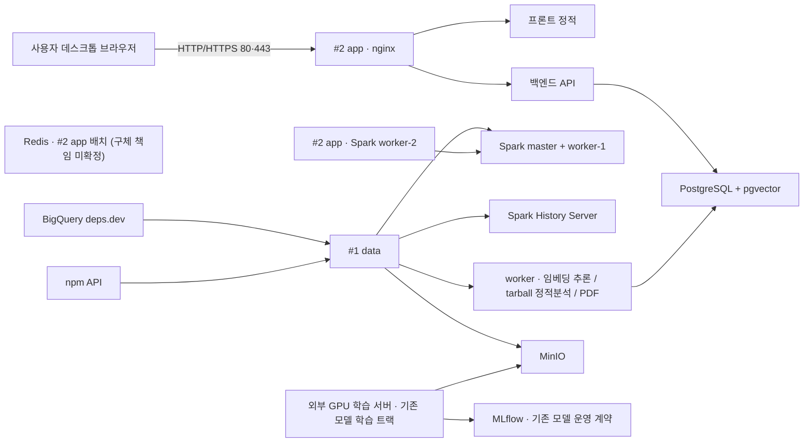

# Pickage 기능별 개발 구상안 0917

작성 기준일: 2026-09-04 (2026-09-10 코드 재검토 갱신: 후보 API·AI 배치·requirements 해석·Dependents major 표시·프런트 검증·저장소 배포 구성을 반영. 2026-09-15 개발현황 반영·간접·전이 Dependency 범위 제외 갱신: S15P21A506-358. 2026-09-17 개발현황 반영·Version Share 패키지 탭 범위 정정: S15P21A506-380, 상세는 `Pickage_0915_to_0917_기획변경_상세분석.md`. 2026-09-17 기능 비교 캐시 계약 확정: S15P21A506-381)
문서 상태: Approved (effective_at: 2026-09-10. `DEC-RANK-UI-20260910-01`: 후보는 최대 3개를 노출하되 초기에는 기준 패키지만 선택한다. 이 사용자 결정은 `DEC-RANK-20260910-01`의 상위 2개 기본 선택 조항만 대체한다. 나머지 랭커 계약과 `DEC-IMPLEMENTATION-ALIGN-20260910-01` 계약은 유지한다. `DEC-SCOPE-CUT-20260915-01`: 간접·전이 Dependency(확장-04)를 프로젝트 범위에서 제외한다. 사용자 확인(2026-09-17): Version Share "패키지 탭"은 Dependents·Downloads와 공유하는 카드 전체 선택 탭이다. `DEC-FEATURE-CACHE-20260917-01`: 기능 비교는 근거 데이터만 영속화하고 판정은 요청마다 재계산한다 — §7.1·9·14.5 참고)
실행 계약 재검수일: 2026-09-11 (개발현황·범위 갱신: 2026-09-15, 2026-09-17)
연결 문서: `Pickage_요구사항_명세서_0917.md`, `Pickage_메뉴구조_IA_0917.md`, `Pickage_서비스_기획서_0917.md`

이 문서는 확정된 사용자 경험을 개발 가능한 데이터·상태·처리 계약으로 옮긴다. 서버의 실제 컴포넌트 배치와 물리 자원은 2026-09-10 개발팀 `서버 정보.pdf`를 우선 정본으로 하고, 그 위에 기존 0904 시스템 아키텍처의 데이터·모델·배포 결정을 결합한다. 화면에서 요구하는 결과와 상태를 누락해서는 안 된다.

표기:

- **시스템 확정안**: v1에서 구현 기준으로 고정된 인프라·프로세스·데이터 흐름
- **제품 계약**: 구현 방식과 무관하게 반드시 만족해야 하는 사용자·데이터 조건
- **튜닝 가능**: 구조는 유지하되 운영 측정에 따라 threshold·자원량·주기 등을 조정할 수 있는 항목

## 1. 0904 핵심 결론

### 1.1 처리 구조

Pickage는 한 방식으로 모든 데이터를 실시간 수집하지 않는다. 사용자 클라이언트 제공 범위는 **데스크톱 웹 브라우저**로 고정하며, 별도 소형 화면 전용 클라이언트 계층은 두지 않는다.

| 구역 | v1 처리 | 이유 |
|---|---|---|
| 후보 검색 | `/packages/similar`가 PostgreSQL의 `similar_package`를 조회. AI 배치는 기본 `search_k=30`으로 결과 파일을 만들지만 DB 원자 게시 연결은 미완료 | API/화면 구현과 배치 게시 완료 상태를 구분 |
| 후보 생태계 신호 | BigQuery deps.dev Snapshot + npm API를 EC2 #1 배치에서 수집·집계 | 외부 호출과 무거운 변환을 서빙 경로에서 분리 |
| 보고서 1페이지 | Spark S1~S7 사전 변환·집계 → PostgreSQL 적재 | 모든 화면을 사전 집계 조회 중심으로 유지 |
| Downloads | npm API 독립 cron 수집·PostgreSQL 적재 | 놓친 기간을 복구하기 어려운 데이터이므로 별도 주기 관리 |
| Version Share | 최신 DB Snapshot의 version별 dependents를 major로 합산 | 시계열이 아닌 현재 구현의 관측 분포를 제공; requirement 해석 분포는 확장 |
| 기능 비교 [확장] | Data + AI + RAG 우선, 불가 시 AI + RAG | 고비용 기능 분석을 MVP와 분리 |
| GitHub 커뮤니티 [확장] | 짧은 TTL 갱신 캐시 | 최신성과 API 제한 균형 |
| PDF | 완료 생태계 ReportSnapshot 재사용(DB) + 세션이 보유한 현재 선택 버전의 기능 비교 결과를 요청 payload로 실어 생성(서버 재조회 없음, `DEC-FEATURE-CACHE-20260917-01`) + EC2 #1(data) worker 생성 | 생태계는 DB 재사용, 기능 비교는 세션 payload로 화면과 다른 재계산 방지; PDF 실행 부하는 app 서빙 경로와 분리 |

### 1.2 MVP 버전 상태

1. 후보 단계: 분석 버전 선택 없음. 카드에는 최신 버전을 참고 metadata로 표시
2. Dependency major 선택: 직접 의존 그래프의 `Total` 또는 선택한 하나 이상의 major 합계
3. Version Share: 버전 선택 상태가 아니라 최신 DB Snapshot 기준일과 major별 분포

기능 비교 버전은 확장 기능 내부 상태이며 생태계 화면 상태와 분리한다. 다만 PDF 적격성에서는 각 비교 패키지의 현재 선택 버전 결과가 완료되었는지 검사한다.

### 1.3 후보 ranking 원칙

**제품 계약**

- 의미 유사도(cos)는 관문을 통과한 후보의 순서를 정하는 **유일한 연속 신호**다. 생존·실체·보완재 여부는 점수 계수가 아니라 통과/탈락 관문으로만 사용한다.
- 검색 후보 수 `search_k=N`과 사용자 노출 최대 3개는 서로 다른 값이다. 현재 배치 기본 `N`은 30이고 초기에는 기준 패키지만 선택한다.
- 인기도·Downloads·채택도는 임베딩 학습, 의미 검색, 최종 정렬 score에 넣지 않는다. 화면의 생태계 맥락 정보로만 제공한다.
- 후보 ranking은 기술 품질 점수나 최종 추천이 아니다.
- 생성형 AI를 후보 검색·정렬에 사용하지 않는다.
- 사용자 요청 시점에는 모델을 호출하지 않고 사전 계산된 후보 결과를 조회한다.
- API가 반환하는 수치 score와 관문 판정은 화면에 노출하지 않는다. 화면에는 정렬 결과인 유사도 순위를 표시한다.

**시스템 확정안 — v1 랭커** (`DEC-RANK-20260910-01`)

1. **코퍼스 자격 필터**: dependents 하한, 최근 12개월 내 릴리스, deprecated 제외를 적용한다. deprecated 패키지는 기준 패키지와 후보 모두에서 제외하며 별도 추천 경로도 만들지 않는다.
2. **변경분 재임베딩**: MLflow `@production` 모델로 `text_hash`가 바뀐 정규화 입력(description·keywords)만 ONNX 재임베딩한다. 전수 재임베딩은 모델 승격 시에만 수행한다.
3. **순수 의미 검색**: 정규화 벡터 행렬곱으로 패키지별 `search_k=N` 후보를 넓게 가져온다. 이 단계에는 popularity·Downloads·dependents 가산을 넣지 않는다.
4. **구조적 관문**: 보완재, 노후, 실체 미달을 순서대로 판정해 탈락시킨다. 작은 가·감점 계수를 누적하지 않는다.
5. **최종 정렬**: 관문 통과 후보를 cos 유사도 내림차순으로만 정렬한다. cos가 같을 때만 dependents 수를 tie-break로 사용하며 score에는 더하지 않는다. `move_lift`도 사용하지 않는다.
6. **채점 게이트**: Recall@N(순수 의미 검색)과 Recall@10(관문·정렬까지 포함), MRR을 측정해 직전 운영값과 비교한다. 하락 시 staging 게시를 중단하고 알림을 발생시킨다.
7. **게시**: 게이트 통과분만 행수 가드를 거쳐 ERD의 현재 `similar_package` 한 벌로 원자 교체하고, 실행 manifest에 모델 버전·입력 snapshot·`search_k`·관문 활성 상태·검증 결과를 기록한다.
8. **화면 출력**: API는 기본 20·최대 50개를 반환하고 화면은 상위 최대 3개를 모두 미선택 카드로 표시한다.

**2026-09-10 구현 체크포인트**

- 구현됨: description+keywords 입력, 기본 `retrieve_k=30`, plugin/adapter 및 same-family 제거, cos 정렬, rank와 score 출력, `/packages/similar` 조회.
- 부분 구현: AI 출력의 `user_visible(rank<=3)`은 최종 후보 노출 수와 일치하지만 현재 프런트는 2개만 표시한다. `default_selected(rank<=2)`는 이번 사용자 결정으로 제품 계약에서 제외됐으며 UI가 소비해서는 안 되는 기존 출력이다.
- 미구현: 직접 의존 겹침을 이용한 보완재 관문, 51K 평가셋 기반 scoring gate, S3 게시, PostgreSQL 원자 적재기.
- 검증 경계: 평가셋이 확정되지 않아 scoring gate는 `SKIPPED`이며 명시적 `--allow-gate-skip` 없이는 성공 마커를 만들지 않는다.

**추가 확인한 코드 차이 — 2026-09-11**

- 기준 이름 존재 조회는 package 존재만 검사하며 deprecated 차단을 보장하지 않는다. 제품의 deprecated 기준/후보 제외는 유지한다.
- 현재 rerank는 반올림 score 정렬이며 dependents 동점 정렬을 구현하지 않는다. 원래 cos 동점만 tie-break하는 목표 계약은 유지한다.
- 직접 추가의 검색 상위 5개 exact match는 존재 증명은 가능하지만 부재 증명은 아니다. 정확 이름 우선 조회와 요청 완료 시 중복/최대 3개 재검증은 후속 결함이다.
- 보고서 직접 진입 fixture·비교 대상과 미연결된 기능 비교 sample/timer·누락된 PDF는 실제 분석 완료가 아니다.
- 탭 unmount 시 기간/major 필터 초기화, 실제 보고서 header의 비교 대상 표시 부족은 IA 목표와의 차이다.
- 기준일 달력 존재는 지표 완료 증거가 아니다. Version Share 과거 query는 이미 있지만 최신 완료 지표 선택은 구현됐다고 보지 않는다.

세부 증거와 기존 승인 gap의 구분은
[최종 6문서 검수 결과](worklogs/S15P21A506-307/최종6문서_검수결과_260911.md)에 기록한다.
이번 문서 작업에서 코드를 수정하거나 미구현을 자동 승인하지 않는다.

**유지되는 학습 원칙**: deprecated→대체 CSV와 migration pair는 “관련 있음”을 학습하는 positive pair로만 사용한다. 후보 가산점이나 별도 deprecated 추천 화면의 근거로 사용하지 않는다.

**OPEN 파라미터**

- `search_k=N`: 현재 구현 기본값은 30이다. 최종 운영값은 30·50·100 중 `S15P21A506-169`의 Recall@N·비용 측정으로 확정한다.
- 보완재 관문: dependents 교집합 `> 0.3`을 후보 기준으로 검증하되, 의존 그래프 준비 시점과 최종 threshold는 `S15P21A506-172`에서 확정한다.
- 노후 관문: 코퍼스의 최근 12개월 자격 필터는 유지한다. 최종 정렬 직전 별도 노후 컷을 추가할지는 중복 배제 여부를 검증한 뒤 결정한다.
- 구현 관문 분류: plugin/adapter·same-family 제거를 AI팀 목표 관문의 보완재 세부 규칙으로 편입할지는 오추천·과제외 false positive를 검증한 뒤 확정한다. 그 전에는 현재 구현 상태일 뿐 `DEC-RANK-20260910-01`의 확정 관문으로 간주하지 않는다.
- 평가셋: 현행 “deprecated 51K 홀드아웃”이라는 명칭의 실제 구성·누수·정답 정의를 `S15P21A506-169`에서 확인하기 전에는 검증 완료 데이터셋으로 단정하지 않는다.

**학습 개시 판정 기준**: Recall@N. 정답이 의미 검색 후보 풀에 반복적으로 들어오지 못하면 관문이나 score 계수로 고치지 않고 아래 3.5절 임베딩 학습 트랙을 연다. Recall@10·MRR 기반 승격 게이트와는 판단 시점이 다르다.

**알려진 한계**: express↔fastify처럼 설명 표현이 다른 대안 관계는 임베딩이 학습하지 못할 수 있다. 이 경우 랭킹 계수를 추가하지 않고 migration positive pair를 이용한 임베딩 개선으로 다룬다.

GBDT LTR 같은 다중 신호 랭커는 별도 후속 결정이 필요한 v1 이후 범위다. v1 품질 문제의 즉시 우회책으로 도입하지 않는다.

### 1.4 기능 비교 확장 원칙

우선 구현안은 `구조화 데이터 + AI + RAG`다. 정확한 버전의 Registry·배포 산출물 등에서 안정적으로 구조화 가능한 데이터는 별도 데이터 계층으로 제공하고, README·버전 문서·타입 선언 등 검색 가능한 근거는 RAG corpus로 사용한다.

구조화 데이터 계층이 수집 가능성·정확도·비용 측면에서 실용적이지 않다면 `AI + RAG`로 축소한다. 이 경우에도 검색된 근거 식별자와 생성 결과를 연결하고 근거 없는 기능 생성·추천을 허용하지 않는다.

### 1.5 API 정본과 wire 계약 (`DEC-API-ALIGN-20260910-01`)

**정본 우선순위**

1. 개발팀 **Notion API 명세**를 endpoint·요청·응답·오류 코드의 canonical source로 사용한다.
2. Notion에서 `서버 반영`이 완료된 항목은 **Swagger**가 실제 구현의 최종 기준이다.
3. 이 개발 구상안은 제품·클라이언트 요구를 설명하되, Notion에 없는 HTTP JSON 모양을 임의로 canonical 계약으로 만들지 않는다.

**현재 구현 상태 경계**: 2026-09-10 전달받은 Notion endpoint export는 기존 5개 항목을 `서버 반영 = No`로 표시했지만 이후 저장소에는 후보를 포함한 아래 6개 endpoint가 병합됐다. 표는 현재 코드 계약이며 Notion/Swagger가 다르면 `pending API alignment`로 추적한다.

현재 확정된 MVP endpoint 방향은 다음과 같다.

| 기능 | canonical endpoint 방향 | 클라이언트 사용 |
|---|---|---|
| 검색 자동완성 | `GET /packages/search?q={prefix}` | 입력 접두사 후보 표시. 목록 선택은 선택 사항 |
| 패키지 개요 | `GET /packages?names=a,b,c` | 최대 3개 패키지 개요 |
| Downloads | `GET /packages/downloads?names=a,b,c&from=&to=` | 공통 trend 응답. weekly 의미, 최대 104주 |
| Dependents | `GET /packages/dependents?names=a,b,c&from=&to=` | package-major별 series 반환. 프런트가 Total/선택 major를 합산 |
| Version Share | `GET /packages/version?names=a,b,c` | 최신 DB Snapshot의 version별 dependents를 major로 합산 |
| 후보 ranking·존재 검증 | `GET /packages/similar?name={name}&limit={limit}` | 기본 20·최대 50, `COMPLETE\|NO_DATA`, rank 순 후보와 `not_found` 반환 |

**wire 표기 경계**

- 성공/실패 공통 envelope와 오류 코드는 Notion 명세를 따른다.
- HTTP wire field는 `snake_case`를 사용한다. 프론트 `api/types`도 서버가 보내는 모양을 그대로 보존한다.
- UI/domain의 camelCase 변환은 `adapter.ts` 한 곳에서만 수행한다.
- 아래 장의 camelCase pseudo-model은 별도 설명이 없는 한 **내부 도메인 모델 예시**이며 HTTP 정본이 아니다.
- 게시 데이터 상태와 UI 요청 상태를 분리한다. 현재 후보 API의 `COMPLETE|NO_DATA`는 게시 데이터 상태이고, 화면의 `loading|success|empty|error` 및 원천이 지원할 때의 `partial|stale`은 UI 상태다.
- 현재 Dependents 응답에는 `relationship_type`이 없고 endpoint 의미와 `sum_over_versions=true`로 직접 의존 major 합계임을 표현한다.

## 2. 사용자 여정과 시스템 책임

| 단계 | 시스템 책임 | 주요 결과 | 범위 |
|---|---|---|---|
| 패키지 입력 | 접두사 자동완성 선택 또는 자유 입력 + `/packages/similar` 서버 검증 | selected package | MVP |
| 후보 탐색 | 의미 후보 pool 검색 | semantic candidates | MVP |
| 후보 ranking | 사전 계산 결과를 `/packages/similar`로 조회 | ranked candidates; API/화면 구현됨, 배치→DB 게시 미연결 | MVP |
| 비교 대상 확정 | 최대 3개·중복·존재 검증 | comparisonPackages | MVP |
| 생태계 변화 | 직접 의존 사전 집계·기간 자료 결합 | Direct Dependency series + Snapshot delta, Downloads, Version Share Snapshot | MVP |
| PDF | 생태계·현재 선택 버전 기능 비교 적격성 검사, 스냅샷·문서 생성 | reportSnapshot, pdfJob | 확장(기능 비교 제공 이후) |
| 기능 비교 | 정확한 버전 근거 retrieval·선택적 구조화·AI 분석 | assessment, evidence, narrative | 확장 |
| 재분석 | 이전 결과 보존·새 실행·차이 생성 | analysisRun, diff | 확장 |
| Evidence Drawer | 셀 단위 근거 응답 | assessment + grouped evidence | 확장 |
| GitHub 커뮤니티 | 저장소 검증·분석 Issue 집계·핵심 쟁점·실제 댓글 흐름 구성 | repository scope, community snapshot, topics, discussion messages | 확장 |

### 기능 번호 연결

| 기능 | 개발 구상 위치 | 범위 |
|---|---|---|
| 기능-01 패키지 입력 | 2·4장 | MVP |
| 기능-02 분석 가능 패키지 확정 gate | 2·4장 | MVP |
| 기능-03 후보 제공 | 4장 | MVP |
| 기능-04 비교 대상 확정 | 4장 | MVP |
| 기능-05 기간·기준일 | 5장 | MVP |
| 기능-06 Downloads | 5.3장 | MVP |
| 기능-07 Dependency | 5.1·5.2장 | MVP 직접 의존 |
| 기능-08 유지·유입·이탈 | 12.6장 | 확장 검토 |
| 기능-09 생태계 변화 통합 | 5장 | MVP |
| 기능-14 PDF | 13장 | 확장(기능 비교 제공 이후) |
| 기능-15 서비스 소개 | 정적 화면, 사용자 문서 기준 | MVP |
| 기능-16 자료 상태·오류 | 4·5·13장 및 확장 오류 | 공통 |
| 기능-17 Version Share | 5.4장 | MVP Snapshot |
| 기능-10 기능 버전·근거 수집 | 6·9장 | 확장 |
| 기능-11 환경·설치 조건 | 6~8장 | 확장 |
| 기능-12 기능 비교 | 7·8장 | 확장 |
| 기능-13 근거·해설·Drawer | 7·8·10장 | 확장 |
| 확장-01 버전 고착 심화 | 12.1장 | 확장 |
| 확장-02 관측된 교체 흐름 | 12.2장 | 확장 |
| 확장-03 Issues·GitHub 커뮤니티 | 5.5·12.3·12.4장 | 확장 |

## 3. 시스템 아키텍처 확정안

### 3.1 v1 실제 서버 기준 (`DEC-SERVER-ALIGN-20260910-01`)

2026-09-10 개발팀 `서버 정보.pdf`의 **서버 관측 배치와 실측 사양**을 인프라 근거로 사용한다. 과거 문서의 `t4g.xlarge`, MinIO `EBS 200GB` 같은 가정은 폐기한다. 다만 서버 관측과 저장소가 관리하는 재현 가능한 배포 선언은 구분한다. `deploy/prod/` compose에는 Redis·Spark History Server·임베딩/tarball/PDF worker 정의가 없고 `backend/build.gradle`의 Redis 의존성도 미사용 상태다. 이 구성들이 서버에 수동 배치됐는지는 별도 확인이 필요하다.

| 서버 | 역할 | CPU | 메모리 | 스토리지 | 서버 정보 PDF의 관측 배치 |
|---|---|---|---|---|---|
| **#2 app (기본)** | 사용자 요청·웹/API·상태 서빙 | 4 vCPU · Intel Xeon Platinum 8175M @ 2.50GHz | 15Gi · Swap 0 | NVMe block 320G · root partition 319G · `/` filesystem 약 309G | nginx, 프론트 정적, 백엔드 API, PostgreSQL+pgvector, Redis, Spark worker-2 |
| **#1 data (추가)** | 데이터 처리·분석 worker·객체 저장 | 4 vCPU · Intel Xeon Platinum 8259CL @ 2.50GHz | 15Gi · Swap 0 | NVMe block 320G · root partition 319G · `/` filesystem 약 309G | Spark master, worker-1, History Server, 임베딩 추론·tarball 정적분석·PDF worker, MinIO |

현재 서비스 외부 노출은 **#2 app의 80/443**이며 #1 data는 서비스 외부 노출이 없다. 두 서버 모두 Docker/Docker Compose 기반 운영을 전제로 한다. #2에는 HTTPS가 설정되어 있으나, 80 포트의 최종 redirect/ACME 동작은 nginx 실제 설정을 따른다.



위 다이어그램에서 GPU·MLflow는 기존 모델 학습/승격 계약을 유지하기 위한 논리 구성이다. **이번 서버 정보 문서가 GPU/MLflow의 물리 사양을 새로 확정한 것은 아니다.**

### 3.2 #2 app — 서버 관측 서비스·상태 노드

| 구성 | 현재 역할/배치 |
|---|---|
| nginx | 서비스 외부 진입. 80/443 노출, HTTPS 설정 |
| 프론트 정적 | Pickage 데스크톱 웹 정적 자산 서빙 |
| 백엔드 API | 패키지 검색·개요·생태계 보고서·PDF 요청 등 애플리케이션 API |
| PostgreSQL + pgvector | 현재 app 서버의 상태/데이터 저장 구성. 기존 집계 결과 서빙 및 벡터 확장 사용 가능 기반 |
| Redis | 서버 정보 PDF에는 app 서버 배치로 기록. 저장소 compose·백엔드 사용 근거는 없어 수동 배치 여부 확인 필요 |
| Spark worker-2 | #1 data의 Spark master와 함께 배치 처리에 참여 |

**예외 — GitHub 커뮤니티 확장(확장-03)**: `DEC-COMMUNITY-20260909-01`에 따라 이 확장의 refresh 경로에 한해서만 Spring Boot가 bounded 실행 단위로 GMS(외부 LLM 요약) API를 직접 호출할 수 있다. 이 예외는 새 범용 LLM 서빙 경로가 아니며, 나머지 MVP/코어 서빙 경로는 PostgreSQL 사전 결과 조회 중심 원칙을 유지한다.

기존 문서의 `Spark worker-2 = 2 core / 6G`는 **서버 물리 사양이 아니다.** 필요 시 Spark executor 자원 설정으로 다루되, 현재 app 서버의 실측 한계인 4 vCPU / 15Gi 안에서 nginx·프론트·API·PostgreSQL·Redis와 공존하도록 튜닝한다.

### 3.3 #1 data — 데이터·분석 노드

| 구성 | 현재 역할/배치 |
|---|---|
| Spark master + worker-1 | 데이터 변환·집계 실행의 중심 |
| Spark History Server | 서버 정보 PDF에는 현재 배치로 기록되지만 저장소 compose에는 정의 없음 |
| 분석 worker | 서버 정보 PDF에는 임베딩 추론, tarball 정적 분석, PDF 생성 역할로 기록되지만 저장소 compose에는 정의 없음 |
| MinIO | #1 data의 객체 스토리지 |
| cron/배치 스케줄 | 기존 P1 ETL·P2 downloads 등 정기 처리 실행 |
| MLflow / 모델 평가 | 기존 후보 모델 등록·평가·승격 계약을 유지하되, 이번 서버 정보 문서는 별도 물리 사양을 추가 확정하지 않음 |

기존 `worker-1 = 3 core / 10G`도 물리 서버 사양이 아니라 실행 시 자원 배분값으로만 취급한다. Spark, History Server, MinIO, 임베딩 추론, tarball 정적 분석, PDF가 **4 vCPU / 15Gi / 320G 디스크**를 공유하므로 실제 executor/worker 동시성은 이 한계 안에서 튜닝한다.

### 3.4 외부 데이터와 학습

- BigQuery/deps.dev와 npm API 수집·집계의 주 실행 위치는 #1 data다.
- 외부 GPU 학습 서버를 사용하는 기존 모델 학습 트랙은 유지하되, 이번 `서버 정보.pdf`는 GPU 사양·접속 방식을 새로 확정한 자료가 아니다.
- 학습 결과의 등록·승격은 MLflow alias와 `etl_load_execution` 실행 manifest를 사용해 추적한다.

### 3.5 모델 학습·스위칭 사이클

0. **개시 조건**: 1.3절 v1 랭커 채점 게이트에서 Recall@N이 정답을 순수 의미 검색 후보 풀에 반복적으로 담지 못하면 이 학습 트랙을 연다. 관문 조정이나 가·감점 계수로 보정하지 않는다.
1. 배치가 매 Snapshot에서 학습쌍을 갱신한다.
2. 외부 GPU가 학습 후 모델을 등록한다.
3. #1 data의 평가/승격 단계가 Recall@10·MRR 개선을 확인한다.
4. candidate 모델로 전수 재임베딩 후 staging 후보 결과를 적재하고 shadow 비교한다.
5. 승격 시 `@production` alias를 전환하고, 검증된 staging 결과를 현재 `similar_package`로 원자 게시한다. 롤백은 이전 검증 결과를 다시 게시하며 실행 manifest로 추적한다.

### 3.6 배포·실행 기준

- 두 EC2 모두 Docker와 Docker Compose 사용을 전제로 한다.
- 저장소는 GitLab이며 현재 `.gitlab-ci.yml`은 없다. CI/CD는 구축 목표이고 자동 배포가 구현됐다고 가정하지 않는다. runner·레지스트리·배포 명령은 `OPEN-SERVER-03`에서 확정한다.
- 동일 Spark job이 두 노드에서 호환되도록 Spark/Java/Python 등 런타임 버전 차이를 관리한다.

### 3.7 네트워크·노출 기준

- **서비스 외부 노출**: #2 app의 `80`, `443`.
- **#1 data 서비스 외부 노출**: 없음.
- SSH 22는 운영 접속을 위한 관리 경로로 서비스 외부 노출과 구분한다.
- PostgreSQL, Redis, Spark, MinIO, History Server 등 내부 컴포넌트 포트를 사용자 서비스 포트로 외부 공개하지 않는다.
- 과거 `#2:443만 외부 인바운드`라는 문구는 현재 서버 구성과 맞지 않으므로 사용하지 않는다.

### 3.8 서버 관측 구성과 저장소 관리 구성의 경계

**서버 정보 PDF에서 관측된 구성**:

- PostgreSQL + pgvector
- Redis
- Spark master / worker-1 / worker-2
- Spark History Server
- MinIO
- 임베딩 추론·tarball 정적분석·PDF worker
- nginx·프론트 정적·백엔드 API

다음은 여전히 별도 확장/운영 고도화로 본다.

- Prometheus·Grafana·healthchecks.io 등 별도 모니터링 스택
- 기능 비교용 `rag-svc` + 외부 LLM
- 문헌 체인 `J1~J6`
- blue-green 배포
- Loki 등 추가 로그 스택

**현재 저장소 `deploy/prod/` compose로 재현되는 구성**:

- #2 app: PostgreSQL, 백엔드 API, 프런트/nginx, Spark worker-2
- #1 data: MinIO/minio-init, Spark master, Spark worker-1

Redis·Spark History Server·임베딩/tarball/PDF worker는 서버 관측 목록에는 있지만 저장소 compose에는 없다. 따라서 제품 확장 여부와 무관하게 **배포 코드 관리 범위는 미확인**으로 둔다.

### 3.9 구현 미확정 인프라 항목

다음은 현재 자료만으로 확정할 수 없으므로 구현 정본을 확인하기 전까지 **OPEN**으로 유지한다.

- `OPEN-SERVER-01` PDF: #2 app의 요청/상태 관리와 #1 data PDF worker 사이의 실제 job 전달·queue·polling/notification 방식
- `OPEN-SERVER-02` Redis: 실제 사용 목적, key/TTL, 세션·캐시·job 상태 책임
- `OPEN-SERVER-03` CI/CD: 실제 runner, container registry, 배포 명령 및 두 서버 배포 동기화 방식
- `OPEN-SERVER-04` 서버 정보 PDF에는 있으나 compose에 없는 Redis·History Server·분석/PDF worker의 실제 프로세스·배포 소유권
- MinIO 예약 용량·보존/정리 정책
- 외부 GPU·MLflow의 물리 배치·사양

서버가 현재 배치되어 있다는 사실만으로 위 구현 방식을 추정하거나 새 컴포넌트를 추가하지 않는다.

### 3.10 2026-09-10 저장소 검증 차단 사항

- `frontend`의 `npm run typecheck`는 `src/routes/analyze/analyze-page.tsx:212`의 미정의 `setError` 호출로 실패한다. 기획 변경이 아니라 코드 결함으로 추적한다.
- `npm run lint`는 오류 없이 완료됐고 React 관련 경고 4건이 남았다.
- 로컬에 `numpy`, `duckdb`, Java 실행 환경이 없어 AI·requirements·backend 테스트를 재실행하지 못했다. 기존 테스트 정의와 worklog 증거만 현재 상태 판단에 사용했다.

### 3.11 클라이언트 경계

- 사용자 클라이언트는 데스크톱 웹 브라우저 1종으로 한정한다.
- 별도 소형 화면 전용 화면 구조나 클라이언트 상태 계약을 두지 않는다.
- 서버·배치 계약은 화면 크기별 분기를 전제로 설계하지 않는다.

## 4. 후보 검색과 선택

### 4.0 입력 검색·자동완성 계약

- 화면-01 입력은 `GET /packages/search?q={prefix}` 접두사 자동완성을 사용한다.
- 자동완성 선택과 자유 입력을 모두 허용하며 Enter 또는 `패키지 확인`으로 제출한다.
- 제출한 이름은 `GET /packages/similar?name=...`의 `not_found`로 존재를 검증한다. 검증 성공 전에는 후보 선택을 확정하지 않는다.
- 자동완성 결과가 없어도 자유 입력을 막지 않으며 `not_found`·조회 실패는 입력 영역에서 표시한다.
- 자동완성은 접두사 일치 목록 제시이며 오타 추측·다른 패키지 자동 교체·유사 패키지 추천과 구분한다.
- 직접 추가 입력은 `/packages/search?q={name}&limit=5` 결과에 정확히 같은 이름이 포함됐는지 검증한다. 접두사가 같은 다른 패키지는 통과시키지 않는다.

### 4.1 후보 배치 파이프라인

후보 생성은 사용자 요청 시 실시간 모델 호출이 아니라 사전 계산 결과를 사용한다. 현재 `ai/similarity/similarity_batch_pipeline.py`의 상태는 다음과 같다.

1. **입력·추론**: description+keywords를 사용하고 raw text가 있으면 이를 우선한다. ONNX Runtime으로 임베딩한다.
2. **순수 의미 검색**: 정규화 벡터 행렬곱으로 기본 30개를 가져온다. 최종 `search_k=N`은 평가 후 확정한다.
3. **현재 구조적 관문**: plugin/adapter·same-family·repo_archived 후보를 drop한다(S15P21A506-333).
4. **미구현 관문**: dependency overlap을 사용하는 보완재 제거와 추가 노후·실체 기준은 후속 과제다. 관문에 쓸 데이터 기반(peer 의존 유사도 S15P21A506-350, dependents 목록 S15P21A506-354, AI 후보 풀 회차 S15P21A506-359)은 마련됐으나, 이 파이프라인 코드는 2026-09-17 기준 아직 그 데이터를 참조하지 않는다 — 관문 자체는 여전히 미구현이다.
5. **최종 정렬**: 통과 후보를 cos 유사도 내림차순으로 정렬한다.
6. **채점 게이트**: 구현 골격은 있으나 51K 평가셋이 확정되지 않아 `SKIPPED`다. `--allow-gate-skip` 없이는 성공 마커를 쓰지 않는다.
7. **게시**: 결과 파일 생성과 PostgreSQL `similar_package` 원자 게시(`pipeline/similar_package/load.py`)가 구현됐다(S15P21A506-342). S3 게시 경로는 별도 확인이 필요하다.

### 4.2 v1 구조적 관문과 최종 정렬

**시스템 확정안**

- AI팀 목표 순서: 입력 자격 확인 → 순수 의미 검색 `search_k=N` → 보완재·노후·실체 미달 관문 → cos 최종 정렬
- 현재 구현: plugin/adapter·same-family·repo_archived 후보를 drop한다(S15P21A506-333). 세 규칙 모두 AI팀 검증 전까지 목표 관문의 확정 세부 규칙이 아니라 구현 중인 임시 관문으로 관리한다.
- 미구현 목표 관문: dependency overlap 보완재 제거와 추가 노후·실체 기준. 작은 감점 계수로 대체하지 않는다(2026-09-17 재확인, 관문 로직 자체는 여전히 미구현 — 데이터 기반은 위 §4.1-4에서 마련됨).
- score: cos 유사도 단독. `move_lift`, popularity, Downloads, dependents 가산은 사용하지 않는다.
- tie-break: cos가 같을 때만 dependents 내림차순을 사용한다.
- 검색 후보 수: 현재 기본 30. 최종 `N`은 30·50·100 중 평가 후 확정하며 화면 노출 수와 별도 설정한다.
- API 반환: 기본 20, 최대 50
- 사용자 노출 후보: 상위 최대 3개
- 기본 선택: 없음

API의 수치 score와 관문 판정은 사용자에게 기술 품질 점수로 노출하지 않는다. 후보 화면에는 패키지명·설명·유사도 순위·최신 버전만 제공한다.

### 4.2.1 채점 게이트와 지표 정의

- **Recall@N** = 순수 의미 검색 단계의 성적. 정답이 설정된 `search_k=N` 후보 안에 들었는지로 측정한다.
- **Recall@10** = 구조적 관문과 cos 정렬까지 마친 전체 파이프라인의 성적. 화면 노출 수 3과 다른 오프라인 평가 cut-off다.
- **MRR** = 전체 정렬에서 첫 정답의 순위를 평가하는 보조 지표다.
- 평가셋은 현행 “deprecated 51K 홀드아웃”의 실제 구성·누수·정답 정의를 확인해 식별자를 고정해야 한다. 확인 전에는 숫자만으로 검증 완료를 선언하지 않는다. 설계 노트는 추가됐으나(S15P21A506-335) 게이트 구현과 식별자 고정은 2026-09-15 기준 여전히 TODO다.
- 직전 운영값 대비 하락하면 해당 staging 결과의 게시를 중단하고 알림을 보낸다. 저품질 결과가 현재 `similar_package`를 교체하지 못하게 하는 안전장치다.
- Recall@N이 반복적으로 하락하면 3.5절의 모델 학습 트랙을 여는 판단 기준이 된다. v1에서는 재랭킹 계수 튜닝으로 해결하지 않는다.
- **알려진 한계**: Live 경쟁자(예: express↔fastify)처럼 이미 널리 쓰이는 대안 간 비교는 임베딩 단독 성능에 의존한다. 이 한계는 보완하지 않고 한계로 명시한다.

GBDT LTR는 별도 결정과 평가를 거쳐야 하는 v1 이후 고도화다. 도입하더라도 MLflow 모델 사이클과 서빙 조회 구조는 유지한다.

### 4.3 현재 후보 API 계약

현재 저장소에는 다음 endpoint와 응답이 구현되어 있다. Notion/Swagger 동기화 여부는 후속 확인한다.

- `GET /packages/similar?name={name}&limit={limit}`
- `limit`: 기본 20, 최대 50
- 응답: `base`, `model_ver`, `data_status`, `candidates`, `not_found`
- candidate: `rank`, `score`, `name`, `latest_version`, `description`
- `data_status`: 후보 결과가 있으면 `COMPLETE`, 없으면 `NO_DATA`

기준 패키지는 후보 목록에 중복 포함하지 않고, 화면은 상위 최대 3개를 모두 미선택 카드로 표시한다(S15P21A506-309, 2026-09-15 구현 완료 — 이전 프런트 2개 노출 gap 해소). HTTP 응답에는 수치 score가 있지만 UI에는 표시하지 않는다. 생성형 AI가 요청 시점에 후보 이름을 만들거나 순서를 임의 변경하지 않는다.

후보 API와 AI 배치의 DB 원자 게시(`pipeline/similar_package/load.py`, S15P21A506-342)가 모두 구현됐다. 주간 수집 자동화(systemd timer, `pipeline/weekly/`)와 운영 상태 조회 API(`OpsWeeklyController`)가 구현됐다(S15P21A506-273·-347).

### 4.4 비교 대상 확정 계약

- 기준 패키지는 항상 포함
- 기준 패키지 해제 요청은 거부
- 최종 패키지 수 1~3
- 패키지명 중복 금지
- 네 번째 패키지 요청은 기존 선택을 자동 제거하지 않고 `MAX_SELECTION_REACHED` 반환
- 직접 추가 패키지는 자동완성 선택 또는 자유 입력 후 `/packages/search` 정확 일치 검증에 성공하면 추가하고 후보 ranking은 변경하지 않음
- 현재 후보 API는 후보 있음 `COMPLETE`, 후보 없음 `NO_DATA`, 존재하지 않는 이름 `not_found`를 구분함. 요청 실패는 UI `error`로 처리

## 5. 보고서 1페이지

### 5.1 사전 집계

**제품 계약**

- MVP는 직접 의존 관계만 집계한다.
- MVP signed 증감은 각 패키지의 현재 표시 필터와 동일한 **조회 구간**에서 첫 유효 관측값과 마지막 유효 관측값의 직접 의존 선언 수 차이만 사용한다.
- signed 증감은 총수 변화이며 동일 dependent의 유지·유입·이탈을 의미하지 않는다. 사용자가 그래프 조회 기간을 바꾸면 비교 기준도 해당 기간의 양 끝으로 바뀌며, 화면에 두 기준일을 함께 표시한다.
- 유효 point가 2개 미만이면 증감값 `0`을 만들지 않고 자료 상태를 남긴다.
- 같은 조회 구간·표시 필터·규칙이면 같은 signed 증감이 계산되어야 한다.
- 서버/DB는 패키지별 직접 의존 시계열을 제공하고, signed 증감은 별도 서버 summary로 저장·반환하지 않는다. 프론트 `adapter.ts`가 해당 trend의 첫·마지막 유효 point를 사용해 계산한다.
- 기능-08 유지·유입·이탈은 MVP 완료 조건이 아니며 확장 파이프라인으로 분리한다.
- `DEC-DEPENDENCY-DELTA-20260910-01`에 따라 총수 차이만으로 retained/inflow/outflow를 역산하거나 추정하지 않는다.

**시스템 확정안**

- EC2 #1 cron이 deps.dev BigQuery를 조회하고 Spark master + worker①/②가 S1~S7 변환·집계를 수행한다.
- 상태와 중간 산출물은 MinIO에 저장하며 Spark 자체는 무상태로 운용한다.
- 현재 package/version·calendar 로더는 transaction·lock·임시 staging 후 `INSERT … ON CONFLICT UPDATE`와 `etl_dataset_current` 게시로 갱신한다. 후보 결과의 원자 게시 전략은 §14.4의 `similar_package` 계약을 따른다.
- 필요한 partition 수·executor 메모리·동시성은 두 실서버 각각 **4 vCPU / 15Gi**의 한계와 현재 동시 배치 서비스 부하를 기준으로 튜닝한다.

### 5.2 Dependency 표시·API 계약

MVP는 직접 의존으로 고정한다. 간접·전이 의존은 프로젝트 범위에서 제외한다(2026-09-15, S15P21A506-358). **Dependents 추이와 Downloads 추이는 서로 독립 endpoint로 유지**한다.

#### Total 조회

```text
GET /packages/dependents?names=winston,pino,bunyan&from={from}&to={to}
```

- API는 같은 패키지의 series를 major별로 반환한다.
- 프런트의 기본 `Total`은 반환된 모든 major series를 날짜별로 합산한다.
- Total은 고유 프로젝트 수가 아니므로 화면에서 `N개 프로젝트가 사용`으로 표현하지 않는다. `의존 수(버전별 합계)` 의미를 유지한다.

#### major 다중 선택

- 패키지마다 사용 가능한 major 목록을 독립적으로 표시한다.
- 하나 이상의 major를 선택하면 프런트가 해당 series들을 날짜별로 합산한다.
- `Total`을 선택하면 모든 major를 합산한다.
- 선택 변경은 이미 받은 응답을 사용하므로 새 API 요청을 만들지 않는다.
- HTTP 응답은 같은 `name`이 major마다 반복되는 TrendResponse이며 `sum_over_versions=true`를 포함한다.

#### signed 증감 계산

- 서버 응답에 `summary{previous_count,current_count,delta}` 같은 별도 객체를 요구하지 않는다.
- 보고서의 signed 증감은 프론트 `adapter.ts`가 **현재 화면 trend의 첫·마지막 유효 point**를 찾아 `last.value - first.value`로 계산한다.
- 계산 입력은 화면에 표시하는 `from/to` 범위의 trend 응답에 한정한다. 별도 최소 조회나 새 endpoint를 요구하지 않는다.
- 유효 point가 2개 미만이거나 자료 상태상 계산할 수 없으면 값 대신 해당 자료 상태를 표시한다.
- UI 조회 기간 변경은 그래프 범위와 signed 증감 기준을 함께 변경하며, 두 기준일을 카드 메타에 표시한다.
- `+/-`는 총수 증가·감소만 의미하며 retained/inflow/outflow를 뜻하지 않는다.
- 여러 패키지의 비교 시계열은 규모 차이 때문에 작은 시리즈가 바닥에 눌리지 않도록 로그축을 사용한다. 현재 프런트는 선형축이다.
- 유효 Snapshot point가 2개 이하인 경우에는 계열별로 선그래프 추세를 과장하지 않고 `데이터 축적 중 (N주차)`를 표시한다. 현재 프런트는 전체 series의 최대 point 수로 판단한다.

#### required metadata

- Snapshot point의 `snapshot_at`
- series의 `major`
- `sum_over_versions = true`
- 패키지별 `not_found`

현재 응답을 Notion canonical API와 동기화하고 Swagger로 확인한다.

### 5.3 Downloads

canonical endpoint: `GET /packages/downloads?names=a,b,c&from=&to=`

- npm 공식 Downloads API 경로만 사용
- npmjs.com 웹 화면, npmtrends 등 서드파티 집계 사이트 크롤링 금지(2026-09-08 팀 결정)
- 한 point의 단위는 **직전 7일 다운로드 합계**이며 UI에는 `주간 Downloads` 또는 동등한 weekly 의미를 표시한다.
- 조회 요청 상한은 현재 `SnapshotWindow.MAX_WEEKS`와 같은 **104주**다. 실제 보유 자료가 더 짧으면 확보된 구간만 반환한다.
- 기간과 호출 기준일 기록
- 누락 구간은 null/gap으로 보존하고 주간 관측 간격이 8일을 넘으면 차트 path를 끊는다. S15P21A506-304로 관측 공백(8일 초과) 단절과 지표 카드별 오류 격리가 구현됐다.
- 기준일 달력이 월요일 주간이 아니어도(2026-02 이후 금·화·목이 섞임) **서버는 월요일 격자로 응답한다**(S15P21A506-403). Downloads 는 구간 합계를 일평균으로 펼쳐 주간 합계로 환산하고, Dependents 는 관측 범위 안의 빈 주를 선형 보간한다. 그래서 8일 초과 단절은 Downloads 에서 그 패키지의 행이 없어 7일이 덮이지 않은 주에만 나타난다. 세부 규칙은 `설계_지표별_관측기간_기준일_표시계약_260918.md` §2.
- Dependents 카드는 실제값(로그축)으로 열고 변화율(구간 시작 = 100%)로 전환한다. (2026-09-20, S15P21A506-416 — 이전에는 변화율이 기본이었다)
- 0은 정상 응답에서 실제 값이 0일 때만 사용
- Downloads와 Dependents는 공통 TrendResponse 계열을 재사용하되 metric/unit metadata로 의미를 구분한다. 구체 wire field는 Notion/Swagger 정본을 따른다.
- 여러 패키지 비교 그래프는 규모 차이를 고려해 로그축을 사용한다. S15P21A506-311로 로그축이 구현됐다.
- 유효 point가 2개 이하인 초기 수집 상태에서는 **계열별로** 선 추세 대신 `데이터 축적 중 (N주차)`를 제공한다. S15P21A506-311로 계열별 데이터 축적 판정이 구현됐다.

#### 시계열 계산 순서와 결측 경계

1. 표시 기간으로 원시 주간 관측을 제한한다.
2. null·8일 초과 관측 공백을 구간으로 분리한다. 관측 없는 major를 0으로 확정하지 않는다.
3. 같은 기간/필터의 유효 point로 계열별 축적 상태와 첫·마지막 signed delta를 계산한다.
4. 구간별 화면 다운샘플링 후 `log1p(x)` 좌표로 그린다. 눈금·툴팁·delta는 원래 단위다.

2주 이상 표시 간격을 8일 결측으로 오인하거나 다운샘플링 후 2점이라는 이유로 축적 중 판정하지 않는다.
현재 major 합산은 없는 날짜를 0으로 대체할 수 있고 SQL은 첫 non-zero 전 값을 제거하므로,
완전한 0 시계열/부분 major의 실제 의미가 현재 응답만으로 확정되지 않는다.
이 차이는 실제 0과 결측을 구분해야 한다는 제품 계약의 이행 과제이며, 임의로 0을 채워 해결하지 않는다.

### 5.4 Version Share Snapshot

canonical endpoint: `GET /packages/version?names=a,b,c`

Version Share는 MVP에서 **최신 DB Snapshot**만 사용자 화면에 사용한다. 현재 API는 공통 `snapshot` 달력 테이블의 `MAX(snapshot_at)`을 기준일로 고르고, 그 날짜의 `package_version_snapshot`에서 version별 dependents를 major로 합산한다. 패키지별 지표의 최신 완료일을 선택하거나 데이터가 있는 과거 날짜로 자동 fallback하지 않는다. 따라서 최신 달력만 있고 해당 지표가 없을 수 있다.

S15P21A506-311부터 카드별 응답에 Version Share 자체 기준일(`versionShareSnapshotAt`)을 개요 공통 기준일과 분리해 노출한다. 두 기준일이 다를 수 있음을 화면에 함께 표시한다.

API의 선택적 `snapshot_at` 과거 날짜 조회는 `PackageController`·`PackageService`·SQL·frontend endpoint에 이미 구현돼 있다. MVP UI의 최신 전용 계약과 충돌하지 않으며 과거 조회 UI를 추가하라는 뜻은 아니다.

**제품 계약**

- Version Share 화면에 시간축 series를 요구하지 않는다.
- 각 패키지는 최신 DB Snapshot 기준일과 major 계열별 관측 비중을 제공한다.
- 기준은 dependents이며 실제 설치 버전·고유 사용 프로젝트 수로 표현하지 않는다.
- 현재 frontend는 상위 5개 major + 기타로 접는다. API가 개별 비율을 소수점 1자리 반올림하므로 표시 합계가 99.9%/100.1%일 수 있다. 원본 분모와 반올림을 설명하고 이를 누락 데이터나 정확한 100%로 조작하지 않는다.
- 현재 응답은 상위 major와 화면의 `기타` 묶음을 제공할 수 있으나 requirement 원문의 해석 불가 상태를 제공하지 않는다.
- 현재 응답은 `items`, `slices`, `not_found`를 사용하며 공통 `data_status`는 없다.

**확장 준비 설계**: `pipeline/requirements_resolution/`에 requirement 문자열 해석 코드가 구현됐다. 다만 2026-09-10 전체 실행은 OOM 이후 `PARTIAL`이며 표준 게시·`_SUCCESS`·current 전환과 API serving이 완료되지 않았다. 확장 단계에는 원본 requirement, 해석 major, `RESOLVED|UNKNOWN|AMBIGUOUS`, 가중치/분모를 보존하고 **최신 완료 실행**만 읽도록 연결한다.

### 5.5 Issues 확장

GitHub 저장소 연결이 검증된 패키지만 시계열을 제공한다.

- 패키지와 저장소의 연결 범위 저장
- 저장소 전체 또는 패키지 단위 구분
- 호출 실패·제한 구간을 null로 유지
- GitHub 커뮤니티 페이지와 같은 저장소 검증 결과 사용

## 6. 확장: 기능 비교 자료·RAG 우선순위

### 6.1 우선 자료와 두 구현 경로

| 우선순위 | 출처 | 역할 |
|---|---|---|
| 1 | npm Registry 정확한 버전 응답 | 버전·dist·tarball·무결성 |
| 2 | 정확한 버전 tarball | package.json, README, 타입 선언, 공개 배포 파일 |
| 3 | deps.dev 버전 자료 | 버전·라이선스·advisory·provenance 보조 확인 |
| 4 | 검증된 GitHub 태그·커밋·버전 문서 | 배포본 부족 근거 보완 |
| 5 | 기본 브랜치 최신 문서 | 최신 참고만 허용, 과거 버전 확정 근거 금지 |

**우선 경로: Data + AI + RAG**

- Registry·package.json·타입·공개 진입 정보처럼 안정적으로 구조화할 수 있는 항목은 별도 데이터 계층으로 정리한다.
- README·versioned docs·태그/커밋 자료 등은 검색 가능한 RAG corpus로 구성한다.
- AI에는 구조화 데이터와 검색된 근거를 함께 제공한다.

**Fallback: AI + RAG**

- 구조화 계층의 신뢰성·비용이 충분하지 않으면 별도 정형 데이터 판정 계층을 생략한다.
- 정확한 버전과 연결된 문서·배포 산출물에서 검색한 근거를 AI에 제공한다.
- 검색 근거 ID와 생성 문장의 연결을 검증한다.

두 경로 중 어느 것을 채택할지는 확장 기능 POC 결과로 확정한다.

### 6.2 안전 원칙

- Registry가 반환한 tarball 주소만 사용
- dist.integrity 검증
- 상위 경로·절대 경로·위험한 심볼릭 링크 차단
- 압축 해제 크기·파일 수·시간 상한
- install, build, postinstall, 임의 JavaScript 실행 금지
- README의 지시문을 명령으로 실행하지 않음
- tarball과 해제 결과는 기본적으로 임시 사용

## 7. 확장: 기능 분석 계약

### 7.1 핵심 엔터티

`SourceSnapshot`·`EvidenceRecord`(근거 데이터)는 PostgreSQL에 영속화해 (패키지, 버전) 단위로 재사용한다. `FeatureAssessment`·`AnalysisRun`·`ReanalysisDiff`(판정 결과)는 영속화하지 않고 요청마다 새로 계산한다 — 근거 재사용과 판정 재계산을 분리한 결정이다(`DEC-FEATURE-CACHE-20260917-01`, §9.1·§14.5).

#### FeatureAssessment (비영속 — 요청마다 재계산)

```text
assessmentId
package
version
featureId
featureLabel
verdict
dataStatus
summary
analysisRunId
analyzedAt
```

#### EvidenceRecord (영속)

```text
evidenceId
snapshotId
package
version
sourceType
path
section
excerpt
confirmedContent
verificationLevel
```

#### AssessmentEvidence (비영속 — FeatureAssessment에 종속)

```text
assessmentId
evidenceId
evidenceRole
displayPriority
defaultExpanded
verdictContribution
```

#### SourceSnapshot (영속)

```text
snapshotId
package
version
integrityAbbrev
sourceCollectedAt
sourceStatus
officialTagMatch
provenanceStatus
```

#### AnalysisRun (비영속 — 세션 범위)

```text
analysisRunId
requestedVersions
runStatus
progressStep
analyzerVersion
rulesetVersion
startedAt
completedAt
previousCompletedRunId
```

#### ReanalysisDiff (비영속 — 세션 범위, §9.5)

```text
previousRunId
currentRunId
changedAssessments
addedEvidenceIds
removedEvidenceIds
reasonSummary
```

#### ReportSnapshot (영속 — PDF 요청 payload를 고정)

```text
reportSnapshotId
comparisonPackages
ecosystemPeriod
dependencyDisplayFilters
featureVersions
completedAnalysisRunIds
communitySnapshotIds
dataStatuses
createdAt
```

`completedAnalysisRunIds`는 서버가 들고 있는 완료 run을 가리키지 않는다. `AnalysisRun`을 영속화하지 않으므로(§9.1) PDF 요청이 함께 실어 보낸 세션 보유 결과(§13.1)를 식별하는 용도로만 쓰고, 재조회 키로 사용하지 않는다.

### 7.2 verdict와 dataStatus 분리 (내부 도메인; HTTP wire는 `data_status`)

`verdict`는 기능 판정이고 `dataStatus`는 자료·분석 상태다.

```text
verdict:
SUPPORTED
CONDITIONALLY_SUPPORTED
LIMITED_SUPPORT
UNCONFIRMED
UNSUPPORTED

dataStatus:
COMPLETE
PARTIAL
NO_DATA
COLLECTION_ERROR
CONFLICT
STALE
```

`UNSUPPORTED`는 공식적인 부정 근거가 연결된 경우에만 허용한다.

### 7.3 evidenceRole

```text
SUPPORTS
LIMITS
CONTRADICTS
CONTEXT
SEARCH_TRACE
```

- SUPPORTS: 지원을 직접 뒷받침
- LIMITS: 환경·설정·범위 제한
- CONTRADICTS: 다른 근거와 충돌하거나 지원을 보류하게 함
- CONTEXT: 판정 해석에 필요한 배경
- SEARCH_TRACE: 무엇을 확인했지만 발견하지 못했는지 기록

### 7.4 sourceType 예시

```text
REGISTRY_METADATA
TARBALL_PACKAGE_JSON
TARBALL_README
TYPE_DECLARATION
PUBLIC_ENTRYPOINT
VERSIONED_DOC
GITHUB_TAG
GITHUB_COMMIT
DEPS_DEV
STATIC_ANALYZER
```

`verificationLevel`은 숫자 점수가 아니라 `OFFICIAL_VERSIONED`, `OFFICIAL_LATEST`, `DISTRIBUTED_ARTIFACT`, `STATIC_CONFIRMATION`, `SUPPLEMENTARY` 같은 범주형 값으로 둔다.

## 8. 확장: RAG 기반 기능 판정·비교 흐름

권장 흐름:

1. 비교 대상의 정확한 버전과 허용 출처 범위를 결정
2. 버전별 문서·배포 산출물을 RAG corpus 또는 검색 가능한 근거 저장소로 구성
3. 우선 경로에서는 안정적으로 추출 가능한 환경·패키지 메타데이터를 구조화
4. 비교 질문 또는 기능 후보별로 관련 근거 retrieval
5. 검색된 근거가 실제 비교 질문을 지원하는지 검증
6. AI에는 검색된 근거와, 제공 가능한 경우 구조화 데이터를 함께 전달
7. 허용된 verdict 후보와 근거 식별자를 생성
8. evidence ID·패키지·버전·판정 기여를 검증
9. 같은 버전 근거 충돌 여부 검사
10. 근거가 충분하면 핵심 5~7개 선정하고 부족하면 확인 가능한 수만 반환
11. 구조화 표와 근거 ID가 연결된 중립 해설 생성

Fallback `AI + RAG`에서는 3단계 구조화 데이터 계층을 생략할 수 있지만 1·2·4·5·7·8단계의 근거 추적 계약은 유지한다.

고정된 HTTP 기능표를 다른 분야에 재사용하지 않는다. 비교 가능한 기능이 부족하면 `COMPARISON_LIMITED` 상태를 반환하고 억지 표를 만들지 않는다.

### 판정 검증 규칙

| verdict | 최소 조건 |
|---|---|
| SUPPORTED | SUPPORTS 근거 1개 이상, 치명적 충돌 없음 |
| CONDITIONALLY_SUPPORTED | SUPPORTS와 LIMITS가 함께 존재하거나 명시 조건 존재 |
| LIMITED_SUPPORT | 기능 일부 근거와 범위 제한 근거 존재 |
| UNCONFIRMED | 직접 근거 부족 또는 CONFLICT |
| UNSUPPORTED | 명시적인 공식 부정 근거 존재 |

이 판정 규칙은 확장 기능에만 적용하며 MVP 생태계 지표에 사용하지 않는다.

## 9. 확장: 기능 비교 버전과 재분석

### 9.1 최초 진입

- 패키지별 latest dist-tag를 확인하되 사전 배포가 아니면 구체 안정 버전으로 저장
- latest가 사전 배포를 가리키면 공개 버전 목록에서 가장 최근의 비사전 배포 버전을 선택
- 비사전 배포 버전이 하나도 없으면 `NO_STABLE_VERSION`으로 반환하고 사전 배포를 자동 선택하지 않음
- 근거 데이터(`SourceSnapshot`·`EvidenceRecord`)가 이미 수집돼 있으면 재사용하고, 판정(`FeatureAssessment`)은 캐시 없이 항상 새로 계산한다(`DEC-FEATURE-CACHE-20260917-01`)
- 근거 데이터가 없으면 수집부터 비동기로 실행

### 9.2 버전 변경

버전 드롭다운 변경은 즉시 분석을 시작하지 않는다.

```text
selectedFeatureVersion != completedFeatureVersion
→ uiState = REANALYSIS_REQUIRED
→ 기존 completed result 유지
→ PDF eligibility = BLOCKED
```

### 9.3 재분석 실행

- 동일 요청 중복 실행 방지
- run idempotency 보장
- `previousCompletedRunId`는 서버 DB가 아니라 **클라이언트가 세션에 들고 있는 직전 완료 결과**를 가리킨다 — `AnalysisRun`을 영속화하지 않으므로 서버는 이 값을 조회 키로 쓰지 않는다(`DEC-FEATURE-CACHE-20260917-01`)
- 성공 시에만 화면의 현재 완료 결과를 교체하고, 클라이언트는 교체 전 결과를 다음 재분석의 `previousCompletedRunId`로 들고 있는다
- 실패하면 기존 완료 결과 유지
- 부분 완료는 영향받는 assessment만 PARTIAL/UNCONFIRMED 처리

### 9.4 진행 상태 전달

권장 방식은 SSE 또는 동등한 단방향 스트리밍이다.

예시 단계:

```text
VERSION_VERIFIED
ARTIFACT_COLLECTED
ENVIRONMENT_EXTRACTED
EVIDENCE_EXTRACTED
ASSESSMENTS_LINKED
NARRATIVE_GENERATED
COMPLETED
```

완료되지 않은 단계를 완료로 전송하지 않는다. 재연결 시 현재 run 상태를 조회할 수 있어야 한다.

### 9.5 재분석 변경점

클라이언트가 세션에 들고 있는 직전 완료 결과와 현재 결과를 **클라이언트 측에서** 비교해 변경점만 표시한다. 서버는 완료 결과를 영속화하지 않으므로 세션이 끊기거나 직전 결과를 들고 있지 않은 상태(새로고침, 다른 세션에서 재방문 등)에서는 이 비교를 제공하지 않는다 — 세션을 벗어난 재분석 diff는 지원 범위 밖이다(`DEC-FEATURE-CACHE-20260917-01`).

- verdict 변경
- 새 근거·제한 근거 추가
- 버전 자료 변경
- analyzer/ruleset 변경

전체 분석 이력을 서버에 남기지 않는다.

## 10. 확장: Evidence Drawer 응답 계약

Drawer는 셀 중심 요청을 사용한다.

```text
GET /reports/{reportId}/features/{featureId}/packages/{package}/evidence
```

응답에는 다음을 포함한다.

- 셀 assessment
- 같은 기능의 패키지 탭 정보
- 역할별 evidence groups
- 핵심 근거 defaultExpanded
- 기술 정보 요약
- 허용 복사 필드
- reason-based retry action
- focus return target를 복원할 수 있는 cell identifier

클라이언트 응답에는 원본 URL, 내부 저장 경로, 비밀값, 전체 integrity를 포함하지 않는다. 저장소와 출처 식별자는 표시 문자열로만 반환하며 클릭 가능한 URL 필드는 보고서·Drawer·커뮤니티 응답에 제공하지 않는다.

### 기술 정보 표시 범위

- package@version
- 축약 integrity와 검증 상태
- 파일 수·압축 해제 크기
- 공식 태그 일치 상태
- provenance 상태
- source snapshot ID
- cache ID 축약값
- analyzer/ruleset 버전
- 수집·완료 시각

### 발췌 계약

- 기본 3줄 분량
- 내부 펼침 최대 10줄
- 전체 문서·전체 섹션 반환 금지
- source excerpt와 service interpretation 분리

## 11. 확장: 미확인과 재시도 정책

| reasonCode | UI 행동 |
|---|---|
| TRANSIENT_FETCH_ERROR | 다시 시도 |
| PARTIAL_SOURCE_FAILURE | 실패 자료 다시 시도 |
| ANALYZER_STALE | 새 분석 |
| SOURCE_ABSENT | 재시도 없음, 확인 범위 표시 |
| EVIDENCE_CONFLICT | 재시도 없음, 충돌 유지 |
| RUNTIME_REQUIRED | 추가 검증 필요 안내 |

단순히 결과가 미확인이라는 이유로 항상 재분석 버튼을 제공하지 않는다.

## 12. 확장 기능

### 12.1 버전 고착 심화

MVP Version Share의 원자료와 버전 조건 해석 결과를 재사용하되, 다음을 별도 분석 결과로 둔다.

- 현재 주버전 조건
- 이전 주버전 조건
- 여러 주버전 허용 조건
- 태그·주소·비표준 조건
- 안전하게 해석할 수 없는 조건

**UI·응답 계약**

- 확장-01은 화면-03A 하단 인페이지 모듈이며 별도 route를 만들지 않는다.
- 보고서의 비교 패키지 목록을 그대로 탭 후보로 사용하고 기본 선택은 `basePackage`다.
- 탭 선택은 `selectedPackage` 표시 상태만 바꾸며 비교 대상 목록 자체를 변경하지 않는다.
- 서버는 패키지별 최신 고착 결과를 독립적으로 식별할 수 있어야 하며, UI는 선택 패키지 결과 하나만 표시한다.

내부 도메인 예시(HTTP canonical 아님; 실제 확장 API 확정 시 snake_case wire 적용):

```json
{
  "basePackage": "winston",
  "packages": ["winston", "pino", "bunyan"],
  "results": [
    {
      "package": "winston",
      "snapshotAt": "2026-09-02",
      "groups": []
    }
  ]
}
```

버전 조건 파서는 npm semver 규칙에 맞는 검증된 구현을 사용한다. 결과는 실제 설치 버전·업데이트 의지·위험 점수로 변환하지 않는다.

### 12.2 관측된 교체 흐름

권장 흐름:

1. 같은 공개 패키지의 연속 관측에서 직접 의존 추가·제거를 계산한다.
2. 동일 변화 안에서 제거와 추가가 함께 나타난 패키지 관계를 찾는다.
3. direct에서 peer·optional로 종류만 이동한 관계를 분리한다.
4. 같은 주체의 반복 변화를 과도하게 세지 않도록 중복을 줄인다.
5. 최소 근거 기준을 통과한 관계만 제공한다.

**UI·응답 계약**

- 확장-02는 화면-03A 최하단 인페이지 모듈이며 별도 route를 만들지 않는다.
- 비교 패키지 수가 `n`이면 자기 자신을 제외한 최대 `n × (n - 1)`개의 directed edge를 반환한다. 현재 비교 상한 3개에서는 최대 6개다.
- edge는 `fromPackage`(제거 관측)와 `toPackage`(같은 변화에서 추가 관측)를 구분하며 `fromPackage == toPackage`는 반환하지 않는다.
- 기본 UI focus는 `ALL`이고, 특정 패키지 focus는 해당 패키지가 `fromPackage` 또는 `toPackage`인 edge만 강조하는 표시 필터다. 서버 결과의 관계 집합을 다시 계산하거나 비교 대상을 바꾸지 않는다.
- flow line 두께는 `observationCount`의 상대 크기에 매핑하되 정확한 수치는 별도 텍스트·hover/focus 등으로 제공한다.

내부 도메인 edge 예시(HTTP canonical 아님; 실제 확장 API 확정 시 snake_case wire 적용):

```json
{
  "periodStart": "2026-08-01",
  "periodEnd": "2026-09-01",
  "packages": ["winston", "pino", "bunyan"],
  "edges": [
    {
      "fromPackage": "pino",
      "toPackage": "bunyan",
      "observationCount": 640,
      "relationType": "CO_OBSERVED_REMOVE_ADD",
      "dataStatus": "COMPLETE"
    }
  ]
}
```

결과에는 관측 수, 기간, 관계 종류, 제외 사유를 함께 저장한다. 원인·완전한 마이그레이션·권장 교체로 해석하지 않는다. 6행 표를 기본 UI 계약으로 요구하지 않고 directed edge 목록을 flow map 등 관계 시각화에 사용할 수 있도록 제공한다.

### 12.3 GitHub 저장소 연결 검증

최초 기준 패키지 하나만 대상으로 하고 npm repository와 DB repo_url의 출처·경로를 검증한다.
npm의 명시 비 GitHub 주소를 DB GitHub 값으로 우회하지 않는다.
명시 directory 파일 불일치와 directory 자체 미지정을 구분한다.
root package 이름 일치만으로 저장소 전체 Issue가 해당 패키지 전용이라고 증명하지 않는다.

연결을 확인한 scope는 `PACKAGE_SCOPED` 또는 `REPOSITORY_WIDE`이고,
연결/범위 실패는 자료 상태 `UNVERIFIED_REPOSITORY`/`AMBIGUOUS_SCOPE`로 구분한다.
서로 다른 namespace를 하나의 scope enum으로 합치지 않는다.

### 12.4 GitHub 커뮤니티 구현 계약

실행 상세 정본은 [커뮤니티 구현계획](for_community/Pickage_GitHub커뮤니티_구현계획_260908.md)이다.
이 구상안에 별도의 CommunitySummary/Topic/Message wire를 중복 정의하지 않는다.
CommunityResponse는 기존 success/data와 snake_case를 사용하며 내부 source ID는 wire에서 제외한다.

- 기존 report shell의 세 번째 lazy tab; 별도 route·공통 header 복제 없음.
- 180일(완전 검색 원시 0건만 365일 1회), Issue 최대 2개, 최신 댓글 최대 100개, 대표 댓글 최대 3개. PR 제외.
- PostgreSQL `community_snapshot` 한 행 JSONB, JdbcTemplate 원자 게시. 새 장기 이력/원문 테이블·Redis·별도 worker 없음.
- data_status: AVAILABLE, PARTIAL, UNVERIFIED_REPOSITORY, AMBIGUOUS_SCOPE, UNSUPPORTED_HOST, NO_DISCUSSION_DATA.
- view/refresh/자료/요약 상태를 분리한다. FETCH_LIMITED를 저장 자료 상태로 만들지 않는다.
- 요약 실패여도 사실 자료는 게시 가능하다. 원문 ID 검사만으로 의미 왜곡이 사라진다고 보지 않고 사람 평가를 병행한다.
- 24시간 fresh, 수집 후 7일 미만 stale. 전체 요약 실패는 실패 완료 5분 뒤 사용자 재시도, 외부 rate cooldown이 더 늦으면 우선.
- bounded refresh에서만 Spring→GMS 허용. 실제 GMS 경로·인증·model은 보유 key와 별개로 연결 확인이 필요하다.
- raw 미보존의 장기 감사 한계를 표시한다. 대표 메시지는 실제 댓글이며 역할·시각·수치는 서버 원본에서 붙인다.
- 장기 Issue 시계열은 Activity 확장 소유다.

백엔드 API(`GET /api/packages/community`, `POST /api/packages/community/refresh`)와 Controller/Service/Orchestrator/Validator/Repository/GitHubRepositoryClient는 구현됐다(S15P21A506-213/-314/-315). **프런트 tab·route도 구현됐다**(S15P21A506-316) — 기존 report shell의 세 번째 lazy tab(`community`)으로 연결됨. GMS 연동 요약 생성도 구현됐다(S15P21A506-365) — 최종 방식은 계획했던 Map-Reduce(4단계) 대신 하이라이트 요약으로 결론났다(S15P21A506-373, 상세는 `Pickage_0915_to_0917_기획변경_상세분석.md` 참고).
파트별 파일/전달물·migration/seed·API fixture·동시성·실패 시험은 구현계획 §3~12에서 인수한다.

### 12.5 (결번 — 간접·전이 Dependency, 2026-09-15 프로젝트 범위에서 제외, S15P21A506-358·구 S15P21A506-325)

### 12.6 기능-08 유지·유입·이탈 분석 [확장 검토]

`DEC-DEPENDENCY-DELTA-20260910-01`에 따라 MVP의 Snapshot 총수 `delta`와 분리한다. 이 확장은 동일 dependent를 Snapshot 사이에서 안정적으로 식별하고 상태 전이를 분류할 수 있는 데이터 계약이 검증된 이후에만 구현한다.

**제품 계약 — 확정된 경계**

- 단순 `currentCount - previousCount`만으로 retained·inflow·outflow를 계산하거나 추정하지 않는다.
- 자료 없음·처리 오류·식별 불가 상태를 outflow로 분류하지 않는다.
- 제공 시 비교 Snapshot 범위와 분류 기준을 결과에 기록하고 MVP `delta`와 별도 필드·별도 UI 의미로 제공한다.

**미확정 — 개발팀 검토 필요**

- Snapshot 사이 동일 dependent를 식별하는 키와 정합성 기준
- retained·inflow·outflow 상태 전이 계산식
- 집계 단위, 중복 제거, 갱신 주기
- 부분 자료와 식별 실패의 세부 상태 코드

위 미확정 항목을 문서가 임의로 채우지 않는다.

## 13. PDF 생성 계약 [확장: 기능 비교 제공 이후]

### 13.1 ReportSnapshot

PDF 생성 요청 시 새 분석을 하지 않고 현재 완료된 **생태계 보고서와 현재 선택 버전의 완료 기능 비교 결과**를 ReportSnapshot으로 고정한다. 기능 비교 결과는 서버 DB가 아니라 요청이 함께 보낸 세션 보유 값에서 가져온다(§9.1·§14.5).

필수 포함:

- comparisonPackages
- ecosystem period와 source dates
- package별 직접 dependency display filter
- package별 Dependency 조회 구간의 첫·마지막 유효 Snapshot 기준과 화면에 표시된 signed 증감의 정합 정보. 프론트 adapter 계산 결과를 PDF와 동일하게 재현해야 하며, derived delta를 전달할지 계산 입력 point를 ReportSnapshot에 보존할지는 `OPEN-SERVER-01`의 PDF 요청/전달 계약에서 확정
- 최신 Version Share snapshotAt
- 후보·생태계 data status summary
- createdAt
- featureVersions
- **세션이 보유한 완료 판정 결과(verdict·evidenceId 목록·narrative)를 PDF 요청 payload로 그대로 싣는다** — `FeatureAssessment`/`AnalysisRun`을 서버가 영속화하지 않으므로 재조회하지 않는다(`DEC-FEATURE-CACHE-20260917-01`, §9.1·§14.5). evidenceId는 영속된 `EvidenceRecord`를 가리키므로 그대로 조회할 수 있다.
- 유지·유입·이탈 조회 `period`(1y/3y/5y, 생략 시 3y)와 그 시점의 `TransitionsResponse`(패키지×kind별
  `retained`·`inflow`·`inflow_new`·`inflow_adopted`·`outflow`·`unobserved`·`data_status`·`t1`·`t2`·
  `population`). 화면(S15P21A506-391)과 같은 원칙을 따른다 — 메인 유입 지표는 원시 `inflow`가
  아니라 `inflow_adopted`이고, `data_status` 네 값(`COMPLETE`·`NO_DATA`·`OUT_OF_SCOPE`·
  `NOT_COMPUTED`)은 0으로 뭉개지 않고 그대로 구분해 적는다. 이 기능(S15P21A506-361·391) 자체가
  이 절 최초 작성(0917) 이후에 생겨 그때는 목록에 없었다 — S15P21A506-394가 추가했다.

선택적으로 포함:

- 완료되어 제공 가능한 communitySnapshotIds와 해당 자료 상태. community 미완료는 PDF 필수 기능 비교 조건을 대신하지도, 별도 차단 사유가 되지도 않음

제외:

- 현재 탭
- Drawer 상태
- 접힘·스크롤 상태
- 진행 메시지
- 미완료 확장 run

### 13.2 적격성

```text
READY:
- comparisonPackages 확정
- 생태계 핵심 결과 Snapshot 생성 가능
- 각 패키지의 현재 기능 비교 버전 결과 완료

BLOCKED:
- COMPARISON_NOT_CONFIRMED
- ECOSYSTEM_RESULT_INCOMPLETE
- SNAPSHOT_CREATION_ERROR
- FEATURE_ANALYSIS_REQUIRED
- VERSION_RESULT_MISMATCH
```

일부 기간 없음, 후보 `NO_DATA`, Version Share의 `기타` major 또는 확장 해석 결과의 `UNKNOWN|AMBIGUOUS`는 차단 사유가 아니다. 유지·유입·이탈의 `data_status`(`NO_DATA`·`OUT_OF_SCOPE`·`NOT_COMPUTED`)도 같은 종류의 결측이라 마찬가지로 차단 사유가 아니다(S15P21A506-394). 상태를 PDF에 표시한다.

기능 비교 확장의 `REANALYSIS_REQUIRED`, `ANALYSIS_RUNNING`, `VERSION_RESULT_MISMATCH`는 PDF를 차단한다. 기존 결과는 비교 화면에서 유지하지만, 현재 선택 버전의 분석이 완료될 때까지 동일 ReportSnapshot의 PDF를 만들지 않는다.

### 13.3 PDF 작업 상태

제품/UI lifecycle은 `READY → GENERATING → COMPLETE`를 기본 흐름으로 사용하고, 적격성 실패는 `BLOCKED`, 생성 작업 자체가 시작된 뒤 실패하면 `FAILED`로 구분한다.

구현 내부에 대기 상태(`QUEUED` 등)가 필요할 수 있으나 `OPEN-SERVER-01`의 #2→#1 job 전달 방식이 확정되기 전에는 특정 queue 구현이나 필수 상태명을 계약으로 강제하지 않는다. 내부 대기 상태가 존재해도 UI에서는 생성 대기/진행으로 일관되게 표현할 수 있다.

다운로드 실패와 생성 실패를 분리한다. `FAILED`에는 완료 파일이 존재한다고 가정하지 않으며, 생성이 완료된 뒤 다운로드만 실패한 경우에만 같은 파일을 다시 제공한다.

2026-09-15: 프런트 lifecycle UI 구현 완료(S15P21A506-220) — 위 상태값 그대로 구현됨.

### 13.4 문서 레이아웃

필수 구성 — **각 수치 구역은 그래프를 위에, 구체적인 수치 표를 아래에 둔다**(2026-09-20, S15P21A506-414. 화면이 보여주는 그래프를 문서에 옮기고 표는 양 끝·증감을 정확한 숫자로 말한다. 조회 조건은 화면의 기본값 — 전체 기간·주 단위 — 이고 의존 수 그래프는 실제값·로그 눈금이다):

1. 표지·요약
2. 후보·비교 대상과 분석 범위
3. 직접 Dependency(의존 수)·표시 필터·Snapshot 간 signed 증감 — **Downloads 보다 앞에 둔다**(2026-09-20, S15P21A506-416).
   실제값 그래프 아래에 변화율 그래프(구간 시작 = 100%)를 함께 싣고 그 아래에 수치 표를 둔다
4. Downloads
5. 최신 DB Snapshot 기반 Version Share와 기준일
6. 유지·유입·이탈 — 선택 `period`·`t1`·`t2`·`population`과 패키지×kind별 네 범주(유지·유입·이탈·
   미관측). 메인 유입은 `inflow_adopted`. `data_status`가 `NO_DATA`·`OUT_OF_SCOPE`·`NOT_COMPUTED`면
   수 대신 사유를 적는다(S15P21A506-394 — 이 항목은 최초 작성 이후 추가됨)
7. 현재 선택 버전의 기능 비교: 분석 버전, 핵심 환경, 핵심 기능표, 중립 해설
8. 판정 또는 narrative에 연결된 근거 요약
9. 자료 상태·해석 한계

완료된 경우 추가 가능한 선택 구역:

10. 완료 snapshot이 있는 **기준 패키지 1개의** 커뮤니티 구역 (`DEC-COMMUNITY-20260909-01`; 다른 비교 패키지로 대체하지 않음). 2026-09-20(S15P21A506-414)부터 실제로 실린다 — 저장소 전체 수치(전체 Issue·열린 Issue)와 핵심 논의 수치(누적 댓글·사용자 반응)를 좌우로 나눈 수치 네 칸, 핵심 논의(요약·강조), 실제 논의 흐름, 수집 기준과 한계. 저장된 스냅샷을 읽기만 하고, 자료가 없으면 그 사실을 적는다. 링크는 넣지 않는다(IA §1-14).

페이지 분할 규칙:

- 그래프 분할 금지
- 표 제목과 첫 행 분리 금지
- 다음 용지에서도 표 헤더 반복
- 자료 상태 경고를 해당 데이터와 분리하지 않음
- 확장 기능표·근거가 포함된 경우 기존 기능 비교 분할 규칙 적용

### 13.5 확장 근거 부록 노출 범위

기능 비교 확장이 PDF에 포함되는 경우 기존 노출 범위를 적용한다.

포함:

- evidence ID
- package@version
- feature label
- source type
- path·section
- confirmed content
- verdict contribution

제외:

- 전체 발췌
- 외부 URL
- 전체 integrity
- cache key
- 내부 경로
- analyzer 내부 상세

### 13.6 파일명

기본 예시:

```text
Pickage_winston-pino-bunyan_2026-09-04.pdf
```

파일명 길이·안전 문자 규칙은 개발 시 확정한다.

## 14. 저장·상태·캐시 확정안

### 14.1 PostgreSQL 16 + pgvector — app 데이터 원장

#2 app의 PostgreSQL에는 pgvector가 함께 배치되어 있다. 사용자 요청 경로가 사용하는 패키지·생태계 결과의 주 데이터 원장으로 유지한다.

주요 저장 대상:

- 직접 Dependency 시계열/Snapshot point (**signed delta 자체는 프론트 adapter 계산이며 별도 집계 필드로 강제하지 않음**)
- Downloads 집계
- 최신 DB Snapshot 기반 Version Share
- 현재 `similar_package` 결과와 API의 모델 버전·rank·score. 배치 실행 manifest와 DB 게시 연결은 후속 구현
- 생태계 ReportSnapshot·PDF 메타데이터
- 확장 기능이 실제 제공될 경우 필요한 결과 메타데이터

pgvector가 설치/배치되어 있다는 사실과 현재 후보 API가 `similar_package` 관계 테이블을 조회한다는 사실을 구분한다. HTTP 후보 API는 구현됐지만 새 배치 결과를 PostgreSQL에 원자 게시하는 연결은 아직 없다.

### 14.2 Redis — app 상태 서비스

Redis는 `서버 정보.pdf`에는 #2 app 배치로 기록됐지만 현재 `deploy/prod/app/compose.yaml`에는 없고 백엔드 의존성도 미사용이다. 실제 서버의 수동 프로세스인지, 과거 구성인지 확인하기 전에는 현재 애플리케이션이 Redis를 사용한다고 단정하지 않는다. 도입할 경우 key/TTL/일관성 정책을 구현 정본에 추가한다.

### 14.3 MinIO — data 객체 스토리지

MinIO는 **#1 data**에 배치한다. 서버 실측 스토리지는 320G NVMe block device(root partition 319G, `/` 파일시스템 약 309G)이며, 기존 문서의 `EBS 200GB` 고정 용량 계약은 폐기한다. MinIO에 실제 몇 GB를 예약할지는 운영 설정으로 별도 관리한다.

기존 논리 버킷 예시는 다음과 같이 유지할 수 있다.

```text
raw
curated/training_pairs
pkg_vectors
mlflow-artifacts
```

전체 BigQuery 데이터셋을 장기 복제하는 구조는 요구하지 않으며, 320G 단일 서버 스토리지 한계 안에서 raw/curated/artifact 보존 기간과 정리 정책을 운영한다.

### 14.4 모델·유사 후보 게시

- ERD의 `similar_package`는 사용자에게 제공하는 **현재 후보 결과 한 벌**이다. `(package_id, similar_package_id)`와 `(package_id, rank)` 제약을 유지하고 `model_ver`를 이 테이블의 키에 넣지 않는다.
- 새 모델 결과는 staging에서 행수·중복·자기추천·rank 범위를 검증한 뒤 하나의 트랜잭션으로 현재 `similar_package` 결과를 교체하고, 사용 모델 버전·입력 snapshot·검증 결과는 `etl_load_execution`의 실행 메타데이터/manifest에 남긴다.
- MLflow `@production`/`@candidate` alias는 모델 레지스트리에서 유지한다. 별도 `model_production` 서비스 테이블은 ERD에 추가하지 않으며, 후보 벡터와 현재 후보 결과의 동행은 같은 실행 manifest로 추적한다.
- 새 모델은 실제 임베딩 결과 검증과 채점 게이트를 통과한 뒤 게시한다.

### 14.5 확장 기능 캐시

**기능 비교 캐시 계약 확정(2026-09-17, `DEC-FEATURE-CACHE-20260917-01`, `S15P21A506-381`)**: 근거 데이터(`SourceSnapshot`·`EvidenceRecord`)만 PostgreSQL에 영속화해 (패키지, 버전) 단위로 재사용하고, 판정(`FeatureAssessment`·`AnalysisRun`·`ReanalysisDiff`)은 영속화하지 않고 요청마다 새로 계산한다. 근거는 입력→후보 선택→분석 시작 단계를 거쳐야만 요청되므로 무분별한 중복 조회 위험이 낮고, 근거 데이터는 판정보다 자연스럽게 (패키지, 버전) 단위로 중복 제거된다. 재방문 시 판정용 AI 호출이 반복되는 비용과 세션을 벗어난 재분석 diff를 제공하지 못하는 제약(§9.5)은 감수한다 — 대회용 프로젝트로 실 서비스 운영을 전제하지 않는다.

GitHub 커뮤니티의 별도 캐시 계약은 해당 확장 구현 시 확정한다. 현재 Redis가 배치되어 있다는 사실만으로 모든 확장 캐시를 Redis에 강제하지 않는다.

## 15. 운영·비용·호출 제한 대응

### 후보 검색

- 사용자 요청에서는 PostgreSQL의 사전 계산 현재 `similar_package`만 조회한다.
- 모델 inference·순수 의미 검색·구조적 관문·cos 정렬은 #1 data의 분석 worker/배치 범위에서 수행한다.
- 변경된 정규화 입력(description·keywords)만 재임베딩하고 전수 재임베딩은 모델 승격 시에만 수행한다.
- 후보 1건 조회를 위해 BigQuery·npm API·MLflow·MinIO를 실시간 호출하지 않는다.

### 보고서 1페이지

- Spring Boot는 PostgreSQL 사전 집계만 조회한다.
- 직접 의존·Version Share는 Spark 배치 결과를 재사용한다.
- Downloads는 독립 cron으로 수집하여 누락 가능성을 별도로 관리한다.

### 기능 비교 [확장]

- 정확한 버전 최초 요청 분석
- 근거 조회(retrieval) 캐시 적중 우선 — 판정(verdict) 자체는 캐시하지 않고 항상 재계산한다(`DEC-FEATURE-CACHE-20260917-01`)
- Data + AI + RAG 경로에서도 전체 문서를 무제한 AI 입력으로 전달하지 않음
- AI + RAG fallback에서도 검색된 관련 근거만 전달
- 동일 run 중복 방지

### GitHub [확장]

- 저장소 검증 결과 캐시
- 짧은 TTL과 조건부 갱신
- 커뮤니티 분석용 GitHub 호출은 후보 ranking 배치와 분리
- `DEC-COMMUNITY-20260909-01`의 한정 예외로, 커뮤니티 refresh 시 Spring Boot가 bounded 실행 단위에서 GMS 요약 API를 직접 호출할 수 있다. 이 예외를 다른 MVP API나 범용 RAG 호출로 확대하지 않는다.
- rate limit 시 이전 조회 시점과 부분 상태 표시

### v1 장애 인지

Prometheus·Grafana·healthchecks.io는 v1에서 제외한다. 그 전까지는 cron 래퍼 실패 시 Slack/Discord webhook을 최소 안전선으로 둘 수 있고, 서버 상태 확인은 `docker logs`에 의존한다. 특히 downloads 수집 실패는 복구가 어려우므로 실패 알림을 우선 적용한다.

### PDF

- 완료 생태계 snapshot 재사용
- **PDF 생성 실행은 #1 data worker에 배치**
- #2 app은 요청·상태/메타데이터·다운로드 흐름을 담당하고 무거운 문서 생성 실행과 분리
- #2→#1의 실제 job 전달/queue 방식은 `OPEN-SERVER-01`이며 현재 자료 없이 임의 확정하지 않음
- 기능 비교 결과는 세션이 보유한 값을 요청 payload로 실어 전달 — 서버가 재조회하지 않는다(§13.1·§14.5)
- 동일 snapshot의 완료 PDF 재다운로드
- 다운로드 실패로 재분석하지 않음

## 16. 실제 POC 검증 결과 [기능 비교 확장 참고]

이 장은 0902에서 수행된 정확한 버전 정적 분석 POC 결과를 보존한다. 0904에서는 기능 비교가 확장으로 이동했으므로 **MVP 완료 조건이 아니라 확장 기술 가능성 참고 자료**로 사용한다. Data + AI + RAG와 AI + RAG 중 어떤 구조를 채택할지는 이 결과만으로 확정하지 않는다.

검증 대상:

- winston 3.19.0
- pino 10.3.1
- bunyan 1.8.15

### 16.1 공통 통과

- npm Registry 정확한 버전 응답 확인
- tarball 다운로드와 dist.integrity 검증
- package.json, README, 타입·공개 진입 자료 정적 확인
- GitHub 태그와 package.json/README 대응 확인
- deps.dev 버전 조회 성공
- unsafe tar path 0건
- 위험 심볼릭 링크 0건
- 패키지 설치·빌드·코드 실행 없이 분석
- 온라인 수집 후 완전 오프라인 캐시 추출 성공

### 16.2 개별 확인

| 패키지 | 확인 결과 |
|---|---|
| winston 3.19.0 | Node.js `>=12`, CommonJS의 ESM named import 관련 주의 확인 |
| pino 10.3.1 | 최소 Node 조건은 현재 자료에서 미확인, 정적 타입 진입 검사 문제 없음, provenance 확인 |
| bunyan 1.8.15 | 비표준 engine 선언 `>=0.10`, 번들 타입 없음 |

### 16.3 도구별 결과

- publint: 치명 오류 없이 개선 제안 확인
- Are The Types Wrong:
  - pino: 문제 없음
  - winston: named export 경고
  - bunyan: 번들 타입 없음
- provenance:
  - pino 확인
  - winston·bunyan은 현재 자료에서 미확인

### 16.4 POC 해석

세 패키지 시험은 하이브리드 구조와 안전한 정적 분석이 실제로 가능함을 보여준다. 다만 세 패키지 결과를 전체 npm 패키지의 성공률·처리 시간·자료 완성도로 일반화하지 않는다.

## 17. 개발 순서

| 단계 | 작업 | 완료 기준 |
|---|---|---|
| 1 | 실서버 기준 고정: #2 app / #1 data, Docker Compose, 네트워크 | 두 서버 모두 4 vCPU·15Gi·320G 확인; 서비스 노출 #2 80/443, #1 없음 |
| 2 | 서버 관측 구성과 `deploy/prod/` compose 대조 | Redis·History Server·분석/PDF worker의 실제 배치·소유권 확인 |
| 3 | P1 BigQuery ETL·P2 npm downloads cron | dry-run/max-bytes cap, downloads 독립 실패 처리 |
| 4 | #1 Spark master+worker-1+History / #2 worker-2 배치 | 4 vCPU·15Gi 자원 안에서 job 실행, 집계·training_pairs·pkg_vectors 생성 |
| 5 | GPU 학습·MLflow 등록·평가/승격 사이클 | GPU 등록과 #1 승격 권한 분리, Recall@10·MRR 평가 |
| 6 | 유사도 배치 v1 후속 | dependency overlap 관문·평가셋/채점 게이트·S3/PG 원자 게시 연결 |
| 7 | Spring Boot 서빙 API·입력·후보·총 3개 선택 | 현재 6개 endpoint와 자유 입력 검증·후보 최대 3개 미선택 UX 정합, 프런트 typecheck 통과 |
| 8 | 직접 Dependency·Downloads·Version Share 보고서 | major 다중 선택·104주·현행 Version Share와 로그축/결측/상태 후속 계약 정합 |
| 9 | RAG 기능 비교 [확장] | 현재 선택 버전별 완료 결과와 근거 계약 |
| 10 | PDF Snapshot·#1 data worker 생성 [확장] | 생태계 결과와 현재 선택 버전의 완료 기능 비교 결과가 모두 있어야 READY이며, app 요청 경로와 생성 실행 분리 |
| 11 | GitHub 커뮤니티 [확장] | v1 코어와 분리된 추가 서비스·TTL 계약 |
| 12 | Prometheus/Grafana·blue-green·Loki 등 [운영 확장] | 현재 Redis·Spark History와 구분해 v1 이후 고도화 |

## 18. 필수 시험 시나리오

### 기본·통합 계약

1. 기준 패키지만 최초 선택되고 후보 ranking 상위 최대 3개는 모두 미선택 카드로 표시
2. 기준 패키지 해제 요청 거부
3. 네 번째 패키지 추가 차단과 수동 해제
4. 후보 0개, 의미 retrieval 실패, ranking 처리 실패 상태 분리
5. `text_hash`가 바뀐 정규화 입력(description·keywords)만 재임베딩되고 모델 승격 전에는 불필요한 전수 재임베딩이 발생하지 않는지 검증
6. 현재 기본 `search_k=30`이 화면 노출 최대 3개와 독립적으로 적용되고 순수 의미 검색에 popularity·Downloads·dependents 가산이 섞이지 않는지 검증
7. 현재 plugin/adapter·same-family 임시 관문과 AI팀 목표인 dependency overlap·노후·실체 관문을 구분하고, 통과 후보가 cos로 정렬되는지 검증
8. 평가셋 확정 전 scoring gate가 `SKIPPED`로 기록되고 명시적 허용 없이 성공 게시되지 않는지 검증
9. MVP Dependents가 `sum_over_versions=true`와 major별 series를 반환하고 직접/간접 전환 UI가 없는지 확인
10. Dependency의 `Total`/major 다중 선택이 이미 받은 series를 패키지별로 독립 합산하며 재호출하지 않는지 확인
11. 프론트 `adapter.ts`가 현재 표시 필터의 dependents trend에서 조회 구간 첫·마지막 유효 point만 사용해 signed 증감을 계산하고, 유효 point가 하나일 때 0으로 대체하지 않는지 확인
12. Version Share 응답에 최신 `snapshot_at`이 있고 시계열 series가 없는지 확인
13. MVP Version Share가 최신 DB Snapshot의 version별 dependents를 major로 합산하고 실제 설치·고유 프로젝트·requirement 해석 비중으로 오인되지 않는지 확인
14. Notion API 명세/Swagger의 endpoint와 HTTP wire `snake_case`를 정본으로 사용하고 `api/types`가 wire shape를 보존하며 camelCase 변환이 `adapter.ts`에만 있는지 확인
15. 자동완성 선택과 자유 입력 모두 서버 검증을 거치고 `not_found`가 입력 오류로 표시되며 이름 자동 교체가 일어나지 않는지 확인
16. Downloads 조회가 최대 104주이고 각 point가 weekly(직전 7일 합계) 의미로 표시되는지 확인
17. 후보 게시 데이터 상태, UI 요청 상태, PDF lifecycle이 서로 혼용되지 않는지 확인
18. `/packages/similar`의 default/max limit과 응답 field가 구현·Notion·Swagger에서 일치하고 화면이 수치 score를 숨기는지 확인
19. 기능 비교의 현재 선택 버전 결과가 완료되기 전에는 PDF가 BLOCKED이며, 완료 후 READY가 되는지 확인
20. PDF 부분 결과 생성과 자료 상태 경고
21. PDF 다운로드 실패 후 동일 파일 재다운로드
22. #2 app의 실제 프로세스를 compose와 대조해 Redis를 포함한 수동 배치 여부를 확인
23. #1 data의 실제 프로세스를 compose와 대조해 History Server·분석/PDF worker의 수동 배치 여부를 확인
24. 서비스 외부 노출이 #2의 80/443이고 #1 data 서비스 포트는 외부 노출되지 않는지 확인
25. 두 서버가 각각 4 vCPU·15Gi·Swap 0·320G NVMe 실측 기준을 유지하는지 확인
26. PDF 생성이 #1 data worker에서 실행되고 app API 요청과 무거운 생성 실행이 분리되는지 확인
27. Dependency/Downloads 비교 그래프가 로그축 계약을 따르고 유효 point 2개 이하에서 `데이터 축적 중 (N주차)` 상태로 전환되는지 확인
28. Downloads 의 8일 초과 관측 공백(7일이 덮이지 않은 주)이 선으로 연결되지 않고, 로그축이 0을 안전하게 표시하는지 확인. Dependents 는 서버가 빈 주를 보간하므로 끊김 없이 이어지는지 확인
29. GitHub 커뮤니티 refresh의 Spring→GMS 직접 호출이 확장-03 bounded 예외에만 한정되고 코어 서빙 경로로 확산되지 않는지 확인
30. 저장소에 구현된 6개 endpoint와 Notion/Swagger의 차이를 pending alignment로 관리하는지 확인
31. 새 모델 결과의 S3·`similar_package` 원자 게시와 실행 manifest 연결을 구현·검증
32. `frontend` typecheck가 통과하고 선택 기간 delta·카드별 오류 격리·계열별 축적 판정이 계약대로 동작하는지 검증
33. 두 EC2의 배포 아티팩트/런타임 버전 호환성이 유지되는지 검증

### 확장

1. 기능-08 유지·유입·이탈 분석이 MVP signed 증감과 별도 계약으로 유지되고, 개발팀 검증 전 retained/inflow/outflow 계산이 구현되지 않는지 확인
2. 기능 비교 Data + AI + RAG 경로에서 구조화 데이터와 검색 근거의 버전 일치 검증
3. AI + RAG fallback에서 검색 근거 없이 확정 판정을 생성하지 않는지 확인
4. 근거 데이터(SourceSnapshot·EvidenceRecord) 캐시 적중·미적중 — 판정(FeatureAssessment)은 캐시 적중 여부와 무관하게 항상 재계산되는지 확인
5. 정식 버전 없음에서 사전 배포 자동 선택 차단
6. 기능 버전 변경 후 재분석 필요 상태가 PDF를 차단하고, 이전 결과가 화면에서 유지되는지 확인
7. 재분석 성공 시 화면 결과 교체, 실패 시 이전 결과 유지 — 서버가 이전 결과를 영속화하지 않으므로 클라이언트가 세션에 들고 있는 이전 결과와의 교체인지 확인
8. 같은 버전 근거 충돌에서 UNCONFIRMED+CONFLICT
9. Drawer·커뮤니티 응답에 외부 URL·전체 원문이 없는지 확인
10. GitHub rate limit 시 이전 조회 시점·부분 상태
11. 악성 tar path·symlink·압축 폭탄·코드 실행 차단

## 19. 공식 자료·확정 아키텍처 기준

- **실제 서버 배치·물리 사양 Source of Truth**: 개발팀 `서버 정보.pdf` (2026-09-10 확인)
- 데이터·모델·제품 처리 아키텍처: 사용자 제공 `필수 기능 아키텍처 — v1 (모델 사이클 포함)` 0904 원문. 서버 정보와 충돌하는 인스턴스 타입·컴포넌트 배치·포트·스토리지 용량 가정은 0910 서버 정합 결정을 우선

- deps.dev BigQuery: https://docs.deps.dev/bigquery/v1/
- BigQuery Storage Read API: https://cloud.google.com/bigquery/docs/reference/storage
- npm Registry API: https://github.com/npm/registry/blob/main/docs/REGISTRY-API.md
- npm package metadata: https://github.com/npm/registry/blob/main/docs/responses/package-metadata.md
- npm Downloads API: https://github.com/npm/registry/blob/main/docs/download-counts.md
- npm package.json: https://docs.npmjs.com/cli/v11/configuring-npm/package-json/
- Node.js packages: https://nodejs.org/api/packages.html
- GitHub REST API: https://docs.github.com/en/rest

> **최종 개발 기준(2026-09-17 갱신)** v1은 두 서버의 실측 사양과 저장소 배포 선언을 함께 본다. 서버 정보 PDF의 관측 구성과 compose에 재현되는 구성을 구분하며 Redis·History Server·분석/PDF worker의 실제 배포 소유권은 확인 전 OPEN이다. 현재 API는 자유 입력을 `/packages/similar`로 검증한다. 후보 상위 최대 3개를 모두 미선택 카드로 표시하는 제품 계약은 구현 완료됐다(S15P21A506-309). Dependents major series는 프런트에서 합산하고 Downloads는 최대 104주를 허용한다. 후보 API·AI 배치 본체와 PostgreSQL `similar_package` 원자 게시가 구현됐다(S15P21A506-342). dependency overlap 관문과 평가셋 게이트는 여전히 미완료다(관문에 쓸 데이터 기반은 마련됨, §4.1-4). Version Share MVP는 최신 DB Snapshot의 version별 dependents를 major로 합산하고, 카드별 Version Share 기준일을 개요 공통 기준일과 분리해 표시한다(S15P21A506-311). requirement 해석 기반 최신 완료 분포는 확장으로 둔다. 로그축·8일 초과 결측 단절·계열별 축적 상태·카드별 실패 격리·선택 기간 delta는 모두 구현 완료됐다(S15P21A506-304, -311), 지수 비교·증감 그래프·로그축 압축 표시가 추가됐다(S15P21A506-379). 기능 비교 결과가 끝나기 전 PDF는 BLOCKED다. GitHub 커뮤니티(확장-03)는 백엔드·프런트·GMS 요약 생성까지 구현 완료됐다(S15P21A506-213/-314/-315/-316/-365/-373).
