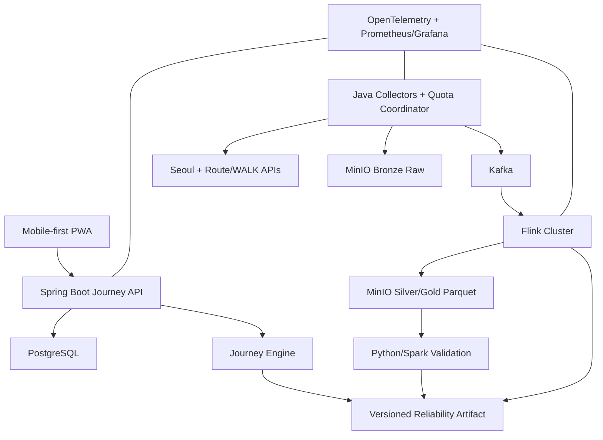
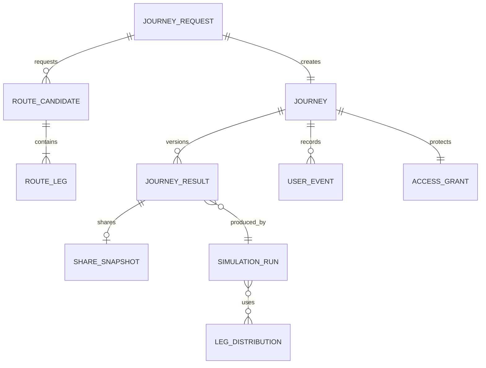
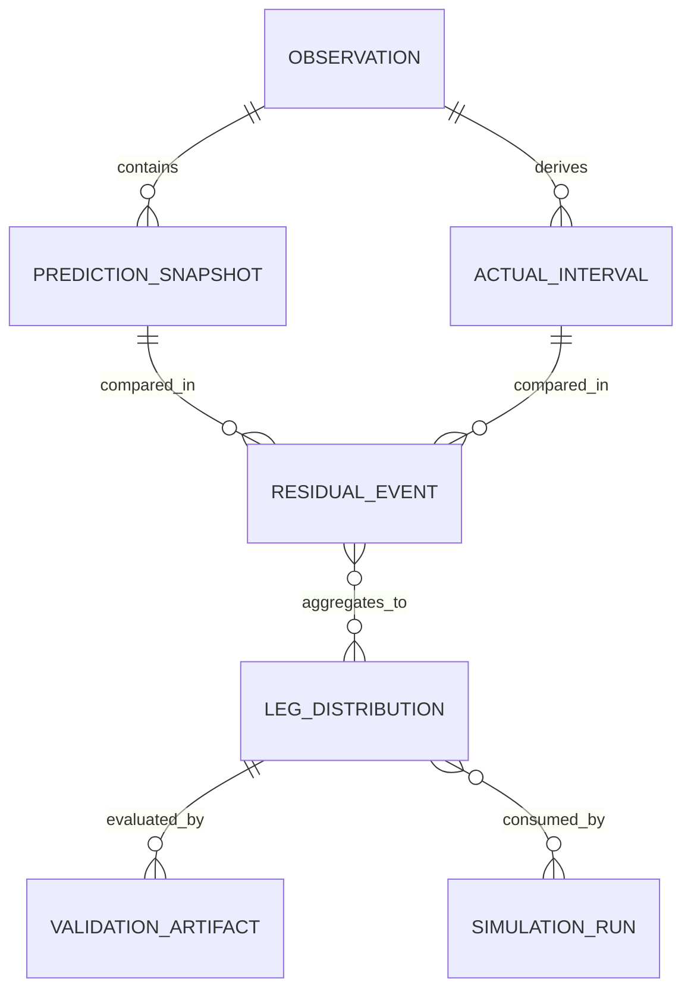

# Journey Reliability 서비스 기획서

> **문서 목적**: Journey Reliability의 사용자 문제, 제품 가치, Minimum Release 범위, 확률·데이터 의미, 실패 원칙, 운영·검증·출시 기준을 하나의 상위 제품 계약으로 고정한다.  
> **문서 지위**: Service Plan 정본 / IA·Requirements의 상위 제품 기준  
> **정본 파일명**: `SERVICE_PLAN_260823.md` (`IA_SCREEN_SPEC_260823.md`, `REQUIREMENTS_SPEC_260823.md`와 한 세트)  
> **기준일**: 2026-08-23  
> **제품 형태**: 독립형 Mobile-first Progressive Web App(PWA)  
> **제품 범위**: 서울 행정구역 내 버스·지하철 복합 여정, 검증 corridor 중심  
> **최종 마감**: 2026-09-25  
> **근거 원칙**: actual experiment evidence를 우선하며 corridor/window/support 범위를 넘어 일반화하지 않는다.

---

## 1. Executive Summary

### 1.1 한 줄 정의

**Journey Reliability는 서울 버스·지하철 여정에서 하나의 예상 소요시간만 보여주는 대신, 선택한 경로로 목표시각까지 도착할 가능성과 늦을 수 있는 범위, 출발해야 할 시점을 알려주는 독립형 대중교통 의사결정 서비스다.**

사용자는 별도의 Mobile-first PWA에 직접 접속해 출발지·목적지·목표 도착시각을 입력하고 결과를 확인한다. 설치 없이 모바일 Web으로 사용할 수 있으며, 지원 환경에서는 홈 화면에 설치해 앱과 같은 standalone 화면으로 실행할 수 있다. 기존 지도 서비스의 plugin이나 부가 화면이 아니며 자체 화면·API·Journey state·데이터 파이프라인을 가진다.

서비스는 외부·공식 provider가 제공하는 structural route와 ETA를 대체하거나 가장 좋은 경로를 자동 선정하지 않는다. 원천 정보 위에서 선택 경로의 불확실성을 계산하고 다음 두 질문에 답한다.

- 출발 전: “이 경로로 약속시간에 도착하려면 언제 출발해야 하는가?”
- 이동 중: “지금까지 실제로 일어난 일을 반영하면 제시간에 도착할 가능성은 어떻게 달라졌는가?”

### 1.2 제품의 핵심 약속

| 사용자 질문 | 제품 답변 | 답할 수 없을 때 |
|---|---|---|
| 보통 언제 도착하는가 | P50 도착시각 | `NOT_COMPUTED` |
| 늦는 경우까지 고려하면 언제인가 | P90 도착시각 | 불확실성 미포함 범위를 함께 표시하거나 미계산 |
| 목표시각 안에 도착할 가능성은 | `P(on_time)` | `INSUFFICIENT` 또는 `NOT_COMPUTED` |
| 계획한 환승을 지킬 가능성은 | Planned Connection Success | 환승이 없거나 계산 근거가 없으면 미표시/미계산 |
| 몇 시에 나가야 하는가 | 선택 경로 기준 Recommended Departure | `INSUFFICIENT_DATA` 또는 `NOT_COMPUTED` |
| 상황이 바뀌면 어떻게 되는가 | 완료 이력 고정 후 남은 여정 Reforecast | 다음 service를 구성할 수 없으면 `REFORECAST_UNAVAILABLE` |

### 1.3 서비스 컨셉

| 컨셉 | 의미 | 사용자 결과 |
|---|---|---|
| From ETA to Reliability | 하나의 예상시간을 범위와 가능성으로 확장 | P50, P90, `P(on_time)` |
| From Route to Deadline Decision | 경로 안내를 목표시각 중심의 행동 판단으로 변환 | 조건부 Recommended Departure |
| From Static Plan to Reforecast | 이동 중 확인된 사실을 반영해 남은 여정만 재계산 | before/after probability와 reason |
| Evidence-aware Decision | 결과값과 근거 수준을 분리하지 않음 | support, freshness, fallback, limitation, validation scope |

### 1.4 제품 범위와 현재 확인 수준

**Planning feasibility: GO. Development: GO. 사용자-facing 확률 성숙도와 Recommended Departure: Claim Gate 적용.**

실제 서울 버스·지하철 API, 공식 파일과 WALK utility를 통해 Route A/B 구조, 핵심 ID 연결, Actual 후보 규칙, WALK/transfer 경계, timetable prior와 운영 quota 위험을 확인했다. 또한 2026-08-22 신규 Kakao Map REST endpoint에서 WALK와 대중교통 경로가 모두 HTTP 200/`OK`로 반환됨을 확인했으며, 2026-08-23 재현 실험으로 이 접근 가능성이 하루 이상 간격을 두고도 안정적임을 추가로 확인했다(동일 OD candidate 15개 signature 완전 일치, ACCESS WALK 295m/323s point 완전 재현). Minimum Release에서 Kakao Map의 runtime 역할은 `KAKAO_MAP_WALK` provider로 한정한다. 즉 `ACCESS_WALK`, `FINAL_WALK`, 필요한 경우 도보 환승 구간의 거리·시간 측정에는 Kakao WALK를 사용할 수 있지만, Kakao publictraffic 후보를 사용자-facing selected route, WAIT/RIDE/TRANSFER 시간, probability 산식의 근거로 사용하지 않는다. 같은 실험에서 대중교통 route-provider 승격 조건은 통과하지 못했다 — Kakao 대중교통 응답의 stop/vehicle 객체는 `name`(과 vehicle의 `type`)만 가지고 있으며 서울시 stId/busRouteId/statnId에 해당하는 필드가 구조적으로 없다. total-step 시간 포함관계도 candidate에 따라 다르다. 따라서 canonical mapping 실패는 WALK-only 사용의 blocker가 아니며, publictraffic evidence는 future route-provider 승격 검토용 reference로만 보존한다. 다음은 아직 사용자 capability로 증명되지 않았다.

- 성숙한 01A target-stop Prediction→Actual residual distribution
- 충분한 subway station×line multi-window residual distribution
- passenger-relevant Bus WAIT event distribution
- whole-Journey end-to-end probability calibration
- Recommended Departure의 실사용 가능성
- citywide coverage·정확도·SLA
- 분산처리 성능·복구 proof와 Web E2E

따라서 제품은 부족한 근거를 임의 숫자로 채우지 않고 `INSUFFICIENT`, `NOT_COMPUTED`, `UNMODELED_UNCERTAINTY`, `UNAVAILABLE`로 안전하게 실패한다.

---

## 2. 서비스 배경과 문제 구조

### 2.1 해결하려는 문제

대중교통 사용자는 평균 이동시간만으로 중요한 약속을 결정하기 어렵다. 버스 도착 오차, 차량·열차 대기, 환승 이동, 계획한 연결편의 실패, 마지막 도보가 연결되면서 같은 “50분 경로”도 결과 범위가 달라진다. 기존 point ETA는 다음 질문을 직접 답하지 못한다.

- 50분보다 늦어질 위험은 어느 정도인가?
- 계획한 환승을 놓쳐도 다음 편으로 회복 가능한가?
- 지금 버스를 보내면 남은 여정의 위험이 얼마나 바뀌는가?
- 어느 정도의 여유를 두고 출발해야 하는가?

핵심 문제는 **ETA가 없어서가 아니라, 분절된 예측과 관측을 전체 Journey의 deadline decision으로 변환하지 못하는 것**이다.

### 2.2 제품이 선택한 해결 방식

1. Minimum Release에서는 승인된 Route A structural manifest를 분석 대상으로 고정하고, 도보 구간만 `KAKAO_MAP_WALK`로 측정한다.
2. WALK, WAIT, TRANSIT_RIDE, TRANSFER를 중복 없이 분리한다.
3. 원천 Prediction과 이후 Actual 관측을 구분하고 Residual을 만든다.
4. leg별 distribution/reference와 근거 수준을 보존한다.
5. 연결편 실패와 다음 service 회복을 포함해 최종 도착분포를 계산한다.
6. 결과값과 함께 support, fallback, freshness, validation scope, limitation을 전달한다.
7. 이동 중 실제 사건은 과거를 다시 추정하지 않고 남은 구간만 Reforecast한다.

### 2.3 제품이 해결하지 않는 문제

- 가장 빠른/안전한 경로의 자동 선택
- 서울 전체 노선 최적화 또는 coverage 보장
- 미래 사고 발생확률 예측

### 2.4 서비스가 필요한 순간

Journey Reliability는 모든 이동을 위한 범용 지도보다 **늦었을 때 비용이 큰 이동**에 집중한다.

| 상황 | Point ETA만으로 부족한 이유 | 필요한 판단 |
|---|---|---|
| 면접·시험 | 평균보다 한 번의 지각이 중요 | 어느 정도 여유를 두고 출발할지 |
| 공연·예약 | 입장 마감이 명확 | 목표시각 내 도착 가능성과 보수적 도착시각 |
| 약속 | 상대에게 현재 전망을 설명해야 함 | 이동 중 재예측과 Share Snapshot |
| 출근·등교 | 반복 이동에서도 특정 날의 변동성이 존재 | 평소와 다른 위험과 남은 여정 변화 |
| 복합 환승 | 한 연결편 실패가 다음 구간 전체를 변경 | planned connection과 다음 편 회복 가능성 |

이동 중에는 노트북을 사용할 수 없으므로 모바일 경험이 부가 채널이면 안 된다. 입력은 출발 전 데스크톱에서도 가능하지만 Journey Start 이후의 상태 확인, `BUS_SKIPPED`, Evidence 확인과 Reforecast는 한 손으로 조작 가능한 모바일 화면을 기준으로 설계한다.

### 2.5 상용·공식 서비스와의 비교 기준

Journey Reliability는 경로 검색의 폭이나 지도 품질로 기존 상용 서비스를 대체하지 않는다. 차별점은 기존에 제공되는 route·ETA를 목표시각 중심의 uncertainty decision으로 변환하는 데 있다. 경쟁 비교는 서비스의 현재 공식 기능을 기준일과 출처와 함께 검증하며, 확인하지 않은 부재를 단정하지 않는다.

| 비교 기준 | 일반 지도·교통 서비스의 중심 가치 | Journey Reliability의 역할 |
|---|---|---|
| 경로 탐색 | 빠른/적은 환승 등 다중 경로 탐색 | Minimum Release는 승인된 Demo Route A 하나를 조건으로 분석하고, future provider mode에서만 first canonical-supported route를 검토 |
| 도착 정보 | ETA·예상 소요시간 중심 | P50/P90와 목표시각 내 도착확률을 분리 |
| 환승 | 계획 경로와 다음 이동 안내 | planned connection 유지와 실패 후 최종 정시 도착을 분리 |
| 출발 판단 | 출발·도착 예상시각 제공 | 선택 경로와 목표 reliability 조건부 Recommended Departure |
| 이동 중 변화 | 실시간 ETA와 경로 갱신 | 사용자 확정 사건과 완료 이력을 반영한 Reforecast |
| 근거 공개 | 원천 정보와 갱신시각 중심 | support, fallback, model coverage, validation scope까지 표시 |
| 실패 처리 | 경로 없음·통신 오류 중심 | unsupported, not computed, partial, insufficient, stale을 구분 |

#### Benchmark Register — 검증된 비교 범위

아래 비교는 2026-08-22에 확인한 각 서비스의 공식 설명 범위만 기록한다. 기능의 부재를 추정하지 않으며, Journey Reliability의 차별점은 상대 서비스에 특정 기능이 “없다”는 주장보다 본 서비스가 책임지는 결과 계약으로 정의한다.

| Benchmark | 공식 확인 범위 | Journey Reliability가 별도로 책임지는 범위 | 비교 제한 |
|---|---|---|---|
| Kakao Map REST API | 2026-07-21 공개된 대중교통·도보·자전거 경로 조회. 2026-08-22 프로젝트 키로 WALK와 대중교통 실제 호출 성공 | Minimum Release에서는 `KAKAO_MAP_WALK` point provider로 도보 거리·시간과 provenance만 책임진다. publictraffic 후보의 canonical Journey 변환과 selected-route reliability는 future route-provider Gate 통과 후 별도 검토 | 접근 성공을 ID crosswalk·시간 의미·Reliability 검증 성공으로 승격하지 않음 |
| TMAP 대중교통 API | Web/Mobile 대중교통 경로탐색과 전체 보행자 이동 경로; 공식 무료체험은 각 대중교통 API 일 10건 | 제한된 비교·검증 후보. TMAP point·route 결과에 임의 probability distribution을 부여하지 않음 | 일 10건 무료체험을 일반 사용자용 운영 예산으로 간주하지 않음 |
| 서울 TOPIS | 서울 교통정보 열람, 버스·정류소 정보, Open API 접근 | 여러 source를 Journey 단위의 deadline decision과 provenance로 결합 | 공식 운영정보 자체를 개인 Journey ground truth로 과장하지 않음 |

공식 기준 출처: [Kakao Map REST API](https://developers.kakao.com/docs/ko/kakaomap/rest-api), [Kakao API 쿼터](https://developers.kakao.com/docs/ko/getting-started/quota), [Kakao 신규 API 오픈 공지](https://devtalk.kakao.com/t/api-4/150764), [TMAP 대중교통 API 약관](https://transit.tmapmobility.com/terms), [서울 TOPIS](https://topis.seoul.go.kr/).

네이버지도 등 추가 benchmark는 공식 기능·화면을 직접 검증한 뒤 같은 register에 추가한다. 발표자료는 검증일·출처 없이 “경쟁 서비스에는 없다”는 문구를 사용하지 않는다.

### 2.6 차별화 문장

**Journey Reliability는 “어떤 경로가 가장 빠른가”보다 “이 경로로 목표시각을 지킬 가능성이 얼마이며, 상황이 달라지면 판단이 어떻게 바뀌는가”를 답한다.**

Journey Reliability가 하지 않는 것은 다음과 같다.

- 개인의 버스 탑승 실패확률을 예측하지 않는다.
- WALK나 정적 환승시간에 관측되지 않은 확률분포를 만들지 않는다.
- 원천 route·ETA를 대체하는 독립 교통예측 서비스라고 주장하지 않는다.

---

## 3. Primary User, Persona, JTBD

### 3.1 Primary User

서울에서 버스와 지하철을 조합해 이동하며, 단순 최단시간보다 **정해진 시각을 지킬 가능성**이 중요한 사용자다. 출근·면접·시험·공연·병원·예약·약속처럼 지각 비용이 있는 이동이 핵심 상황이다.

### 3.2 핵심 Persona

| Persona | 상황 | 현재 불편 | 기대 결과 |
|---|---|---|---|
| Deadline Planner | 출발 전 약속시간을 기준으로 준비 | ETA에 얼마의 여유를 더할지 감으로 결정 | 선택 경로 기준으로 일반적·보수적 도착과 정시 가능성을 비교 |
| Cautious Commuter | 환승 실패 비용이 큰 복합 여정 | 총시간만 보고 연결편 리스크를 알기 어려움 | Planned Connection과 최종 회복 가능성을 분리해 이해 |
| In-trip Replanner | 이동 중 버스를 보내거나 환승을 놓침 | 이전 ETA가 즉시 무의미해짐 | 실제 사건 이후 남은 여정의 확률과 도착시각 변화를 확인 |
| Evidence-conscious User | 확률 숫자를 그대로 믿기 어려움 | 데이터가 오래됐거나 부족한지 알 수 없음 | support·freshness·fallback·미모델링 구간을 확인 |

### 3.3 JTBD

- 중요한 일정에 맞춰 출발을 준비할 때, 선택한 경로의 늦을 위험을 알고 합리적인 출발시각을 정하고 싶다.
- 환승이 포함된 경로를 볼 때, 계획한 연결편을 지킬 가능성과 놓친 뒤에도 제시간에 도착할 가능성을 구분하고 싶다.
- 이동 중 사건이 생겼을 때, 이미 지나온 이동은 확정한 채 남은 경로만 다시 계산해 다음 행동을 결정하고 싶다.
- 근거가 부족할 때는 그럴듯한 숫자보다 “아직 계산할 수 없음”을 알고 싶다.

---

## 4. Value Proposition과 차별점

| 기존 정보의 한계 | Journey Reliability의 가치 |
|---|---|
| 단일 ETA | P50, P90, 목표시각 내 도착확률을 서로 다른 의미로 제공 |
| leg별 실시간 정보 | WALK·WAIT·RIDE·TRANSFER를 전체 Journey로 구성 |
| 환승 성공 여부와 최종 도착 혼합 | Planned Connection Success와 Final On-time 분리 |
| 변화 전 ETA를 계속 표시 | 완료 이력과 사용자 사건을 조건으로 남은 Journey Reforecast |
| 숫자의 근거가 보이지 않음 | source, support, fallback, freshness, validation scope, coordinate provenance 노출 |
| 부족한 데이터의 묵시적 보정 | `INSUFFICIENT/NOT_COMPUTED/UNMODELED`를 정상 제품 상태로 허용 |

차별점은 “AI로 더 정확한 숫자”가 아니라 **기존 교통정보를 deadline-oriented risk decision으로 재구성하고, 그 숫자의 근거와 한계를 함께 제품화하는 것**이다.

---

## 5. Minimum Release 범위

### 5.1 In Scope

- Mobile-first PWA(설치 없이 이용 가능한 responsive mobile Web 포함), 서울 행정구역
- `ROUTE_A_ONLY`에서는 승인된 Route A structural manifest 한 개를 분석하고, 도보 구간은 `KAKAO_MAP_WALK` provider로 측정 가능
- BUS + SUBWAY mixed journey
- `ACCESS_WALK / WAIT / TRANSIT_RIDE / TRANSFER / FINAL_WALK`
- `BUS_TO_SUBWAY / SUBWAY_TO_SUBWAY / SUBWAY_TO_BUS`
- Pre-trip analysis, Journey Start, In-trip Reforecast
- P50, P90, `P(on_time)`, Planned Connection Success, Final On-time
- 목표 reliability 기본값 90%, 사용자 변경 가능
- 계산 Gate 통과 시 Recommended Departure
- support, fallback, freshness, limitation, validation scope
- `BUS_SKIPPED`, `BOARD_CONFIRMED`, `TRANSFER_MISSED`
- Evidence Detail
- Share Snapshot은 일정·보안 Gate에 따른 Should

### 5.2 Explicit Out

- 전국/수도권 전체 자동 지원, citywide 정확도·SLA
- 다중 경로 reliability ranking, fastest-vs-safest 추천, route optimizer
- BUS_TO_BUS transfer
- 로그인·회원 personalization, 장기 이동 history, native app, push notification
- 개인 boarding failure probability, 미래 희귀사고 발생확률
- mandatory LightGBM/생성형 AI
- 외부 utility를 transit ground truth로 사용하는 것
- 검증되지 않은 support threshold, stale threshold, latency SLO, partition, watermark, TTL 수치
- Kakao/TMAP 등 route provider의 후보 순서를 reliability ranking으로 재해석하는 것
- Kakao publictraffic 후보를 Minimum Release의 selected route 또는 자동 OD route provider로 사용하는 것

### 5.3 향후 확장

Claim Gate와 핵심 E2E가 안정된 뒤에만 검토한다.

- 더 많은 corridor와 citywide resolver/coverage validation
- 다중 경로 reliability comparison
- empirical WALK/transfer uncertainty
- event-level headway와 advanced correlation model
- 검증을 통과한 quantile ML
- evidence-grounded 자연어 설명
- Share 고도화·개인화·알림

### 5.4 Scope Cut 순서

일정 위험 시 `AI 설명 → LightGBM → Share polish/SCR-06 → Recommended Departure AVAILABLE → Route B 장기 maturity → 부가 dashboard → citywide → advanced model` 순으로 제거한다.

다음은 보호한다: provenance, Actual/Residual correctness, Route A core, BUS_SKIPPED topology, 부족한 근거의 정직한 처리, Mobile/PWA core E2E, 최소 distributed correctness proof.

### 5.5 Mobile-first PWA 범위

PWA는 native app의 임시 대체물이 아니라 Minimum Release의 기본 delivery model이다.

| Capability | Minimum Release 정책 |
|---|---|
| Mobile Web | 설치 없이 핵심 SCR-01~05 전체 사용 가능 |
| Installability | Web App Manifest, icon, standalone display, HTTPS 제공 |
| Responsive | 작은 모바일 viewport를 기준으로 설계하고 tablet/desktop으로 확장 |
| Service Worker | app shell과 정적 asset 중심으로 사용; probability API 응답을 무조건 cache-first 처리하지 않음 |
| Offline | 새 분석·Reforecast 불가. 마지막 snapshot은 `OFFLINE_SNAPSHOT`과 계산시각을 표시할 때만 read-only 제공 가능 |
| Reconnect | foreground 복귀 시 owner capability로 server state/version/freshness 재동기화 |
| Background Execution | browser/OS 지원을 핵심 전제로 두지 않음. 앱이 닫힌 동안 지속 polling·위치추적을 보장하지 않음 |
| Push | Explicit Out. 핵심 성공조건 아님 |
| Device Location | 명시적 사용자 권한과 목적 고지가 있을 때 origin 보조 입력에만 사용; 지속 GPS tracking 기본 금지 |
| Share | 지원 브라우저에서는 OS share sheet를 사용하되 URL copy fallback 필수 |
| Update | 새 service worker가 대기 중이면 안전한 시점에 안내; active mutation 중 강제 reload 금지 |

#### PWA Compatibility Matrix

| 환경 | Minimum Release 검증 | 핵심 확인 항목 | 실패 시 정책 |
|---|---|---|---|
| iOS Safari Mobile Web | MUST | SCR-01~05, foreground recovery, location permission, copy Share | 설치 불가와 무관하게 Mobile Web flow 유지 |
| iOS Home Screen standalone | MUST when installable | manifest/icon, standalone navigation, update 후 state 복구 | browser mode로 복귀 가능한 안내 |
| Android Chrome Mobile Web | MUST | SCR-01~05, offline snapshot, location, OS share/copy fallback | unsupported enhancement만 비활성화 |
| Android installed PWA | MUST when installable | install, Service Worker update, offline/foreground, safe activation | install 여부로 기능·claim 차등 금지 |
| Desktop Chrome/Edge | SHOULD | pre-trip input/result/evidence와 responsive 확장 | mobile core 성공조건을 대체하지 않음 |

실제 OS/browser version과 device identifier는 보유 기기·배포 시점에 G4 test manifest로 동결한다. 근거 없이 “모든 모바일 지원”을 claim하지 않는다.

PWA 설치 여부가 권한·기능·결과 품질을 바꾸지 않는다. 브라우저별 지원 차이는 progressive enhancement로 다루며, 설치할 수 없는 환경에서도 Mobile Web core flow가 완성되어야 한다. PWA 기능은 HTTPS와 실제 iOS/Android 기기에서 검증한다.

---

## 6. Route 정책과 Main Journey

### 6.1 Selected-route 정책

Minimum Release는 route optimizer가 아니다. 현재 selected route는 provider 후보 목록에서 고르는 값이 아니라 승인된 Route A structural manifest다. Route A manifest는 다음 조건을 만족해야 한다.

1. 서울 범위와 지원 mode에 해당한다.
2. bus route/stop, station×line, leg boundary를 canonical structure로 해석할 수 있다.
3. 결과 전체에 `APPROVED_DEMO_ROUTE` 조건부임을 표시한다.
4. 외부 route provider의 후보 순서를 reliability rank로 해석하지 않는다.
5. provider 후보와 Route A의 시간·구간 값을 조용히 혼합하지 않는다.

Provider registry는 route provider와 WALK provider를 분리해 관리한다. Minimum Release의 Kakao Map runtime scope는 `KAKAO_WALK_ONLY`다. Kakao WALK는 좌표쌍 기반 `ACCESS_WALK`, `FINAL_WALK`, 필요 시 도보 환승 구간의 거리·시간 측정에 사용할 수 있지만, Kakao publictraffic 후보는 selected route, WAIT/RIDE/TRANSFER 시간, probability eligibility 근거로 사용하지 않는다.

`KAKAO_ROUTE_PROVIDER_GATE`는 Kakao publictraffic을 future Primary route provider로 승격할 때만 필요한 조건이다. **2026-08-23 재실험 결과 아래와 같이 판정됐고, Minimum Release의 WALK-only 사용을 차단하지 않는다.**

1. 실제 앱의 무료/유료 entitlement와 일일 quota 상태를 콘솔에서 기록한다. → **`CONFIRMED`** (2026-08-23 15:16 KST 콘솔 스크린샷: `publictraffic.json` 9/1,000, `walk.json` 4/1,000 — 이 세션의 실제 호출 수와 정확히 일치. 2026-08-23 15:23 KST "유료 사용량" 콘솔 스크린샷으로 이번 달 유료 호출 0건도 확인 — 과금 발생 없음)
2. Kakao stop·vehicle·coordinate를 서울시 bus route/stop 및 station×line identity에 결정적으로 연결한다. → **`REJECTED`** (topology 3종 후보 전부 stop=`name`만, vehicle=`name`/`type`만 확인 — busRouteId/stId/stationId에 해당하는 필드가 응답 스키마에 없어 API 응답만으로는 구조적으로 불가능)
3. `totalTime`, step time, 접근·환승·대기·마지막 도보의 포함 관계를 raw response로 규명한다. → **`PARTIAL`** (BUS_AND_SUBWAY 후보는 15초 이내로 거의 explained, 순수 SUBWAY 후보는 58초 잔차가 남아 완전히 규명되지 않음)
4. 동일 OD 반복 호출의 candidate order·구조 안정성과 mapping failure rate를 검증한다. → **`PASS`** (같은 window 반복 및 전날 대비 재호출에서 15개 후보 signature 완전 일치)

entitlement가 `CONFIRMED`로 바뀌었더라도 mapping 조건이 구조적으로 `REJECTED`이므로 Kakao publictraffic route-provider 승격은 보류한다. 공개 범위는 승인된 Route A로 제한되고 Kakao는 WALK provider 또는 internal comparison/reference 범위만 유지한다.

경로가 바뀌거나 해석할 수 없으면 조용히 다른 확률을 재사용하지 않고 다시 분석하거나 `UNSUPPORTED/ROUTE_MAPPING_INCOMPLETE`로 종료한다.

### 6.2 Route A와 Route B의 역할

| Route | 구조 | 제품 역할 | 현재 주장 가능 범위 |
|---|---|---|---|
| Route A · Primary | 삼청동 → 01A → 안국 → 3호선 → 교대 → 2호선 → 역삼 → 멀티캠퍼스 | Pre-trip 핵심 결과, evidence trace, 최종 Demo main story | structural route와 corridor source feasibility; 확률값은 개발 Claim Gate 이후 |
| Route B · Internal Validation | 01A → 3호선 안국→압구정 → 147 → 역삼권역 | `SUBWAY_TO_BUS`, BUS WAIT, `BUS_SKIPPED`의 개발·QA 검증 | 구조와 realtime ID interoperability 범위; 공개 데모·사용자 추천 경로가 아님 |

Route B를 Route A보다 “더 좋은 경로”로 추천하지 않으며 최종 사용자 데모에 포함하지 않는다. 내부 test fixture와 QA run에서만 사용하고 실제 product probability와 fixture provenance를 분리한다.

### 6.3 Pre-trip Main Journey

| 단계 | 사용자 행동 | 서비스 처리 | 실패/제한 처리 |
|---|---|---|---|
| 1 | 출발지·목적지·목표 도착시각 입력 | 좌표와 역할을 보존하고 서울 범위 검증 | 입력 오류/지원 외 지역 구분 |
| 2 | 목표 reliability 확인 | 미선택 시 90% 적용 | 90%는 모델 정확도나 SLA가 아님 |
| 3 | 분석 요청 | structural candidates 조회 및 selected route 결정 | provider error, route 없음, mapping incomplete 분리 |
| 4 | 결과 확인 | P50/P90/P(on_time)/connection/support 제공 | required input 부족 시 null/미계산 |
| 5 | 출발 판단 | Gate 통과 시 Recommended Departure 제공 | 근거 부족 시 unavailable 사유 표시 |
| 6 | 근거 확인 | leg별 source/fallback/freshness/limitation 제공 | raw payload·secret은 일반 UI에 미노출 |
| 7 | 이동 시작 | 분석 snapshot으로 Journey state 생성 | 중복 start는 idempotent 처리 |

### 6.4 In-trip / Reforecast Journey

Reforecast는 `P(final arrival | observed history, current state)`를 다시 계산한다.

**고정**: 완료 WALK/RIDE/TRANSFER, 확인된 user event, 현재시각.  
**재계산**: 아직 시작하지 않은 WAIT/RIDE/TRANSFER/FINAL WALK.  
**금지**: 완료된 leg 재샘플링, 현재 required transit leg 삭제, 과거 확률을 새 상태에 재사용.

`BUS_SKIPPED`는 사용자가 현재 candidate bus에 타지 않았음을 확정한 사건이다. 개인 탑승 실패확률이 아니다. 처리 순서는 `현재 candidate 제거 → NEXT BUS_WAIT → 동일 BUS_RIDE → downstream`이다. 다음 service 근거가 없으면 `REFORECAST_UNAVAILABLE`이며 버스 구간을 건너뛰지 않는다.

---

## 7. 핵심 기능과 사용자 가치

| 기능 영역 | 핵심 정책 | 사용자 가치 | 하위 계약 연결 |
|---|---|---|---|
| Journey Input | 실제 목적지와 목표시각을 받음 | deadline 기준 판단 | REQ-001~004 / SCR-01 |
| Structural Route | Minimum Release는 approved Route A manifest 선택; future provider mode에서만 first-supported candidate 검토 | 분석 대상이 명확함 | REQ-005~009 |
| Pre-trip Result | 서로 다른 4개 결과와 근거 표시 | 평균·보수·정시·환승 위험 이해 | REQ-010~016 / SCR-02 |
| Live Journey | 현재 leg와 freshness 표시 | 이동 중 상태 이해 | REQ-020~022 / SCR-03 |
| Reforecast | 실제 사건 이후 남은 여정만 갱신 | 변화가 최종 도착에 미치는 영향 확인 | REQ-023~026 / SCR-04 |
| Evidence Detail | support/fallback/source/limitation | 숫자를 과신하지 않고 판단 | REQ-040~045 / SCR-05 |
| Share | 최소화된 result snapshot | 동행/약속 상대에게 상태 전달 | REQ-080~081 / SCR-06 |

---

## 8. 확률 결과의 의미와 표시 원칙

### 8.1 결과 정의

| 결과 | 제품 의미 | 사용자 표현 | 금지 표현 |
|---|---|---|---|
| P50 | simulation 최종 도착시각의 50 percentile | “현재 모델이 계산한 도착분포의 중앙값 시각” | 평균 도착, 가장 정확한 도착 |
| P90 | simulation 최종 도착시각의 90 percentile | “현재 모델이 계산한 도착분포의 90번째 백분위 시각”* | “90% 정확도”, “정확히 이 시각 도착” |
| `P(on_time)` | `P(final_arrival ≤ target_arrival)` | “목표시각까지 도착할 가능성” | 모델 정확도, 개인 보장 |
| Planned Connection Success | 처음 계획한 candidate connection을 모두 지킨 simulation 비율 | “계획한 환승을 지킬 가능성” | 최종 정시확률과 동일시 |
| Final On-time | connection miss 후 다음 service 회복까지 포함한 정시 결과 | `P(on_time)`에 반영 | 계획 환승 성공률과 단순 대소관계 강제 |
| Recommended Departure | 선택 route에서 목표확률을 만족하는 가장 늦은 검토 후보시각 | “이 경로 기준 {p*}% 권장 출발” | “가장 안전한 출발시간” |

\* 실제 calibration scope와 support가 함께 표시되어야 하며, component-only 결과를 end-to-end 보장처럼 표현하지 않는다. “10번 중 약 9번” 같은 반복빈도 표현은 해당 범위의 end-to-end calibration이 통과한 뒤에만 허용한다.

### 8.2 P50/P90와 P(on_time)의 관계

P50/P90는 도착분포의 시간 분위수이고 `P(on_time)`은 사용자가 정한 목표시각을 기준으로 한 누적확률이다. 목표시각이 바뀌면 `P(on_time)`은 바뀌지만 같은 계산 snapshot의 P50/P90가 반드시 바뀌는 것은 아니다.

### 8.3 Monte Carlo 정책

전체 Journey는 leg 확률의 단순 합·곱이 아니라 service candidate와 연결 실패/회복을 포함해 simulation한다. 운영 N은 미리 숫자로 고정하지 않는다. 대표 fixture와 Route A artifact에서 P50/P90/`P(on_time)`의 수렴, fixed-seed 재현성, 응답시간과 자원 profile을 비교해 조건을 만족하는 최소 N을 versioned benchmark로 정한다. Wilson interval을 사용할 경우 finite-N sampling noise에만 적용하며 모델·데이터 uncertainty나 calibration confidence interval로 설명하지 않는다.

### 8.4 Recommended Departure 정책

정의는 다음과 같다.

`선택 경로 R에서 P(arrival ≤ target | depart=d, route=R) ≥ p*를 만족하는 가장 늦은 후보 d`

출발 후보가 달라질 때마다 timetable/empirical WAIT, service availability, ride context, connection feasibility를 재평가한다. 같은 total-time distribution을 시간축으로 단순 이동하지 않는다. 대중교통 service의 불연속성 때문에 monotonicity를 가정한 binary search를 기본 correctness 계약으로 쓰지 않고 candidate grid/coarse-to-fine을 사용한다.

현재 Route A timetable은 2026-06-16 공식 snapshot을 static prior로 사용할 수 있으나 exact current service guarantee와 passenger-relevant Bus WAIT distribution, component/replay Gate가 남아 있다. 따라서 `AVAILABLE`은 Claim Gate 통과 전 HOLD다.

---

## 9. Journey Domain Boundary

### 9.1 Canonical composition

`ACCESS_WALK + WAIT(mode) + TRANSIT_RIDE(mode) + TRANSFER(mode→mode) + WAIT(next mode) + … + FINAL_WALK`

### 9.2 Leg별 경계

| Leg | 시작–종료 경계 | 시간 의미 | 불확실성 정책 |
|---|---|---|---|
| ACCESS_WALK | 실제 출발점→첫 boarding point | versioned WALK provider point/reference | 임의 variance 금지, `UNMODELED` |
| WAIT | boarding point 도착→차량/열차 탑승 가능 시점 | realtime candidate, timetable 또는 empirical wait | sample unit·dependence 명시 |
| BUS_RIDE | 버스 탑승→목표 정류장 하차 | duration 또는 prediction+signed residual | target identity Gate 필수 |
| SUBWAY_RIDE | 열차 탑승→목표 station/line 도착 | duration 또는 prediction+signed residual | `subwayId×statnId×trainNo` |
| TRANSFER | 이전 mode 하차→다음 boarding point 도착 | street + station internal component | 다음 service WAIT 포함 금지 |
| FINAL_WALK | 최종 하차점→실제 목적지 | versioned WALK provider point/reference | 목적 역 도착을 Journey 완료로 보지 않음 |

### 9.3 Transfer 세부 경계

- `BUS_TO_SUBWAY`: bus stop→station entrance/참조 node street component + entrance→platform internal component
- `SUBWAY_TO_BUS`: platform→exit internal component + exit→bus stop street component
- `SUBWAY_TO_SUBWAY`: 공식 transfer reference 우선

Route A 안국 BUS_TO_SUBWAY는 street 143m/101s만 VERIFIED이며 endpoint는 `STATION_CENTER` candidate다. entrance→platform은 미측정이므로 전체 transfer는 `PARTIAL/UNMODELED_UNCERTAINTY`다. 안국역 깊이 18.81m는 공간 reference일 뿐 시간으로 환산하지 않는다.

교대 3→2는 OA-22521의 door/direction-specific 144초를 Tier-0 reference로 쓴다. OA-13290의 75m/63초는 geometric sanity reference이며 두 값을 평균하거나 분포 후보로 섞지 않는다. 둘 다 개인 walking distribution이 아니다.

Route A FINAL WALK는 역삼 `STATION_CENTER` candidate→POI entrance 329m/300s point estimate다. 출구 기반이라고 표현하지 않는다.

---

## 10. Prediction, Actual, Residual, Observation Uncertainty

### 10.1 분리해야 하는 개념

- **Prediction**: source API가 특정 시점에 제공한 목표 node 도착예측.
- **Actual**: 실제 도착 상태가 polling 사이에서 처음 확인된 사건. exact instant를 모르면 interval로 보존.
- **Residual**: `Actual - Predicted`인 부호 있는 prediction error.
- **Travel Duration**: 한 구간을 이동하는 데 걸린 시간. Residual과 다른 값.

Actual이 `(이전 관측시각, 최초 도착상태 관측시각]`이면 residual도 lower/mid/upper 범위를 유지한다. midpoint 하나로 observation uncertainty를 숨기지 않는다. `abs(residual)` 또는 residual 자체를 ride duration으로 사용하지 않는다. prediction horizon은 prediction 시점에 알 수 있는 ETA를 사용하고, outcome 이후 알게 된 realized time-to-event를 feature로 사용하지 않는다.

### 10.2 Bus 규칙

- Arrival `vehId1/2`와 Position `vehId`를 연결한다.
- 현재 Actual candidate는 동일 vehicle의 `stopFlag 0→1`이다.
- Arrival target `stId`와 Position `sectionId`는 동일 namespace로 가정하지 않는다.
- vehicle ID+시간창만으로 만든 match는 diagnostic이며 target-stop residual acceptance가 아니다.
- `congetion`은 관측 context일 수 있으나 개인 boarding success ground truth가 아니다.

### 10.3 Subway 규칙

- 최소 identity는 `subwayId × statnId × trainNo`다.
- station name만으로 multi-line 역을 합치지 않는다.
- 현재 Actual candidate는 동일 station×line×train에서 `arvlCd != 1 → 1` 최초 transition이다.
- mixed-route code, timetable `SI_ID`, realtime `statnId` 사이의 산술 패턴을 일반화하지 않고 versioned explicit crosswalk를 쓴다.

### 10.4 Timestamp와 좌표 provenance

`source_generated_at`, HTTP 직전 `requested_at`, 응답 직후 `received_at`, 계산시각 `calculated_at`을 분리한다. 기준 timezone은 Asia/Seoul이다. 실호출 646건에서 request-boundary timestamp 기록의 일관성은 확인했지만 provider clock 기반 lateness는 아직 측정하지 않았다. 따라서 provider 생성시각이 없는 payload에 임의의 source timestamp를 부여하지 않는다.

좌표에는 값과 함께 `coordinate_source`와 `ORIGIN_POINT/BUS_STOP/STATION_CENTER/STATION_EXIT/PLATFORM_REFERENCE/POI` 역할을 저장한다. station center를 exit/platform으로 조용히 승격하지 않는다.

---

## 11. Support, Fallback, Confidence, Validation Scope

### 11.1 네 개념의 분리

| 개념 | 답하는 질문 |
|---|---|
| Support | 이 결과를 만든 유효 관측 단위가 얼마나 충분한가 |
| Fallback | exact 조건이 부족해 어떤 더 넓은 group/reference를 썼는가 |
| Confidence | evidence sufficiency를 사용자에게 요약한 label은 무엇인가 |
| Validation Scope | 어떤 수준까지 실제 outcome으로 검증했는가 |

확률값이 높다고 confidence가 높은 것이 아니며, sample count만 크다고 validation scope가 높아지는 것도 아니다.

### 11.2 Support 정책

`SUPPORT_RULE_V1` 전에는 5/20/30/100 같은 임의 sample threshold로 HIGH/MEDIUM/LOW를 자동 생성하지 않는다. empirical artifact의 기본 confidence는 `INSUFFICIENT`다. Threshold는 independent sample unit을 먼저 정의한 뒤 down-sampling, bootstrap, hold-out coverage 안정성으로 정한다.

### 11.3 Fallback 정책

exact route×pair×time 조건이 부족할 때 broader supported pool을 사용할 수 있으나, 사용한 계층과 support를 결과에 남긴다. source가 없는 required leg에는 placeholder 시간을 넣지 않는다. 실제 결과는 `NOT_COMPUTED`, synthetic logic fixture는 `ENGINE_FIXTURE_ONLY`로 분리한다.

### 11.4 Validation ladder

| 단계 | 의미 | 결과 metadata |
|---|---|---|
| V0 | synthetic/deterministic engine logic | `UNVALIDATED` |
| V1 | leg component temporal hold-out | `COMPONENT_ONLY` |
| V2 | 같은 corridor의 service sequence replay/backtest | `CORRIDOR_REPLAY` |
| V3 | 독립 실제 Journey outcome calibration | `END_TO_END` |

Component validation을 whole-Journey calibration으로 승격하지 않는다. 계약 위반이 확인된 vertical-slice 산출값은 제품 확률·Demo 근거로 사용하지 않는다.

### 11.5 Result Eligibility와 Start Eligibility

Result Eligibility는 “숫자를 계산·표시할 수 있는가”, Confidence는 “그 결과의 empirical evidence가 얼마나 충분한가”, Start Eligibility는 “현재 snapshot으로 live Journey를 시작해도 되는가”를 답한다. 세 축을 합치지 않는다.

| 입력/상태 | Result Eligibility | 표시 | Start |
|---|---|---|---|
| selected route·target·필수 topology 또는 required leg의 시간 입력 부재 | `NOT_COMPUTED` | 구조와 부재 사유만 | 차단 |
| 모든 required time-bearing leg에 유효한 distribution 또는 승인된 deterministic/reference input 존재, 일부 uncertainty 미모델링 | `USER_FACING` + `PARTIAL_MODEL` | core metric + critical limitation | freshness가 허용하면 경고 후 허용 |
| 모든 required input 충족, 사용자 API가 아닌 synthetic engine fixture | `ENGINE_FIXTURE_ONLY` | non-production dev surface만 | 차단 |
| 모든 required input 충족, confidence `INSUFFICIENT` | `USER_FACING` | metric + 근거 부족 경고 | confidence만을 이유로 차단하지 않음 |

`required time-bearing leg`는 최종 도착시각에 시간을 더하는 ACCESS_WALK, WAIT, TRANSIT_RIDE, TRANSFER, FINAL_WALK이다. 각 leg에는 empirical distribution이 없더라도 출처와 의미가 검증된 deterministic/static reference가 있을 수 있다. 이 경우 전체 숫자는 표시할 수 있으나 `PARTIAL_MODEL/UNMODELED_UNCERTAINTY`를 숨기지 않는다. 시간 입력 자체가 없으면 해당 leg를 0이나 placeholder로 채우지 않고 core result를 `NOT_COMPUTED`로 둔다.

Planned Connection Success는 환승이 없거나 해당 연결 입력이 부족해도 core P50/P90/P(on_time)을 자동 무효화하지 않는다. Recommended Departure는 별도 Claim Gate이며 unavailable이 core result와 Start를 막지 않는다.

---

## 12. 핵심 설계 근거

| 설계 대상 | 확인된 사실 | 적용 정책 |
|---|---|---|
| Bus WAIT | 짧은 주기의 연속 snapshot은 동일 접근 차량을 반복 관측하며 강한 시계열 의존성을 가진다. | polling row 수를 독립 headway support로 사용하지 않고 차량 도착·교체 사건 또는 dependence-aware unit을 사용한다. |
| Bus Actual/Residual | target stop에서 유효한 `0→1` 도착 사건을 충분히 확보하지 못한 window가 존재한다. | 도착 규칙을 느슨하게 바꾸지 않고 Bus residual confidence를 근거 수준에 맞게 제한한다. |
| Subway quota | 실시간 지하철 key는 공유 일일 budget이며 실제 수집에서 quota business error가 반복될 수 있다. | key×KST-day ledger, 중앙 scheduler, priority budget, preflight, backoff를 적용하고 key rotation으로 우회하지 않는다. |
| Timestamp | collector latency는 HTTP 요청·응답 경계에서만 유효하게 측정된다. | `requested_at`을 send 직전, `received_at`을 수신 직후 기록하고 provider source time과 분리한다. |
| Timetable | 공식 static timetable은 future service prior로 유용하지만 exact current operation을 보장하지 않는다. | source date/version을 보존하고 Recommended Departure는 candidate 재평가 Gate를 별도로 통과해야 한다. |
| Transfer | 같은 역의 공식 데이터도 의미와 산식에 따라 서로 다른 reference를 제공할 수 있다. | 의미가 더 직접적인 operational reference를 선택하고 다른 값은 sanity reference로만 보존하며 평균하지 않는다. |
| WALK/Station internal | street walk point estimate와 station depth만으로 개인별 내부 이동 분포를 만들 수 없다. | point/reference와 `UNMODELED_UNCERTAINTY`를 함께 전달하며 depth를 시간으로 환산하지 않는다. |
| Coordinate | 역 중심·출구·승강장·POI는 서로 다른 위치 역할이다. | 모든 endpoint에 coordinate role/source를 기록하고 station center를 exit로 표현하지 않는다. |
| Subway identity | 같은 역명이 여러 호선에 존재해 name-only join이 관측을 혼합할 수 있다. | `subwayId×statnId×trainNo`를 기본 identity로 사용한다. |
| Simulation | placeholder, residual-as-duration, topology 삭제는 그럴듯한 숫자를 만들지만 제품 의미를 훼손한다. | required input이 없으면 `NOT_COMPUTED`, synthetic run은 `ENGINE_FIXTURE_ONLY`, residual과 duration을 분리한다. |
| Kakao Map WALK / publictraffic reference | 2026-08-22 WALK 295m/323s, public transit 15개 후보가 HTTP 200/`OK`로 반환됐다. 2026-08-23 같은 OD를 재호출해 15개 후보 signature가 완전히 동일했고 ACCESS WALK 295m/323s point도 완전 재현됐다. | `KAKAO_MAP_WALK`는 Minimum Release의 WALK provider로 사용할 수 있다. publictraffic은 route-provider reference evidence로만 보존하며 selected route나 transit time 근거로 사용하지 않는다. |
| Kakao total/step gap 분해 (2026-08-23) | 후보 index 0(SUBWAY): gap 919m/887s, 경계 WALK(origin→첫 지점 918m/825s + 마지막 지점→destination 5m/4s) 합 923m/829s → 거리는 4m 차이로 거의 일치하지만 시간은 58초 잔차가 남음(`PARTIALLY_EXPLAINED`). 후보 index 2(BUS_AND_SUBWAY): gap 468m/422s, 경계 WALK 합 481m/437s → 13m/15s 차이(`HIDDEN_WALK_STRONGLY_SUPPORTED`). | 58초 잔차를 WAIT나 환승 대기로 임의 확정하지 않고 `PARTIALLY_EXPLAINED`로 유지한다. 후보 유형(순수 지하철 vs 버스+지하철)에 따라 설명 정도가 다르다는 사실 자체를 기록하고 일반화하지 않는다. |
| Kakao canonical ID mapping (2026-08-23, future route-provider 조건) | 대중교통 응답의 stop 객체는 `name`만, vehicle 객체는 `name`/`type`만 가지고 있다. busRouteId·stId·stationId에 해당하는 필드가 응답 스키마에 존재하지 않는다(3개 topology 후보 전부 동일 구조 확인). | 이 API 응답만으로는 결정적 crosswalk가 불가능하다 — `REJECTED`(payload 자체 한계). 별도의 외부 name-based crosswalk 없이는 publictraffic을 Primary route provider로 승격할 수 없다. 이 조건은 WALK-only 사용에는 필요하지 않다. |
| Kakao 지리 범위 (2026-08-23) | 서울이 아닌 부산 좌표(129.0756,35.1796 → 129.0800,35.1850)로 publictraffic을 호출한 결과 정상적으로 3개 후보(버스 2, 지하철 1)를 반환했다. 동일 지점/매우 짧은 거리는 각각 `EQUAL_POINTS`/`NO_RESULTS` business status로 명확히 구분됐다. | Kakao publictraffic은 서울 범위를 스스로 제한하지 않는다 — "서울시 데이터만" 원칙은 product 입력단에서 강제해야 하며 provider 응답 성공 여부로 지역 범위를 판단하지 않는다. |
| Kakao source 구분 | 기존 package의 403은 Kakao Mobility walking endpoint와 일반 REST key 조합에서 발생했고, 이번 성공은 2026-07-21 공개된 Kakao Map `dapi.kakao.com/v2/routing/*` endpoint다. | 기존 BLOCKED evidence를 삭제하지 않고 `KAKAO_MOBILITY_WALK_LEGACY`, `KAKAO_MAP_WALK`, `KAKAO_MAP_PUBLIC_TRANSIT`를 서로 다른 providerKey로 관리한다. |
| WALK provider 차이 | 동일 Route A 접근 pair에서 기존 TMAP은 297m/245s, 신규 Kakao는 295m/323s를 반환했다. 2026-08-23 Kakao 재호출도 295m/323s로 완전히 동일했다. | provider별 point estimate와 version을 보존하고 평균하거나 empirical distribution으로 변환하지 않는다. 동일 provider의 재현성은 개인 variance 없는 deterministic point라는 근거를 강화할 뿐 distribution 근거는 아니다. |

위 근거는 현재 정책의 범위를 설명하며 서울 전체 성능을 보증하지 않는다. 세부 source·window·artifact는 Design Basis Register에서 추적한다.

---

## 13. 상태·오류·데이터 부족 UX 원칙

### 13.1 상태 모델

아래는 사용자에게 보이는 상태 언어다. 구현에서는 `AnalysisState`, `JourneyLifecycleState`, `ReforecastState`, `LegState`, `Freshness`를 별도 namespace로 보존한다. `REFORECASTING`이나 `UNAVAILABLE`을 Journey lifecycle enum에 합치지 않는다.

| 상태 | 의미 | 숫자 표시 | 사용자 행동 |
|---|---|---|---|
| LOADING/ANALYZING | route/source/계산 진행 중 | 이전 값을 새 값처럼 표시하지 않음 | 기다리기/취소 |
| FRESH | 정책상 freshness 기준 내 결과 | 표시 가능 | 이동 시작/근거 보기 |
| AGING | 기준에 가까워짐 | 계산시각·주의 표시 | 새로고침 |
| STALE | 기준 초과 | stale임을 명확히 표시; 새 계산처럼 취급 금지 | 재시도/기존 snapshot 확인 |
| PARTIAL_MODEL | 일부 uncertainty만 모델링 | 허용 Gate에 따라 표시 + limitation | Evidence Detail |
| LOW_SUPPORT | calibrated rule 기준 support 낮음 | 정책이 허용할 때만 표시 | 근거 확인 |
| INSUFFICIENT | support rule 전/근거 부족 | 사용자-facing 숫자를 과장하지 않음 | 이후 재시도/다른 입력 |
| NOT_COMPUTED | required input 부재/계산 미실행 | null, 임의 값 금지 | 이유 확인 |
| UNSUPPORTED | 지리/mode/mapping 범위 밖 | 0%로 표시 금지 | 입력 수정 |
| PROVIDER_ERROR | 외부 provider 실패/quota | 마지막 성공과 혼합 금지 | retry 가능 여부 표시 |
| OFFLINE_SNAPSHOT | 네트워크 단절 상태에서 마지막으로 저장된 결과 | 저장시각·오프라인 표식을 붙인 read-only 결과만 | 연결 복구/새로고침 |
| RECONNECTING | 앱이 foreground로 돌아와 최신 상태를 확인 중 | 이전 snapshot을 live로 승격하지 않음 | 완료까지 mutation 대기 |
| REFORECAST_UNAVAILABLE | 다음 service를 구성할 근거 없음 | 버스 leg 삭제 금지 | 현재 상태 유지/수동 판단 |

### 13.2 실패 원칙

- provider HTTP 성공 안의 business error도 성공으로 세지 않는다.
- provider raw error/secret/internal ID를 일반 UI에 노출하지 않는다.
- 일부 source만 실패했을 때 partial result 허용 여부는 critical leg와 result eligibility로 판단한다.
- stale snapshot을 live result로 포장하지 않는다.
- recorded evidence/replay는 “기록된 근거”라고 표시하며 live로 표현하지 않는다.
- 색상만으로 상태를 구분하지 않고 label, icon, copy를 함께 사용한다.

### 13.3 Freshness 합성 정책

Freshness는 provider/source별 원상태를 보존하고, 사용자 행동을 위해 Journey-level projection을 별도로 만든다. 합성 전에 각 source를 다음처럼 분류한다.

- **CRITICAL_CALCULATION**: 현재 core result 또는 active next action을 계산하는 데 실제 사용된 source
- **NON_CRITICAL_CONTEXT**: Evidence Detail, 보조 상태, 미사용 대안 등 core result를 바꾸지 않는 source

Journey-level projection은 다음 순서를 따른다.

1. critical source에 usable current/cached input이 없으면 `NOT_COMPUTED` 또는 `PROVIDER_ERROR`; 마지막 성공값과 새 값을 혼합하지 않는다.
2. core result가 의존한 critical source 중 하나라도 `STALE`이면 Journey result도 `STALE`; 새 Journey Start는 refresh 전 차단한다.
3. critical source에 `STALE/PROVIDER_ERROR/NO_DATA`가 없고 하나라도 `AGING`이면 `AGING`이다.
4. 모든 critical source가 `FRESH`일 때만 Journey-level `FRESH`다.
5. non-critical source의 실패는 core freshness를 강등하지 않지만 해당 정보의 unavailable/limitation을 표시한다.

`PARTIAL_MODEL`, `confidence`, `validationScope`는 freshness와 직교한다. 예를 들어 `FRESH + PARTIAL_MODEL + INSUFFICIENT`가 동시에 존재할 수 있으며 하나의 배지로 덮지 않는다. 정확한 provider별 threshold는 유효 timestamp profile 뒤 결정하고 version을 남긴다.

---

## 14. 데이터 Lifecycle과 Provenance

| 단계 | 책임 | 보존해야 할 provenance |
|---|---|---|
| Collect/Bronze | 성공·실패 raw request/response를 가능한 범위에서 immutable 보존 | provider, sanitized params, timestamps, hash, collector version, error code |
| Normalize/Silver | provider field를 canonical Observation/ID/time으로 변환 | schema version, raw ref, mapping version, quality flags |
| Derive/Gold | Actual interval, Residual, duration, Distribution, validation artifact 생성 | rule/artifact version, source observation IDs, support window |
| Simulate | selected route와 state로 JourneyResult 생성 | engine/distribution/route/wait versions, seed, N, state version, input provenance |
| Serve | 사용자 결과 snapshot과 상태 제공 | calculated_at, validation scope, eligibility, fallback, limitations |
| Reforecast | 새 user/source event로 새 version 생성 | 이전 result/state version, event idempotency, 고정 이력 |
| Replay/Audit | 실제/증폭 replay로 기능·성능·복구 검증 | replay purpose, multiplier, original/replay event time, correctness manifest |

재계산은 기존 Actual/Residual/Distribution/Result를 덮어쓰지 않고 새 version을 만든다. Amplified replay 복제본은 benchmark에만 사용하며 training support나 실제 서울 traffic으로 세지 않는다.

---

## 15. 개인정보·보안·Share 원칙

### 15.1 개인정보 최소화

- Minimum Release는 계정이 없다.
- 계산에는 origin/destination/target이 필요하지만 analytics에는 exact coordinate를 기본 저장하지 않는다.
- active Journey state와 result snapshot만 최소 보존하며 장기 이동 history를 만들지 않는다.
- Journey retention TTL은 G5 Security Review에서 확정한다. 근거 없이 수치를 만들지 않는다.

### 15.2 Secret과 접근

- API key는 frontend bundle, repo, README, CI log, error body에 포함하지 않는다.
- HTTPS, CORS allow-list, internal admin/stream UI 접근 제한을 적용한다.
- quota 회피를 위한 credential rotation을 사용하지 않는다.
- raw evidence storage와 application log의 접근·목적을 분리한다.

Minimum Release의 일반 Journey는 계정 대신 **browser-bound owner capability**로 보호한다.

- `journeyId`는 locator이며 authorization credential이 아니다.
- Journey 생성 시 서버가 발급한 owner capability는 `HttpOnly`, `Secure`, 적절한 `SameSite` 속성의 cookie 등 JavaScript와 URL에 노출되지 않는 채널로 보관한다.
- `/journey/{id}` 조회·Start·Event·Evidence·Share 생성은 resource 존재뿐 아니라 owner capability 일치를 요구한다.
- owner capability가 없는 직접 URL은 resource 존재 여부를 드러내지 않는 동일한 not-found/recovery UX를 사용한다.
- cross-browser/cross-device owner Journey 복구는 Minimum Release 범위 밖이다. 동행자에게는 live owner 권한이 아니라 축약 Share Snapshot만 제공한다.
- capability와 Journey의 정확한 만료 기간은 G5에서 정하되, 만료·폐기·access audit가 없는 상태로 출시하지 않는다.
- Service Worker cache에는 secret, owner capability, exact origin, mutation response를 저장하지 않는다. offline snapshot은 privacy-safe projection만 기기 저장소에 보관한다.
- 사용자가 브라우저 데이터를 지워 local snapshot을 잃어도 서버의 owner capability가 자동 폐기됐다고 가정하지 않는다. 서버 만료·폐기 정책이 권한 수명을 통제한다.
- 위치 권한은 사용자가 “현재 위치 사용”을 선택할 때만 요청하고, 연속 background GPS tracking은 하지 않는다.

### 15.3 Share

Share는 원본 Journey가 아니라 축약된 immutable snapshot이다.

포함: destination label, target time, arrival summary, probability, calculated_at.  
제외: exact origin, GPS trace, provider raw ID, debug evidence, secret.  
Token은 opaque·unpredictable하고 만료가 필수다. 정확 TTL이 G5까지 확정되지 않으면 Share를 cut할 수 있다.

Share token은 owner capability와 별도 권한이며 원본 Journey API나 mutation에 사용할 수 없다. 서버에는 token 원문이 아니라 검증 가능한 digest와 expiry/revocation 상태를 보존하고, Share payload는 생성 당시의 immutable snapshot으로 고정한다. URL·analytics·application log에 token 원문을 남기지 않는다.

---

## 16. Logical Architecture, ERD, API와 기술 선택

### 16.1 시스템 아키텍처

Product request path와 reliability data path를 분리한다. PWA 요청이 외부 provider를 무제한 직접 호출하지 않으며, Backend가 quota·freshness·cache·eligibility를 통제한다. Raw response는 사후 재파싱과 replay를 위해 canonical transform과 분리해 먼저 또는 동시에 보존한다.

### 16.2 구성요소 책임

| 구성 | 기준 기술 | 책임 |
|---|---|---|
| Mobile/PWA | Next.js + TypeScript | mobile-first UI, manifest, service worker, foreground recovery, installability |
| Journey API | Java 21 + Spring Boot | user API, owner access, Journey state, idempotency, Share, quota-aware serving |
| Journey Engine | Java module | route composition, Monte Carlo, connection, Recommended Departure, Reforecast |
| Provider Adapters/Collector | Java worker | Kakao/Seoul/TMAP adapter, polling, request-boundary time, quota reservation, raw write, Kafka publish |
| Event Backbone | Kafka | collector/processor decoupling과 replayable input |
| Stream Processing | Flink Java | canonical normalize, keyed vehicle/train state, Actual/Residual, online aggregate |
| Operational Store | PostgreSQL | Journey, result version, access grant, event, Share, quota ledger |
| Object/Analytics Store | MinIO + Parquet | Bronze/Silver/Gold, replay, distribution·validation artifact |
| Offline Validation | Python, 필요 시 Spark | profiling, bootstrap, backtest, artifact build, distributed batch proof |
| Observability | OpenTelemetry + Prometheus/Grafana | API·collector·quota·Flink·artifact health |
| Deployment | Docker Compose, Nginx, EC2 2대 | HTTPS public PWA/API와 internal processing surface 분리 |
| CI/CD | GitLab CI 우선, Jenkins 대안 | build, test, schema/secret scan, deploy, rollback |

### 16.3 기술 대안과 전환 조건

| 기준 선택 | 한계 신호 | 대안 |
|---|---|---|
| Spring Boot + Java Engine | 통계 artifact 생성 속도가 일정 blocker | Runtime contract는 Java 유지, offline builder만 Python 분리 |
| Kafka + Flink | EC2 memory/운영 복잡도로 2-worker proof 불가 | Kafka+Spark Structured Streaming 또는 MinIO+Spark Standalone replay proof |
| Flink online aggregate | state/window 정책 안정성 미확보 | Actual/Residual까지만 Flink, distribution은 offline batch |
| PostgreSQL serving | 반복 read latency·contention이 profile됨 | Redis read cache 추가; SoT는 PostgreSQL 유지 |
| MinIO | 운영 안정성 또는 disk 제약 | S3-compatible object storage로 교체 |
| GitLab CI | runner/권한 제약 | Jenkins pipeline로 전환 |
| Next.js PWA | service worker integration이 일정 blocker | installability·manifest 유지, 제한된 custom service worker와 network-first API 정책 적용 |

EC2 CPU/RAM/disk, partition 수, watermark, state TTL, checkpoint interval, cache TTL과 SLO는 profile 전 임의 숫자로 고정하지 않는다. 기술명은 확정하되 운영 파라미터는 ADR과 benchmark로 결정한다.

#### 2-node EC2 임시 배치안

사양 확인 전의 물리 배치 가설이며 최종 capacity claim이 아니다.

| Node | 보호 workload | 조건부 workload | 금지/전환 조건 |
|---|---|---|---|
| EC2-A · Public/Serving | Nginx, Next.js PWA, Spring Boot Journey API, PostgreSQL | Flink TaskManager 1개 | public port 최소화; serving 안정성을 침해하면 worker를 EC2-B 또는 별도 자원으로 이동 |
| EC2-B · Data/Processing | Java Collector, Quota Coordinator, Kafka, Flink JobManager+TaskManager, MinIO/Parquet | offline artifact builder | Spark 상시 daemon·AI serving·중복 dashboard는 기본 배치하지 않음 |

분산 증명 시 두 node의 TaskManager가 동일 Kafka input의 서로 다른 partitioned task에 실제 참여하는 구성을 우선 검증한다. 단일 node 장애가 public API와 evidence pipeline을 동시에 영구 손상하지 않도록 raw/object/DB backup과 restart 순서를 ADR에 포함한다. CPU/RAM/disk profile에서 보호 workload가 공존하지 못하면 `Spark·Redis·AI·Share polish 제거 → processing 시간분리 → 추가 자원 검토` 순으로 대응하며 correctness Gate는 제거하지 않는다.

이 2-node 구성은 분산 task 참여·replay·correctness를 증명하는 제출 구조이지 high availability나 무중단 failover를 보장하는 구조가 아니다. node·broker·JobManager·database의 단일 장애점을 실제로 제거하고 failover를 검증하기 전에는 HA·SLA 근거로 사용하지 않는다.

### 16.4 API 기본 틀

| 그룹 | 기본 endpoint | 책임 |
|---|---|---|
| Location | `GET /api/v1/locations/search` | 장소 후보와 coordinate provenance; provider namespace 포함 |
| Route | `POST /api/v1/route-candidates` | Minimum Release는 승인 Route A manifest 조회/선택, future provider mode에서만 canonical mapping과 first-supported 선택 |
| Analysis | `POST /api/v1/journeys/analyze` | Journey 생성, eligibility, result snapshot |
| Journey | `GET /api/v1/journeys/{id}` | foreground 복구와 최신 state/result |
| Start | `POST /api/v1/journeys/{id}/start` | PRE_TRIP_READY→ACTIVE idempotent 전이 |
| Event/Reforecast | `POST /api/v1/journeys/{id}/events` | user event, versioned state/result |
| Evidence | `GET /api/v1/journeys/{id}/evidence` | source/support/fallback/freshness/validation |
| Share | `POST /api/v1/journeys/{id}/share`, `GET /api/v1/share/{token}` | privacy-safe immutable snapshot |
| Operations | internal health/quota endpoints | provider, budget, artifact, distributed health |

모든 API는 `/api/v1`, request ID, schema version, timezone-aware datetime, null semantics와 공통 error envelope를 사용한다. owner capability는 secure cookie로 검증하고 mutation은 idempotency key와 expected state/result version을 요구한다. PWA의 service worker는 analysis/state/event 응답을 무조건 cache-first하지 않으며 offline mutation을 성공처럼 queue하지 않는다.

### 16.5 논리 ERD

운영 Journey lifecycle과 reliability lineage를 별도 관계로 유지한다. Requirements에서는 각 entity의 PK/FK, unique key, immutable 여부, lifecycle, privacy class, provenance와 retention owner를 정의한다.

### 16.6 분산처리 필수 증명

분산처리는 제출 목적의 선택 기능이 아니라 Release Gate다. 데이터양이 작아도 실제 또는 recorded input을 Kafka에 적재하고 Flink의 두 개 이상 worker가 partitioned task에 참여해야 한다.

Acceptance는 다음을 포함한다.

1. single-worker와 multi-worker input/output count·checksum 일치
2. vehicle/train key state가 worker 간 중복되지 않음
3. worker 종료 후 checkpoint/restart 또는 replay 복구
4. duplicate/loss와 idempotent sink 검증
5. throughput, latency, backpressure, state size 기록
6. worker participation과 run manifest 보존
7. actual data와 amplified benchmark input 분리

먼저 `Raw→Canonical→Actual/Residual→Distribution→Simulation→API→PWA`를 contract-safe하게 관통한 뒤 동일 schema를 분산 경로에 연결한다. “Kafka/Flink를 사용했다”가 아니라 correctness·failure recovery·replayability가 완료 기준이다.

---

## 17. ML/AI 적용 및 비적용 기준

### 17.1 Baseline First

Provider point baseline, empirical residual/duration baseline, hierarchical fallback을 먼저 검증한다. LightGBM Quantile은 동일 temporal hold-out에서 pinball loss, empirical coverage, calibration guardrail, low-support 추가가치, serving complexity를 모두 만족할 때만 승격한다. 최종 `P(on_time)`을 black-box AI output으로 대체하지 않는다.

### 17.2 생성형 AI

허용: reason code와 evidence를 바탕으로 “왜 확률이 바뀌었는지” 설명, limitation 요약.  
금지: 확률·ETA·support 숫자 생성, provider evidence 대체, 정책 reason code 대체.  
AI 실패는 핵심 분석·Reforecast를 막지 않으며 가장 먼저 scope cut한다.

H100이나 특정 모델은 제품 성공조건이 아니다.

---

## 18. 운영·관측성·데모 정책

### 18.1 운영 관측 항목

- Collector: provider별 last success/error, calls, quota ledger, business error, round-trip latency
- Data: join/dedupe/out-of-order, Actual/Residual 생성, interval width, artifact age
- Stream/Batch: lag, throughput, state/checkpoint, worker participation, shuffle/spill/skew, recovery
- API/Web: p95/error, Journey/reforecast state, result eligibility, stale/partial rate
- PWA/Mobile: manifest·Service Worker version, update activation, offline snapshot 진입, foreground reconnect, mobile Web Vitals, viewport별 핵심 flow completion
- Security: secret scan, access control, disk/object usage, backup/restore/rollback 상태

Threshold 숫자는 profile 후 정하며 근거·version을 남긴다.

### 18.2 Provider failure 운영

Route provider failure 시 새 route analysis를 만들지 않는다. Realtime failure 시 마지막 성공이 freshness policy 안인지 확인하고 아니면 stale/provider error로 전환한다. Kakao/TMAP WALK 실패 시 임의 직선거리·속도나 다른 provider 시간을 출처 변경 없이 대입하지 않으며, 동일 provider/version의 승인된 cached pair가 없으면 해당 결과를 unavailable 처리한다.

### 18.3 데모 정직성

- final probability는 실제 pipeline output만 사용한다.
- hard-coded·illustrative·failed fixture 숫자를 actual result로 사용하지 않는다.
- provider outage 시 fake live result로 전환하지 않고 stale/recorded evidence를 구분한다.
- amplified replay는 benchmark traffic으로만 설명한다.
- 한 결과에서 Raw→Observation→Actual→Residual→Distribution→Simulation→UI provenance를 추적한다.

최종 데모는 Route A만 사용한다. Route B는 `SUBWAY_TO_BUS`와 `BUS_SKIPPED` topology의 내부 개발·QA 검증에만 사용하며 사용자 화면·발표 narrative·public route selector에 노출하지 않는다.

#### Route A Demo Run Manifest

최종 rehearsal과 발표 run은 다음 manifest가 모두 채워진 경우에만 승인한다.

| 영역 | 동결 필드 |
|---|---|
| Route | Route A ID, structural route hash, mapping/crosswalk version |
| Data | source별 live/recorded mode, observation window, artifact version, validation scope, critical limitation |
| Engine | engine/rule/distribution/wait version, seed, simulation N, result eligibility |
| PWA/API | app/cache/schema/API version, owner access mode, deployment commit/image |
| Quota | credential alias, KST-day approved status, reserved/used/remaining, degradation state |
| Distributed | input manifest, worker participation, count/checksum, failure/recovery result |
| Claim | 허용·금지 문구, Recommended Departure status, real/recorded/amplified 구분 |
| Recovery | last known good version, rollback 절차, live failure 시 보여줄 정직한 unavailable/recorded 화면 |

manifest 누락, fixture provenance 혼합 또는 preflight 실패 시 숫자를 대체하지 않고 해당 scene을 제거한다.

### 18.4 API quota와 수집 예산

외부 API 호출 예산은 컴퓨팅 자원보다 희소한 핵심 운영 자원이다. 실시간 Prediction은 과거 시점을 사후 조회할 수 없는 경우가 많아 필요한 Evidence를 직접 축적해야 하지만, 짧은 주기의 무제한 polling은 동일 snapshot을 반복 수집하면서 quota만 소모할 수 있다.

호출 계획은 다음 산식과 ledger로 관리한다.

\[
DailyCalls = \sum_{source,cohort,window}
\frac{ActiveWindowSeconds}{PollingIntervalSeconds}
\times EndpointCount
\]

| 관리 단위 | 필수 필드 |
|---|---|
| Credential budget | provider, credential alias, KST day, approved limit/status |
| Reservation | consumer, purpose, priority, reserved calls, active window |
| Usage | endpoint, route/station cohort, success, business error, retry, remaining |
| Yield | unique source snapshot, Actual event, Residual event, useful observation per call |
| Forecast | projected exhaustion, next reset, degradation level |

모든 collector와 user-facing adapter는 중앙 quota coordinator를 통과한다. 여러 poller가 같은 credential을 독립 budget처럼 사용하지 않는다.

우선순위는 `활성 사용자 Journey·Route A 데모 → Claim Gate target corridor → multi-window Evidence → coverage 확대 → 실험/디버깅`이다. quota가 임박하면 낮은 우선순위 예약부터 중단한다.

#### Quota Budget v1

| Source | 현재 확인된 기준 | Budget 상태 | Release 전 필수 조치 | 고갈 시 |
|---|---|---|---|---|
| 서울 실시간 지하철 | 2026-08-23 서울 열린데이터광장 "인증키 안내" 공식 정책 텍스트로 확인: **1일 1,000회/키**(활용사례 갤러리 등록·승인 시 무제한 전환 가능하나 이 프로젝트는 미등록). 이 1,000회는 station×line 쿼리 종류와 무관하게 지하철인증키 하나에 걸리는 계정 단위 공유 한도다 | `CONFIRMED / GALLERY_NOT_REGISTERED` | 활용사례 갤러리 등록 시 무제한 전환 가능(release 전 검토); 현재는 KST-day ledger로 225/1,000(2026-08-23 실사용) 정도의 여유를 관리 | 낮은 우선순위 수집 중단, stale/not-computed 처리 |
| 서울 버스 Arrival | 2026-08-23 data.go.kr 마이페이지 확인: `getArrInfoByRouteAllList` 등 4개 상세기능 각각 **1,000/day**(서비스 등록 단위, data.go.kr 계정 키는 공유하지만 quota는 서비스마다 독립) | `CONFIRMED` | 없음 — 이미 확인 완료 | Route A active/demo 보호, evidence window 축소 |
| 서울 버스 Position | 2026-08-23 data.go.kr 마이페이지 확인: `getBusPosByRouteStList` 등 5개 상세기능 각각 **1,000/day**(Arrival과 별도 quota) | `CONFIRMED` | 없음 — 이미 확인 완료 | Route A active/demo 보호, evidence window 축소 |
| Kakao Map public transit | 첫 활성화 앱 공식 무료 일 1,000회, 초과 10원/건 | `API_VERIFIED / FREE_QUOTA_CONFIRMED`(2026-08-23 콘솔: 9/1,000 사용; billing 콘솔: 이번 달 유료 호출 0건, 과금 없음) | runtime route provider로 사용하지 않음. `KAKAO_ROUTE_PROVIDER_GATE`는 future 승격 조건 | 사용자 신규 OD 분석 budget 0, reference evidence만 보존 |
| Kakao Map WALK | 첫 활성화 앱 공식 무료 일 1,000회, 초과 10원/건 | `API_VERIFIED / FREE_QUOTA_CONFIRMED`(2026-08-23 콘솔: 4/1,000 사용) | runtime WALK provider로 사용. route와 별도 counter·cache key·provider version 기록 | 동일 provider 승인 cache 외 WALK 미계산 |
| TMAP 대중교통 | 공식 무료체험 일 10회 | `KNOWN_BASE / VALIDATION_ONLY` | 사용자 runtime 기본 provider에서 제외하고 golden-route 비교 budget만 예약 | 호출 중단; Kakao/승인 Route A 의미를 변경하지 않음 |
| TMAP pedestrian | project credential 실제 승인량 미확정; 과거 실제 호출 성공 | `API_VERIFIED / LIMIT_UNCONFIRMED` | Kakao와 별도 quota·cache·provenance 유지 | Kakao 값을 TMAP provenance로 표시하지 않음 |

`UNCONFIRMED`를 0이나 임의 quota로 채우지 않는다. Kakao의 공식 1,000회는 첫 번째 활성화 앱 조건이며 프로젝트 앱 entitlement가 확인되기 전 `remaining=1,000`으로 가정하지 않는다. collector는 approved limit/status가 입력되지 않은 credential로 무제한 schedule을 시작하지 않으며, 수동 preflight budget 안에서만 dry run한다. 서울 실시간 지하철 기본 한도와 활용사례 등록 절차는 [서울 열린데이터광장 인증키 안내](https://data.seoul.go.kr/together/mypage/actkeyMain.do)를, Kakao 한도와 초과 요금은 [Kakao 공식 쿼터 문서](https://developers.kakao.com/docs/ko/getting-started/quota)를 기준으로 관리한다.

### 18.5 호출 효율화와 degradation

- route-wide/bulk endpoint를 station별 반복 호출보다 우선한다.
- 동일 OD·provider·normalization version의 structural route는 승인된 cache policy 안에서 재사용하고, 목표시각·목표 reliability 변경만으로 route를 재조회하지 않는다.
- 노선·정류장·역·시간표·환승정보는 file 또는 versioned cache로 분리한다.
- source timestamp/hash가 반복되면 동일 payload 저장과 polling cadence를 완화한다.
- active Journey, 도착 임박 candidate, target corridor의 cadence만 선택적으로 높인다.
- route cohort와 출근/낮/퇴근/주말 window를 순환한다.
- retry도 quota 사용량으로 계산하고 exponential backoff, jitter, circuit breaker를 적용한다.
- provider business error와 HTTP success를 분리한다.
- quota 고갈 시 static prior·last eligible snapshot·recorded evidence를 live로 포장하지 않는다.

| Source state | 사용자 처리 |
|---|---|
| Live critical inputs usable | 정상 계산 |
| 일부 uncertainty만 부재 | `USER_FACING + PARTIAL_MODEL` |
| static prior only | partial/not-live limitation |
| critical live input stale | `STALE`, 새 Start는 refresh 필요 |
| critical input 없음 | `NOT_COMPUTED` |
| quota business error | `PROVIDER_ERROR/QUOTA_EXHAUSTED`, 즉시 반복 retry 제한 |

### 18.6 데이터 확장·Fixture·Replay 정책

| 방법 | 목적 | Probability support/calibration 사용 |
|---|---|---|
| 실제 multi-window 반복 수집 | residual/support 확대 | 가능 |
| event-unit bootstrap | 안정성·신뢰구간 평가 | 가능 |
| hierarchical pooling/shrinkage | 희소 조건 보완 | fallback·limitation과 함께 가능 |
| official timetable/static reference | deterministic prior | partial model로 가능 |
| recorded replay | 기능·복구·회귀 | 실제 outcome claim 불가 |
| synthetic fixture | state/engine/UI QA | 불가 |
| amplified replay | 분산 성능·backpressure | 불가; actual traffic claim 금지 |

가짜 Ground Truth로 표본 수를 늘리지 않는다. Fixture와 replay는 별도 provenance, namespace, environment를 사용하고 product support count에 합산하지 않는다.

### 18.7 quota 증액과 대체 source

실시간 지하철은 외부에서 접속 가능한 실제 Web URL을 조기에 배포하고 공식 활용사례 절차를 신청한다. 서울 버스의 증액 절차는 지하철과 동일하다고 가정하지 않고 포털·운영기관에서 별도로 확인한다. 화면 캡처·로컬 URL·소스 저장소만으로 승인을 가정하지 않는다. 승인량·처리시점은 제품이 통제할 수 없으므로 증액 전제를 release blocker로 두지 않는다. 신청 시 서비스 URL, PWA 주요 화면, 사용 endpoint·목적, 예상 호출식, 중앙 quota 통제와 개인정보 최소화 정책을 함께 제출한다.

대체 source는 `동일 provider bulk endpoint → 공식 file dataset → 서울시/서울교통공사 대량 제공·증액 협의 → 동일 의미의 다른 공식 서울 source → 외부 utility/sanity reference` 순서로 검토한다. license, quota, history, identity, source timestamp, 갱신주기와 Prediction→Actual 연결 가능성을 통과한 source만 core로 승격한다.

---

## 19. 성공 기준과 평가 체계

### 19.1 Product Outcome

| 기준 | 성공 정의 |
|---|---|
| Decision completeness | 사용자가 selected route, P50/P90/P(on_time), connection, support/limitation을 구분해 확인 |
| Pre-trip E2E | 실제 입력→route→eligible result 또는 정직한 unavailable 상태까지 완주 |
| In-trip E2E | Journey start→event→state version 증가→올바른 Reforecast/Unavailable |
| Comprehension | 사용자/발표자가 P90, on-time probability, confidence, validation scope를 혼동하지 않음 |
| Evidence trace | user result에서 사용한 source/artifact/version까지 추적 가능 |
| Failure usability | stale/provider error/unsupported/insufficient가 0%나 fake value로 보이지 않음 |
| Mobile continuity | 설치 여부와 무관하게 모바일 핵심 flow가 동작하고 foreground 복귀·네트워크 단절에서 상태를 오인하지 않음 |

### 19.2 Data/Probability Evaluation

- identity correctness, Actual/Residual validity, duplicate/out-of-order profile
- P50/P90 temporal hold-out pinball loss, empirical coverage, sharpness
- independent sample 기반 support stability
- V2/V3가 있을 때만 Journey calibration/Brier/reliability diagram
- Recommended Departure candidate-time service-set change 검증
- fixed-seed regression과 benchmark로 확정한 N의 수렴·응답시간 증거

Minimum Release에서 목표 metric 수치가 아직 evidence로 정해지지 않은 경우 pass/fail 숫자를 만들지 않고 Gate 산출물과 상태로 관리한다.

### 19.3 측정 거버넌스

| 평가군 | Owner | Measurement source | 판정 시점 |
|---|---|---|---|
| Product flow/comprehension | PM + UX + QA | product analytics, moderated walkthrough, QA evidence | G4 및 final rehearsal |
| Data identity/quality | BE Bus/Subway + QA | canonical DQ metrics, labeled samples, contract tests | G3 이후 각 artifact 승격 시 |
| Probability/support | Data/Engine owner + PM | temporal hold-out, replay/V3 outcome, rule version | 각 Claim Gate |
| Reliability/operations | Infra/Ops + Backend | provider/API/stream signals, failure drill | G6 |
| Security/privacy | Security reviewer + PM | access tests, payload/log review, retention decision | G5/G6 |

baseline, cohort, evaluation window, pass threshold는 해당 evidence가 생긴 Gate에서 versioned decision으로 확정한다. 본 문서는 근거 없는 목표 숫자를 선행 고정하지 않지만, owner·source·결정 시점이 없는 `TBD`는 허용하지 않는다.

---

## 20. QA와 Release Gate

### 20.1 Release-blocking Gate

1. **Data correctness**: Bus/Subway identity, Actual interval, signed Residual, target-node mapping, timestamp, quota, receive-order out-of-order.
2. **Probability correctness**: no placeholder, value semantics, P50/P90/P(on_time), connection separation, MC regression/convergence.
3. **Reforecast correctness**: completed history fixed, idempotency, `BUS_SKIPPED` 후 next WAIT+same ride.
4. **Honesty**: support/fallback/coordinate/validation scope, `NOT_COMPUTED/UNMODELED` 노출.
5. **Product E2E**: SCR-01→02, Start→SCR-03, Event→SCR-04, Evidence→SCR-05. 실제 iOS·Android 기기에서 narrow viewport, install/non-install 동등성, manifest, Service Worker update, offline snapshot, foreground reconnect를 검증한다.
6. **Security/Ops**: secret critical 0, frontend key 0, HTTPS, backup/restore/rollback.
7. **Distributed proof**: agreed minimum worker/failure/correctness set.
8. **Access/Eligibility contract**: anonymous owner capability, Share 권한 분리, criticality matrix, Start gate, mixed freshness QA 통과.
9. **Provider contract**: Minimum Release는 승인된 Route A manifest와 `KAKAO_MAP_WALK` provider contract를 충족해야 한다. Kakao publictraffic을 사용자 입력용 Primary route provider로 승격할 경우에만 entitlement·canonical ID·시간 분해·반복 안정성의 `KAKAO_ROUTE_PROVIDER_GATE`를 별도로 통과해야 한다.

### 20.2 Capability Claim Gate

| Claim | 필요한 Gate | 미통과 시 |
|---|---|---|
| Mature Bus Reliability | multi-window target-stop Prediction→Actual residual, mapping, support/hold-out | `INSUFFICIENT`, claim 축소 |
| Mature Subway Reliability | fresh-quota station×line samples, residual, hold-out | `INSUFFICIENT`, scope 표시 |
| Empirical Bus WAIT | passenger-relevant event unit, dependence-aware multi-window artifact | timetable/fallback 또는 unavailable |
| Recommended Departure AVAILABLE | future Bus/Subway WAIT, candidate re-evaluation, component/replay validation | `INSUFFICIENT_DATA/NOT_COMPUTED` |
| Whole-Journey calibrated | independent Journey outcomes, V3 calibration | `COMPONENT_ONLY/CORRIDOR_REPLAY` |
| Citywide accuracy/SLA | 별도 citywide validation | claim 금지 |

### 20.3 문서 Gate

Service Plan이 상위 제품 정책을 고정한다. IA는 화면·route·entry/exit·state·CTA·copy를, Requirements는 REQ/BR/NFR/API/ENT/AC를 구현 계약으로 상세화한다. 하위 문서가 상위 정책을 암묵 변경할 수 없다.

---

## 21. 팀, WBS, 리스크

### 21.1 역할

| 역할 | 책임 |
|---|---|
| PM / Team Lead | scope, decision, product/probability contract, integration, QA, claim 승인 |
| UI/UX + AI | IA, 상태·evidence UX, optional explanation |
| Full-stack / FE | Mobile-first PWA, responsive state, Service Worker lifecycle, API integration, Share |
| BE-1 Bus | bus collector, identity, Actual/Residual, distribution |
| BE-2 Subway/Journey | subway collector/crosswalk, Actual/Residual, Journey Engine |
| BE-3 Infra | deployment, stream/batch, storage, CI/CD, observability, benchmark |

Journey probability는 PM·BE-1·BE-2 공동 review다.

### 21.2 Critical Path와 Gate

`Planning Freeze → Contract-safe Foundation → Probability Vertical Slice → PWA/API Vertical Slice → Validation/Support → Recommended Departure Gate → Streaming Integration → Distributed Proof → Integration Freeze → Final`

- 2026-08-22–08-25: canonical contract, architecture decision, PWA shell
- 2026-08-26–08-30: provider adapter, Kakao Gate, identity/residual/BUS_SKIPPED foundation, public HTTPS skeleton
- 2026-08-31–09-03: quota ledger·collector dry run·증액/대체 source 절차 확인
- 2026-09-01–09-07: Route A probability vertical slice와 PWA/API vertical slice
- 2026-09-05–09-14: temporal validation/support, Start·Reforecast·Evidence UX
- 2026-09-12–09-18: stream/storage integration과 분산 처리 구현
- 2026-09-17–09-20: worker failure/recovery·correctness proof, provider degradation drill
- 2026-09-20–09-22: security, accessibility, 실제 모바일/PWA QA
- 2026-09-23: integration freeze, 2026-09-24: rehearsal, 2026-09-25: final release/demo

#### Protected E2E 실행 Lane

| Lane | 포함 | Scope Cut 조건 |
|---|---|---|
| Protected E2E | Route A Mobile Web/PWA 입력→분석→Start→`BUS_SKIPPED`→Reforecast/Unavailable→Evidence | 제거 금지; 실패 시 다른 기능보다 먼저 복구 |
| Release Blocking | owner capability, quota degradation, PWA foreground/offline/update, raw→result provenance, distributed correctness/recovery | 미통과 시 release/demo claim 차단 |
| Claim Gate | mature Bus/Subway residual, empirical WAIT, Recommended Departure, whole-Journey calibration | evidence 미충족 시 `HOLD/INSUFFICIENT/NOT_COMPUTED` 유지 |
| Cuttable | Share polish, AI 설명, LightGBM, Spark 별도 운영, Redis, citywide 확대, 부가 dashboard | protected lane 일정 또는 2-node 안정성을 침해하는 즉시 제거 |

Scope Cut은 기능 수를 줄이는 결정이지 placeholder·fixture를 사용자 결과로 승격하는 수단이 아니다.

### 21.3 Top Risks

| 리스크 | 현재 근거 | 예방 | Fallback/Scope Cut |
|---|---|---|---|
| Bus residual maturity 부족 | 2026-08-23 target stop(안국역6번출구, staOrd=21) 30분 window에서 sectOrd 기준 필터링 결과 유효 `0→1` Actual event 0건(같은 window의 다른 정류장에서는 93건 전이 관측 — 빌더 메커니즘 자체는 정상) | 더 긴/여러 window로 target-node 재수집, sectOrd↔staOrd 대응 자체도 재검증 | insufficient/claim 축소 유지 |
| Subway quota·표본 부족 | 2026-08-23 45분 window에서 안국(3호선)·교대(3호선측) 각 16건, 교대(2호선측)·역삼(2호선) 각 1건의 유효 `arvlCd=1` Actual event 확보(D-048의 15분 window 0건에서 진전). 2호선 두 역만 유독 적게 포착된 이유는 미상 | 2호선 구간 poll interval/window를 조정해 재확인, key×day quota ledger 유지 | component evidence로 취급, 아직 mature 아님 |
| WAIT pseudo-sample | autocorrelation 0.77, poll-interval churn | event definition+dependence test | empirical headway claim HOLD |
| Station internal uncertainty | street만 확인, depth만 존재 | source 탐색/경계 분리 | `UNMODELED`, FULL claim 금지 |
| Probability calibration 실패 | V1~V3 미완료 | baseline-first temporal validation | confidence/claim 축소; ML 억지 도입 금지 |
| Architecture scope overrun | target stack 다수 | vertical slice first | core E2E 보호, optional stack 범위 축소 |
| Provider outage/demo failure | 외부 API 의존 | quota/health preflight, recorded evidence | live unavailable를 정직하게 표시 |
| Kakao publictraffic route-provider 미승격 | 2026-08-23 재실험으로 future route-provider 조건 2(canonical mapping)가 payload 자체 한계로 `REJECTED` 확정 — 외부 crosswalk 없이는 publictraffic을 Primary route provider로 승격하기 어려움 | 별도 name-based crosswalk 설계가 필요하면 그 자체를 새 evidence 항목으로 관리 | 승인 Route A 고정; Kakao는 WALK provider/internal reference로 사용. WALK-only 정책에는 blocker 아님 |
| Contract drift | vertical-slice 산출물에서 실제 위반 발견 | traceability+automated contract tests | merge freeze 후 reconcile |

---

## 22. 확인된 사실과 Claim하면 안 되는 항목

### 22.1 현재 확인된 사실

- Route A/B structural route와 demo corridor 핵심 realtime ID 연결 가능
- 신규 Kakao Map REST WALK·public-transit endpoint가 프로젝트 키로 HTTP 200/`OK`를 반환함
- Kakao WALK는 Route A 접근 pair에서 295m/323s point를 반환했으며 기존 TMAP 297m/245s와 source별 차이가 존재함
- Kakao public transit은 테스트 OD에서 15개 후보를 반환함(버스 8, 지하철 3, 복합 4)
- Kakao publictraffic 후보는 Minimum Release selected route, WAIT/RIDE/TRANSFER 시간, probability 산식의 근거가 아니라 future route-provider reference evidence임
- Bus Arrival↔Position vehicle join과 route-level `stopFlag 0→1` 관측 가능
- Route A station×line 4개에서 Subway train join corridor-scoped 재확인
- ACCESS WALK 297m/245s, BUS_TO_SUBWAY street 143m/101s, FINAL WALK 329m/300s point/reference evidence 존재
- 교대 3→2 공식 source 두 종류와 의미 차이 존재; runtime reference는 144초
- Route A의 2026-06-16 timetable static prior 존재
- request-boundary timestamp 계측 가능
- Subway quota가 collector 운영정책에 직접 영향을 줌
- raw→canonical→Actual/Residual→simulation의 설계 가능성은 확인됨
- Kakao 대중교통 후보(15개, 오늘 재현)의 candidate signature는 동일 window·전날 대비 완전히 안정적임(`BURST_STABLE_FOR_TESTED_OD`, cross-day)
- Kakao WALK ACCESS leg(295m/323s)는 전날과 오늘 완전히 동일한 값을 반환함(provider point 재현성)
- Kakao 대중교통 응답의 stop/vehicle 객체에는 name(과 vehicle type) 외 canonical ID 필드가 구조적으로 없음(3개 topology 후보로 확인)
- Kakao publictraffic total/step gap은 후보 유형에 따라 설명 정도가 다름(BUS_AND_SUBWAY는 15초 이내 explained, 순수 SUBWAY는 58초 잔차)
- Kakao publictraffic은 서울시 경계에 국한되지 않고 응답함(부산 좌표로도 정상 200/OK)
- 2026-08-23 45분 지속 수집에서 Route A station×line 4개 중 2개(안국 3호선, 교대 3호선측)는 다수의 유효 `arvlCd=1` Actual event를 확보함
- 2026-08-23 좌표 대조 결과, 오늘 호출한 Kakao publictraffic 8건의 어떤 candidate·step도 승인 Route A 탑승점(춘추문) 반경 100m 이내를 지나지 않음 — Kakao 후보와 Route A는 이 OD 범위에서 구조적으로 다른 경로임을 좌표로 재확인
- 2026-08-23 안국역(3호선) 열차 1대(3166)에 대해 Prediction→Actual signed residual 계산 사례 1건 확보(L/M/U = −40s/−12.5s/+15s) — builder mechanism 자체는 정상 동작하나 표본 1건으로 support나 distribution을 주장하지 않음
- collector(`bus_*_spike.py`/`subway_*_spike.py`)의 `requested_at`/`received_at`이 실제로는 응답 수신 후 거의 동시에 stamping되어 request-boundary latency를 측정하지 못한다는 tooling 한계를 확인함(오늘 240건 전부 0.00~0.001s로 기록) — collector timestamp capture 수정은 별도 개발 이슈로 이관
- Kakao entitlement는 2026-08-23 콘솔 스크린샷으로 `CONFIRMED`됨(publictraffic 9/1,000, walk 4/1,000 — 이 세션의 실제 호출 수와 정확히 일치)
- Bus(non-target stop) Prediction→Actual signed residual 계산 사례 1건 확보(vehId=106024177, L/M/U = −17s/−3s/+11s) — target 정류장(staOrd=21)은 여전히 표본 0건
- data.go.kr 마이페이지 콘솔로 Bus Arrival/Position 각 endpoint군의 승인 한도가 서비스별로 독립적인 1,000/day임을 확인함(공유 풀 아님)
- 서울 열린데이터광장 콘솔로 지하철 실시간 API의 승인 한도가 계정(키) 단위 공유 1,000/day이며 활용사례 갤러리 미등록 상태임을 확인함; 일반 API는 호출 횟수 제한이 없음(1회당 최대 1,000건 조회 cap만)

### 22.2 아직 Claim하면 안 되는 것

- 서울 전체 정확도, coverage, SLA
- “P90=90% 정확도” 또는 특정 시각 도착 보장
- whole-Journey 확률이 calibrated되었다는 주장
- mature Bus/Subway residual distribution
- 181 Bus WAIT snapshots가 181 independent samples라는 주장
- `congetion` 또는 `BUS_SKIPPED`가 개인 boarding failure probability라는 주장
- TMAP/정적 transfer가 empirical distribution이라는 주장
- `STATION_CENTER`가 출구/승강장이라는 주장
- Route B Reliability E2E가 구현 완료됐다는 주장
- Recommended Departure AVAILABLE
- 계약 위반 vertical-slice 숫자가 real product probability라는 주장
- amplified replay가 실제 서울 traffic이라는 주장
- 특정 partition/watermark/TTL/SLO 숫자가 검증됐다는 주장
- Kakao API 성공·candidate 안정성 확인만으로 publictraffic route-provider 지원, canonical ID mapping, total/step 시간 구성이 검증됐다는 주장(candidate 안정성은 확인됐으나 mapping은 `REJECTED`, 시간 구성은 candidate별로 `PARTIAL`)
- Kakao 대중교통 응답에 provider ID가 없다는 사실을 "언젠가 채워질 수 있다"고 가정하는 것 — 별도 외부 crosswalk 없이는 이 API 자체 데이터로 해결되지 않는 구조적 한계임
- entitlement가 `CONFIRMED`(1,000/day, 2026-08-23 콘솔 스크린샷)됐다고 해서 publictraffic route-provider 승격이나 Gate 전체 통과로 확대 해석하는 것
- Kakao WALK 측정 성공을 Kakao publictraffic selected route 지원으로 확대 해석하는 것
- 신규 Kakao Map 성공이 기존 Kakao Mobility 403 evidence를 오류로 만든다는 주장
- Kakao publictraffic이 서울 밖에서도 응답한다는 사실을 서울시 데이터 사용 원칙 위반이나 예외로 확대 해석하는 것(product 입력단 제한과는 별개 사실)

---

## 23. Final Demo Narrative

1. **문제 제시**: “총 50분”은 약속시각을 지킬 위험을 설명하지 못한다.
2. **Route A 입력**: 삼청동→멀티캠퍼스, 목표 도착시각과 reliability를 입력한다.
3. **선택 경로 고지**: Route A는 승인된 Demo Run Manifest의 selected structural route이며 route optimizer 결과가 아니다. Kakao WALK를 사용한 경우 도보 provider와 version을 별도로 고지한다.
4. **결과 의미**: P50, P90, `P(on_time)`, Planned Connection, 가능할 때만 Recommended Departure를 서로 다르게 설명한다.
5. **근거와 한계**: point WALK, 교대 reference, BUS_TO_SUBWAY internal gap, support/validation scope를 숨기지 않는다.
6. **이동 시작**: 완료 구간과 현재 leg를 보여준다.
7. **Route A 이동 사건**: 01A 대기 중 사용자가 `BUS_SKIPPED`를 확정하면 current candidate만 제거하고 다음 01A WAIT+같은 BUS_RIDE 구조를 유지한다. 실제 다음 service를 구성할 수 없으면 결과를 만들지 않고 unavailable을 표시한다.
8. **Reforecast 변화**: 이전/이후 probability·P50/P90·reason을 비교한다. 다음 service가 없으면 unavailable을 보여준다.
9. **Evidence trace**: 한 결과의 Raw→Observation→Actual→Residual→Distribution→Simulation→UI version을 추적한다.
10. **Engineering proof**: real volume과 amplified replay를 구분하고 multi-worker/failure/correctness 결과를 제시한다.
11. **마무리 claim**: “서울 전체 정확도”가 아니라, 검증 corridor에서 reliability decision layer의 feasibility와 정직한 실패 계약을 증명했다고 말한다.

---

## 24. 핵심 용어와 Claim Wording Guardrail

| 용어 | 정본 의미 | 권장 문구 |
|---|---|---|
| Journey Reliability | 선택 경로의 deadline-oriented uncertainty layer | “선택한 경로의 도착 가능성을 분석” |
| Selected Route | Minimum Release에서는 승인된 Demo Route A. Future provider mode에서만 활성 provider order의 canonical-supported candidate | “이 경로 기준” |
| P50 | final arrival 50th percentile | “모델 도착분포의 중앙값 시각” |
| P90 | final arrival 90th percentile | “모델 도착분포의 90번째 백분위 시각” + scope |
| `P(on_time)` | target까지 final arrival 누적확률 | “목표시각까지 도착할 가능성” |
| Planned Connection Success | 처음 계획한 연결편 유지 비율 | “계획한 환승을 지킬 가능성” |
| Recommended Departure | selected route·candidate service 조건부 latest candidate | “이 경로 기준 {p*}% 권장 출발” |
| Confidence | evidence sufficiency label | “현재 근거 수준” |
| Validation Scope | 실제 outcome 검증 단계 | “구간 검증/회랑 replay/전체 여정 검증” |
| Actual | polling interval 안에서 확인된 도착사건 | exact timestamp라고 단정하지 않음 |
| Residual | signed prediction error | “예측 대비 빠름/늦음” |
| BUS_SKIPPED | user-confirmed non-boarding event | “이번 버스를 타지 않음” |
| Partial Model | 일부 uncertainty만 모델링 | “일부 구간 변동성 미포함” |

### 금지 Claim

- “서울 전체에서 90% 정확”
- “P90은 90% 정확한 도착시간”
- “AI가 지연을 정확히 예측”
- “버스를 못 탈 확률 예측”
- “가장 안전한 경로/출발시간”
- “모든 이동 불확실성을 반영”
- “카카오 API가 되므로 서울 전역 Reliability가 검증됨”

---

## 25. 문서 경계와 변경 규칙

### Service Plan에 유지하는 것

사용자 문제, 가치, scope, route 선택, 결과 의미, domain boundary, evidence rationale, 실패·privacy·architecture 원칙, success/release/claim gate.

### IA로 내려가는 것

화면별 route/entry/exit, card 배치, CTA, component state, responsive 동작, analytics event, 상세 copy. 현재 SCR-01~SCR-06 구조와 모순되지 않게 유지하되 본 문서에서는 상위 사용자 의도만 고정한다.

### Requirements/Supporting Contract로 내려가는 것

필드 schema, API path/envelope, entity enum, DQ flag, 정확한 acceptance test, topic/key, deployment topology, profile 후 정할 threshold·partition·watermark·TTL.

### 변경 절차

`Evidence/Problem → Decision proposal → PM FIXED/REJECTED → impacted docs/traceability → code/test`

구현 편의를 위해 상위 제품 의미를 암묵 변경하지 않는다.

anonymous access, eligibility/Start, freshness aggregation, demo entry 정책을 변경할 때는 Service Plan·IA·Requirements를 같은 change set에서 갱신한다.

---

## 26. 정본 품질 기준

- 실제 evidence의 corridor·window·support·artifact completeness를 넘어 일반화하지 않는다.
- WAIT dependence, quota, timestamp, transfer, coordinate, 제외된 산출값의 이유를 관련 정책 옆에서 설명한다.
- 사용자 문제·가치·상태·의사결정·출시 기준을 기술 선택보다 우선한다.
- UI·BE·Data·QA가 공유할 상위 의도와 하위 문서 경계를 유지한다.
- probability, confidence, support, validation scope, Transfer, WAIT 용어를 하나의 의미로 사용한다.
- profile·보안·validation 근거가 없는 SLA·threshold·TTL 숫자를 만들지 않는다.

---

## Appendix A. 설계 근거 인덱스

| 영역 | 우선 근거 |
|---|---|
| 실제 관측·실험 사실 | 실험 reports와 raw/derived artifacts |
| Evidence status | `03_EVIDENCE_REGISTER.md` |
| 제품 정책 | `02_DECISION_LOG.md`, `13_PLANNING_FREEZE.md` |
| 데이터/확률 | `40_DATA_CONTRACT.md`, `41_OBSERVATION_ACTUAL_RESIDUAL.md`, `42_PROBABILITY_CONTRACT.md`, `43_VALIDATION_PLAN.md` |
| 사용자 상태/범위 | `11_SCOPE_AND_SOURCE_POLICY.md`, `12_USER_JOURNEY_AND_STATE.md` |
| 아키텍처/보안 | `50_SYSTEM_ARCHITECTURE.md`~`53_SECURITY_OPERATIONS.md` |
| QA/출시/일정 | `60_WBS_RISK.md`, `61_QA_ACCEPTANCE.md`, `62_DEMO_RELEASE.md` |
| 하위 제품 계약 | `IA_SCREEN_SPEC_260823.md`, `REQUIREMENTS_SPEC_260823.md` |

## Appendix B. 한 문장 완료 정의

**사용자는 서울 범위의 선택된 버스·지하철 복합 경로에 대해 목표 도착시각을 입력하고, 실제 근거가 허용하는 범위에서 P50·P90·정시 도착가능성·계획 환승가능성·조건부 권장 출발시각과 그 근거를 확인하며, 이동 중 확정한 사건 이후에는 완료 이력을 보존한 남은 여정 Reforecast 또는 정직한 unavailable 상태를 Mobile-first PWA에서 받을 수 있다.**
