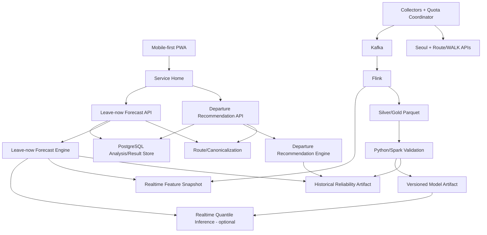
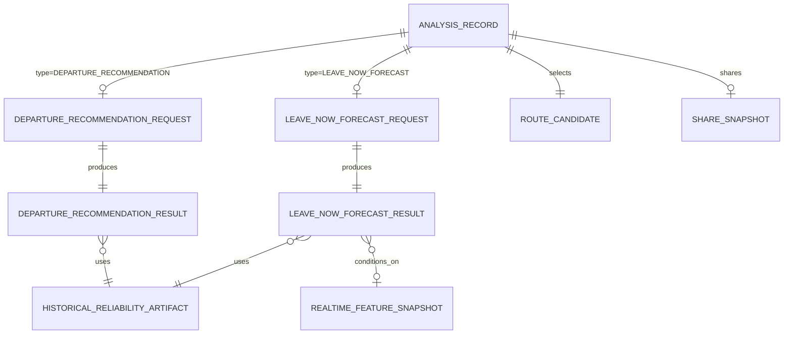
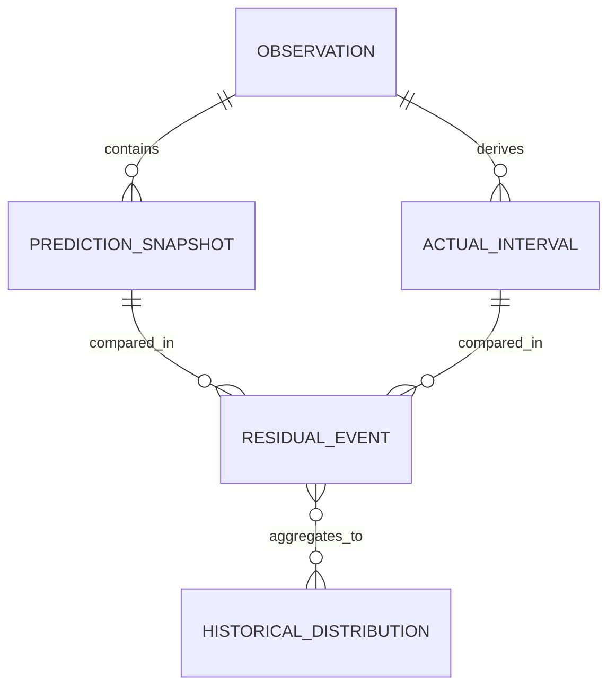

# Journey Reliability 서비스 기획서 — v0.2

> **문서 목적**: Journey Reliability의 사용자 문제, 제품 가치, Minimum Release 범위, 확률·데이터 의미, 실패 원칙, 운영·검증·출시 기준을 하나의 상위 제품 계약으로 고정한다.  
> **문서 지위**: Service Plan 정본 / IA·Requirements의 상위 제품 기준  
> **정본 파일명**: `SERVICE_PLAN_260824_v0.2.md` (`IA_SCREEN_SPEC_260824_v0.2.md`, `REQUIREMENTS_SPEC_260824_v0.2.md`, `DECISION_SHEET_260824_v0.2.md`와 한 세트)  
> **기준일**: 2026-08-24  
> **버전**: v0.2 — 출발 시간 추천 / 도착 가능성 계산 제품 기능 완전 분리  
> **제품 형태**: 독립형 Mobile-first Progressive Web App(PWA)  
> **제품 범위**: 서울 행정구역 내 버스·지하철 복합 여정, 검증 corridor 중심  
> **최종 마감**: 2026-09-25  
> **근거 원칙**: actual experiment evidence를 우선하며 corridor/window/support 범위를 넘어 일반화하지 않는다.

---

## 문서 네비게이션

**정본 문서 바로가기**

- **Service Plan**
- [IA / Screen Spec](IA_SCREEN_SPEC_260824_v0.2.md)
- [Requirements Spec](REQUIREMENTS_SPEC_260824_v0.2.md)
- [Decision Sheet](DECISION_SHEET_260824_v0.2.md)

**이 문서 안에서 이동**

- [Executive Summary](#executive-summary)
- [서비스 배경과 문제 구조](#서비스-배경과-문제-구조)
- [Primary User, Persona, JTBD](#primary-user-persona-jtbd)
- [Value Proposition과 차별점](#value-proposition과-차별점)
- [Minimum Release 범위](#minimum-release-범위)
- [Route 정책과 Main Journey](#route-정책과-main-journey)
- [핵심 기능과 사용자 가치](#핵심-기능과-사용자-가치)
- [확률 결과의 의미와 표시 원칙](#확률-결과의-의미와-표시-원칙)
- [Journey Domain Boundary](#journey-domain-boundary)
- [Prediction, Actual, Residual, Observation Uncertainty](#prediction-actual-residual-observation-uncertainty)
- [Support, Fallback, Confidence, Validation Scope](#support-fallback-confidence-validation-scope)
- [핵심 설계 근거](#핵심-설계-근거)
- [상태·오류·데이터 부족 UX 원칙](#상태오류데이터-부족-ux-원칙)
- [데이터 Lifecycle과 Provenance](#데이터-lifecycle과-provenance)
- [개인정보·보안·Share 원칙](#개인정보보안share-원칙)
- [Logical Architecture, ERD, API와 기술 선택](#logical-architecture-erd-api와-기술-선택)
- [ML/AI 적용 및 비적용 기준](#mlai-적용-및-비적용-기준)
- [운영·관측성·데모 정책](#운영관측성데모-정책)
- [성공 기준과 평가 체계](#성공-기준과-평가-체계)
- [QA와 Release Gate](#qa와-release-gate)
- [팀, WBS, 리스크](#팀-wbs-리스크)
- [확인된 사실과 Claim하면 안 되는 항목](#확인된-사실과-claim하면-안-되는-항목)
- [Final Demo Narrative](#final-demo-narrative)
- [핵심 용어와 Claim Wording Guardrail](#핵심-용어와-claim-wording-guardrail)
- [문서 경계와 변경 규칙](#문서-경계와-변경-규칙)
- [정본 품질 기준](#정본-품질-기준)
- [Appendix — 설계 근거 인덱스](#appendix-설계-근거-인덱스)
- [Appendix — 한 문장 완료 정의](#appendix-한-문장-완료-정의)

## Executive Summary

### 한 줄 정의

**Journey Reliability는 하나의 데이터·신뢰도 플랫폼 위에서, 약속 전에 쓰는 `출발 시간 추천`과 출발 직전에 쓰는 `도착 가능성 계산`을 서로 독립된 제품 기능으로 제공하는 서울 대중교통 의사결정 서비스다.**

두 기능은 WALK/WAIT/RIDE/TRANSFER domain, selected-route 정책, Historical Reliability Artifact와 Reliability Engine을 공유할 수 있지만 **사용자 진입점·입력 화면·계산 트리거·API request·result entity·결과 화면은 공유하지 않는다.** 한 기능을 사용해야 다른 기능을 사용할 수 있는 선후관계도 없다.

| 제품 기능 | 사용 시점 | 사용자 질문 | 입력의 핵심 | 데이터 조건 | 결과 |
|---|---|---|---|---|---|
| **출발 시간 추천 · Departure Recommendation** | 약속 전날, 몇 시간 전, 사전 계획 시 | `목표시각까지 가려면 언제 출발해야 하지?` | origin, destination, 미래 targetArrivalAt | historical baseline only | `Departure P50`, `Departure P90` |
| **도착 가능성 계산 · Leave-now Forecast** | 실제 출발 직전 | `지금 출발하면 목표시각까지 갈 수 있나?` | origin, destination, targetArrivalAt; `departAt=calculatedAt≈now` | historical baseline + eligible realtime context | `P(on_time)`, `Arrival P50`, `Arrival P90` |

`Departure Recommendation`에서 현재 차량·열차·혼잡도 같은 realtime input을 사용하지 않는다. `Leave-now Forecast`는 계산 순간에 검증된 realtime context만 추가하며, 사용할 수 없는 경우 historical-only/partial realtime 상태와 limitation을 명시한다.

### 제품의 핵심 약속

| 기능 | 제품 답변 | 계산 원칙 | 답할 수 없을 때 |
|---|---|---|---|
| 출발 시간 추천 | `보통은 {time}까지 출발`, `여유 있게는 {time}까지 출발` | 미래 target 기준 historical distribution 역산 | metric별 `NOT_COMPUTED` |
| 도착 가능성 계산 | `지금 출발하면 {target}까지 도착할 가능성`, Arrival P50/P90 | now 고정 + historical + eligible realtime | historical-only/partial limitation 또는 `NOT_COMPUTED` |
| 공통 Evidence | support·fallback·freshness·validation·source/model provenance | 각 기능의 실제 사용 근거만 노출 | 근거 부족을 숨기지 않음 |

### 기능 분리 불변조건

1. Home에서 두 기능은 **서로 다른 CTA**로 진입한다.
2. 각 기능은 **별도 입력 화면**과 **별도 결과 화면**을 가진다.
3. `출발 시간 추천` request/response에 Arrival P50/P90·`P(on_time)`을 포함하지 않는다.
4. `도착 가능성 계산` request/response에 Departure P50/P90을 포함하지 않는다.
5. 한 기능의 result가 다른 기능의 prerequisite 또는 자동 continuation이 되지 않는다.
6. 내부 route cache·historical artifact·engine 재사용은 허용하지만 이를 사용자 flow 결합으로 해석하지 않는다.

### 제품 범위와 현재 확인 수준

**Planning feasibility: GO. Development: GO. Historical distribution·realtime feature·AI uplift·whole-Journey calibration은 각 Claim Gate를 통과한 범위에서만 사용자 claim을 승격한다.**

2026-08-23까지의 실제 Evidence는 route/WALK 접근, 일부 Bus/Subway identity·Prediction→Actual→Residual builder 가능성, provider quota와 여러 데이터 품질 한계를 확인했다. 그러나 성숙한 historical WAIT/RIDE distribution, Departure P50/P90 hold-out coverage, realtime feature availability/value-add, whole-Journey calibration은 아직 증명되지 않았다. `congetion`, 선행 차량 상태, 차량 간 거리/headway는 검증 대상일 뿐 확보·효과가 확인됐다고 간주하지 않는다.

## 서비스 배경과 문제 구조

### 해결하려는 문제

대중교통 사용자가 필요한 의사결정은 시간축에 따라 다르다. 약속 전날에는 현재 버스 위치가 중요하지 않고 **언제 출발해야 하는지 계획**하는 것이 핵심이다. 반대로 실제 출발 직전에는 과거 평균만으로 부족하고 **지금 출발했을 때의 도착 가능성**이 필요하다.

따라서 제품이 답하는 질문은 같은 화면의 두 카드가 아니라 두 개의 독립 기능이다.

- **출발 시간 추천**: 미래 일정의 목표 도착시각을 기준으로 P50/P90 출발시각을 계산한다.
- **도착 가능성 계산**: 계산 시점을 출발시각으로 고정하고 P(on_time), Arrival P50/P90을 계산한다.

핵심 문제는 ETA의 부재가 아니라 **historical reliability와 현재 관측을 각 사용 시점에 맞는 별도 decision product로 변환하지 못하는 것**이다.

### 제품이 선택한 해결 방식

1. 공통 Route/Canonicalization/Data Platform을 구축한다.
2. WALK/WAIT/RIDE/TRANSFER를 중복 없이 분리하고 Prediction→Actual→Residual lineage를 만든다.
3. historical artifact를 구축해 `출발 시간 추천`의 유일한 stochastic input으로 사용한다.
4. `도착 가능성 계산`은 동일 historical artifact에 계산 순간의 eligible realtime feature snapshot을 추가한다.
5. 두 기능은 결과 entity와 API contract를 분리한다.
6. AI/ML은 Leave-now leg distribution 보정에만 사용하고 final probability를 black-box로 직접 생성하지 않는다.
7. Evidence 화면은 공통 컴포넌트를 쓰되 `analysisType`에 맞는 근거만 렌더링한다.

### 제품이 해결하지 않는 문제

- 가장 빠른/안전한 경로의 자동 선택 또는 다중 경로 reliability ranking
- 서울 전체 노선 정확도·SLA 보장
- 개인 boarding failure probability, 미래 사고 발생확률
- Minimum Release에서 이동 중 탑승/하차/환승 상태 추적
- Minimum Release에서 수동 `탑승했어요/버스를 보냈어요/하차했어요` 상태 버튼
- 두 핵심 기능을 하나의 `통합 분석` 버튼/결과 화면으로 재결합하는 UX

### 서비스가 필요한 순간

| 사용자 순간 | 사용 기능 | 이유 |
|---|---|---|
| 내일 면접·시험 시간을 미리 계획 | 출발 시간 추천 | 내일의 현재 차량 상태는 알 수 없으므로 historical planning이 적합 |
| 오늘 몇 시간 뒤 공연·예약 준비 | 출발 시간 추천 | 준비 시작 전에 출발 deadline을 정함 |
| 지금 현관에서 나갈지 판단 | 도착 가능성 계산 | departAt=now와 현재 교통 context가 중요 |
| 택시 등 다른 수단으로 바꿀지 마지막 판단 | 도착 가능성 계산 | 현재 정시 가능성과 늦은 tail을 확인 |

Mobile-first Minimum Release의 핵심은 **Home에서 기능 선택 후 해당 기능을 독립 완주하는 것**이다.

## Primary User, Persona, JTBD

### Primary User

서울에서 버스와 지하철을 조합해 이동하며, 단순 최단시간보다 정해진 시각을 지킬 가능성이 중요한 사용자다.

### 핵심 Persona

| Persona | 사용 시점 | 사용하는 기능 | 기대 결과 |
|---|---|---|---|
| Deadline Planner | 약속 전날/사전 준비 | 출발 시간 추천 | 보통/여유 기준 출발시각을 미리 확정 |
| Leave-now Checker | 출발 직전 | 도착 가능성 계산 | 지금 출발 기준 P(on_time), Arrival P50/P90 |
| Evidence-conscious User | 두 기능 결과 확인 시 | 해당 결과의 Evidence | 데이터 범위·fallback·validation을 이해 |

### JTBD

- 미래 일정에 맞춰 준비할 때 `출발 시간 추천`만 실행해 Departure P50/P90을 알고 싶다.
- 실제로 나가기 직전에는 `도착 가능성 계산`만 실행해 지금 출발 기준 위험을 알고 싶다.
- 사전 계획 결과가 없어도 Leave-now 기능을 바로 사용할 수 있어야 한다.
- 이전 Departure Recommendation이 있어도 Leave-now는 현재시각·현재 context로 새 독립 계산을 해야 한다.
- 근거가 부족하면 그럴듯한 숫자보다 limitation 또는 미계산 상태를 보고 싶다.

## Value Proposition과 차별점

| 기존 정보의 한계 | Journey Reliability의 가치 |
|---|---|
| 사전 계획과 지금 판단이 하나의 ETA에 섞임 | 사용 시점이 다른 두 기능을 별도 UX/API로 제공 |
| 평균 소요시간에 임의 여유를 더함 | Departure P50/P90으로 계획 기준 제공 |
| 현재 교통 상황을 감으로 해석 | Leave-now P(on_time), Arrival P50/P90과 realtime coverage 제공 |
| historical/realtime 출처가 불투명 | 기능별 conditioning information을 Evidence에서 분리 |
| “AI 반영” 여부가 불명확 | modelVersion, feature scope, fallback, hold-out Gate 추적 |
| 데이터 부족이 숫자로 메워짐 | `NOT_COMPUTED/PARTIAL_MODEL/HISTORICAL_ONLY`를 정상 상태로 허용 |

제품의 핵심은 두 기능을 UI에서 합치는 것이 아니라 **공통 Reliability Platform을 서로 다른 사용자 순간에 맞는 두 개의 독립 serving capability로 제공하는 것**이다.

## Minimum Release 범위

### In Scope

- Mobile-first PWA의 **Service Home**과 두 독립 기능 entry
- 서울 행정구역 내 임의 origin/destination, BUS+SUBWAY mixed route
- structural route discovery, canonicalization crosswalk, selected-route provenance
- **출발 시간 추천**: 미래 targetArrivalAt + historical baseline → Departure P50/P90
- **도착 가능성 계산**: departAt=now + historical baseline + eligible realtime context → P(on_time), Arrival P50/P90
- 기능별 request/result snapshot, Evidence, privacy-safe Share(Should)
- historical distribution, realtime feature snapshot, Prediction→Actual→Residual lineage
- AI/ML은 Leave-now leg-level residual/WAIT quantile 보정에 한정
- provider/quota/security/분산 correctness proof

`targetReliability` 사용자 입력과 단일 `{p*}% Recommended Departure`는 폐기한다.

### Product Function Boundary

| 항목 | 출발 시간 추천 | 도착 가능성 계산 |
|---|---|---|
| 독립 entry | Required | Required |
| 별도 input route | Required | Required |
| 별도 submit CTA | `추천 출발 시간 계산` | `지금 출발 시 도착 가능성 계산` |
| 별도 result route | Required | Required |
| realtime 사용 | 금지 | eligible context만 |
| 다른 기능 결과 필요 | 없음 | 없음 |
| 내부 historical artifact 공유 | 가능 | 가능 |
| 내부 route/cache 재사용 | 정책상 가능 | 정책상 가능 |

### Coverage / Selected-route 분리 축

기존 `geographyCoverage`, `routeSearchCoverage`, `selectedRoutePolicy`, `canonicalMappingStatus`, `historicalModelCoverage`, `validationAndDemoScope`를 유지한다. `realtimeContextCoverage`는 Leave-now 결과에만 존재한다.

canonical mapping/historical coverage가 부족하면 **해당 기능의 숫자만** `NOT_COMPUTED`로 처리한다. Leave-now realtime context만 부족한 경우 historical baseline이 유효하면 historical-only/partial realtime으로 축소할 수 있다.

### Explicit Out

- 두 기능을 한 CTA·한 request·한 result snapshot으로 통합하는 Dual Analysis
- route optimizer, 다중 경로 reliability ranking, “가장 안전한 경로/시간”
- citywide accuracy/SLA, 전국/수도권 자동 지원
- Journey Start/Live Journey/UserEvent/Reforecast 상태머신
- 수동 탑승·하차·환승 tracking
- background/continuous GPS tracking, push, native app, account personalization
- 생성형 AI final probability, 검증되지 않은 realtime feature의 임의 weight

### 향후 확장

Minimum Release와 두 기능의 calibration이 안정된 뒤 Passive GPS Journey Tracking, automatic reforecast, corridor/citywide 확대, multi-route comparison 등을 검토한다. Future GPS는 현재 구현 계약이 아니다.

### Scope Cut 순서

`Share polish/생성형 설명 → unsupervised regime → realtime ML serving claim → Leave-now 비필수 realtime feature 확대 → 부가 dashboard/citywide` 순으로 cut한다. 두 독립 기능의 기본 historical path, provenance, data correctness, Evidence, Mobile E2E는 보호한다.

### Mobile-first PWA 범위

| Capability | Minimum Release 정책 |
|---|---|
| Service Home | 두 기능을 별도 CTA로 선택 |
| Departure Recommendation | Home→Planning Input→Planning Result→Evidence |
| Leave-now Forecast | Home→Leave-now Input→Leave-now Result→Evidence |
| Installability | manifest, icon, standalone, HTTPS |
| Offline | 각 기능의 마지막 privacy-safe snapshot만 not-current read-only |
| Foreground | 저장 result 복구; Leave-now를 자동 재계산하지 않음 |
| Device Location | 각 input에서 explicit one-shot convenience만 |
| Background GPS | Explicit Out/Future Research |
| Share | 한 번에 **한 기능 결과**만 immutable snapshot으로 공유 |

## Route 정책과 Main Journey

### Selected-route 정책

Minimum Release는 route optimizer가 아니다. 각 기능 request는 독립적으로 selected route를 확정한다. 동일 OD에 대해 승인 cache/canonical route artifact를 내부 재사용할 수 있지만 **한 기능의 selected route/result ID를 다른 기능 request가 prerequisite로 요구하지 않는다.**

D2 selected route는 provider order에서 canonical mapping과 historical model coverage가 충족된 첫 supported candidate다. 최종 시연과 D2 Gate 미통과 fallback은 승인 Route A structural manifest를 사용한다.

### Route A와 Route B의 역할

| Route | 제품 역할 |
|---|---|
| Route A · Primary | 두 기능의 별도 vertical slice와 Evidence, 최종 Demo main story |
| Route B · Internal Validation | topology, realtime identity/interoperability, data pipeline QA; public UI 미노출 |

### Journey 1 — 출발 시간 추천

| 단계 | 사용자 행동 | 서비스 처리 |
|---|---|---|
| 1 | Home에서 `출발 시간 추천` 선택 | Planning input 진입 |
| 2 | origin/destination/미래 목표 도착일시 입력 | planning horizon 검증 |
| 3 | `추천 출발 시간 계산` | route→historical artifact→candidate departure search |
| 4 | Departure P50/P90 확인 | realtime source를 조회/사용하지 않음 |
| 5 | 근거/경로 확인 또는 공유 | historical evidence만 표시 |

### Journey 2 — 도착 가능성 계산

| 단계 | 사용자 행동 | 서비스 처리 |
|---|---|---|
| 1 | Home에서 `도착 가능성 계산` 선택 | Leave-now input 진입 |
| 2 | origin/destination/목표 도착시각 입력 | `departAt=calculatedAt≈now` 고정 |
| 3 | `지금 출발 시 도착 가능성 계산` | route→historical baseline→eligible realtime snapshot→simulation |
| 4 | P(on_time), Arrival P50/P90 확인 | realtime FULL/PARTIAL/NONE 표시 |
| 5 | 근거/경로 확인 또는 공유 | historical + 실제 사용 realtime/model evidence만 표시 |

두 Journey 사이에 자동 transition은 없다. 다른 기능을 사용하려면 Home 또는 명시적 `다른 기능` navigation으로 새 request를 시작한다.

### Future GPS Tracking — Minimum Release 외

2026-08-23의 수동 Journey Start/UserEvent/Reforecast는 퇴역한다. 향후 tracking은 별도 연구/결정 이후 GPS/location 기반 자동 상태 추론을 우선 검토한다.

## 핵심 기능과 사용자 가치

| 기능 영역 | 핵심 정책 | 사용자 가치 | 하위 계약 연결 |
|---|---|---|---|
| Service Home | 두 독립 기능을 별도 CTA로 선택 | 사용 목적을 먼저 명확히 함 | REQ-113 / SCR-00 |
| Departure Recommendation Input | 미래 일정 입력 | 전날/사전 계획 가능 | REQ-001~003,114 / SCR-01 |
| Departure Recommendation Result | historical-only Departure P50/P90 | 출발 deadline 판단 | REQ-107~109,114 / SCR-02 |
| Leave-now Input | 지금 출발 기준 target 입력 | 당장 출발 판단 준비 | REQ-001~003,115 / SCR-07 |
| Leave-now Result | P(on_time), Arrival P50/P90 | 현재 정시 위험 판단 | REQ-011~013,110~112,115 / SCR-08 |
| Function Isolation | 한 request/result에 한 기능만 | 의미 혼합 방지 | REQ-116 / BR-094~096 |
| Structural Route | 공통 provider/crosswalk | 분석 대상 일관성 | REQ-005~009,104,105 |
| Historical Reliability Data | 공통 baseline | 두 기능의 신뢰도 기반 | REQ-060~073,109 |
| Evidence | analysisType별 실제 근거만 | 숫자 과신 방지 | REQ-040~045 / SCR-05 |
| Future GPS Tracking | MR 밖 | 장래 자동 추적 연구 | retired F004~F006 |

## 확률 결과의 의미와 표시 원칙

### 결과 정의

| 결과 | 제품 의미 | 사용자 표현 | 금지 표현 |
|---|---|---|---|
| `Departure P50` | A에서 `P(arrival≤target given depart=d, historical) ≥ 0.50`을 만족하는 가장 늦은 검토 후보 d | `보통은 {time}까지 출발` | 평균 출발시간, 보장 |
| `Departure P90` | A에서 같은 조건의 threshold가 0.90인 가장 늦은 검토 후보 d | `여유 있게는 {time}까지 출발` | 가장 안전한 출발시간, 90% 정확도 |
| `Arrival P50` | B의 현재 출발 조건부 final-arrival distribution Q0.50 | `지금 출발 시 보통 {time} 도착` | 평균 도착, 가장 정확한 도착 |
| `Arrival P90` | B의 현재 출발 조건부 final-arrival distribution Q0.90 | `늦는 경우까지 보면 {time} 정도` + scope | 90% 정확도, 보장 |
| `P(on_time)` | B에서 `P(final_arrival≤target given depart=now, context)` | `지금 출발하면 목표시각까지 도착할 가능성` | 모델 정확도, 개인 보장 |

P50은 평균(mean)이 아니라 중앙값(median)이다. 사용자 친화 copy로 “보통”을 사용할 수 있으나 문서·Evidence에서 평균이라고 정의하지 않는다.

### 두 기능의 관계와 분리 원칙

두 기능은 같은 domain/data platform을 공유하지만 서로 다른 product command다. Departure Recommendation은 historical-only, Leave-now Forecast는 now+eligible realtime context다. 두 결과는 단순 역함수처럼 일치해야 하는 계약이 아니며, 한 기능의 결과를 다른 기능의 입력이나 current state로 자동 승격하지 않는다. 동일 OD/target이라도 두 기능은 별도 `analysisId`, request timestamp, result entity를 가진다.

### Monte Carlo 정책

전체 Journey는 leg의 평균/P90을 단순 합산하지 않는다. service availability·WAIT·RIDE·TRANSFER와 필요한 의존성을 포함해 distribution 또는 simulation으로 final-arrival samples를 만든다. 운영 N은 대표 artifact에서 수렴·fixed-seed 재현성·응답시간을 benchmark한 뒤 versioning한다.

### Departure Planning 정책

A는 두 threshold를 동시에 계산한다.

- `Departure P50`: `P(arrival≤T | depart=d, historical baseline) ≥ 0.50`
- `Departure P90`: `P(arrival≤T | depart=d, historical baseline) ≥ 0.90`

출발 후보가 달라지면 service day, timetable/empirical WAIT, time-of-day historical bucket과 connection feasibility를 다시 평가한다. 목표시각에서 하나의 평균 총소요시간이나 P90 leg 값을 단순 차감하지 않는다. 대중교통 service의 불연속성을 고려해 candidate grid/coarse-to-fine을 사용하며, monotonicity가 검증되지 않은 binary search를 correctness 전제로 두지 않는다.

A에는 현재 차량/앞차 위치·혼잡·실시간 ETA를 넣지 않는다. 이 정보는 B 전용 realtime context다.

## Journey Domain Boundary

### Canonical composition

`ACCESS_WALK + WAIT(mode) + TRANSIT_RIDE(mode) + TRANSFER(mode→mode) + WAIT(next mode) + … + FINAL_WALK`

이 composition은 두 기능 모두 동일하다. Minimum Release는 각 leg를 실제 사용자 진행 상태로 전이시키지 않고 **계산용 route topology**로 사용한다.

### Leg별 경계

| Leg | 시작–종료 경계 | 시간 의미 | 기능별 정책 |
|---|---|---|---|
| ACCESS_WALK | 실제 출발점→첫 boarding point | versioned WALK provider point/reference | 두 기능 공통 baseline, 임의 variance 금지 |
| WAIT | boarding-ready point→탑승 가능한 service | timetable/empirical/realtime candidate | A historical; B realtime context 추가 가능 |
| BUS_RIDE | 버스 탑승→목표 정류장 | duration 또는 prediction+signed residual | A historical residual; B current context 보정 가능 |
| SUBWAY_RIDE | 열차 탑승→목표 station/line | duration 또는 prediction+signed residual | A historical residual; B current context 보정 가능 |
| TRANSFER | 이전 mode 하차→다음 boarding-ready point | street + station internal | next-service WAIT 포함 금지 |
| FINAL_WALK | 최종 하차점→실제 목적지 | versioned point/reference | Journey final arrival boundary |

### Transfer 세부 경계

기존 Route A의 BUS_TO_SUBWAY, SUBWAY_TO_SUBWAY, SUBWAY_TO_BUS source·coordinate 의미와 `UNMODELED_UNCERTAINTY` guardrail을 유지한다. 검증되지 않은 station depth를 시간으로 환산하거나 서로 다른 provider/reference를 평균하지 않는다.

## Prediction, Actual, Residual, Observation Uncertainty

### 분리해야 하는 개념

- **Prediction**: source API가 prediction 시점에 제공한 목표 node 도착예측.
- **Actual**: 이후 polling/관측으로 확인된 차량·열차 도착 사건. exact instant를 모르면 interval로 보존.
- **Residual**: `Actual - Predicted`인 부호 있는 prediction error.
- **Travel Duration**: 한 구간을 이동하는 실제 시간. Residual과 다른 값.
- **Realtime Feature Snapshot**: B 계산 시점 이전/동시에 관측 가능했던 차량·열차 context. outcome 이후 알게 된 값은 포함 금지.

Actual interval과 residual lower/mid/upper를 보존하고, `abs(residual)`이나 residual 자체를 duration으로 사용하지 않는다. A의 historical distribution과 B의 ML 학습 target은 이 semantics를 공유한다.

### Bus 규칙

- Arrival `vehId1/2`와 Position `vehId` 연결은 verified 범위에서 사용한다.
- target Actual 후보는 동일 vehicle의 `stopFlag 0→1`이며 target identity Gate가 필요하다.
- `congetion`은 **realtime feature candidate**일 수 있으나 개인 boarding success ground truth가 아니다.
- 선행 차량의 identity, congestion, 거리/headway가 안정적으로 생성 가능한지는 2026-08-24 현재 Evidence가 없으므로 `UNVERIFIED` Gate다. 이름·순서 추정만으로 feature를 만들지 않는다.

### Subway 규칙

- 최소 identity는 `subwayId × statnId × trainNo × serviceDate`다.
- station name만으로 multi-line 역을 합치지 않는다.
- Actual 후보와 timetable/realtime crosswalk는 기존 versioned explicit mapping 원칙을 유지한다.
- B에 사용하는 current train context도 inference 시점 observable이어야 하며 outcome leakage를 허용하지 않는다.

### Timestamp와 좌표 provenance

`source_generated_at`, `requested_at`, `received_at`, `calculated_at`을 분리한다. 기존 collector timestamp instrumentation의 확인된 한계는 Decision Sheet에 그대로 남긴다. B realtime feature에는 `featureObservedAt`/source freshness가 필요하며, timestamp가 신뢰할 수 없는 feature를 “현재 상황”으로 사용하지 않는다.

## Support, Fallback, Confidence, Validation Scope

### 네 개념의 분리

Support, Fallback, Confidence, Validation Scope는 기존과 같이 서로 다른 축이다. 여기에 2026-08-24부터 **Historical Coverage**와 **Realtime Context Coverage**를 분리한다.

| 개념 | 답하는 질문 |
|---|---|
| Support | 이 distribution/model을 만든 유효 관측 단위가 충분한가 |
| Fallback | exact 조건 대신 어떤 broader group/reference를 썼는가 |
| Confidence | 근거 sufficiency의 사용자 요약은 무엇인가 |
| Validation Scope | component/corridor/E2E 중 어디까지 실제 outcome 검증했는가 |
| Historical Model Coverage | 두 기능 baseline에 필요한 leg distribution이 어느 범위까지 있는가 |
| Realtime Context Coverage | B에서 현재 관측 feature가 `FULL/PARTIAL/NONE` 중 어디까지 사용됐는가 |

### Support 정책

독립 sample unit이 확정되기 전 raw polling row 수를 support로 사용하지 않는다. threshold는 down-sampling/bootstrap/hold-out stability로 versioning한다.

### Fallback 정책

A는 exact `route×node/pair×day-type×time-bucket`이 부족할 때 승인된 hierarchical pooling/reference를 사용할 수 있으며 level을 남긴다. B realtime feature가 부족하면 **historical-only fallback**이 가능하되 `realtimeContextCoverage=NONE/PARTIAL`과 reason을 노출한다. critical historical input 자체가 없으면 `NOT_COMPUTED`다.

### Validation ladder

| 단계 | 의미 |
|---|---|
| V0 | synthetic/deterministic logic |
| V1 | leg/component temporal hold-out |
| V2 | corridor replay/backtest |
| V3 | independent Journey outcome calibration |

추가로 B의 realtime model promotion은 historical-only baseline과 같은 temporal hold-out에서 비교해야 한다. V1/V2 uplift를 V3 whole-Journey calibration으로 표현하지 않는다.

### Result Eligibility

`resultEligibility`는 숫자를 계산·표시할 수 있는가를 답한다. 기존 `Start Eligibility`는 Minimum Release에서 제거한다.

- historical critical input 부재 → `NOT_COMPUTED`
- historical baseline 가능, 일부 uncertainty 미모델링 → `USER_FACING + PARTIAL_MODEL`
- B realtime feature 없음, historical baseline 가능 → `USER_FACING + HISTORICAL_ONLY` limitation
- synthetic fixture → `ENGINE_FIXTURE_ONLY`

### Per-metric Claim Eligibility

metric별로 독립 판정한다.

- `departureP50At`, `departureP90At`
- `arrivalP50At`, `arrivalP90At`
- `onTimeProbability`

자격은 `STRUCTURE_ONLY / DISTRIBUTION_AVAILABLE / PROBABILITY_AVAILABLE / CALIBRATED_CLAIM`을 사용한다. B에서 realtimeContextCoverage가 NONE이어도 historical distribution이 충분하면 distribution/probability를 계산할 수 있으나 “실시간 반영” claim은 별도 금지한다.

## 핵심 설계 근거

| 설계 대상 | 확인된 사실 | 적용 정책 |
|---|---|---|
| Bus WAIT | 짧은 주기의 연속 snapshot은 동일 접근 차량을 반복 관측하며 강한 시계열 의존성을 가진다. | polling row 수를 독립 headway support로 사용하지 않고 차량 도착·교체 사건 또는 dependence-aware unit을 사용한다. |
| Bus Actual/Residual | target stop에서 유효한 `0→1` 도착 사건을 충분히 확보하지 못한 window가 존재한다. | 도착 규칙을 느슨하게 바꾸지 않고 Bus residual confidence를 근거 수준에 맞게 제한한다. |
| Subway quota | 실시간 지하철 key는 공유 일일 budget이며 실제 수집에서 quota business error가 반복될 수 있다. | key×KST-day ledger, 중앙 scheduler, priority budget, preflight, backoff를 적용하고 key rotation으로 우회하지 않는다. |
| Timestamp | collector latency는 HTTP 요청·응답 경계에서만 유효하게 측정된다. | `requested_at`을 send 직전, `received_at`을 수신 직후 기록하고 provider source time과 분리한다. |
| Timetable | 공식 static timetable은 future service prior로 유용하지만 exact current operation을 보장하지 않는다. | source date/version을 보존하고 A Departure P50/P90은 candidate-time service set과 historical time bucket을 재평가한다. |
| Transfer | 같은 역의 공식 데이터도 의미와 산식에 따라 서로 다른 reference를 제공할 수 있다. | 의미가 더 직접적인 operational reference를 선택하고 다른 값은 sanity reference로만 보존하며 평균하지 않는다. |
| WALK/Station internal | street walk point estimate와 station depth만으로 개인별 내부 이동 분포를 만들 수 없다. | point/reference와 `UNMODELED_UNCERTAINTY`를 함께 전달하며 depth를 시간으로 환산하지 않는다. |
| Coordinate | 역 중심·출구·승강장·POI는 서로 다른 위치 역할이다. | 모든 endpoint에 coordinate role/source를 기록하고 station center를 exit로 표현하지 않는다. |
| Subway identity | 같은 역명이 여러 호선에 존재해 name-only join이 관측을 혼합할 수 있다. | `subwayId×statnId×trainNo`를 기본 identity로 사용한다. |
| Simulation | placeholder, residual-as-duration, topology 삭제는 그럴듯한 숫자를 만들지만 제품 의미를 훼손한다. | required input이 없으면 `NOT_COMPUTED`, synthetic run은 `ENGINE_FIXTURE_ONLY`, residual과 duration을 분리한다. |
| Kakao Map WALK / publictraffic | 2026-08-22 WALK 295m/323s, public transit 15개 후보가 HTTP 200/`OK`로 반환됐다. 2026-08-23 같은 OD를 재호출해 15개 후보 signature가 완전히 동일했고 ACCESS WALK 295m/323s point도 완전 재현됐다. | `KAKAO_MAP_WALK`는 Minimum Release의 WALK provider로 사용할 수 있다. publictraffic은 서울 임의 OD의 route discovery provider로 runtime에 실제 호출된다(REQ-104). payload 자체 canonical mapping은 REJECTED이므로 selected route나 transit time 근거로 쓰려면 REQ-105 external crosswalk와 model Gate가 필요하다. |
| Kakao total/step gap 분해 (2026-08-23) | 후보 index 0(SUBWAY): gap 919m/887s, 경계 WALK(origin→첫 지점 918m/825s + 마지막 지점→destination 5m/4s) 합 923m/829s → 거리는 4m 차이로 거의 일치하지만 시간은 58초 잔차가 남음(`PARTIALLY_EXPLAINED`). 후보 index 2(BUS_AND_SUBWAY): gap 468m/422s, 경계 WALK 합 481m/437s → 13m/15s 차이(`HIDDEN_WALK_STRONGLY_SUPPORTED`). | 58초 잔차를 WAIT나 환승 대기로 임의 확정하지 않고 `PARTIALLY_EXPLAINED`로 유지한다. 후보 유형(순수 지하철 vs 버스+지하철)에 따라 설명 정도가 다르다는 사실 자체를 기록하고 일반화하지 않는다. |
| Kakao canonical ID mapping (2026-08-23 payload-only route-provider 조건) | 대중교통 응답의 stop 객체는 `name`만, vehicle 객체는 `name`/`type`만 가지고 있다. busRouteId·stId·stationId에 해당하는 필드가 응답 스키마에 존재하지 않는다(3개 topology 후보 전부 동일 구조 확인). | 이 API 응답만으로는 결정적 crosswalk가 불가능하다 — `REJECTED`(payload 자체 한계). 별도의 외부 name-based crosswalk 없이는 publictraffic을 Primary route provider로 승격할 수 없다. 이 조건은 WALK-only 사용에는 필요하지 않다. |
| Kakao 지리 범위 (2026-08-23) | 서울이 아닌 부산 좌표(129.0756,35.1796 → 129.0800,35.1850)로 publictraffic을 호출한 결과 정상적으로 3개 후보(버스 2, 지하철 1)를 반환했다. 동일 지점/매우 짧은 거리는 각각 `EQUAL_POINTS`/`NO_RESULTS` business status로 명확히 구분됐다. | Kakao publictraffic은 서울 범위를 스스로 제한하지 않는다 — "서울시 데이터만" 원칙은 product 입력단에서 강제해야 하며 provider 응답 성공 여부로 지역 범위를 판단하지 않는다. |
| Kakao source 구분 | 기존 package의 403은 Kakao Mobility walking endpoint와 일반 REST key 조합에서 발생했고, 이번 성공은 2026-07-21 공개된 Kakao Map `dapi.kakao.com/v2/routing/*` endpoint다. | 기존 BLOCKED evidence를 삭제하지 않고 `KAKAO_MOBILITY_WALK_LEGACY`, `KAKAO_MAP_WALK`, `KAKAO_MAP_PUBLIC_TRANSIT`를 서로 다른 providerKey로 관리한다. |
| WALK provider 차이 | 동일 Route A 접근 pair에서 기존 TMAP은 297m/245s, 신규 Kakao는 295m/323s를 반환했다. 2026-08-23 Kakao 재호출도 295m/323s로 완전히 동일했다. | provider별 point estimate와 version을 보존하고 평균하거나 empirical distribution으로 변환하지 않는다. 동일 provider의 재현성은 개인 variance 없는 deterministic point라는 근거를 강화할 뿐 distribution 근거는 아니다. |

위 근거는 현재 정책의 범위를 설명하며 서울 전체 성능을 보증하지 않는다. 세부 source·window·artifact는 Design Basis Register에서 추적한다.

---

## 상태·오류·데이터 부족 UX 원칙

### 상태 모델

Minimum Release는 분석 snapshot 중심이다. `JourneyLifecycleState`, `ReforecastState`, 수동 leg 진행 state는 MR 사용자 state에서 제거한다.

| 상태/표시 | 의미 | 숫자 표시 | 사용자 행동 |
|---|---|---|---|
| ANALYZING | 현재 선택한 기능의 route/source 계산 중 | 이전 결과를 새 값처럼 표시하지 않음 | 취소/대기 |
| FRESH | 사용한 source/artifact가 정책상 사용 가능 | eligible 값 표시 | 근거 보기/새 계산 |
| HISTORICAL_ONLY | B의 realtime context가 사용되지 않음 | historical 기반 B 값은 Gate가 허용할 때 표시 | limitation 확인/새 계산 |
| PARTIAL_REALTIME | B realtime feature 일부만 사용 | 값+사용 범위 표시 | 근거 확인 |
| STALE | B에 필요한 realtime source가 stale | stale realtime을 current로 사용 금지 | historical fallback 또는 새로 계산 |
| PARTIAL_MODEL | 일부 uncertainty 미모델링 | 허용된 metric+limitation | Evidence |
| INSUFFICIENT | support 근거 부족 | 정책에 따라 값 또는 미계산 | 근거 확인 |
| NOT_COMPUTED | critical input 부재 | null | 이유 확인/입력 수정 |
| UNSUPPORTED | geography/mode/mapping 범위 밖 | 0% 금지 | 입력 수정 |
| PROVIDER_ERROR | provider/쿼터 실패 | prior snapshot과 구분 | retry 정책 |
| OFFLINE_SNAPSHOT | 저장된 과거 분석 | read-only, live 표현 금지 | 연결 후 새 계산 |

### 실패 원칙

provider HTTP success와 business success를 구분하고, historical/realtime missing을 서로 다른 limitation으로 남긴다. B realtime source failure가 historical baseline까지 삭제하게 만들지 않으며, historical fallback을 사용한 경우 이를 명시한다. 반대로 historical critical input이 없는데 realtime 한두 feature만으로 숫자를 생성하지 않는다.

### Freshness 합성 정책

A의 historical artifact freshness와 B의 realtime source freshness를 한 enum으로 뭉치지 않는다.

- A: artifact version, observation window, dataEndAt, validation scope를 제공한다.
- B: 사용한 realtime feature source별 `source_generated/requested/received/calculated`와 freshness를 제공한다.
- stale/invalid realtime feature는 모델 입력에서 제외하거나 B를 historical-only로 축소한다.
- B snapshot은 계산시각 이후 자동으로 “현재” 상태를 유지하지 않는다. 사용자가 새로 계산해야 새로운 now snapshot이 만들어진다.

## 데이터 Lifecycle과 Provenance

### Provider Policy Registry와 Default-deny 원칙

API 호출 권한, 화면 표시 권한, cache 권한, raw 장기보존 권한, derived data 보존 권한, Share/재배포 권한은 서로 다른 Gate다. `HTTP 200`, sanitized 처리, secret 제거만으로 장기보존·재배포를 허용하지 않는다. `ProviderPolicyRegistry`의 `UNVERIFIED`는 persistent raw storage·cross-session cache·redistribution에서 default deny다.

2026-08-23 Kakao WALK/publictraffic raw retention 상태는 기존 Decision을 그대로 따른다. 제품 구조가 두 독립 기능으로 바뀌었다고 retention 권한이 새로 생기지 않는다.

### Shared Data Lifecycle + Independent Serving

| 단계 | 책임 | 보존해야 할 provenance |
|---|---|---|
| Collect | provider Observation과 error/quota 수집 | provider, endpoint, requested/received/source time, collector version, policy status |
| Normalize | canonical identity/time/route mapping | schema/mapping version, quality flags |
| Actual/Residual | Prediction→Actual interval→signed Residual | source observation IDs, rule version, interval width |
| Historical Build | day-type/time-bucket/route/node/service별 WAIT/RIDE distribution과 support/fallback 생성 | artifactVersion, dataStartAt/dataEndAt, grouping dimensions, support rule, validation |
| Realtime Feature | B 계산 시점 observable context snapshot 생성 | snapshotId, feature category, entity identity, observedAt, freshness, coverage, schema version |
| Departure Recommendation | 별도 planning request로 historical artifact만 사용해 Departure P50/P90 계산 | departureAnalysisId, selected route, target, artifact version, candidate search config, seed/N |
| Leave-now Forecast | 별도 now request로 historical artifact + eligible realtime snapshot 사용 | leaveNowAnalysisId, departAt, realtime coverage, model/fallback, calculatedAt, seed/N |
| Serve | 기능별 immutable result + mode-scoped Evidence 제공 | analysisType, result schema/version, metric eligibility, limitations |
| Replay/Audit | historical/realtime/model/distributed correctness 검증 | run purpose, input manifest, version, checksum, outcome scope |

각 기능의 재계산은 해당 기능에서 새 analysis snapshot을 만든다. Leave-now의 새로운 “지금” 결과는 Leave-now 기능에서 새 request를 실행해야 하며 Departure Recommendation result를 갱신하거나 이어 쓰지 않는다.

### 활성 Provider별 Retention/Redistribution Matrix

2026-08-23 provider별 retention/redistribution 판정은 `DECISION_SHEET_260824_v0.2.md`의 historical evidence와 `ProviderPolicyRegistry`를 정본으로 사용한다. 새 historical artifact나 realtime feature를 만든다고 raw 보존 권한을 자동 확대하지 않는다. derived data 역시 provider policy가 허용한 범위에서만 저장한다.

## 개인정보·보안·Share 원칙

### 개인정보 최소화

- Minimum Release는 계정이 없다.
- 계산에는 origin/destination/target이 필요하지만 analytics에는 exact coordinate/free-text location을 기본 저장하지 않는다.
- 서버에는 analysis request/result/access/share에 필요한 최소 metadata만 보존하고 장기 이동 history나 GPS trace를 만들지 않는다.
- analysis/share retention TTL은 G5 Security Review에서 확정하며 evidence 없이 수치를 만들지 않는다.
- Future GPS Tracking은 별도 privacy decision 전까지 어떠한 background/continuous location history도 수집하지 않는다.

### Secret과 접근

- API key는 frontend bundle, repo, README, CI log, error body에 포함하지 않는다.
- HTTPS, CORS allow-list, internal admin/stream UI 접근 제한을 적용한다.
- quota 회피를 위한 credential rotation을 사용하지 않는다.
- raw evidence storage와 application log의 접근·목적을 분리한다.

일반 analysis result는 browser-bound owner capability로 보호한다.

- `analysisId`는 locator이며 authorization credential이 아니다.
- owner capability는 JavaScript/URL에 노출되지 않는 secure channel로 보관한다.
- `/analysis/{analysisId}` result 조회·Evidence·Share 생성은 owner capability 일치를 요구한다.
- Start/Event/Abort 권한은 MR에 존재하지 않는다.
- capability가 없는 직접 URL은 resource 존재 여부를 드러내지 않는 동일 recovery UX를 사용한다.
- Service Worker cache에는 secret, capability, exact origin을 저장하지 않는다. offline snapshot은 privacy-safe projection만 저장한다.
- origin 위치 권한은 명시적 `현재 위치 사용` action 뒤 one-shot으로만 요청한다.

### Share

Share는 원본 analysis가 아니라 **한 기능 결과만** 축약한 immutable snapshot이다. `analysisType`을 반드시 포함하고 두 기능 metric을 한 payload에 합치지 않는다.

- Departure Recommendation Share: destination, target, eligible Departure P50/P90, historical scope, calculatedAt, limitation.
- Leave-now Forecast Share: destination, target, departAt, P(on_time), Arrival P50/P90, realtimeContextCoverage, calculatedAt, limitation.  
제외: exact origin, GPS trace, raw vehicle/train ID, provider raw payload, debug evidence, secret.

Share token은 owner capability와 별도 read-only 권한이며 원본 result/evidence 권한으로 승격할 수 없다. 정확 TTL은 G5에서 확정한다.

### 서울시 공공데이터 출처표시

서울 버스/지하철 realtime·timetable 등 서울특별시 공공데이터를 활용한 두 기능 결과에는 출처를 표시한다. 기본 문구는 다음과 같다.

> 이 결과는 서울특별시 공공데이터를 활용해 계산되었습니다.

적용 위치: SCR-02 Departure Result, SCR-08 Leave-now Result, SCR-05 Evidence Detail, 서울시 기반 metric이 포함된 SCR-06 Share Snapshot. 퇴역한 SCR-03/04는 적용 대상이 아니다.

## Logical Architecture, ERD, API와 기술 선택

### 시스템 아키텍처

**Product split / platform share**가 기본 원칙이다. 두 API/serving engine은 사용자 contract를 분리하지만 route normalization, Historical Reliability Artifact, simulation library, data platform을 내부적으로 공유할 수 있다.

### 구성요소 책임

| 구성 | 책임 |
|---|---|
| Service Home | 두 기능을 별도 CTA로 진입시킴; 통합 계산 CTA 없음 |
| Departure Recommendation API/Engine | planning request, historical-only candidate search, Departure P50/P90 |
| Leave-now Forecast API/Engine | now request, realtime feature application, P(on_time), Arrival P50/P90 |
| Shared Route/Canonicalization | 두 기능별 request에서 selected route 확보; 내부 cache 재사용 가능 |
| Historical Artifact | 두 engine의 공통 baseline SoT |
| Realtime Feature Builder | Leave-now에서만 사용하는 immutable current-context snapshot |
| AI Inference Adapter | Leave-now leg residual/WAIT quantile 보정; final probability 직접 대체 금지 |
| Collector/Kafka/Flink | Observation, identity, Actual/Residual, realtime aggregate |
| Offline Validation | historical artifact build, hold-out, baseline-vs-realtime model 평가 |
| PostgreSQL | analysisType별 request/result/access/share/quota metadata; live Journey state 없음 |

### 기술 대안과 전환 조건

기존 Java/Spring, Kafka/Flink, PostgreSQL, MinIO/Parquet, Python/Spark, 2-worker distributed proof 원칙을 유지한다. realtime ML이 Gate를 통과하지 못해도 Departure Recommendation은 영향 없이 동작해야 하며 Leave-now는 declared historical baseline으로 축소될 수 있다.

#### 2-node EC2 임시 배치안

2-node는 HA가 아니라 worker participation/replay/correctness proof다. serving 보호 workload는 `Departure Recommendation API`, `Leave-now Forecast API`, shared route/result/evidence다.

### API 기본 틀

| 그룹 | endpoint | 책임 |
|---|---|---|
| Location | `POST /api/v1/locations/search` | 장소/좌표 resolve |
| Route | `POST /api/v1/route-candidates` | route discovery/crosswalk; 내부 cache 가능 |
| Departure Recommendation | `POST /api/v1/departure-recommendations` | **Departure metrics만** 생성 |
| Leave-now Forecast | `POST /api/v1/leave-now-forecasts` | **Arrival/P(on_time) metrics만** 생성 |
| Result | `GET /api/v1/analyses/{analysisId}` | 해당 analysisType의 immutable result 복구 |
| Evidence | `GET /api/v1/analyses/{analysisId}/evidence` | 해당 기능에 사용된 근거만 반환 |
| Share | `POST /api/v1/analyses/{analysisId}/share`, `GET /api/v1/share/{token}` | 한 기능 result snapshot |
| Operations | internal health/quota/model/artifact endpoints | provider/data/distributed 상태 |

기존 `/api/v1/journeys/analyze` Dual Analysis endpoint는 v0.2 MR에서 `RETIRED_FROM_MR`이다.

### 논리 ERD

### 분산처리 필수 증명

Protected data path는 `Raw/Observation→Actual/Residual→Historical Artifact/Realtime Feature→각 독립 Engine→각 Result→PWA`다. multi-worker failure/replay/checksum/duplicate-loss correctness를 검증하며 2-node를 HA/SLA라고 표현하지 않는다.

## ML/AI 적용 및 비적용 기준

### Primary AI Capability

2026-08-24 정본의 제1 AI capability는 **`JR_REALTIME_QUANTILE_MODEL`**이다. 2026-08-23 문서의 `JR_TEMPORAL_QUANTILE_MODEL`은 historical/realtime 목적이 섞인 deprecated 명칭으로 취급하고 Decision history는 보존한다.

모델은 B에서 사용할 BUS/SUBWAY leg의 residual/WAIT quantile(Q10/Q50/Q90 등)을 예측한다. 입력 후보는 prediction 시점에 관측 가능한 요일·시간대·route/node/service, baseline statistics, current vehicle/train 위치·ETA, congestion, verified leading-vehicle gap/headway 등이다. **어떤 realtime feature도 availability·identity·timestamp Gate를 통과하기 전에는 feature schema에 활성화하지 않는다.**

최종 `P(on_time)`과 Arrival P50/P90은 Reliability Engine이 leg distribution을 결합해 계산한다. AI가 최종 Journey probability를 직접 출력하지 않는다.

### Unsupervised Learning의 위치

비지도학습은 `NORMAL/BUNCHING/CONGESTED/...`와 같은 latent traffic regime을 탐색하는 **optional feature-engineering 단계**로만 허용한다. cluster ID나 distance를 직접 지연 seconds/weight로 해석하지 않는다. 실제 residual/WAIT 개선량은 outcome label이 있는 temporal hold-out에서 supervised/quantile model 또는 명시적 statistical model로 검증한다.

### H100 Training Plane과 Runtime Serving Plane

H100/Jupyter는 offline training/evaluation 전용이다. production PWA/API/collector/engine은 training environment를 직접 호출하지 않고 `ModelArtifactManifest`의 model file, feature schema, evaluation report, model card, hash만 반입한다.

### Promotion / Back-up Plan

비교 baseline을 최소한 다음처럼 분리한다.

- **B0**: empirical/static historical baseline
- **B1**: historical feature 기반 quantile baseline
- **B2**: B1 + validated realtime feature
- **U1(optional)**: unsupervised regime feature를 B2에 추가

B2/U1은 동일 temporal hold-out에서 B0/B1 대비 pinball loss, empirical coverage, calibration, low-support behavior, latency/ops cost가 실제 개선될 때만 user-facing AI/realtime model claim을 승격한다. 개선이 없으면 B1 또는 B0로 자동 축소하고 “AI 반영” claim을 하지 않는다.

### 생성형 AI

근거 요약은 optional이다. 확률·ETA·support·reason code·feature effect를 생성형 AI가 임의 생성하는 것은 금지한다.

## 운영·관측성·데모 정책

### 운영 관측 항목

- Collector/Data: provider last success/error, quota, identity, duplicate/out-of-order, Actual/Residual yield
- Historical Artifact: dataEndAt, bucket/support/fallback 분포, artifact/version/validation age
- Realtime Feature: source freshness, feature coverage, unmatched vehicle/train, leading-vehicle/headway availability
- Model: feature schema/model version, inference fallback, baseline-vs-realtime uplift report
- API/PWA: 기능별 latency/error/result eligibility, Leave-now historical-only/partial realtime rate, Evidence access, 두 독립 mobile flow
- Distributed: worker participation, lag/checkpoint/replay/correctness

### Provider failure 운영

route/WALK failure 원칙은 기존과 동일하다. B realtime feature source가 실패하면 stale 값을 current로 넣지 않고 feature를 제외한다. historical baseline이 유효하면 `HISTORICAL_ONLY/PARTIAL_REALTIME`으로 계산 가능하고, critical historical input도 없으면 `NOT_COMPUTED`다.

### 데모 정직성

- 두 기능의 final 숫자는 각 독립 pipeline output만 사용한다.
- B가 historical-only이면 이를 숨기지 않는다.
- realtime model이 baseline보다 개선되지 않았으면 AI/realtime uplift claim을 하지 않는다.
- 각 analysisId에서 source→Observation→Actual/Residual→Historical/Realtime Feature→Simulation→해당 기능 UI provenance를 추적한다.
- 최종 데모는 Route A를 사용하고 Route B는 내부 데이터/interoperability QA에만 사용한다.

#### Route A Demo Run Manifest

기존 route/data/engine/PWA/quota/distributed/recovery manifest를 유지하되 `Start/Event/Reforecast` 대신 다음을 추가한다.

- Departure Recommendation run: analysisId, historical artifact/version, Departure P50/P90 eligibility
- Leave-now run: 별도 analysisId, departAt/calculatedAt, realtimeContextCoverage, used feature categories, Arrival P50/P90/P(on_time)
- Model: baseline/model key, feature schema version, fallbackUsed, evaluation scope
- Claim: historical-only/partial/full realtime 여부와 허용 wording

### API quota와 수집 예산

2026-08-23에 확인된 source별 quota·entitlement 사실은 그대로 유지한다. 우선순위만 `사용자 두 기능의 독립 요청·Route A demo → historical evidence/Claim Gate corridor → realtime feature validation → coverage 확대 → 실험`으로 바꾼다. 과거 수치와 `PENDING_RECONCILIATION` 상태를 임의 수정하지 않는다.

### 호출 효율화와 degradation

동일 OD structural route는 승인 cache policy 안에서 재사용하되, B의 realtime context는 별도 freshness와 snapshot ID를 가진다. A target time 변경은 historical candidate 재평가가 필요하지만 route provider를 무조건 재호출하지 않는다. realtime quota가 부족하면 B를 historical-only로 축소하고 A는 영향을 받지 않게 한다.

### 데이터 확장·Fixture·Replay 정책

실제 multi-window 수집, event/dependence-aware sampling, hierarchical pooling, official static prior, replay/synthetic/amplified의 기존 provenance 구분을 유지한다. Synthetic/amplified는 support/calibration 또는 AI uplift claim에 합산하지 않는다.

### quota 증액과 대체 source

기존 공식 절차·대체 source 검토 순서를 유지한다. 새 realtime feature 후보는 license/retention뿐 아니라 identity·timestamp·inference-time availability를 추가 Gate로 통과해야 한다.

## 성공 기준과 평가 체계

### Product Outcome

| 기준 | 성공 정의 |
|---|---|
| Function entry separation | Home에서 두 기능 CTA가 별도이며 통합 계산 CTA 0 |
| Departure Recommendation completeness | Departure P50/P90 또는 정직한 미계산 사유를 planning result에서만 표시 |
| Leave-now Forecast completeness | P(on_time), Arrival P50/P90, realtime coverage를 leave-now result에서만 표시 |
| Independent invocation | 어느 기능도 다른 기능 result/session을 prerequisite로 요구하지 않음 |
| API/result isolation | request/response/entity에 다른 기능 metric contamination 0 |
| Evidence trace | 각 analysisId→해당 historical/realtime/model/source/version 역추적 |
| Failure usability | unsupported/not-computed/historical-only/partial/provider error를 숫자로 위장하지 않음 |
| Mobile core | `Home→Planning Input→Planning Result→Evidence`와 `Home→Leave-now Input→Leave-now Result→Evidence` 각각 완주 |

### Data/Probability Evaluation

- identity correctness, Actual/Residual validity, duplicate/out-of-order profile
- historical bucket/support/fallback stability
- A Departure P50/P90 hold-out coverage와 candidate-time service-set 변화 검증
- B Arrival P50/P90 pinball/coverage, `P(on_time)` calibration/Brier는 scope가 있을 때만
- B0/B1/B2/U1 temporal hold-out 비교와 realtime incremental value
- fixed-seed convergence/응답시간

수치 threshold는 evidence 없이 선행 고정하지 않는다.

### 측정 거버넌스

PM/Data/Engine/QA가 metric semantics와 Gate를 공동 승인한다. realtime feature effect는 correlation만으로 승격하지 않고 hold-out outcome 기준으로 판정한다.

## QA와 Release Gate

### Release-blocking Gate

1. **Function isolation**: 두 기능의 entry/input/API/result/share payload가 독립이며 combined Dual Analysis 0.
2. **Route/Data correctness**: identity, canonical mapping, timestamps, Actual/Residual semantics.
3. **Historical baseline correctness**: bucket/time/service semantics, no placeholder, provenance.
4. **Departure Recommendation correctness**: historical-only, Departure P50/P90 threshold/candidate re-evaluation.
5. **Leave-now correctness**: departAt=now, P(on_time), Arrival P50/P90, inference-time observable realtime only.
6. **Honesty**: historical-only/partial realtime/low-support/unmodeled/not-computed 숨김 0.
7. **Product E2E**: 두 독립 mobile flow를 각각 실제 기기에서 통과.
8. **Provider/Security/Ops**: quota, secret, retention, backup/rollback.
9. **Distributed proof**: agreed multi-worker correctness/failure/replay.
10. **Traceability**: Service/IA/Requirements/Decision v0.2 간 충돌 0.

### Capability Claim Gate

| Claim | 필요한 Gate | 미통과 시 |
|---|---|---|
| Historical Bus/Subway Reliability | multi-window residual/wait support + temporal hold-out | fallback/INSUFFICIENT |
| Departure P50/P90 | future service/time-bucket historical input + candidate 재평가 + replay/hold-out | `NOT_COMPUTED` |
| B realtime-conditioned | realtime feature identity/timestamp/freshness/coverage | historical-only limitation |
| Realtime ML value-add | B2/B1 vs B0 temporal hold-out uplift + calibration/ops | baseline 사용, AI claim 금지 |
| Whole-Journey calibrated | independent V3 outcomes | calibration wording 금지 |
| Passive GPS Tracking | 별도 future research/permission/accuracy/privacy Gate | MR에 미포함 |

### 문서 Gate

Service Plan이 상위 정책을 고정한다. IA와 Requirements는 두 기능의 독립성, MR에서 퇴역한 수동 tracking 범위, historical/realtime 구분을 암묵 변경할 수 없다.

## 팀, WBS, 리스크

### 역할

| 역할 | 책임 |
|---|---|
| PM / Team Lead | 두 독립 기능의 product contract, scope, claim, shared-platform integration |
| UI/UX + AI | 두 독립 flow IA, evidence UX, realtime feature/model evaluation |
| Full-stack / FE | Mobile PWA, Input/Result/Evidence/Share |
| BE-1 Bus | Bus collector, identity, Actual/Residual, congestion/headway feature feasibility |
| BE-2 Subway/Journey | Subway/crosswalk, historical distribution, Reliability Engine |
| BE-3 Infra | stream/batch/storage/deployment/observability/distributed proof |

### Critical Path와 Gate

`Function Split Freeze → Shared Data Contract → Departure Recommendation Vertical Slice → Leave-now Historical Baseline → Realtime Feature Feasibility → Leave-now Realtime/ML Gate → Two Independent PWA E2E → Distributed Proof → Freeze → Final`

- 2026-08-24~08-27: 두 기능의 entry/input/API/result contract와 shared historical/realtime schema freeze
- 2026-08-26~09-03: collector/timestamp/identity fixes, multi-window data acquisition, crosswalk 병행
- 2026-09-01~09-08: Route A historical distribution + A Departure P50/P90 vertical slice
- 2026-09-05~09-12: B historical-only now forecast + realtime feature snapshot feasibility
- 2026-09-09~09-16: B1/B2/U1 temporal hold-out, model promotion/fallback decision
- 2026-09-12~09-18: stream/storage/distributed integration
- 2026-09-17~09-22: provider degradation, security, actual mobile QA
- 2026-09-23 freeze, 09-24 rehearsal, 09-25 release/demo

#### Protected E2E 실행 Lane

| Lane | 포함 |
|---|---|
| Protected Product E2E — Departure | Home→Planning Input→Departure P50/P90 또는 정직한 fallback→Evidence |
| Protected Product E2E — Leave-now | Home→Leave-now Input→P(on_time)+Arrival P50/P90 또는 정직한 fallback→Evidence |
| Release Blocking | route/crosswalk, historical semantics, B realtime honesty, quota/security, distributed correctness |
| Claim Gate | mature residual/wait, A coverage, realtime feature availability, model uplift, whole-Journey calibration |
| Cuttable | Share polish, generated explanation, unsupervised regime, realtime ML serving claim, extra dashboard/citywide |

### Top Risks

| 리스크 | 현재 근거 | 대응 |
|---|---|---|
| Historical support 부족 | Bus target-stop/일부 Subway 표본 미성숙 | multi-window 수집, pooling/fallback, claim 축소 |
| WAIT pseudo-sample | polling dependence 확인 | event/dependence-aware unit |
| Realtime feature 미확보 | leading vehicle/congestion/headway는 아직 검증 안 됨 | feature availability Gate; historical-only B fallback |
| Realtime feature 과대반영 | 효과 크기 evidence 없음 | supervised quantile hold-out; no uplift면 제거 |
| Unsupervised 모델 오해 | cluster와 delay effect는 동일하지 않음 | regime는 보조 feature만 허용 |
| Provider/crosswalk 일정 | 기존 D2 blocker 유지 | structure-only/fallback 정책 유지 |
| Architecture scope overrun | stack 다수 | 두 독립 protected flow 우선, optional ML cut |

## 확인된 사실과 Claim하면 안 되는 항목

### 현재 확인된 사실

2026-08-23까지 확인된 provider 접근, Route A/B 구조, Kakao WALK/publictraffic 판정, Bus/Subway identity/Actual 후보, 일부 residual builder 사례, quota, timestamp tooling 한계 등은 **Decision Sheet 2026-08-23 관측 범위 그대로 유효**하다. 2026-08-24의 제품 구조 변경은 이 사실을 삭제하거나 성숙도를 소급 승격하지 않는다.

새 제품 방향에 직접 연결되는 확인 가능 사실은 다음 정도로 제한한다.

- Prediction→Actual→signed Residual을 만들 수 있는 builder 사례가 존재한다.
- Bus position/arrival과 Subway realtime source가 historical/realtime feature 후보의 원천이 될 수 있다.
- `congetion`은 관측 context candidate일 뿐 개인 boarding probability ground truth가 아니다.
- route/WALK/canonical mapping/retention/quota Gate는 서로 독립이다.

### 아직 Claim하면 안 되는 것

- 서울 전체 accuracy/coverage/SLA
- `Departure P90`이 “90% 정확한 출발시간”이라는 표현
- B의 P90이 “90% 정확한 도착시간”이라는 표현
- whole-Journey calibrated claim(V3 전)
- 성숙한 Bus/Subway historical distribution
- raw WAIT polling rows가 독립 sample이라는 주장
- 현재차/앞차 congestion, 앞차와 거리/headway가 **안정적으로 확보되거나 유의한 predictor라는 주장**
- 비지도학습이 적절한 영향 weight/초 단위 지연을 스스로 결정한다는 주장
- AI realtime model이 historical baseline보다 정확하다는 주장(hold-out uplift 전)
- GPS로 boarding/alighting을 자동 판별할 수 있다는 주장(향후 연구 전)
- Kakao API 성공만으로 D2 selected route/reliability가 검증됐다는 주장
- 검증되지 않은 threshold/partition/watermark/TTL/SLO 숫자

## Final Demo Narrative

최종 시연은 **같은 약속을 두 시점에 바라볼 수 있지만 두 기능을 하나의 세션처럼 연결하지 않는다.**

### Scene 1 — 약속 전날: 출발 시간 추천

1. Home에서 `출발 시간 추천`을 선택한다.
2. 출발지·목적지·내일 목표 도착시각을 입력한다.
3. historical reliability로 계산된 Departure P50/P90을 별도 result screen에서 확인한다.
4. Evidence에서 historical artifact/support/fallback을 확인한다.

### Scene 2 — 약속 당일 출발 직전: 도착 가능성 계산

1. Home에서 `도착 가능성 계산`을 별도로 선택한다. Scene 1 result가 없어도 실행 가능함을 보여준다.
2. origin/destination/목표 도착시각을 입력하고 `departAt=now`를 확인한다.
3. P(on_time), Arrival P50/P90, realtimeContextCoverage를 별도 result screen에서 확인한다.
4. Evidence에서 실제 사용 realtime category/model/fallback을 확인한다.

### Engineering Narrative

공통 Observation→Actual/Residual→Historical Artifact/Realtime Feature platform 위에 두 serving API/engine이 존재함을 보여준다. 발표에서 “한 번 입력하면 두 결과가 나온다”, “A 결과가 B로 이어진다”는 표현을 사용하지 않는다.

## 핵심 용어와 Claim Wording Guardrail

| 용어 | 정본 의미 | 권장 문구 |
|---|---|---|
| Departure P50 | historical 기준 on-time probability 0.50 threshold를 만족하는 latest candidate | `보통은 {time}까지 출발` |
| Departure P90 | historical 기준 0.90 threshold를 만족하는 latest candidate | `여유 있게는 {time}까지 출발` |
| Arrival P50 | B current-departure distribution median | `지금 출발 시 보통 {time} 도착` |
| Arrival P90 | B current-departure distribution Q0.90 | `늦는 경우까지 보면 {time} 정도` + scope |
| `P(on_time)` | B의 target 누적확률 | `지금 출발하면 목표시각까지 도착할 가능성` |
| Historical Baseline | A와 B fallback의 과거 통계/참조 distribution | `과거 유사 조건 기준` |
| Realtime Context Coverage | B 계산에 실제 사용된 현재 feature 범위 | `현재 교통정보 일부/전체 반영` 또는 `과거 데이터 기준` |
| JR Realtime Quantile Model | B leg residual/WAIT quantile 보정 model | 최종 확률 직접 AI 생성 표현 금지 |
| Future GPS Tracking | MR 밖 수동 버튼 없는 자동 tracking 연구 | 구현 완료처럼 표현 금지 |

### 금지 Claim

- `평균 출발시간=P50`
- `P90은 90% 정확`
- `가장 안전한 출발시간`
- `AI가 도착확률을 직접 계산`
- `앞차 혼잡도가 지연에 X% 영향을 준다` — 검증 전
- `비지도학습이 최적 가중치를 자동 결정했다` — supervised outcome 검증 없이
- `실시간 반영` — B가 historical-only일 때
- `GPS가 자동으로 탑승을 알아낸다` — Future Gate 전

## 문서 경계와 변경 규칙

### Service Plan에 유지하는 것

두 독립 제품 기능의 사용 시점/가치/경계, shared platform 원칙, 결과 의미, historical/realtime/AI, release/claim gate.

### IA로 내려가는 것

SCR-00 Home, SCR-01/02 Departure flow, SCR-07/08 Leave-now flow, SCR-05 Evidence, SCR-06 Share, Future reserved SCR-03/04.

### Requirements로 내려가는 것

별도 request/result/API/entity, shared route/artifact/engine interface, feature isolation rule, DQ/NFR/Acceptance/Traceability.

### Decision Sheet에 유지하는 것

2026-08-23 Evidence history와 v0.1 reframing history, 그리고 v0.2에서 Dual Analysis를 supersede한 Product Separation Decision.

### 변경 절차

`Evidence/Problem → Decision → Service Plan → IA → Requirements → Decision reconciliation → cross-document audit → code/test`

과거 Evidence/Decision 사실은 소급 변경하지 않는다. v0.1의 Dual Analysis contract는 history로만 보존하고 active v0.2 의미로 재사용하지 않는다.

## 정본 품질 기준

- `Dual Analysis`, 한 버튼·한 result·한 API에서 두 기능을 동시에 계산하는 active 계약이 0건이어야 한다.
- Home에 두 독립 CTA가 존재하고 각 CTA가 별도 input/result route로 연결되어야 한다.
- Departure Recommendation active request/response에는 Departure metrics만 존재한다.
- Leave-now active request/response에는 Arrival/P(on_time) metrics만 존재한다.
- 한 기능은 다른 기능의 result/session을 prerequisite로 요구하지 않는다.
- 내부 route/cache/artifact/engine 재사용과 사용자 flow 결합을 혼동하지 않는다.
- Departure Recommendation은 realtime/current vehicle feature를 사용하지 않는다.
- Leave-now realtime feature는 inference-time observable + identity/timestamp Gate가 있어야 한다.
- P50을 평균으로 정의하지 않는다.
- historical-only Leave-now를 realtime이라고 표현하지 않는다.
- 수동 Start/Event/Reforecast는 MR active flow에 남지 않는다.
- Future GPS는 연구 방향만 적는다.
- 기존 2026-08-23 Evidence 판정·quota/provider 사실을 소급 수정하지 않는다.
- evidence 없는 성능·정확도·feature effect 수치를 만들지 않는다.

## Appendix — 설계 근거 인덱스

- 실제 관측·provider/쿼터 사실: `DECISION_SHEET_260824_v0.2.md`의 2026-08-23 Evidence 보존 영역
- 2026-08-24 v0.1→v0.2 제품 분리 결정: `DECISION_SHEET_260824_v0.2.md`의 Product Separation Decision
- 화면 계약: `IA_SCREEN_SPEC_260824_v0.2.md`
- 구현 계약: `REQUIREMENTS_SPEC_260824_v0.2.md`

## Appendix — 한 문장 완료 정의

**사용자는 Home에서 목적에 맞는 기능을 선택해, 미래 일정에는 독립된 출발 시간 추천 flow로 Departure P50/P90을 확인하고 출발 직전에는 독립된 도착 가능성 계산 flow로 P(on_time)·Arrival P50/P90을 확인하며, 두 기능은 shared reliability platform을 사용하되 request/result/API/UI가 결합되지 않고 각각의 근거와 한계를 추적할 수 있다.**
