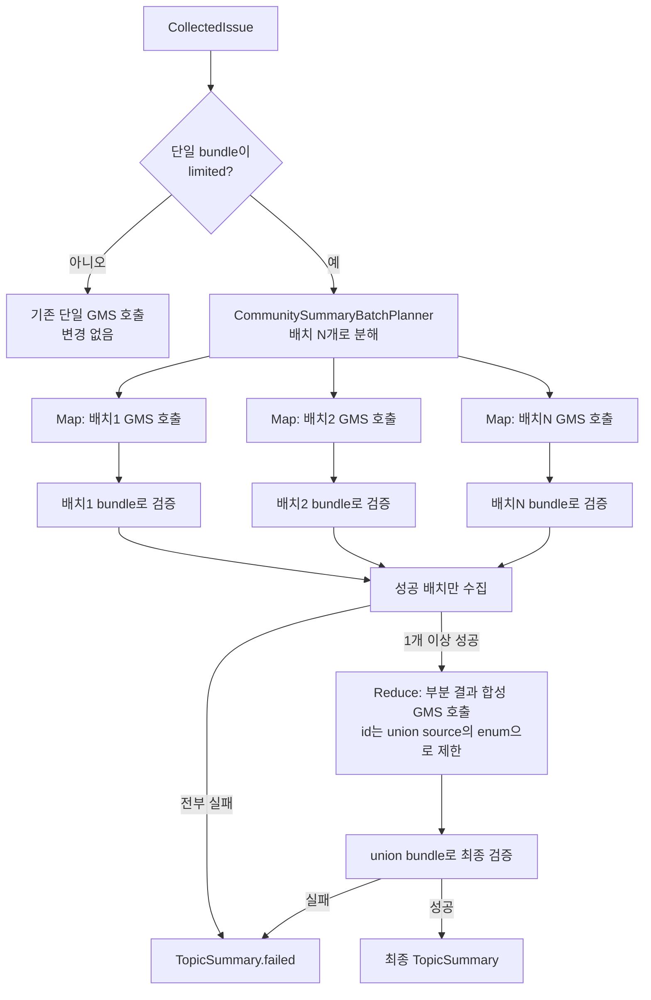

# Spec — S15P21A506-373 4단계: Map-Reduce 재구조화 (④) — 구현 후 폐기

> **2026-09-17 추가**: 이 Spec대로 구현·테스트·실네트워크 검증까지 마쳤으나, 실측 결과
> 이슈당 GMS 호출이 최대 6회(Map 5 + Reduce 1)까지 늘어 시연에 필요한 시간·비용을
> 못 맞췄다(자세한 실측 수치는 [Phase 기록](../phases/S15P21A506-373-step4-map-reduce.md)
> 참고). 오세진 님이 논의 전체 재구성 대신 "반응 최다 댓글 + 유지관리자 답글 + 그 주변
> 댓글" 방식으로 방향을 바꾸도록 결정해, 이 Map-Reduce 코드(배치 분해·Reduce 호출)는
> 최종적으로 **삭제했다** — git 이력에는 구현·삭제 커밋이 모두 남아 있다. 이 Spec은
> "왜 이 방향을 먼저 시도했고 왜 못 썼는지"를 남기기 위한 기록이다. 실제로 배포된 설계는
> [S15P21A506-373-step5-highlight-summary.md](S15P21A506-373-step5-highlight-summary.md)
> 참고.

> [`TEMPLATE.md`](TEMPLATE.md) 기반. Acceptance Criteria는 새로 쓰지 않고 Jira
> S15P21A506-373의 "완료 판단 기준"을 그대로 인용한다.

## 0. 대상 Phase

- Jira: [S15P21A506-373](https://ssafy.atlassian.net/browse/S15P21A506-373)
  `[BE][구현] GMS 대용량 이슈 요약 실패 개선(0~4단계)` — 이 Spec은 그중 4단계만 다룬다.
- 브랜치: `api/feat/S15P21A506-373-map-reduce-summary`
  (`sh scripts/new-branch.sh api feat 373 map-reduce-summary`, develop 기준 새로 분기 —
  1·2단계는 이미 MR [!165](https://lab.ssafy.com/s15-bigdata-dist-sub1/S15P21A506/-/merge_requests/165)로
  병합 완료, 3단계는 커밋된 적 없이 되돌려 develop에 흔적 없음)
- 구현계획 문서 참고 절:
  [`../Pickage_GitHub커뮤니티_대용량요약_개선계획_260916.md`](../Pickage_GitHub커뮤니티_대용량요약_개선계획_260916.md)
  §3④, §5(4단계 실행 순서), §6(테스트 계획 ④행), §9
- 선행 Phase: 0~2단계 완료·병합(develop). 3단계(⑤-A background+폴링)는 실측으로 GMS
  프록시가 폴링을 지원하지 않아 폐기·되돌림 — ④는 3단계를 전제조건으로 두지 않는다
  (개선계획 §3④ 재검수 정정: "⑤-A는 호출 방식만 바꿀 뿐 처리량을 늘리지 않는다").

## 1. 작업 개요

- **작업명/목표**: 댓글이 많아 이슈 1건의 입력이 48,000자 예산을 넘기거나(`SUMMARY_INPUT_LIMITED`)
  모델이 한 번에 소화하기 버거운 이슈(zod `colinhacks/zod` #479 — 88개, #372 — 81개가 실측
  근거)에서, 댓글을 배치로 나눠 배치별 GMS 호출(Map) 후 병합 GMS 호출(Reduce)로 최종
  `TopicSummary`를 만들어 요약 성공률을 높인다.
- **Jira "작업 내용" 재인용**: "④ Map-Reduce 재구조화 — 댓글을 배치로 나눠 여러 번 GMS를
  호출한 뒤 합성한다. 착수 시 동시성(`BoundedCommunitySummarizer` worker 수)·예산 상향을
  함께 설계하고, 팀 공유 GMS 조직 계정 quota 영향을 인프라 담당과 확인한다."
- **Jira "필요한 이유" 재인용**: "댓글이 많은(80개 이상) 인기 저장소일수록 요약 실패율이
  높다 — 즉 사용자가 실제로 비교하고 싶어 할 가능성이 큰 활발한 패키지일수록 커뮤니티 탭이
  무의미해지는 구조적 문제다."
- **Jira "영향 범위" 재인용**: 백엔드 API(해당), 문서(해당). 데이터 저장소(스키마·마이그레이션)는
  "4단계 설계에 따라 해당 여부 결정"이라고 남겨져 있으나, 아래 §2·§6에서 확인한 대로 이번
  설계는 DB 스키마 변경이 필요 없다(스냅샷 저장 형태·`community_snapshot` 계약 불변).

## 2. 변경 대상 (Scope)

### 추가될 파일과 역할

- `backend/src/main/java/com/ssafy/pickage/domain/community/CommunitySummaryBatchPlanner.java`
  — `CollectedIssue`를 여러 `CommunitySummarySourceBundle`(배치)로 나눈다. 기존
  `CommunitySummarySourceBundle.from`의 우선순위 정렬(작성자 최초 댓글 특례 → 반응 수
  내림차순 → 동률 시 최신)을 그대로 재사용하되, "하나의 48,000자 예산"이 아니라
  "배치당 예산 안에서 순서대로 채우고 넘치면 다음 배치로"로 바꾼다.
- `backend/src/main/java/com/ssafy/pickage/domain/community/CommunityMapReduceSummarizer.java`
  — Map(배치별 GMS 호출 + 배치별 검증) → Reduce(검증된 배치 결과를 합성하는 GMS 호출 1회)
  오케스트레이션. `BoundedCommunitySummarizer`가 노출하는 executor를 통해 배치를 동시에
  디스패치한다(이슈 간 병렬 디스패치와 같은 패턴, S15P21A506-368 후속 재사용).
- 테스트: `CommunitySummaryBatchPlannerTest`, `CommunityMapReduceSummarizerTest`,
  기존 `GmsCommunitySummarizerTest`에 reduce 스키마 케이스 추가.

### 수정될 파일과 변경 사항

- `CommunitySummarizer.java` — 인터페이스에 `TopicSummary reduce(List<BatchResult> parts,
  Duration budget)` 추가(신규 메서드, 시그니처는 §3에서 구체화). 기존 `summarize`는 시그니처
  그대로 유지 — 배치 하나짜리(=배치 불필요) 경로에서도 그대로 쓴다.
- `GmsCommunitySummarizer.java` — `reduce` 구현 추가: 별도 system prompt + json_schema(§3).
  기존 `summarize`/`buildRequestBody`/`schema()`는 변경하지 않는다(Map 호출은 지금과 동일한
  스키마·프롬프트를 배치 단위 입력에 그대로 재사용).
- `FakeCommunitySummarizer.java` — `reduce`도 `TopicSummary.failed()` 반환하도록 추가(기존
  "설정값 없으면 실패로 폴백" 정책과 동일).
- `CommunitySummarySourceBundle.java` — 기존 `from(CollectedIssue)`는 그대로 두고, 배치 분해는
  새 `CommunitySummaryBatchPlanner`에 둔다(이 파일 자체는 수정 없음 — 재사용만 한다).
- `BoundedCommunitySummarizer.java` — worker 수·큐 용량을 하드코딩된 `2, 2, ...,
  ArrayBlockingQueue<>(2)`에서 `CommunityProperties`의 새 상수를 읽도록 바꾼다(§6에서 확인:
  현재 `CommunityProperties.EXECUTOR_WORKER_COUNT`가 정의만 되어 있고 실제로 이 클래스에
  연결돼 있지 않다 — 이번에 처음 연결).
- `CommunityProperties.java` — 새 상수 추가(§4·§6에서 구체값, 승인 필요):
  `SUMMARY_BATCH_CHAR_BUDGET`, `MAX_SUMMARY_BATCHES`, 상향된 `EXECUTOR_WORKER_COUNT`.
  `TOTAL_BUDGET`(30초)·`MAX_CONCURRENT_EXECUTIONS`(refresh 자체 동시 실행 상한, GMS 호출
  worker 수와는 다른 세마포어)는 이번 Phase에서 바꾸지 않는다(§6).
- `CommunityRefreshOrchestrator.java` — `pending` 루프에서 `sources.limited()`인 이슈만
  `CommunityMapReduceSummarizer` 경로로, 아니면 기존 `summarizer.summarizeAsync(...)` 경로
  그대로 — **분기만 추가, 기존 단일 호출 경로는 한 줄도 바꾸지 않는다.**
- `CommunitySummaryValidator.java` — 변경 없음. Map 단계는 배치별 `bundle`로
  `validate(bundle, candidate)`를 그대로 호출(재사용). Reduce 단계 검증은 §3에서 설명하는
  "배치들의 `sources()` 합집합" bundle을 만들어 같은 `validate(unionBundle, candidate)`를
  그대로 호출 — 새 검증 로직을 만들지 않는다.

### 범위 밖 — 이 Phase에서 하지 않을 일

- `TOTAL_BUDGET`(30초) 자체의 상향 — 개선계획 §3④가 "필요할 가능성이 높다"고 언급하지만,
  이번 Phase는 먼저 worker 수 확장 + 배치 수 상한으로 예산 안에 넣는 것을 시도한다. 그래도
  안 되면(§5 실측) 별도로 상향을 제안한다(승인 필요 — §6).
- GMS 공유 조직 계정 quota 조정 — 인프라 담당 영역. "확인 필요(외부 의존성)"로만 표시(§4).
- ⑤-B(cross-request 비동기 분리) — 이번 범위 아님(Jira 본문에 이미 보류 명시).
- DB 스키마 변경 — 필요 없음(배치 중간 산출물은 요청 처리 중 메모리에만 존재, snapshot에는
  최종 `TopicSummary` 하나만 저장되는 기존 계약 그대로).
- `domain/packages/**`, `frontend/**`, `compose.yaml`/`application.yaml`의 GMS 설정 — 루트
  AGENTS.md·`docs/for_community/AGENTS.md` "수정 가능 범위"의 기존 경계 그대로.

## 3. 아키텍처 / 데이터 흐름

### 배치 분해 (Map 입력 준비)

`CommunitySummaryBatchPlanner.plan(CollectedIssue issue)`:

1. 먼저 `CommunitySummarySourceBundle.from(issue)`로 기존과 동일하게 단일 bundle을 만들어
   본다. `limited() == false`면 배치가 필요 없다 — 빈 리스트를 반환하고
   `CommunityRefreshOrchestrator`는 지금처럼 단일 호출 경로를 쓴다(대다수 이슈는 이 경로를
   그대로 탄다 — 회귀 위험 최소화).
2. `limited() == true`면, 기존 `priorityOrder`(작성자 최초 댓글 특례 → 반응 수 내림차순 →
   동률 시 최신)로 정렬한 댓글을 순서대로 순회하며, 배치 하나의 누적 글자 수가
   `SUMMARY_BATCH_CHAR_BUDGET`(제안값 12,000자, §6)을 넘기 전까지 같은 배치에 담고, 넘으면
   다음 배치를 연다. 각 배치는 이슈 title/body(`ISSUE_BODY`)를 반복 포함한다(각 배치가
   독립적인 GMS 호출 입력이어야 하므로 — 지금 단일 호출과 동일하게 title/body는 4,000자로
   클립).
3. 배치 수가 `MAX_SUMMARY_BATCHES`(제안값 5, §6)를 넘으면 그 뒤 댓글은 버리고
   `limited=true`로 표시한다(지금도 48,000자를 넘으면 버리는 것과 같은 종류의 저하 —
   "이 이상은 자연히 저하로 표시한다"는 기존 철학을 유지).
4. 반환값: `List<CommunitySummarySourceBundle>` — 각 배치는 지금의 `CommunitySummarySourceBundle`
   레코드를 그대로 쓴다(새 타입을 만들지 않는다). `sources()`는 그 배치 안의 id만 담는다.

### Map — 배치별 GMS 호출 + 배치별 검증

`CommunityMapReduceSummarizer.summarize(CollectedIssue issue, Duration budget)`:

1. `CommunitySummaryBatchPlanner.plan(issue)`로 배치 목록을 얻는다.
2. 남은 예산을 배치 수 + 1(reduce 몫)로 나눠 배치별 호출 예산을 정한다(기존
   `GmsCommunitySummarizer.clampTimeout`이 이미 [1초, 15초] 범위로 한 번 더 자르므로 이중
   안전장치는 그대로 유지된다).
3. 배치마다 `BoundedCommunitySummarizer`의 executor에 `delegate.summarize(batch.issue(),
   perBatchBudget)`를 제출해 동시에 디스패치한다(이슈 간 병렬 디스패치, S15P21A506-368
   후속과 동일한 패턴).
4. 각 결과를 **그 배치의 bundle로만** `CommunitySummaryValidator.validate(batch, candidate)`
   호출 — 배치 A의 결과가 배치 B의 댓글 id를 인용하면 배치 A의 `sources()`에 그 id가 없으므로
   기존 검증 로직이 그대로 걸러낸다(개선계획 §3④가 우려한 "배치 경계를 넘는 support 참조"를
   **새 검증 로직 없이** 기존 `CommunitySummaryValidator`의 "bundle에 없는 id는 거부"
   불변식만으로 막는다 — 이번 설계의 핵심 재사용 지점).
5. `SummaryStatus.FAILED`인 배치는 버리고, 나머지(검증 통과한 배치)만 Reduce로 넘긴다. 전부
   실패하면 이 시점에 `TopicSummary.failed()`를 반환(=지금과 동일하게 `SUMMARY_UNAVAILABLE`로
   이어진다).

### Reduce — 검증된 배치 결과의 합성

1. Reduce 호출의 입력은 **원문 댓글이 아니라, 이미 검증을 통과한 배치별 부분 결과**다 —
   각 배치의 `title_ko`/`summary_ko`/`flow[]`/`messages[]`와 그 근거로 쓰인 source id들.
   배치 수(≤5) × 부분 결과 크기(요약 500자 + flow 4개×200자 + message 3개×300자 이하)로
   상한이 잡혀 입력이 원천적으로 작다 — 개선계획이 우려한 "N+1번째 호출도 큰 입력을 다시
   본다"는 문제를 구조적으로 피한다.
2. Reduce용 GMS 요청은 **새 system prompt + 새 json_schema**를 쓴다(`GmsCommunitySummarizer`에
   `reduce(List<BatchResult>, Duration)` 메서드 추가, 기존 `summarize`용 스키마는 그대로 둔다).
   스키마는 기존 `topic_summary` 스키마와 형태는 같지만(`title_ko`/`summary_ko`/`flow`/
   `flow_support`/`messages`), **`id` 필드를 자유 문자열이 아니라 이 호출에 실제로 주어진
   source id들의 enum으로 제한**한다(json_schema strict 모드가 문자열 enum을 지원 —
   `GmsCommunitySummarizer.schema()`가 이미 `type` 필드에 enum을 쓰고 있는 것과 같은 방식).
   이렇게 하면 Reduce 단계에서 모델이 없는 id를 지어내도 스키마 자체가 거부한다(1차 방어),
   최종 검증은 여전히 아래 3번(2차 방어)으로 한 번 더 확인한다.
3. Reduce 결과는 **모든 성공 배치의 `sources()` 합집합**으로 만든 union bundle에 대해
   `CommunitySummaryValidator.validate(unionBundle, reduceCandidate)`를 그대로 호출해 검증한다
   (합집합이므로 어떤 성공 배치의 id를 인용해도 유효 — 새 Validator 로직 불필요).
4. Reduce 호출 자체가 실패(타임아웃·비200·검증 실패)하면, **부분 배치 결과만으로 대체
   합성하지 않고 그대로 `TopicSummary.failed()`** — "모델이 주장하는 것을 그대로 믿지 않는다"
   원칙과 같은 이유로, 검증되지 않은 부분 결과를 코드에서 짜깁기해 최종 답으로 내놓지 않는다.
   이슈 하나가 이렇게 실패해도 `CommunityRefreshOrchestrator`의 기존 "이슈별 독립 실패"
   계약(`CommunitySummarizer` javadoc)을 그대로 따른다 — `SUMMARY_UNAVAILABLE` limitation만
   붙고 다른 이슈·전체 refresh는 계속 진행된다.

### 동시성·예산

- `BoundedCommunitySummarizer`의 executor를 `CommunityProperties.EXECUTOR_WORKER_COUNT`(제안값
  2→6, §6)로 늘리고 큐 용량도 비례해 늘린다(제안값 8). 지금은 이 상수가 정의만 되고
  실제로는 `new ThreadPoolExecutor(2, 2, ...)`로 하드코딩돼 있어 연결부터 새로 만든다.
- `RefreshTask.TOTAL_BUDGET`(30초)은 바꾸지 않는다 — 배치 호출을 동시에 디스패치하고(위
  Map 단계), 배치별 호출 예산은 `GmsCommunitySummarizer.MAX_CALL_TIMEOUT`(15초)로 여전히
  상한이 걸리므로, worker 수만 늘리면 같은 30초 예산 안에서 N+1 호출이 병렬로 끝날 여지가
  생긴다. 실측(§5)으로 부족하면 `TOTAL_BUDGET` 상향을 별도로 제안한다.

## 4. 예외 및 엣지 케이스

- **세부 항목 매핑** (Jira "세부 항목" 중 4단계 관련 1개):
  - `4단계: Map-Reduce 배치 분해·합성 레이어 설계(Spec 별도 작성) 및 구현` → 이 문서 §3 +
    구현.
- 배치 일부 실패(GMS 타임아웃·비200·검증 실패) → 실패한 배치만 버리고 나머지로 Reduce
  진행(§3 Map 4번). 전부 실패 → 이슈 전체가 `SUMMARY_UNAVAILABLE`.
- 예산 소진 도중(예: 배치 3개는 응답 왔는데 예산이 다 됨) → 이미 완료된 배치만으로 Reduce
  시도, Reduce도 예산이 없으면(`BoundedCommunitySummarizer.summarize`가 이미 `budget.isZero()`
  체크로 즉시 `failed()` 반환하는 것과 동일한 안전장치) `TopicSummary.failed()`.
- 배치가 1개뿐인 경우(=`limited()`는 true지만 48,000~60,000자 사이처럼 배치 하나로 충분한
  경우) → Map 1회 + Reduce 1회(원문이 아니라 그 배치의 검증된 부분 결과를 합성) — Reduce를
  건너뛰고 배치 결과를 그대로 쓰지 않는다. 이유: Reduce 스키마(2차 id 제한)까지 거친 결과만
  최종 결과로 쓴다는 계약을 배치 수와 무관하게 일관되게 유지하기 위함 — 배치가 1개일 때만
  예외를 둬서 Reduce를 생략하면 "배치 수에 따라 검증 경로가 달라진다"는 새로운 분기가
  생기고, 이 분기 자체가 테스트해야 할 새 표면이 된다.
- 이슈 자체가 `MAX_SUMMARY_BATCHES`를 넘는 댓글을 가진 경우 → §3 배치 분해 3번대로 저하
  (`SUMMARY_INPUT_LIMITED` limitation 유지, 지금 48,000자 초과 시 저하 표시와 같은 종류).
- **외부 의존성으로 남겨둘 것**: GMS 공유 조직 계정 quota에 N+1배 호출이 주는 실제 영향
  (`docs/for_community/GMS_연동_참고.md:24-27`가 이미 "SSAFY 조직 계정 하나를 팀 전체가
  공유"라고 경고) — "확인 필요(외부 의존성)"로만 표시하고, 이번 Phase의 테스트는 전부
  fake/mock GMS 서버로 진행한다(§5). 실제 GMS quota 확인은 인프라 담당·오세진 님이 별도로
  판단한다.

## 5. 검증 계획

- [ ] 단위 테스트: `./gradlew test --tests "com.ssafy.pickage.domain.community.CommunitySummaryBatchPlannerTest"
      --tests "com.ssafy.pickage.domain.community.CommunityMapReduceSummarizerTest"
      --tests "com.ssafy.pickage.domain.community.GmsCommunitySummarizerTest"
      --tests "com.ssafy.pickage.domain.community.CommunitySummarySourceBundleTest"
      --tests "com.ssafy.pickage.domain.community.CommunityContractReviewTest"
      --tests "com.ssafy.pickage.domain.community.CommunityRefreshOrchestratorTest"`
- [ ] 회귀: 위 명령이 전체 `community` 패키지 테스트를 덮지 못하면
      `./gradlew test --tests "com.ssafy.pickage.domain.community.*"`로 전체 재확인.
- [ ] 격리 테스트 DB 불필요(이 Phase는 GMS 클라이언트·오케스트레이터 레이어만 건드리고
      snapshot 저장 계약은 바뀌지 않는다) — 기존 애플리케이션 DB·로컬 seed는 쓰지 않는다.
- [ ] 통합 인수: `docker compose --profile api up -d postgres` 후
      `./gradlew integrationTest --tests "*CommunityAcceptanceIntegrationTest*"`로 R11/R12 계열
      (재시작·소유권·뒤늦은 publish 거부) 전부 통과 확인 — 깨지면 되돌린다(개선계획 §6 규칙).
- [ ] `GmsCommunitySummarizerRealNetworkTest`(0단계에서 추가된 실네트워크 테스트)에 배치·reduce
      케이스를 추가할지는 구현 중 판단 — `GMS_API_KEY` 있을 때만 실행되는 기존 게이트를
      유지한다.
- [ ] Jira "완료 판단 기준" 매핑(4단계 관련 항목만, 정본은 Jira):
  - "계획 문서 §5의 0~4단계가 각각 구현·테스트·리뷰를 거쳐 병합된다" → 이 Phase의 구현·테스트·
    `/code-review`·MR로 충족.
  - "각 단계에서 `CommunityAcceptanceIntegrationTest`의 R11/R12 계열이 그대로 통과한다" → 위
    통합 인수 항목으로 충족.
  - "zod #479/#372를 포함한 대용량 댓글 이슈에서 요약 성공률이 실측으로 개선됐음을 확인한다" →
    fake GMS로는 확인 불가 — `GMS_API_KEY`가 있을 때 실네트워크로 재수집해 비교(0단계와 같은
    방식). 없으면 "확인 필요(외부 의존성 — GMS_API_KEY)"로 남기고 사용자에게 보고.
- [ ] 시크릿 노출 여부 체크: 이 Phase는 `GMS_*` 환경변수·API 키를 새로 다루지 않는다(기존
      `GmsCommunitySummarizer` 생성자 파라미터 재사용) — 커밋 전 `git diff`로 재확인.

## 6. 자체 검증 (승인 요청 전 필수)

### 확인한 실제 파일/패턴

- `CommunitySummarizer` 인터페이스는 `CollectedIssue`를 받는다(bundle 자체가 아니라 bundle이
  만든 트림된 `CollectedIssue`) — 배치도 같은 인터페이스를 그대로 태울 수 있음을 확인.
- `CommunitySummarySourceBundle.from`의 우선순위 정렬(`priorityOrder`)이 이미 "작성자 최초
  댓글 특례 → 반응 수 내림차순 → 동률 시 최신"을 구현하고 있어, 배치 분해가 그 순서를 그대로
  재사용할 수 있음을 확인(코드 재작성 없이 순회만 배치 경계에서 끊으면 됨).
  **정정: 실제로는 정렬 로직 자체(`priorityOrder`)가 `CommunitySummarySourceBundle` 안에
  `private static`으로 캡슐화돼 있어 `CommunitySummaryBatchPlanner`가 그대로 호출할 수
  없다 — 구현 시 `from`과 배치 분해가 공유할 수 있게 `priorityOrder`를 package-private으로
  올리거나, `CommunitySummarySourceBundle`에 배치 분해 메서드를 직접 추가하는 두 옵션 중
  하나를 고른다(§2의 "새 파일 `CommunitySummaryBatchPlanner`" 결정은 코딩 착수 시 이 캡슐화
  문제를 다시 확인한 뒤 최종화한다 — 구조는 유지하되 이 세부만 유동적).**
- `CommunitySummaryValidator.validate`가 `bundle.sources()`에 없는 id를 그대로 거부하는 것을
  확인(`support()` 메서드) — §3에서 "배치 경계를 넘는 참조"를 이 기존 불변식만으로 막는다는
  설계의 근거.
- `BoundedCommunitySummarizer`가 `new ThreadPoolExecutor(2, 2, 0, ..., ArrayBlockingQueue<>(2))`로
  worker 수·큐를 **하드코딩**하고 있고, `CommunityProperties.EXECUTOR_WORKER_COUNT`(=2)는
  현재 이 클래스 어디에서도 참조되지 않는 걸 확인 — §2·§3에서 이번에 처음 연결한다고 명시한
  근거.
- `GmsCommunitySummarizer.schema()`가 이미 `type` 필드에 `putArray("enum")`으로 문자열 enum을
  쓰고 있어, Reduce 스키마의 `id` enum 제한(§3)이 기존 패턴 재사용임을 확인.
- `CommentWindowResolver.TARGET_COMMENT_COUNT = 100`, `IssueSelectionPolicy.MAX_SELECTED_ISSUES
  = 2` 확인 — 배치 분해 입력은 이슈당 최대 100개 댓글로 이미 상한이 잡혀 있다(수집 단계
  기존 정책, 이번 Phase가 새로 제한하지 않는다).
- `RefreshTask.collectionTimeLeft()`가 게시 예산(2초)을 뺀 값을 돌려주는 것, `budget.isZero()`면
  `BoundedCommunitySummarizer.summarize`가 즉시 `failed()`를 반환하는 이중 안전장치를 확인 —
  §4의 "예산 소진 시 Reduce도 즉시 실패" 근거.

### 발견해 Spec에 반영한 차이

- 개선계획 §3④ 원문은 "이슈 하나가 배치 수만큼(N번) 호출 + 합성 1번"이라고만 말하고 합성이
  GMS 호출인지 코드 병합인지 명시하지 않는다. 코드만으로 병합하는 대안(특히
  `summary_ko`)을 검토했으나, `CommunitySnapshotValidator.plain(summary.summaryKo(), 500)`
  제약상 N개 배치 요약을 단순 이어붙이면 500자를 넘기거나 문맥이 끊길 가능성이 커서, Reduce도
  GMS 호출로 하는 쪽으로 Spec을 확정했다(§3) — 이 선택 자체가 아래 "아직 못 정한 것"에도
  다시 올라간다(대안이 있는 결정이므로).
- 위 "확인한 실제 파일/패턴"에 적은 대로 `priorityOrder`의 캡슐화 문제를 발견해 §2·이 절에
  반영했다 — 최종 클래스 배치는 코딩 착수 시 재확인한다.

### 결정됨 (2026-09-16, 오세진 님 승인)

1. **Reduce = 실제 GMS 호출 (Spec 기본안 유지).** 요약 품질(특히 `summary_ko` 500자 제약
   안에서의 자연스러움)을 우선한다. 입력 토큰 중복(배치마다 title/body 재전송)과 Map→Reduce
   순차 구조로 인한 30초 예산 압박은 알려진 리스크로 남기고, 구현 후 실측으로 확인한다
   (아래 4번 및 §3 "동시성·예산" 절 그대로).
2. **배치·동시성 상수는 제안값으로 확정.** `SUMMARY_BATCH_CHAR_BUDGET=12,000자`,
   `MAX_SUMMARY_BATCHES=5`, `EXECUTOR_WORKER_COUNT` 2→6, 큐 용량 8. 구현 중 발견되는 명백한
   오류(예: 상수 하나가 실제로 말이 안 되는 값으로 드러남)가 아니면 이 값을 그대로 코딩한다.
3. **`TOTAL_BUDGET`(30초) — 먼저 시도 후 재제안 (Spec 기본안 유지).** 이번 Phase는
   worker 수 확장 + 배치 상한만으로 예산 안에 넣는 것을 시도한다. §5 실측(R11/R12 통합
   인수, GMS_API_KEY 있으면 zod #479/#372 재수집)에서 부족함이 확인되면 그 결과를 근거로
   별도 상향을 제안한다 — 이번 Spec/구현 범위에 미리 포함하지 않는다.
4. **GMS 공유 조직 계정 quota 확인 — 4단계 구현·병합 이후.** 이번 구현은 fake GMS로 진행하고
   (`docs/for_community/AGENTS.md` 규칙 6), 인프라 담당에게 quota 영향을 확인하는 절차는
   4단계가 구현·테스트·리뷰·병합까지 끝난 뒤 별도로 시작한다.

---
승인: 2026-09-16, 오세진 님 (AskUserQuestion 4건 — Reduce 방식/배치 상수/TOTAL_BUDGET 순서/
quota 확인 시점 — 전부 Spec 기본안 또는 제안값대로 확인).
