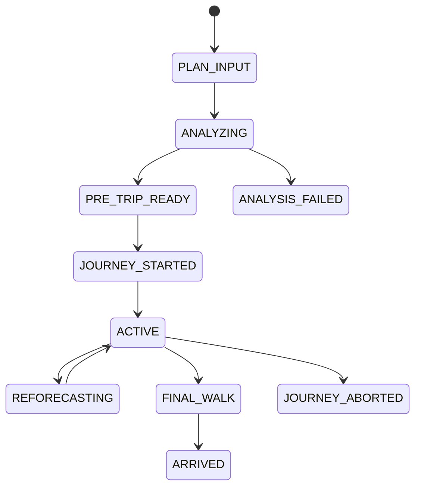
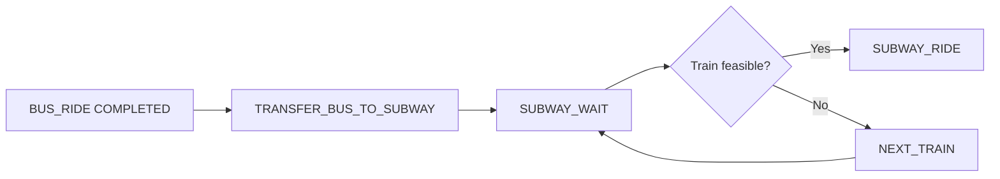
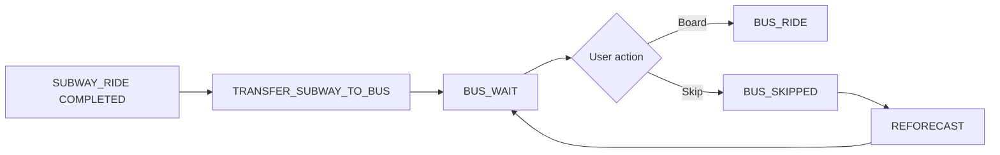
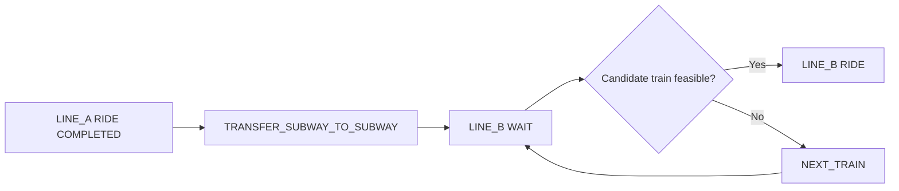

# User Journey & State

## 1. Canonical Building Blocks

```text
ACCESS_WALK
WAIT
TRANSIT_RIDE
TRANSFER
FINAL_WALK
```

`TRANSFER`는 다음 boarding point까지의 이동이다.
`WAIT`는 boarding point 도착 이후 차량 대기다.

## 2. TransferType

```text
BUS_TO_SUBWAY
SUBWAY_TO_BUS
SUBWAY_TO_SUBWAY
```

현재 지원 대상으로 두지 않는:
`BUS_TO_BUS`

는 필요 시 추후 추가한다. 현재 문서가 자동 지원을 의미하지 않는다.

## 3. High-Level State



## 4. Leg State

모든 leg:

```text
PLANNED
AVAILABLE
IN_PROGRESS
COMPLETED
SKIPPED
MISSED
UNAVAILABLE
```

mode에 따라 사용하지 않는 state는 생길 수 있다.

## 5. BUS_TO_SUBWAY



Transfer:
- bus alight
- stop→station entrance
- gate/internal movement
- platform arrival

Wait:
- platform arrival 이후 train까지

## 6. SUBWAY_TO_BUS

Phase 0 Raw에 이미 존재하는 Route B structural example:

```text
01A → 3호선(안국→압구정) → TRANSFER_SUBWAY_TO_BUS → 147 → 역삼권역
```

구조와 압구정 station/147 route·stop/realtime WAIT source interoperability는 `EVD-CROSS-002 VERIFIED`다. 단 `BUS_SKIPPED→REFORECAST` product state/engine 구현은 아직 NOT_STARTED다.



## 7. SUBWAY_TO_SUBWAY



## 8. UserEvent

### USER-EVT-001 `BUS_SKIPPED`

Precondition:
- `BUS_WAIT`
- 하나 이상의 candidate bus가 식별됨
- 사용자가 해당 candidate에 미탑승을 확정

Effect:
- candidate bus `SKIPPED`
- current time fixed
- 해당 bus branch 제거
- 다음 feasible bus candidate 생성
- 남은 Journey Reforecast

### USER-EVT-002 `BOARD_CONFIRMED`

Precondition:
- Wait state

Effect:
- 현재 candidate를 실제 탑승으로 fixed
- Wait 완료
- Ride 시작

### USER-EVT-003 `TRANSFER_MISSED`

Tier-0:
시스템의 fixed-buffer boarding feasibility 판정 또는 사용자 confirmation으로 기록.

Effect:
- 계획 candidate `MISSED`
- next candidate 탐색
- final on-time probability 재계산

## 9. Reforecast Invariant

Reforecast 시:

**고정**
- 이미 완료된 walk
- 이미 완료된 ride
- confirmed user event
- 현재 timestamp

**다시 계산**
- 아직 시작하지 않은 wait
- future ride
- future transfer
- final walk point estimate

완료된 leg를 다시 sample하지 않는다.

## 10. Service Candidate Semantics

- Near-now / IN_TRIP: realtime vehicle/train candidate를 우선
- Future PRE_TRIP: exact future vehicle ID가 없을 수 있으며 timetable 또는 empirical WAIT model을 사용
- candidate source가 없으면 해당 state를 fabricated candidate로 채우지 않고 `UNAVAILABLE/INSUFFICIENT`로 둔다

## 11. Freshness State

Journey live 화면은 data state를 별도로 가진다.

```text
FRESH
AGING
STALE
PROVIDER_ERROR
NO_DATA
```

구체 threshold는 `22_NFR.md`에서 profile 후 결정한다.

## 12. Confidence State

```text
HIGH
MEDIUM
LOW
INSUFFICIENT
```

이 label은 probability 값 자체가 아니라 Evidence sufficiency를 표현한다.
rule은 `43_VALIDATION_PLAN.md`에서 calibration 후 version한다.
