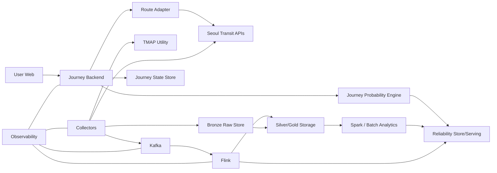

# System Architecture

## 1. Architecture Principle

기술 이름을 먼저 정당화하지 않는다.

본 프로젝트에서 Kafka/Flink/Spark는 다음 두 질문을 분리해 다룬다.

1. **서비스 구현에 필요한 역할인가?**
2. **분산처리 프로젝트로서 scale/failure/correctness를 증명할 수 있는가?**

실제 서울 API traffic이 작더라도 amplified replay를 benchmark에 사용할 수 있다.
단 그것을 실제 운영량이라고 주장하지 않는다.

---

# 2. Logical Context



---

# 3. Component Responsibilities

## Collector
- external API polling
- request/response metadata
- **raw immutable write를 Kafka downstream과 분리해 먼저/동시에 보존**
- Kafka publish
- retry/backoff
- quota awareness

Collector가 probability 계산을 하지 않는다.

## Kafka
Target role:
- collector/processor decoupling
- replayable event log
- partitioned processing input

실제 topic/partition count는 `51_STREAMING_STORAGE_CONTRACT.md`.

## Flink
Target role:
- canonical normalize
- event-time handling
- keyed train/vehicle state
- Actual interval matching
- Residual emission
- online aggregate 후보

## Storage
- Bronze raw
- Silver canonical
- Gold derived
- distribution artifact
- benchmark history

## Spark
Target role:
- offline data profiling
- distribution aggregation/backtest
- ML candidate training
- scale-out benchmark
- optimization proof

## Reliability Serving
- versioned LegDistribution 조회
- support/fallback metadata
- hot/cached serving

## Journey Engine
- route leg normalization
- near-now realtime candidate 또는 future timetable/empirical WAIT source 선택
- Monte Carlo
- recommended departure
- Reforecast

## Backend
- user-facing API
- Journey state
- user event idempotency
- share
- access control/rate limiting

## Web
- input
- probability result
- live state
- evidence UX
- share

---

# 4. Target Deployment

현재 자원:
- EC2 2대
- 팀 노트북 6대(4050)
- H100 지원 예정
- GitLab monorepo
- Jenkins/tool 제한 낮음

## EC2-A target
- Backend
- Kafka primary/dev broker candidate
- Flink JobManager
- TaskManager
- reverse proxy
- state DB/cache 일부

## EC2-B target
- MinIO/object storage
- Spark master/worker 또는 standalone worker
- Flink TaskManager
- observability
- Jenkins agent 가능

**주의:** 실제 CPU/RAM/disk가 아직 문서에 없으므로 최종 배치 LOCK 금지.

## Laptops
- dev
- local worker
- benchmark secondary worker 후보

네트워크/방화벽 조건을 확인한 뒤 실제 distributed cluster 참여 여부 결정.

## H100
Core 성공조건 아님.
Quantile LightGBM baseline에도 필수 아님.

Optional:
- AI explanation
- 비교 실험

---

# 5. Technology Decision Status

| ADR | Technology | Status | Why / Gate |
|---|---|---|---|
| ADR-001 | Kafka | TARGET/REVIEW | replay/decoupling/key partition. volume profile 후 final |
| ADR-002 | Flink | TARGET/REVIEW | stateful Prediction→Actual matching에 자연스러움 |
| ADR-003 | Spark | TARGET/REVIEW | offline aggregation + distributed proof |
| ADR-004 | MinIO/Parquet | TARGET/REVIEW | replay/analytics artifact |
| ADR-005 | PostgreSQL | PROPOSED | Journey state/metadata; actual repo stack 확인 후 |
| ADR-006 | Redis | OPTIONAL | cache 필요성이 profile될 때만 |
| ADR-007 | LightGBM | HOLD | validation promotion gate |
| ADR-008 | Generative AI | OPTIONAL | explanation only |

---

# 6. Vertical Slice First

분산 stack을 완성하기 전에 다음이 local/single-process로라도 관통해야 한다.

```text
Raw sample
→ canonical
→ actual/residual
→ distribution
→ Journey simulation
→ API
→ UI
```

그 후 같은 contract를 Kafka/Flink/Spark에 옮긴다.

이 순서가 architecture divergence를 줄인다.

---

# 7. Failure Boundary

- Provider failure != stream failure
- Collector failure != Flink failure
- Probability unavailable != HTTP 500 고정
- stale result != fresh result
- partial model != full model

각 layer가 error semantics를 유지한다.

---

# 8. Architecture Acceptance

최종 architecture는:
- actual data profile
- benchmark
- failure recovery
- correctness
- operational complexity

증거와 함께 freeze한다.

“Kafka/Flink/Spark를 썼다” 자체가 acceptance가 아니다.
