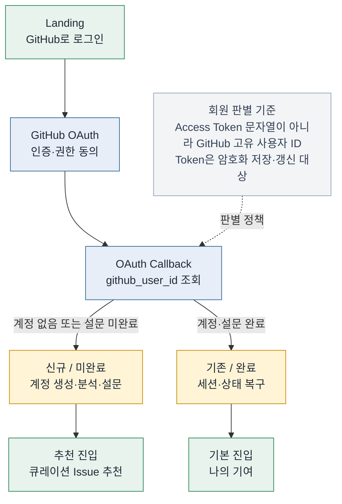
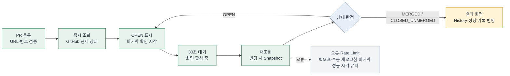
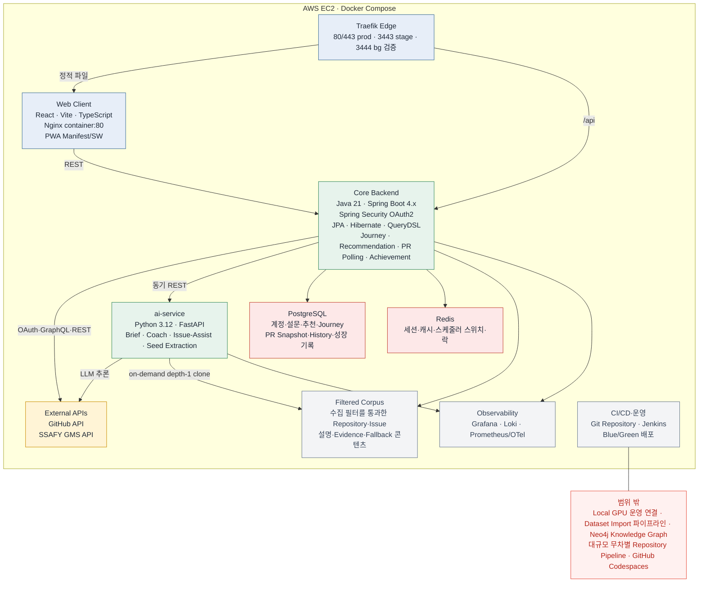

# 깃든 서비스기획서 최종본

> Markdown 정본. MVP(2026-07-30) 전용 판은 `docs/history/2026-08-01-service-plan-minimum-update/`에 보존한다. 이 문서는 확장계획최종본이 확정한 **Minimum(M-01~M-07)** 범위를 현재 구현 상태에 맞춰 정리한 기준본이다. 확장계획최종본은 구현 종료 후 history로 이동하며, 이 문서가 사용자 경험 범위의 현행 기준이다.
>
> 머리글: 깃든 | AI 기반 오픈소스 기여 학습 Web 서비스 기획서

**PRODUCT SPECIFICATION**

**깃든**

**오픈소스에 내 코드를 깃들게, Git에 깃들다**

AI 기반 오픈소스 기여 Journey Web 서비스 기획서

MVP 기능 성립(2026-07-30) 위에 확장계획최종본 Minimum 구현 결과를 현재 제품 상태 기준으로 정리한 기준본

```mermaid
flowchart LR
    landing["1 Landing<br/>GitHub로 로그인"] --> oauth["2 OAuth<br/>GitHub 인증"]
    oauth --> account["3 계정 분기<br/>신규 / 기존"]
    account --> analysis["4 GitHub 분석<br/>언어·Framework 추천"]
    analysis --> survey["5 온보딩 설문<br/>사용자 확정 입력"]
    survey --> tutorial["6 튜토리얼<br/>첫 기여자 기본 노출"]
    tutorial --> repository["7 큐레이션 Issue<br/>100점 추천·선택"]
    repository --> journey["8 Journey<br/>개요·설정"]
    journey --> learning["9 실행 학습<br/>Fork·Clone(모바일은 PC 안내)·Brief·Coach"]
    learning --> pr["10 Commit·PR<br/>작성·등록"]
    pr --> monitoring["11 Monitoring<br/>30초 Polling"]
    monitoring --> result["12 Result<br/>Merge / Closed"]
    result --> growth["13 성장 기록<br/>History·XP·Level"]
    growth --> history["14 나의 기여<br/>History·이어하기"]
    account -.->|"기존 사용자: 계정·진행 상태 복구"| history

    classDef primary fill:#e7f3ec,stroke:#2f855a,color:#1f2937;
    classDef auth fill:#e7eef8,stroke:#376996,color:#1f2937;
    classDef terminal fill:#fff4d6,stroke:#c98b00,color:#1f2937;
    class landing,analysis,survey,tutorial,repository,journey,learning,pr,growth,history primary;
    class oauth,account auth;
    class monitoring,result terminal;
```

그림 1. 깃든 전체 사용자 Journey (Minimum 기준)

| **항목** | **내용** |
| --- | --- |
| 서비스 형태 | Responsive Web, PWA 설치 지원(Minimum) |
| 핵심 타깃 | 오픈소스 기여 경험이 없거나 적은 주니어 개발자 |
| 핵심 가치 | 맞는 Repository·Issue 발견 → 근거 기반 학습 → 실제 PR → 결과·성장 기록 |
| 기반 | MVP 기능 성립 2026-07-30, Minimum 확정 확장계획최종본 2026-07-31 재검증본 |
| 문서 상태 | Minimum 구현 완료 후 운영 확인 잔여 기준 정본(2026-08-05 dev 기준) |
| TEAM | 오세진 · 송수빈 · 임지영 · 유호준 · 이예준 · 조도연 |

## 문서 범위와 제외 원칙

| **구분** | **기준** |
| --- | --- |
| 포함 | MVP 사용자 흐름 위에 확장계획최종본이 확정한 Minimum 범위 중 현재 구현된 제품 상태 — 수집 필터 정밀화·Hash 변경 감지(M-01), Journey·GMS 사용량 운영(M-05), 사용자별 후보 검색과 100점 큐레이션 추천(M-04), PWA Lite 설치·모바일 반응형·Clone·PR PC 안내(M-06), 나의 기여·Skill Map·게임화 XP 조회(M-07) |
| 영구 폐기(재고 대상 아님) | Local GPU 분석·Dataset Artifact/Import 파이프라인 — 확장계획최종본 1.4 "가장 중요한 결정" #2에 따라 도입하지 않기로 확정. Next Step 후보 목록에도 포함하지 않는다. |
| 제외(Next Step 후보) | Knowledge Graph · 고도화 Orchestrator · 정교한 코드 평가(Diff 분석) · GitHub Codespaces 연동 · Web Push·업무 데이터 Offline Cache·Background Sync · 공개 Portfolio·Leaderboard · 추적 대상 밖 PR 무차별 Poller |
| 이동 문서 | `docs/history/2026-08-05-final-docs-refresh/깃든_확장계획_최종본.md`는 Minimum 구현 계획 보존본이다. Next Step 후보는 이 문서와 최신 요구사항 정의서의 "범위 밖" 항목을 기준으로 재기획한다. |
| 의사결정 기준 | 화면이나 API가 제외 기능에 의존하면 해당 의존성을 제거하거나 사전 정의 데이터·Fallback으로 대체한다. |

## 목차

| **구분** | **내용** |
| --- | --- |
| SECTION I | 프로젝트 정의 및 서비스 전략 |
| SECTION II | Web 서비스 경험 설계 |
| SECTION III | 기능·정책·상태 설계 |
| SECTION IV | AI·Evidence 전략 |
| SECTION V | 데이터·보안·개인정보 설계 |
| SECTION VI | 기술·인프라·운영 기준 |
| SECTION VII | 프로젝트 관리·품질·출시 |
| SECTION VIII | 결론 |
| 부록 | 기능 추적 기준 · 기술 구현 결정 |

**SECTION I**

## 프로젝트 정의 및 서비스 전략

오픈소스 프로젝트 발견부터 실제 Pull Request 결과 확인과 성장 기록까지, 주니어 개발자가 중단 없이 완주할 수 있는 제품 가치를 정의한다.

> **PR Monitoring 기준**: 외부 오픈소스 Repository에는 우리 GitHub App을 설치할 수 없으므로 Webhook을 PR Monitoring의 1차 이벤트 원천으로 사용하지 않는다. 기본 경로는 App installation 토큰 기반 GraphQL 배치 조회이며, 화면 활성 중 30초 Client Polling은 즉시성 UX를 담당하고 Backend Background Sync는 화면 이탈 후 Snapshot·Notification 갱신을 담당한다. Webhook은 App이 설치된 Repository의 보조 신호로만 사용한다.

### 1. 서비스 개요

| **항목** | **정의** |
| --- | --- |
| 서비스명 | 깃든 |
| 캐치프레이즈 | 오픈소스에 내 코드를 깃들게, Git에 깃들다 |
| 한 줄 정의 | 주니어 개발자에게 맞는 Repository와 Issue를 추천하고, 근거 기반 질문과 실제 Git Journey를 통해 첫 PR과 기여·성장 기록까지 완주하도록 돕는 AI Web 서비스 |
| 서비스 성격 | 오픈소스 기여 학습 · AI 질문 코칭 · GitHub 실행 가이드 · PR 결과·성장 기록 |
| 1차 사용자 | 프로젝트와 Git의 기본 경험은 있으나 외부 오픈소스 PR이 처음이거나 0~2회인 주니어 개발자 |
| 핵심 문제 | 어떤 프로젝트와 Issue를 선택해야 하는지, 코드를 어떻게 이해하고 Fork·Clone·Commit·PR을 어떤 순서로 수행해야 하는지 몰라 실제 기여가 중단된다. |
| 핵심 기능 | GitHub 통합 로그인, GitHub 분석·설문, 초보자 튜토리얼, 입문자가 실제로 기여 가능한 큐레이션 Issue 100점 추천, 단계형 Journey, 질문 Coach, Commit·PR 학습, PR Polling, 결과·History, PWA 설치, 나의 기여·Skill Map·게임화 XP 조회 |
| 핵심 차별점 | 추천 근거와 Repository·Issue 맥락을 학습·실행 과정에서도 반복 사용하고, AI가 정답 코드를 대신 제출하기보다 사용자의 판단과 실제 GitHub 행동을 연결한다. 추천은 "많이 모으기"가 아니라 "입문자가 실제로 기여할 수 있는 이슈만 남기기"를 원칙으로 한다. |
| 추천 규모 | 저장소 스타 상한·이슈 30일 창으로 좁힌 수집 Corpus 중 큐레이션 상위 50건(품질을 유지한 채 확대 가능)을 100점 기준으로 노출한다. |

### 2. 핵심 제안문

| **VALUE PROPOSITION** 깃든은 오픈소스에 기여하며 성장하고 싶지만 적합한 프로젝트와 실제 시작 방법을 찾지 못하는 주니어 개발자를 돕는다. 사용자는 "GitHub로 로그인" 한 번으로 계정을 연결하고, GitHub 활동에서 확인된 기술 정보를 참고해 자신의 언어·Framework·Git 숙련도·IDE·경험·관심 분야를 확정한다. 깃든은 입문자가 실제로 기여할 수 있는 조건으로 걸러진 큐레이션 Issue를 근거와 함께 100점 기준으로 추천하고, Fork·Clone·문제 이해·코드 수정·Commit·PR의 실제 순서를 단계형 Journey로 안내한다. 설치 가능한 PWA에서 모바일로도 탐색·학습이 가능하며, 로컬 개발 환경이 필요한 단계는 "PC에서 이어하기"로 연결한다. PR 등록 후에는 짧은 주기의 Polling으로 상태 변화를 확인하고, 추천 당시 예상시간 Snapshot과 결과를 기록하며, Journey·PR에서 발생한 실제 활동은 나의 기여 기록과 XP·Level에 반영된다. |
| --- |

### 3. 서비스 필요성과 문제 구조

- 주니어는 "좋은 오픈소스를 찾는 문제"와 "찾은 뒤 실제로 기여하는 문제"를 동시에 겪는다.
- GitHub Search와 good first issue 라벨은 원본 정보를 제공하지만 Repository의 문서 품질, 외부 기여 수용성, 작업 범위, 사용자 적합도를 함께 설명하지 않는다.
- 별 수만 개 프로젝트의 good first issue는 입문자가 화면에서 보기 전에 다른 사람이 이미 가져간다 — 비용은 서비스가 내고 실패는 사용자가 겪는 구조라서, 깃든은 저장소 스타 상한과 이슈 기간 창으로 수집 자체를 좁힌다.
- 범용 AI와 코딩 에이전트는 주어진 코드 작업에는 강하지만 초보 사용자가 무엇을 먼저 판단하고 어떤 협업 절차를 수행해야 하는지를 학습시키는 구조는 별도로 필요하다.
- Fork·Clone·Branch·Commit·PR·Review·Merge는 설명만 읽을 때보다 실제 행동을 순서대로 수행할 때 학습 효과가 높다.
- PR 결과를 서비스 안에서 확인하고 기록해야 추천이 일회성 탐색으로 끝나지 않고 다음 기여와 성장 기록으로 이어진다.

### 4. 핵심 과업과 Pain Point

| **단계** | **사용자 장벽** | **깃든의 대응** |
| --- | --- | --- |
| 계정 진입 | 회원가입과 로그인의 차이를 사용자가 먼저 판단해야 함 | GitHub로 로그인 단일 CTA, 시스템 자동 분기 |
| 사용자 이해 | GitHub 활동만으로 실제 숙련도·IDE·관심을 단정할 수 없음 | GitHub 추천값과 사용자의 설문 확정값을 분리 |
| 탐색 | 유명 Repository만 보거나 Issue가 이미 다른 사람에게 배정됐는지 판단하지 못함 | 스타 상한·30일 창으로 좁힌 큐레이션 Issue를 근거와 함께 제공 |
| 선택 | Repository와 Issue 정보가 한꺼번에 보여 판단이 어려움 | Repository 선택 후 해당 Repository의 Issue만 비교, 100점 Component 근거 표시 |
| 실행 | Fork·Clone·IDE 실행 과정에서 이탈, 모바일에서는 로컬 환경 자체가 없음 | 수동·보조·자동 경로, 명령 복사, IDE Handoff와 Fallback, 모바일은 Clone·PR 단계에서 PC 안내 카드로 이어감 |
| 학습 | AI가 준 코드를 복사하고 영향·테스트를 설명하지 못함 | Evidence 기반 질문·대안·단계적 Hint로 판단을 먼저 형성 |
| 협업 | Commit 메시지·PR 본문·등록 방식을 모름 | 체크리스트와 What/Why/How tested/Fixes 템플릿 |
| 사후 관리 | PR을 올린 뒤 GitHub 상태 변화를 놓치고, 기여 활동이 기록으로 남지 않음 | 화면 활성 중 30초 Polling, Backend Sync, 종료 상태 자동 전환, History·XP·Level 반영 |

### 5. 타깃과 페르소나

| **페르소나** | **상황** | **기대 결과** |
| --- | --- | --- |
| Persona A · 첫 기여 준비형 | React/Spring 팀 프로젝트 경험, Git 기본 가능, 외부 PR 0회 | 오픈소스 용어와 순서를 익히며 작은 Issue를 실제 PR까지 완료 |
| Persona B · AI 의존 탈피형 | 생성형 AI를 자주 사용하지만 코드 영향과 테스트 설명에 자신 없음 | 근거·대안·테스트 계획을 자신의 언어로 남기고 리뷰에 대응 |
| Persona C · 과정 단축형 | PR 경험이 있고 Fork·Clone에 익숙함 | 익숙한 단계는 빠르게 넘기고 Issue 이해·Coach·PR 품질에 집중 |
| Persona D · 이동 중 탐색형 | 출퇴근·이동 시간에 모바일로 Issue를 살펴보고 싶음 | PWA에서 추천·학습 콘텐츠를 열람하고, 같은 계정으로 PC에 로그인해 실제 코드 작업을 이어감 |

### 6. 목표와 성공 기준

| **성공 항목** | **완료 기준** |
| --- | --- |
| E2E 완주 | 신규 사용자가 GitHub 로그인→설문→추천→Issue→Journey→PR 등록→Monitoring→History를 중단 없이 완료 |
| 기존 사용자 복귀 | 기존 사용자가 GitHub 로그인 후 중복 가입 없이 계정·진행 상태를 복구하고 나의 기여로 진입 |
| 추천 이해도 | 사용자가 Repository·Issue 선택 이유·주의사항·첫 반응 예상시간과 100점 Component 근거를 Evidence와 함께 설명할 수 있음 |
| 큐레이션 품질 | 노출된 Issue 50건이 "입문자가 지금 실제로 잡을 수 있는" 상태임을 사람이 확인함(자동 판정으로 대체하지 않음) |
| 학습 관여 | Coach에서 최소 한 번 이상 대안·Hint·사용자 답변 기록을 남김 |
| PR 연결 | 유효한 GitHub PR URL 또는 번호를 Journey와 연결하고 최초 상태 조회 성공 |
| 상태 완료 | Client Polling 또는 Backend Sync로 MERGED 또는 CLOSED를 감지하고 추천 당시 첫 반응 예상시간 Snapshot과 결과·History 갱신 |
| PWA 설치 | 대회 시연 기기에서 설치와 독립 실행이 성공하고 모바일 핵심 흐름(추천·학습·Monitoring·History)이 동작 |
| 성장 기록 | Journey 시작·완료·PR 등록·PR Merge Event가 XP·Level과 기여 기록에 반영되고 재처리 시 중복되지 않음 |
| 품질 | Critical 결함 0, OAuth·계정 격리·PR 등록·Polling·상태 복구·Hash 캐싱·모바일→PC 이어가기 소유권 검증 핵심 시나리오 통과 |

**SECTION II**

## Web 서비스 경험 설계

단일 GitHub 로그인, 신규 설문, 큐레이션 추천, 실행 Journey, PR 상태 확인, 성장 기록까지의 실제 사용자 경험을 정의한다. 화면 ID와 라우트는 `docs/깃든_IA_최종본.md`를 기준으로 한다.

> 이 Main Use Case는 [그림 1. 깃든 전체 사용자 Journey](#user-journey)와 동일한 흐름을 재사용한다.

그림 2. 깃든 Main Use Case

### 1. Main Use Case

| **단계** | **사용자 행동** | **서비스 처리** | **핵심 데이터** |
| --- | --- | --- | --- |
| 1 | Landing·GitHub 로그인 | 사용자는 단일 CTA "GitHub로 로그인"을 선택한다. 별도의 회원가입·로그인 모드를 선택하지 않는다. | OAuth 요청 상태 |
| 2 | 계정 자동 분기 | OAuth 성공 후 GitHub 고유 사용자 ID를 조회한다. 신규 계정은 생성하고, 기존 계정은 세션·상태를 복구한다. | User·GitHubAccount·LoginSession |
| 3 | GitHub 분석 | 신규 또는 온보딩 미완료 사용자에게 공개 프로필과 확인 가능한 언어·Framework 추천값을 보여준다. | GitHubAccount·AnalysisSuggestion |
| 4 | 온보딩 설문 | 사용자가 6개 설문을 확인·수정·확정한다. | SkillProfile·Preference·IDEPreference |
| 5 | 초보자 튜토리얼 | 오픈소스 경험이 "처음"이면 기본 노출한다. 완료 또는 스킵 상태를 저장한다. | TutorialProgress |
| 6 | 큐레이션 Issue 추천 | 저장소 스타 상한·이슈 30일 창을 통과한 Corpus에서 사용자별 SQL 선필터로 후보를 만들고, 100점 Rule Score(스킬 25·난이도 20·이슈 구체성 15·나머지 40, 2026-08-03 갱신)로 큐레이션 상위 50건을 제시한다. | Repository·Issue·SelectedRecommendationSnapshot·Evidence |
| 7 | Issue 선택 | 선택 Repository의 Open Issue를 문제·기대 결과·완료 기준·난이도로 비교한다. | Issue·IssueProfile |
| 8 | Journey 생성 | 선택 Issue를 목표로 Journey를 생성하고 단계·스킵·실행 방식을 확인한다. | Mission·JourneySession·JourneyStep |
| 9 | 실행·학습 | Fork·Clone·Brief·Coach·IDE 수정을 수행하고 Commit·PR 작성법을 학습한다. 모바일에서는 Clone 단계에서 "같은 계정으로 PC에 로그인하면 이어집니다" 안내 카드를 표시한다. | AutomationExecution·Interaction·Checkpoint |
| 10 | PR 등록 | 사용자가 실제 PR URL 또는 번호를 등록하고 GitHub 원문을 검증한다. 추천 당시 첫 반응 예상시간을 PR 등록 전 안내한다. | PullRequestLink |
| 11 | PR Monitoring | 등록 직후 즉시 조회하고 화면 활성 중 기본 30초 간격으로 상태를 갱신한다. 화면 이탈 후에는 Backend Sync가 Snapshot·Notification을 갱신하며 추천 당시 첫 반응 예상시간을 표시한다. | PRStatusSnapshot |
| 12 | 결과·History | Merge 또는 Closed 결과, Journey 요약, 추천 당시 첫 반응 예상시간과 다음 행동을 나의 기여에 저장한다. | ContributionHistory |
| 13 | 성장 기록 | Journey 시작·완료·PR 등록·PR Merge 등 실제 Event를 XP·Level과 나의 기여 화면에 반영한다. Badge는 1차 미도입으로 빈 배열을 유지한다. | AchievementEvent·SkillEvidence·UserGamificationState |

### 2. 단일 GitHub 로그인과 계정 처리

그림 3. 단일 GitHub 로그인·자동 분기

Landing의 계정 진입 요소는 "GitHub로 로그인" 버튼 하나로 통합한다. 사용자는 가입 여부를 기억하거나 별도 모드를 선택하지 않는다. OAuth Callback이 GitHub API에서 받은 고유 사용자 ID를 기준으로 서비스 계정을 조회하여 신규 가입과 기존 로그인을 자동 분기한다. 이 흐름은 PWA 독립 실행 모드에서도 동일한 표준 브라우저 리다이렉트로 동작한다.

| **분기** | **판정** | **처리** |
| --- | --- | --- |
| 신규 사용자 | github_user_id에 매핑된 계정 없음 | User·GitHubAccount·OAuthCredential·LoginSession 생성 → GitHub 분석·설문 |
| 온보딩 미완료 | 계정은 있으나 설문 또는 필수 단계 미완료 | 저장 상태 복구 → 미완료 단계부터 재개 |
| 기존 사용자 | 계정과 온보딩 완료 | 세션 갱신·Journey·PR 상태·History·성장 기록 복구 → 나의 기여 |
| 권한 만료·철회 | 토큰 만료, scope 부족, API 401 | 재동의 안내 → OAuth 재인증. 계정 데이터는 유지 |
| OAuth 취소·실패 | 사용자 거절, state 불일치, Provider 오류 | 계정 생성·변경 없이 Landing 오류 안내와 재시도 |

| **식별자 정책** "처음 Access Token을 발급한 사용자"라는 사용자 경험은 구현에서 GitHub 고유 사용자 ID로 판별한다. Access Token 문자열 자체는 갱신·철회될 수 있으므로 회원 식별 키로 사용하지 않고 암호화된 인증 자격 증명으로만 보관한다. |
| --- |

### 3. GitHub 분석과 온보딩 설문

GitHub 공개 정보에서 확인 가능한 값은 설문 답변을 대신 결정하지 않는다. 분석 결과는 "GitHub 활동에서 찾은 추천값"으로 표시하고, 사용자가 최종 값을 선택·추가·삭제한 뒤 저장한다.

| **설문 항목** | **입력 방식** | **GitHub 연동 표시** | **활용** |
| --- | --- | --- | --- |
| 주 사용 언어 | 복수 선택·직접 추가 | 공개 Repository 언어 통계에서 확인되는 경우 추천 칩으로 표시 | 추천·Issue 적합도 |
| Framework 경험 | Frontend / Backend / AI 그룹별 복수 선택, 기타 서술 | manifest·package 정보 등 현재 수집 범위에서 확인되는 경우만 추천값 표시 | 추천·Brief 난이도 |
| Git 숙련도 | 초급 / 기본 / 중급 / 숙련 | 자동 추정하지 않음 | Journey 설명 깊이·기본 실행 방식 |
| 주 사용 IDE | VS Code / IntelliJ IDEA / PyCharm / WebStorm / Eclipse / 기타 | 자동 추정하지 않음 | Clone·IDE Handoff |
| 오픈소스 경험 | 처음 / 1~2회 / 3회 이상 | GitHub PR 기록은 참고 정보일 뿐 최종 판단은 사용자 선택 | 튜토리얼 기본 노출·설명 깊이 |
| 관심 분야 | 웹·AI·데이터·테스트·문서·공익·버그 등 복수 선택, 기타 | Topic과 Repository 설명을 참고 후보로 표시 가능 | 추천 가중치 |

- GitHub 추천값과 사용자 확정값은 UI와 데이터에서 출처를 구분한다.
- 분석 실패 또는 수집하지 못한 항목은 추측하지 않고 빈 상태로 보여준다.
- 필수 문항은 6개이며 기타 서술형 값은 선택이다.
- 기존 사용자가 프로필을 수정할 경우 다음 추천부터 반영하며 기존 Journey 기록은 변경하지 않는다.

### 4. 튜토리얼과 온보딩 완료 규칙

| **조건** | **기본 동작** | **정책** |
| --- | --- | --- |
| 오픈소스 경험 = 처음 | 튜토리얼 기본 진입 | Fork·Clone·Branch·Commit·PR·Review·Merge 개념과 전체 흐름 |
| 1~2회 또는 3회 이상 | 추천으로 바로 이동 | 사용자가 원할 경우 다시 보기 제공 |
| 스킵 | 허용 | 스킵 여부와 시점 저장, 다음 로그인에서 강제 재노출하지 않음 |
| 완료 | 마지막 단계 도달 또는 완료 버튼 | TutorialProgress 완료 저장 후 큐레이션 Issue 추천 |

### 5. 큐레이션 Issue 추천과 Issue 선택

추천의 핵심은 규모가 아니라 적합성이다. 저장소 스타 상한과 이슈 30일 창으로 "입문자가 실제로 기여할 수 있는" 후보만 먼저 좁히고, 그 안에서 사용자별로 개인화한다.

| **구분** | **정책** |
| --- | --- |
| 수집 필터 | 저장소 스타 상한 + 이슈 30일 창(발견 쿼리에만 적용, 상태 갱신 쿼리는 제외)으로 후보를 좁힌다. 하한만 있던 시드 규칙에 상한을 추가한다. |
| 변경 감지 | Repository는 README/CONTRIBUTING Blob OID 기반 Hash로, Issue는 title/body/labels 직접 비교로 변경 여부를 판정한다. 변경이 없으면 AI를 호출하지 않는다. |
| 후보 검색 | 전역 Stars 우선 절단을 폐지하고, Hard Filter(OPEN·Active·Assignee/PR 없음·Freshness·License) 후 사용자 확정 Language·Skill·Interest·Difficulty로 SQL 후보를 만든다. |
| 100점 Rule Score | (`#S15P11A603-445` 배점 개편) 스킬 매칭 25 · 난이도 핏 20 · 이슈 구체성 및 준비도 15 · 메인테이너 응답성 8 · 최신성 7 · 도메인/관심사 매칭 10 · 뉴비 적합 10 · 저장소 신뢰도 5. AI 프로필 없는 이슈는 점수 가산 없이 **탐험 슬롯**(기본 2칸, `RecommendationItemFactory`)에 예약 노출하고, `ai_profile_stale` 플래그가 선 이슈는 이슈 구체성 0점 처리. Semantic·기여유형 항목은 점수에 포함하지 않는다. |
| Repository 카드 | 목적·주 언어·기술·활동성·기여 문서·주의사항·예상 난이도·추천 이유·Component 근거 |
| Evidence | README·CONTRIBUTING·Issue 원문·Repository 규칙 등 출처와 요약을 함께 표시 |
| 메인테이너 반응 | 모든 활성 Seed에 0보다 큰 수동 추정값과 MANUAL_ESTIMATE 출처를 필수로 둔다. ≤24시간 +8점, 24시간 초과~48시간 이하 +4점, 48시간 초과 +0점을 추천에 반영한다. |
| Issue 후보 | OPEN 상태, 담당자·연결 PR·최근 갱신 등 사전 검증을 통과한 Issue만 노출 |
| 노출 목록 | 큐레이션 상위 50건, Repo당 최대 2개로 다양화. 사람이 50건 전건을 확인해 "지금 실제로 잡을 수 있는 이슈인가"를 승인한다. |
| 선택 순서 | Repository를 먼저 선택한 뒤 해당 Repository의 Issue만 별도 화면에서 비교 |

| **정책 지점** | **계약** |
| --- | --- |
| Seed 검증 | maintainer_first_response_estimate_hours > 0과 metric_source=MANUAL_ESTIMATE가 없으면 추천 대상에서 제외 |
| 추천 점수 | 100점 만점, 8개 Component 합계, `algorithmVersion=rule-100-v2` |
| 추천 화면 | "메인테이너 첫 반응 예상 · 약 N시간"과 수동 추정값임을 표시 |
| Journey 생성 | 선택 당시 시간·출처·점수 구성요소를 JourneySession Snapshot에 저장 |
| PR 작성·Monitoring | Repository 최신값이 아니라 Journey Snapshot을 "추천 당시 첫 반응 예상 · 약 N시간"으로 표시 |
| 결과·History | 결과와 나의 기여에 같은 Snapshot을 보존하고 Repository 값 변경으로 과거 기록을 변경하지 않음. 기존 `algorithmVersion=rule-v1` History는 85점 기준으로 그대로 보존한다. |
| 한계 | 실제 Comment·Review까지 걸린 시간을 통계로 계산하지 않으며 실측 통계는 Next Step에서 별도 제공 |

### 6. Contribution Journey

Journey는 사용자가 실제 GitHub 행동을 수행하는 상태 기반 학습 흐름이다. 튜토리얼은 Journey 생성 전에 완료되는 별도 도메인이며 IDE 실행은 JourneyStep이 아니라 실행 시도 기록으로 관리한다. Minimum에서도 고정 7단계 계약은 바뀌지 않는다.

| **단계** | **사용자 경험** | **상태·예외** |
| --- | --- | --- |
| FORK | 수동 안내 또는 사용자 확인 후 API 자동화(모바일 포함 완전 자동) | 완료·스킵·실패·재시도 |
| CLONE | 데스크톱은 명령 복사 또는 IDE Clone Handoff. 모바일은 "PC에서 진행해주세요" 안내 카드 표시 | Fork 완료 상태를 보존하고 Clone 이후만 재시도 |
| REPO_ISSUE_BRIEF | 프로젝트 목적·Issue 문제·기대 결과·완료 기준·수정 전 코드 예시 | 선택 Issue의 최신 AI Profile Evidence를 사용 |
| QUESTION_COACH | 대안 비교·사용자 답변·단계적 Hint·Evidence | 정답 코드 대신 판단 근거 형성 |
| COMMIT_PUSH | Branch·Commit·Push 개념, 명령 예시와 체크리스트 | 체크리스트는 클라이언트 상태 |
| PR | What/Why/How tested/Fixes 템플릿, 원문 이동, PR 등록 | 등록하지 않고 Journey 종료 가능 |
| MONITORING | PR 상태 조회와 결과 연결 | PR 등록된 Journey만 진입 |

### 7. 모바일 Clone·PR PC 안내

모바일에서 Clone 단계와 PR 등록 단계는 로컬 개발 환경이 없다. 깃든은 이 문제를 별도 인증 장치 없이 **계정 기반 로그인**으로 해결한다. 로그인이 기기가 아니라 계정에 묶여 있으므로, 사용자가 같은 계정으로 PC 브라우저에 로그인하기만 하면 진행 중이던 Journey로 자연스럽게 이어진다. GitHub Codespaces 연동은 Next Step으로 미룬다.

| **단계** | **처리** |
| --- | --- |
| 모바일 안내 | Clone·PR 등록 단계에서 액션 버튼 대신 "PC에서 진행해주세요, 같은 계정으로 로그인하면 자동으로 이어집니다" 안내 카드를 표시한다. |
| PC 진입 | 사용자가 PC 브라우저에서 같은 GitHub 계정으로 로그인하면 활성 Journey 1개 제약과 기존 "이어하기"가 같은 Journey로 자동 복귀시킨다. |
| 이후 진행 | Branch·Commit·Push·PR은 PC에서 기존 흐름 그대로 진행한다. |
| 계속 진행 | 모바일에서도 안내 카드 확인 뒤 "다음" 버튼으로 Brief·Coach 등 학습 단계를 계속 진행할 수 있다. |
| 보안 모델 | 신규 인증·인가 장치가 없다 — 소유권 검증은 기존 로그인 세션과 소유권 Guard가 그대로 담당한다. |

### 8. PR Monitoring과 결과 흐름

그림 4. PR Monitoring Polling 흐름

Monitoring은 두 경로로 구현한다. 브라우저에서 SCR Monitoring 화면이 활성화된 동안에는 서버 상태 조회 API를 기본 30초 간격으로 반복 호출해 즉시성 UX를 제공한다. 화면이 비활성화되거나 사용자가 떠난 뒤에는 Backend Sync가 등록된 PR을 주기적으로 조회해 Snapshot과 Notification을 갱신한다. GitHub App Webhook은 설치 Repository의 보조 신호일 뿐 외부 OSS의 기본 이벤트 원천이 아니다.

| **항목** | **정책** |
| --- | --- |
| 초기 조회 | PR 등록 직후 즉시 1회 |
| 기본 주기 | 화면 활성 중 Client 30초, 화면 이탈 후 Backend Sync 주기 정책 |
| 중지 조건 | Client Polling은 MERGED·CLOSED·사용자 추적 해제·화면 이탈 시 중지. Backend Sync는 terminal 상태 또는 추적 해제 시 중지 |
| OPEN 처리 | 현재 상태, CI/Review 요약, PR 등록 후 경과시간, 마지막 확인 시각, 추천 당시 첫 반응 예상시간 표시 |
| 변경 저장 | 직전 상태와 달라진 경우 Snapshot 저장. 동일 상태는 중복 저장하지 않음 |
| 오류 | 401/404는 권한·PR 유효성 안내, 403/429는 Rate Limit 백오프, 5xx/네트워크는 마지막 성공 상태 유지 |
| 수동 보조 | "지금 새로고침" 제공. 자동 Polling과 중복 호출되지 않도록 단일 요청 Lock |
| 재방문 | Monitoring 또는 나의 기여 진입 시 OPEN PR을 즉시 1회 재조회 |

### 9. 상태 복구와 예외 경험

| **상황** | **복구·Fallback** |
| --- | --- |
| 새로고침 | Journey ID로 Mission·Repository·Issue·단계·PR 링크를 재조회하고 현재 단계 복구 |
| 재로그인 | 프로필·튜토리얼·진행 Journey·OPEN PR·History·성장 기록을 복구하고 나의 기여에 요약 |
| GitHub API 장애 | 마지막 성공 데이터와 확인 시각을 유지하고 원문 링크·재시도 제공 |
| LLM 장애 | 검증된 정적 Brief·질문·Hint로 Fallback하여 Journey를 계속 진행 |
| 자동화 실패 | 수동 명령·GitHub 원문·IDE 수동 실행 경로 제공. 완료된 Fork 상태는 보존 |
| PR 미등록 종료 | Monitoring·Result에 진입하지 않고 completion_reason=NO_PR로 Journey 종료 후 다음 미션 선택 |

### 10. 성장 기록 — Portfolio·Skill Map·게임화·설정

설정은 실제 API로 동작한다. `MyContributionsPage`는 `getMyContributions`·`getMyGamification`·`getUnifiedProfile`을 호출해 진행 중 여정, 완료 History, XP·Level을 표시한다. Backend는 Journey 시작·완료, PR 등록·Merge에서 `GamificationAwardService`로 중복 방지된 `AchievementEvent`를 적립한다. **정정(2026-08-09)**: 코멘트 모아보기와 "사고의 흔적"이 "아직 프로토타입 상수"라고 오래 적혀 있었다 — 둘 다 이제 실제 데이터다. 코멘트 모아보기는 AI(`POST /v1/pr-comment-digest`, `#S15P11A603-571`)가 실제로 번역·요약·분류·할 일을 생성하고, "사고의 흔적"은 여정별 실제 Coach 문답 이력(정답/오답 뱃지 포함, `#S15P11A603-597`)을 보여준다. 다만 Skill Map(`getSkillMap`)·Portfolio(`getPortfolio`)는 어느 화면에서도 호출되지 않아 여전히 미연동이고, Badge는 1차 미도입으로 빈 배열을 유지한다.

| **기능** | **동작** | **근거 Event** |
| --- | --- | --- |
| Portfolio/나의 기여 | 진행 중 Journey와 완료 History를 조회해 이어가기·결과 요약을 제공 | Journey 시작·완료, PR 등록·Merge |
| Skill Map | 사용자 입력 Skill과 `skill_evidence` 기반 근거 목록을 조회 | 사용자 설문, Journey/PR Evidence |
| 게임화 | 실제 Event 기반 XP·Level(`level = 1 + floor(xp/100)`). ~~첫 PR/첫 Merge Badge~~ → Badge는 1차 미도입(기준 미정의, 2026-08-03 결정, 필드는 유지·빈 배열) | 동일 Source Event는 한 번만 반영(`UNIQUE(source_type, source_id, event_type)` 복합 인덱스 — 별도 Idempotency Key 컬럼 없음) |
| 설정 | Skill·Interest·Git 경험·게임화 표시 On/Off 실제 저장 | 사용자 입력 |

공개 URL·PDF·다중 공개 범위, Leaderboard·도전과제, KG 기반 숙련도 자동 판정, 계정 삭제·데이터 Export는 Next Step으로 미룬다.

**SECTION III**

## 기능·정책·상태 설계

기능 ID와 비즈니스 기준을 정의한다.

### 1. 기능 목록

| **ID** | **기능** | **우선순위** | **완료 정의** |
| --- | --- | --- | --- |
| F001 | GitHub 통합 로그인 | Must | 단일 CTA, OAuth, github_user_id 기준 신규/기존 자동 분기, 세션·상태 복구 |
| F002 | GitHub 프로필 분석·추천값 | Must | 공개 프로필과 확인 가능한 언어·Framework를 출처 표시와 함께 제공 |
| F003 | 온보딩 설문 | Must | 6개 문항 입력·검증·저장, GitHub 추천값 편집 |
| F004 | 초보자 튜토리얼 | Must | 첫 기여자 기본 노출, 완료·스킵 저장 |
| F005 | 수집 필터·Hash 변경 감지 | Must | 저장소 스타 상한·이슈 30일 창, Repository Hash 기반 재분석 최소화, 변경 없는 재수집 AI 발송 0회 |
| F006 | 100점 큐레이션 추천 | Must | 사용자별 SQL 선필터, 스킬 25·난이도 20·이슈 구체성 15 포함 100점 Component Score(`#S15P11A603-445`), 미분석 이슈 탐험 슬롯 예약, 큐레이션 상위 50건 |
| F007 | Issue 설명·선택 | Must | 문제·기대 결과·완료 기준·범위·난이도 비교 |
| F008 | Journey 생성·상태·이어하기 | Must | Mission·Session·7개 단계 상태, 새로고침·재로그인 복구 |
| F009 | Fork 수동·자동 | Must | 사용자 확인·별도 자동화 동의·수동 Fallback |
| F010 | Clone·IDE Handoff | Must | 명령 복사·Deep Link·부분 실패 재시도 |
| F011 | Repo·Issue Brief | Must | 최신 AI Profile 기반 설명, Evidence, 수정 전 코드 예시 |
| F012 | 질문 Coach·Hint | Must | 대안·사용자 답변·단계적 Hint·Evidence·질문 유형별 학습 보조 자료(파일트리/코드/배경지식, 2026-08-03 추가) |
| F013 | Commit·Push 학습 | Must | Branch·Commit·Push 설명과 클라이언트 체크리스트 |
| F014 | PR 작성·제출 학습 | Must | PR 본문 템플릿·원문 이동·추천 당시 첫 반응 예상시간 안내·최종 확인 |
| F015 | PR 연결·등록 | Must | URL/번호 검증, Journey 연결, 최초 상태 조회 |
| F016 | PR Monitoring | Must | 화면 활성 중 기본 30초 Polling, Backend Sync, 추천 당시 첫 반응 예상시간 표시, 변경 Snapshot, 종료 상태 자동 전환 |
| F017 | PR 결과 | Must | MERGED/CLOSED 결과, 추천 당시 첫 반응 예상시간과 다음 행동 제공 |
| F018 | 나의 기여 History | Must | Journey·PR·결과·학습 한 줄 저장, 진행 중 Journey 이어하기 |
| F019 | 인앱 알림 보관함 | Must | PR 코멘트·리뷰·종료 이벤트 조회, 미읽음 수, 읽음 처리 |
| F020 | PWA 설치·모바일 반응형 | Must | Manifest·아이콘·Service Worker·설치 CTA, 18개 화면 반응형, 360px 기준 Overflow 0 |
| F021 | 모바일 Clone·PR PC 안내 | Must | 로컬 환경이 필요한 단계에서 PC 안내 카드 표시, 계정 기반 로그인으로 소유권 자동 검증 |
| F022 | Portfolio·Skill Map | Must | 나의 기여 화면의 진행 중 Journey·완료 History는 실제 API 조회(구현 완료). **정정(2026-08-09)**: Skill Map·Portfolio는 `getSkillMap`·`getPortfolio` API 자체는 있으나 프론트 어느 화면도 호출하지 않아 **미연동**이다(요구사항정의서 REQ-047~048 참고). 여정별 "사고의 흔적"은 실제 Coach 문답 이력으로 이미 실 데이터다(프로토타입 수치 아님) |
| F023 | 게임화(XP·Level·Badge) | Must | 실제 Event 기반 XP·Level 배선, 재처리 시 중복 0. Badge는 1차 미도입으로 빈 배열 유지 |

### 2. 핵심 비즈니스 규칙

> 이 BR 번호는 서비스기획서·IA가 공유하는 제품 정책 목록이다. `docs/깃든_요구사항정의서_최종본.md`는 이 목록을 더 세분화한 별도의 독립 BR 목록(BR01~BR21)을 쓰며, 같은 번호라도 문서가 다르면 다른 규칙을 가리킬 수 있다 — 예: 이 문서의 BR19와 요구사항정의서의 BR19는 다른 규칙이다. 참조할 때는 반드시 문서명을 함께 명시한다.

| **BR** | **규칙** |
| --- | --- |
| BR01 | GitHub OAuth 인증 없이는 서비스 계정·Journey·History에 접근할 수 없다. |
| BR02 | Landing은 "GitHub로 로그인" 단일 CTA만 제공하며 회원가입·로그인 모드를 사용자에게 묻지 않는다. |
| BR03 | 회원 판별은 GitHub 고유 사용자 ID로 수행하고 Access Token 문자열을 식별자로 사용하지 않는다. |
| BR04 | GitHub 분석값과 사용자 확정 설문값을 출처로 구분하며 분석만으로 숙련도를 단정하지 않는다. |
| BR05 | 오픈소스 경험이 "처음"인 사용자는 튜토리얼을 기본 노출하되 스킵을 허용한다. |
| BR06 | Repository 선택 후에만 해당 Repository의 Issue 후보를 노출한다. |
| BR07 | 추천 대상은 수집 필터(저장소 스타 상한·이슈 30일 창)를 통과한 Corpus이며, 노출은 큐레이션 상위 50건이다. 모든 활성 Seed는 메인테이너 첫 반응 예상시간과 MANUAL_ESTIMATE 출처를 가지며 ≤24시간 +8점, 24시간 초과~48시간 이하 +4점, 48시간 초과 +0점을 적용한다. 총점은 100점 만점이며 화면에는 반드시 "예상" 또는 "약"을 표시하고 Journey 이후에는 생성 당시 Snapshot을 사용한다. |
| BR08 | Fork·Clone 등 외부 부작용은 사용자 클릭·대상 확인·필요 동의 이후에만 실행한다. |
| BR09 | Fork 완료 후 Clone·IDE Handoff가 실패하면 Fork 완료 상태를 유지하고 실패 지점 이후만 재시도한다. |
| BR10 | AI는 정답 코드 제출을 대신하지 않으며 Evidence·질문·Hint·대안으로 사용자의 판단을 보조한다. |
| BR11 | PR 등록은 GitHub 원문 조회로 유효성을 검증하고 사용자의 Repository·Journey와 일치해야 한다. |
| BR12 | PR Monitoring은 등록 직후 즉시 조회하고 화면 활성 중 기본 30초 Client Polling을 수행한다. 화면 이탈 후에는 Backend GraphQL polling이 상태와 인앱 알림을 갱신한다. GitHub webhook은 보조 신호이며 평상시 배달이 없어도 연결 PR 상태 추적의 진실원이 아니다. |
| BR13 | MERGED와 CLOSED는 종료 상태이며 Polling을 중지하고 결과·History를 생성한다. |
| BR14 | 인증된 사용자의 소유 데이터는 서버의 Security Principal을 기준으로 조회하며 클라이언트 userId를 신뢰하지 않는다. |
| BR15 | LLM·GitHub API 실패 시 마지막 성공 상태와 검증된 Fallback 콘텐츠를 제공해 Journey 진행을 보존한다. |
| BR16 | 인앱 알림 보관함, PWA 설치·모바일 반응형, 모바일 Clone·PR PC 안내, 나의 기여·Skill Map API·게임화 XP/Level 배선은 포함 범위다. Web Push 클라이언트와 기기 알림, 이메일 채널, 알림 필터·보존 정책, 공개 Portfolio·Leaderboard, Local GPU·Knowledge Graph·GitHub Codespaces 연동은 Minimum에서 제외한다. |
| BR17 | Hash가 같은 Repository·Issue는 재분석하지 않는다. 변경 없는 재수집에서 AI 발송이 0회임을 회귀 테스트로 고정한다. |
| BR18 | 모바일에서 PC로 이어갈 때도 신규 인가 로직을 추가하지 않으며, 로그인 사용자와 Journey 소유자 일치를 기존 소유권 검증으로 확인한다. |
| BR19 | 배포 AI backend는 GMS를 명시 선택하고 `source`·`fallbackUsed`를 검증한다. AI 내부 API는 공개 사용자 Route에서 격리한다. |

### 3. 상태 모델 요약

| **Enum** | **값** | **목적** |
| --- | --- | --- |
| AccountOnboardingStatus | NEW / PROFILE_REQUIRED / TUTORIAL_REQUIRED / COMPLETE | OAuth Callback 이후 진입점 결정 |
| JourneySessionStatus | IN_PROGRESS / COMPLETED / CANCELLED | 전체 Journey 상태. `CANCELLED`는 사용자가 포기한 여정이며 기여 이력을 만들지 않는다 |
| JourneyCompletionReason | PR_MERGED / NO_PR / CLOSED_UNMERGED / USER_ABANDONED | 완료 또는 종료 사유 |
| JourneyStepType | FORK / CLONE / REPO_ISSUE_BRIEF / QUESTION_COACH / COMMIT_PUSH / PR / MONITORING | Journey 세션 내부 단계 |
| JourneyStepState | PENDING / IN_PROGRESS / COMPLETED / SKIPPED / FAILED | 단계 상태. 재시도는 FAILED→IN_PROGRESS 전이 |
| JourneyStepMode | MANUAL / ASSISTED / AUTOMATED | 수동·보조·자동 구분 |
| PullRequestState | OPEN / MERGED / CLOSED / UNKNOWN | GitHub 상태를 서비스 상태로 정규화 |
| PollingState | ACTIVE / PAUSED / TERMINATED / BACKOFF | 화면 Polling 및 Backend Sync 제어 상태 |
| RepositoryAiSyncStatus | PENDING / PROCESSING / COMPLETED / FAILED | Hash 비교 뒤 AI 재분석 발송 상태 |
| AnalysisSource | GMS / RULE / FALLBACK | 같은 Source Hash에서는 GMS > RULE > FALLBACK 우선순위 |

### 4. 사용자 화면 원칙

- 사용자 화면의 기본 언어는 한국어로 통일하되 Git·GitHub의 고유 용어는 원문과 쉬운 설명을 함께 제공한다.
- Repository, Issue, Pull Request 등 외부 원문은 항상 GitHub 링크를 제공한다.
- AI 생성 또는 요약 정보에는 Evidence 또는 데이터 출처를 표시하고, 추정치는 "예상·약"으로 표현한다.
- 실패 화면은 원인만 알리는 것이 아니라 사용자가 계속 진행할 수 있는 수동 Fallback을 제시한다.
- 진행 중 Journey에는 현재 위치, 완료 단계, 스킵·실패 상태와 다음 행동을 일관되게 표시한다.
- 모바일 화면은 로컬 실행이 필요한 단계(Clone, PR 등록)를 PC 안내 카드로 안내하고, 그 외 탐색·학습·Monitoring·History는 모바일에서 완결한다.

### 5. 분석 이벤트와 최소 지표

| **이벤트** | **목적** |
| --- | --- |
| auth_login_started / succeeded / failed | 통합 로그인 전환과 OAuth 실패 확인 |
| onboarding_suggestion_shown / edited / completed | GitHub 추천값과 사용자 보정 사용성 확인 |
| repository_recommended / selected | 추천 노출·첫 반응 가산점·선택 근거 확인 |
| issue_selected / journey_started | 추천에서 실제 기여 시작으로 전환 |
| coach_answered / hint_opened | AI 학습 관여 확인 |
| pr_registered / polling_started / pr_state_changed | PR 연결·Monitoring 정상 동작 확인. 주경로는 Backend GraphQL polling이며 webhook은 보조 신호 |
| github_webhook_delivery_absent | GitHub webhook 보조 경로 무배달 운영 경보. 코드 결함 해결 여부가 아니라 Payload URL·App 설치·alert 정책을 점검한다 |
| journey_completed / journey_ended_no_pr | 완주와 PR 미등록 종료 구분 |
| history_opened / journey_resumed | 재방문과 상태 복구 확인 |
| pwa_installed / pwa_launched | PWA 설치·독립 실행 전환 확인 |
| mobile_pc_guidance_shown / pc_journey_resumed | 모바일 PC 안내 카드 노출·PC 이어하기 성공 확인 |
| achievement_event_recorded | 성장 기록(XP·Level·기여 History) 반영 확인 |

**SECTION IV**

## AI·Evidence 전략

AI 코칭 기능은 검증된 소수~중규모 Repository·Issue 데이터와 SSAFY GMS API를 활용하며 실패 시 정적 Fallback으로 완주 가능해야 한다. Local GPU는 배포 환경과 연결하지 않는다.

### 1. AI의 제품 역할

| **역할** | **동작** |
| --- | --- |
| 추천 설명 | 규칙 기반 추천 결과를 사용자의 언어·경험과 연결해 설명 |
| Repo·Issue Brief | 프로젝트 목적, 현재 문제, 기대 결과, 완료 기준을 쉽게 요약 |
| 질문 Coach | 문제 이해·영향·접근·테스트를 스스로 설명하도록 질문하고, 질문 성격에 맞는 학습 보조 자료(파일 트리·실제 코드·배경지식 중 하나)를 함께 제공 |
| Hint | 바로 정답을 제시하지 않고 Evidence 범위 안에서 단계적으로 제공 |
| PR 작성 보조 | What/Why/How tested/Fixes 구조와 체크포인트 안내 |
| 결과 회고 | PR 결과와 사용자가 남긴 답변을 바탕으로 학습 한 줄 정리 |

### 2. AI 구성

| **구성요소** | **책임** |
| --- | --- |
| Core Backend | 사용자 권한, Journey 상태, Tool 허용 여부, 부작용 실행을 최종 통제, 변경 감지(Hash)와 최종 Ranking을 담당 |
| SSAFY GMS API | 제한된 Prompt로 설명·질문·Hint·요약·구조화 추출을 생성. 대화형(`gpt-5.4-nano`)과 대량 추출(`gpt-5-nano`) 모델을 용도별로 분리한다. |
| Curated Corpus | 수집 필터를 통과한 Repository·Issue의 README·CONTRIBUTING·Issue·코드 예시 등 검증 자료 |
| Rule Engine | 추천 가중치(100점 Component), Issue 제외, 상태 전이, 자동화 동의, PR 검증 등 확정 규칙 |
| Fallback Content | GMS 지연·실패 시 화면별로 제공할 사전 작성 Brief·질문·Hint |

### 3. AI 처리 흐름과 품질 Gate

| **단계** | **정책** |
| --- | --- |
| 1. 변경 감지 | Repository는 Hash 비교, Issue는 직접 필드 비교로 재분석 필요 여부를 코드로 판정한다. AI를 호출하지 않는다. |
| 2. Context 구성 | 사용자 확정 프로필, 선택 Repository·Issue, 현재 Journey 단계, 허용 Evidence만 조합 |
| 3. Backend 정책 검사 | 개인정보·토큰·비공개 코드 제외, Prompt 크기 제한, 허용 Task 확인 |
| 4. GMS 호출 | Task별 고정 Prompt Template과 구조화 응답 Schema 사용, 용도별 모델 분리 |
| 5. 출력 검증 | 필수 필드·금지 표현·Evidence 존재 여부·URL·코드 길이 검증 |
| 6. 사용자 표시 | AI 결과와 Evidence를 구분해 표시, 원문 링크 제공 |
| 7. Fallback | Timeout·Schema 오류·검증 실패 시 사전 작성 콘텐츠로 대체 |

### 4. AI 안전·품질 원칙

- Access Token, Cookie, 개인정보, 비공개 Repository 데이터는 Prompt에 포함하지 않는다.
- AI가 GitHub API 자동화, Fork, PR 생성 등 부작용을 직접 실행하지 않는다. 모든 실행은 Backend 정책과 사용자 확인을 거친다.
- 실제 코드를 광범위하게 분석한 것처럼 표현하지 않는다. 정적·정제 콘텐츠의 데이터 범위를 명시한다.
- 근거를 찾지 못한 경우 그럴듯한 설명을 만들지 않고 "확인 가능한 근거가 부족하다"고 표시한다.
- Prompt Template·모델 식별자·호출 결과·Fallback 여부를 최소 로그로 남기되 원문 토큰과 민감 정보는 마스킹한다.
- 별도 `ai_usage_ledger`·Budget Pool·Hard Stop은 개발하지 않는다. Hash 캐싱이 예산을 지키는 핵심 장치이며, 대량 Scan 직후에만 GMS 잔여량을 확인한다.

### 5. Local GPU 폐기와 Next Step으로 유보된 AI 항목

Local GPU는 "유보"가 아니라 "폐기 확정"이다 — Next Step에서도 재검토 대상이 아니다. 아래 표는 이 둘을 구분한다.

| **구분** | **항목** | **사유** |
| --- | --- | --- |
| 폐기 확정(재고 대상 아님) | Local GPU 오픈소스 분석 | 확장계획최종본 1.4 "가장 중요한 결정" #2에 따라 도입하지 않기로 영구 확정 — 모델 분리로 GMS 단가가 약 87% 내려가 별도 추론 환경을 둘 이유가 사라짐 |
| Next Step 유보 후보 | Knowledge Graph | User·Skill·Repository·Issue·Rule·PR 관계 기반 추천 근거, Next Step 후보(N-08) |
| Next Step 유보 후보 | 고도화 Orchestrator | Tool·Model Routing, 적응형 질문 깊이, 복합 작업 계획 |
| Next Step 유보 후보 | 정교한 코드 평가 | Diff 영향·테스트·Repository Rule 기반 PR 준비도 분석 |

| **대회 규정 대응** 배포 서비스는 Local GPU와 직접 연결하지 않는다. 모든 AI 분석은 GMS 경로로 일원화되어 있으므로 이 원칙은 예외 없이 유지된다. |
| --- |

**SECTION V**

## 데이터·보안·개인정보 설계

GitHub 계정, 사용자 설문, Journey, PR 상태, 성장 기록을 최소 데이터로 연결하고 인증된 사용자 소유권을 서버에서 보장한다.

### 1. 핵심 도메인

| **도메인** | **엔티티** |
| --- | --- |
| Identity | User, GitHubAccount, OAuthCredential, LoginSession, Consent |
| Profile | SkillProfile, UserPreference, IDEPreference, TutorialProgress |
| Open Source | Repository(readme_oid·contributing_oid·current_input_hash·analyzed_hash 포함), Issue, IssueProfile, Evidence |
| Recommendation | SelectedRecommendationSnapshot, RecommendationEvidence |
| Journey | ContributionMission, JourneySession, JourneyStep, JourneyCheckpoint, AutomationExecution, IDELaunchAttempt |
| PR & History | PullRequestLink, PRStatusSnapshot, ContributionHistory |
| 성장 기록 | AchievementEvent, SkillEvidence, UserGamificationState |

Neo4j·Dataset Artifact 같은 새 저장 계층은 도입하지 않는다. 위 신규 항목은 모두 기존 PostgreSQL에 컬럼·테이블을 추가하는 방식으로 구현한다.

### 2. 데이터 생애주기

| **시점** | **처리** |
| --- | --- |
| OAuth 로그인 | GitHub 식별자·프로필·토큰·scope·세션 생성 또는 갱신 |
| 온보딩 | GitHub 추천값과 사용자 확정 설문값을 분리 저장 |
| 수집 | **정정(2026-08-09, `#S15P11A603-556` 재조정 반영)**: 저장소 후보 수집은 20분마다(`:00/:20/:40`), 이슈 상태 갱신은 20분마다(`:06/:26/:46`), STANDBY 승격은 20분마다(`:17/:37/:57`) 실행한다(예전 "매시 정각/15·45분/5·35분" 서술은 재조정 전 값). Repository Hash가 같으면 AI를 호출하지 않고 확인 시각만 갱신한다. |
| 추천 | 요청 시 사용자 확정 프로필과 수집 필터를 통과한 Corpus를 계산한다. 사용자가 선택한 시점에 점수 구성·Evidence·첫 반응 예상시간을 Snapshot으로 보존하며 동일 조회의 중복 영구 저장은 피한다. |
| Journey | Issue 선택 시 Mission·Session·Step을 생성하고 추천 당시 첫 반응 예상시간·출처·점수 구성을 Snapshot으로 저장한다. 단계마다 상태와 최소 체크포인트를 기록한다. |
| PR 등록 | PR 링크 검증 후 Session과 1:1 연결하고 즉시 Snapshot 생성 |
| Polling | 상태가 변한 경우에만 Snapshot 추가, 마지막 확인 시각 갱신 |
| 종료 | 결과·학습 요약·추천 당시 첫 반응 예상시간을 History에 저장한다. Journey 완료·PR Merge Event를 XP·Level에 반영한다. 원본 Snapshot은 감사·복구를 위해 유지한다. |
| 탈퇴 | ~~사용자 상태를 DELETED로 전환하고 토큰 폐기. 법적·운영상 필요한 기록 보유 기간은 별도 정책으로 확정~~ → **정정(2026-08-04, `#S15P11A603-500`, REQ-067)**: **즉시 완전 삭제**한다(하드 딜리트). GitHub OAuth 인가를 철회한 뒤 `DELETE FROM users` 한 문장으로 FK `ON DELETE CASCADE`가 사용자 소유 29개 테이블을 정리하고, 전 세션을 폐기한다. 보유 기간은 없다. **소프트 삭제를 채택하지 않은 이유**: `users`에 상태 컬럼이 없고(V29), 로그인이 `github_accounts.github_user_id`로 사용자를 찾으므로 그 행을 남기면 **재로그인 순간 탈퇴 계정이 부활한다**. 공용 코퍼스(`repositories`·`issues`·AI 프로필)는 사용자 소유가 아니라 그대로 남는다 |

### 3. 인증·인가 정책

| **항목** | **정책** |
| --- | --- |
| OAuth 방식 | Spring Security OAuth2 Login의 Authorization Code 흐름 사용 |
| 회원 식별 | GitHub 고유 사용자 ID를 Unique Key로 사용 |
| 세션 | 서버 세션 또는 HttpOnly·Secure·SameSite Cookie 기반. 로그인 성공 시 세션 식별자 회전 |
| API 소유권 | /users/me 또는 Security Principal 기준. 일반 API 요청에서 임의 userId를 받지 않음 |
| CSRF·State | OAuth state 검증, 변경 API CSRF 방어, 허용 Origin 제한 |
| 토큰 | DB 암호화, 로그·응답·Prompt 비노출, scope 최소화, 만료·철회 시 재인증 |
| 자동화 동의 | Fork 자동화 등 추가 권한·부작용은 최초 사용 시 목적·대상·범위를 별도로 확인 |
| 모바일→PC 이어가기 | 신규 인가 로직을 추가하지 않으며, 로그인 사용자와 Journey 소유자 일치를 기존 소유권 Guard로 검증 |
| 감사 로그 | 로그인, 동의, 자동화, PR 등록의 성공·실패와 대상 ID를 민감 정보 없이 기록 |

### 4. 개인정보·동의 UX

- OAuth 전에 수집 목적, 공개 Repository만 분석한다는 범위, 저장 항목, 탈퇴·권한 철회 경로를 안내한다.
- 서비스 이용에 필요한 읽기 권한과 Fork 자동화에 필요한 추가 권한은 요청 시점을 분리한다.
- GitHub 프로필·아바타·공개 Repository 정보는 서비스 화면 제공과 추천을 위해서만 사용한다.
- 사용자가 수정한 설문값은 GitHub 분석값과 별도로 관리하고 언제든 수정할 수 있다.
- 데모·로그·분석 이벤트에 Access Token, 이메일 전체, Prompt 원문 등 민감 정보를 남기지 않는다.

### 5. PR Polling 데이터 정책

| **항목** | **정책** |
| --- | --- |
| 저장 단위 | PR 링크, 정규화 상태, GitHub 확인 시각, source, 최소 상태 요약, Journey 생성 당시 첫 반응 예상시간 Snapshot |
| 중복 방지 | 상태 Hash 또는 주요 필드 비교 후 변화가 있을 때만 Snapshot 저장 |
| 원문 데이터 | 전체 GitHub 응답을 무기한 저장하지 않고 필요한 필드만 정규화 |
| 호출 제한 | 사용자당 활성 Monitoring 1개 기준, 요청 중복 Lock과 Rate Limit 백오프 |
| 종료 후 | Client Polling과 Backend Sync 중지. 나의 기여 재방문 시 필요한 경우 사용자가 수동 조회 |

**SECTION VI**

## 기술·인프라·운영 기준

기본 외부 진입점은 Traefik 80/443(prod)·3443(stage)이며, 앱 컨테이너 내부는 Frontend 80, Backend 8080, ai-service 8000, PostgreSQL 5432, Redis 6379를 사용한다. Blue/Green 검증용 진입점 3444는 stage 전환 검증에 사용한다.

### 1. 기술 스택

| **계층** | **기술** | **책임** |
| --- | --- | --- |
| Web Client | React · Vite · TypeScript · Nginx(컨테이너 내부) | Responsive UI, PWA Manifest·Service Worker, 정적 자원 |
| Core Backend | Java 21 · Spring Boot 4.x | Auth·추천·Journey·PR Monitoring·History·성장 기록 |
| Security | Spring Security · OAuth2 Client/Login | GitHub OAuth, 세션, 인증·인가, CSRF |
| Data Access | Spring Data JPA · Hibernate · QueryDSL | 영속성, 동적 검색·추천 조건 |
| Primary DB | PostgreSQL | 계정·설문·Repository·Journey·PR·History·성장 기록 |
| AI | SSAFY GMS API(용도별 모델 분리) + 검증된 Evidence/Fallback | 제한적 설명·질문·Hint·요약·구조화 추출 |
| Runtime | AWS EC2 · Docker Compose · Traefik | Edge 라우팅/TLS, app·data·observability 스택 분리, Blue/Green 전환 |
| CI/CD | Git Repository · Jenkins | Build·Test·배포·Rollback |
| Observability | Grafana · Loki · Prometheus/OTel Collector | 로그·지표·스케줄러 상태·수집/AI 비용 관측 |

### 2. 논리 아키텍처

그림 5. 깃든 논리 아키텍처(Minimum 기준)

- Traefik이 외부 TLS와 라우팅을 담당하고, Frontend 컨테이너의 Nginx는 정적 파일을 제공한다. PWA Manifest·Service Worker는 App Shell 중심으로 Cache한다.
- Core Backend가 GitHub OAuth·API, Recommendation, Journey, PR Polling, History, 성장 기록의 단일 정책 경계를 담당한다.
- PostgreSQL은 사용자·콘텐츠·상태의 Source of Truth다.
- AI 기능은 Backend→ai-service→SSAFY GMS API 경로로만 호출하며 Browser가 GMS를 직접 호출하지 않는다.
- Redis는 세션·캐시·멱등성·스케줄러 스위치·락에 사용하고 작업 큐로 쓰지 않는다.
- Neo4j, Local GPU Model Server, Dataset Import 파이프라인, 대규모 무차별 Repository Pipeline은 실행 경로에서 제외한다.

### 3. PR Polling 구현 기준

| **계층** | **기준** |
| --- | --- |
| Client | Monitoring 화면에서 setInterval 또는 동등한 Query Polling 사용. Tab 비활성 시 중복·과도 호출 방지 |
| Backend | 현재 사용자와 Journey 소유권 검증 후 GitHub PR API 호출. ETag/조건부 요청 적용 가능 |
| Concurrency | 같은 PR에 대한 동시 요청 Lock 또는 in-flight 요청 재사용 |
| Persistence | 상태 변경 시 Snapshot과 History 후보 이벤트를 Transaction으로 저장 |
| Backoff | 403/429 Retry-After 준수, 5xx/Timeout은 지수 백오프, UI에 마지막 성공 시각 표시 |
| Terminal | MERGED/CLOSED 감지 시 Polling 응답에 terminal=true를 반환하고 Client가 결과 화면 이동 |

### 4. 배포·CI/CD·Rollback

| **단계** | **정책** |
| --- | --- |
| Build | Frontend/Java/Python 사용 시 각 Test·Lint → Container Image 생성 |
| Database | Backward-compatible Migration 우선, 배포 전 Backup과 Rollback Script 준비 |
| Deployment | Traefik File Provider 기반 Blue/Green 전환. prod는 443, stage는 3443을 라이브 진입점으로 쓰고 3444로 색 라우팅을 검증 |
| Secrets | GitHub Client Secret·DB Credential·GMS Key를 이미지와 Repository에서 분리 |
| Feature Flag | Fork 자동화·LLM 호출·PR Polling·수집·AI 배치 Scheduler를 독립적으로 비활성화할 수 있도록 구성(`SchedulerSwitch`로 재배포 없이 전환) |
| Demo Fallback | 외부 API 장애에 대비한 검증 Repository·PR Snapshot과 정적 Coach 콘텐츠 준비, 시연 전날은 `SchedulerSwitch`로 수집을 멈추고 확정된 큐레이션 목록으로 진행 |

### 5. 기술 검증 주의사항

| **Spring Boot 4.x 기준** Java 21은 Spring Boot 4.x의 지원 범위 안에서 사용하는 LTS 기준이다. Spring Boot 4.x·Spring Framework 7·Jakarta EE 기준으로 의존성을 고정하고 실제 빌드·통합 테스트를 통과한 버전을 문서에 기록한다. |
| --- |

| **QueryDSL 적용 Gate** QueryDSL은 Jakarta annotation processor와 Hibernate 조합을 실제 프로젝트에서 검증한다. Q Class 생성, Gradle/Maven clean build, Test Container 기반 조회 테스트가 실패하면 대체 가능한 JPA Specification 또는 Criteria 전략을 기술 ADR로 결정한다. |
| --- |

| **대규모 무차별 수집 제외** 대규모 무차별 수집 파이프라인은 두지 않는다. 현재 수집은 GitHub App installation 토큰 기반의 제한된 스케줄러와 STANDBY 승격 배치로 운영하고, 등록된 PR을 대상으로 한 경량 Backend Sync는 PR Monitoring의 일부로 허용한다. Spring Security는 GitHub OAuth·세션·인가를 담당하는 별도 필수 구성이다. |
| --- |

**SECTION VII**

## 프로젝트 관리·품질·출시

기능이 존재한다가 아니라 사용자가 실제로 끝까지 수행하고 복구할 수 있다는 기준으로 검증한다.

### 1. 테스트 전략

| **유형** | **검증 범위** |
| --- | --- |
| Unit | 추천 규칙, Hash 비교, 상태 전이, PR URL 파싱, GitHub 상태 정규화, Polling 중지·백오프 |
| Repository/JPA | Unique·소유권·상태 변경 Snapshot·History·성장 기록 생성, QueryDSL 동적 조건 |
| Security | OAuth state, 세션 고정 방지, /users/me 소유권, CSRF, 토큰·로그 마스킹, 모바일→PC 이어가기 소유권 검증 |
| API Integration | GitHub API·GMS 성공/실패/Timeout/Rate Limit, Fallback |
| Frontend | 단일 CTA, 설문 추천값 편집, Journey 이어하기, Polling UI와 결과 이동, PWA 설치, 모바일 반응형 |
| E2E | 신규 가입, 기존 로그인, 첫 기여자, 경험 사용자, PR Merge, PR Closed, 외부 장애, PWA 설치→모바일 PC 안내→PC 이어하기 |
| Document QA | 기능 ID·화면·REQ·API·ERD 연결, Next Step 항목 잔존 여부 |

### 2. 핵심 인수 시나리오

| **ID** | **시나리오** |
| --- | --- |
| AC-01 신규 사용자 | GitHub 로그인→계정 생성→분석 추천값→6개 설문→튜토리얼→큐레이션 추천 |
| AC-02 기존 사용자 | 동일 GitHub 계정 로그인→중복 User 생성 없음→나의 기여와 진행 Journey·XP/Level 복구 |
| AC-03 설문 보정 | GitHub 추천 언어·Framework를 삭제·추가하고 확정값으로 추천 결과 변경 |
| AC-04 Journey 복구 | 중간 단계 새로고침·재로그인 후 Repository·Issue·현재 단계·완료 상태 유지 |
| AC-05 자동화 실패 | Fork 완료 후 Clone 실패→FORK 완료 유지→Clone만 재시도·수동 Fallback |
| AC-06 AI 실패 | GMS Timeout→정적 Brief·Coach Fallback 제공→Journey 계속 진행 |
| AC-07 PR Monitoring Merge | PR 등록→즉시 OPEN→30초 Client Polling 또는 Backend Sync→MERGED 감지→추천 당시 첫 반응 예상시간·결과·History·XP 자동 갱신 |
| AC-08 PR Polling Closed | CLOSED 감지→실패 단정 없이 보완·다음 미션 경로 제공 |
| AC-09 Rate Limit | GitHub 403/429→백오프·마지막 확인 시각·수동 재시도 표시, 중복 Snapshot 없음 |
| AC-10 권한 격리 | 다른 사용자의 Journey·History ID를 요청해도 접근 불가 |
| AC-11 Hash 캐싱 | 변경 없는 저장소 재수집 시 AI 발송 0회, Stars/Forks만 바뀐 경우 재분석 없음 |
| AC-12 모바일→PC 이어가기 | 모바일에서 Clone·PR 단계 진입→PC 안내 카드 확인→PC에서 같은 계정 로그인→같은 Journey 도착, 다른 계정은 403 |
| AC-13 성장 기록 중복 방지 | 같은 Journey 완료·PR Merge Event 재처리 시 XP 중복 생성 없음. Badge는 1차 미도입으로 빈 배열 유지 |

### 3. 출시 체크리스트

- [ ] Landing에는 "GitHub로 로그인" 단일 CTA와 권한·공개 데이터 사용 안내만 노출된다.

- [ ] OAuth 성공 후 github_user_id 기준으로 신규·기존·온보딩 미완료 사용자가 정확히 분기된다.

- [ ] 6개 설문과 GitHub 언어·Framework 추천값의 출처·편집·저장이 동작한다.

- [ ] 첫 기여자는 튜토리얼을 완료하거나 스킵할 수 있고 재로그인 시 상태가 복구된다.

- [ ] 운영 환경에서 필수 env가 compose → container → app 설정으로 실제 전달되는지 값 노출 없이 확인했다.

- [ ] 수집 필터(스타 상한·30일 창)를 통과한 Corpus에서 큐레이션 50건 전건을 사람이 확인해 승인했다.

- [ ] 변경 없는 재수집에서 AI 발송이 0회임을 회귀 테스트로 확인했다.

- [ ] 100점 Rule Score의 8개 Component가 화면·API·OpenAPI에서 일치한다.

- [ ] Journey 7개 단계의 상태·스킵·실패·재시도·새로고침 복구가 일치한다.

- [ ] Fork·Clone·IDE Handoff 실패 시 수동 경로로 계속 진행할 수 있다.

- [ ] Brief·Coach는 GMS 성공과 Fallback 두 경로 모두 제공된다.

- [ ] 실제 PR URL 또는 번호를 검증하고 Journey와 연결하며 PR 작성 전 추천 당시 첫 반응 예상시간을 표시한다.

- [ ] Monitoring 화면에서 즉시 조회와 기본 30초 Polling, 수동 새로고침, 백오프가 동작한다.

- [ ] MERGED/CLOSED 결과와 추천 당시 첫 반응 예상시간이 History에 저장되고 나의 기여에서 확인된다.

- [ ] 인앱 알림 보관함이 동작하고 미읽음 수·읽음 처리가 정확하다.

- [ ] 대회 시연 실기기에서 PWA 설치와 독립 실행, 모바일 핵심 흐름이 동작한다.

- [ ] 모바일에서 Clone·PR 단계 PC 안내 카드가 정상 노출되고, PC에서 같은 계정 로그인 시 자동으로 이어지며 다른 계정 접근은 차단된다.

- [ ] Journey 완료·PR Merge·Review 반영 등 실제 Event가 History·XP·Level에 반영되고 재처리 중복이 없다.

- [ ] Critical 결함 0, Secret Scan·Backup·Rollback·보안 핵심 시나리오를 확인한다.

### 4. 일정과 문서 Gate

| **Gate** | **산출물** | **승인 기준** |
| --- | --- | --- |
| G0 서비스기획서 | 서비스 목표·범위·핵심 정책 고정 | 본 문서 SECTION I~VIII 고정 |
| G1 IA | 화면·라우트·분기·전이 확정 | `docs/깃든_IA_최종본.md` 흐름 외 신규 화면 금지 |
| G2 요구사항 | REQ·BR·API·수용 기준 확정 | F001~F023 완전 추적 |
| G3 화면정의 | 요소·상태·오류·Polling UI 확정 | mock·미구현 전역 요소 제거 |
| G4 ERD | 상세 모델 기반 ERD | Journey 7단계·설문·PR Snapshot·성장 기록 반영 |
| G5 아키텍처 | 실제 배포와 포트·연결 검증 | Traefik Blue/Green·data/app/observability 스택 반영, Local GPU·Neo4j 운영 연결 제외 |
| G6 Minimum Release | E2E·보안·외부 장애·Rollback 통과 | 구현 가능한 핵심 E2E와 운영 확인 항목을 현황 기준으로 통과 |

### 5. 리스크와 대응

| **리스크** | **영향** | **대응** |
| --- | --- | --- |
| Spring Boot 4·QueryDSL 조합 | 빌드·Q Class 생성 실패 | 초기 Spike와 ADR, 대체 조회 전략 준비 |
| GitHub Rate Limit | Polling 지연·데모 실패 | 30초 주기, ETag, 백오프, 수동 새로고침, 예비 PR |
| OAuth·Token | 로그인 실패·보안 위험 | Spring Security 표준 흐름, 최소 scope, 암호화, 로그 마스킹 |
| GMS 지연·응답 오류 | Brief·Coach 중단 | 구조화 Schema 검증과 화면별 정적 Fallback |
| Repository·Issue 변경 | 추천·데모 데이터 무효 | 검증 시각·상태 표시, 예비 Seed와 원문 재검증 |
| 필터가 너무 좁아 후보 부족 | 큐레이션 50건 미달 | 첫 수집의 fetched/saved 계측으로 즉시 확인, 재배포 없이 시드 데이터만 조정 |
| 상한을 내렸는데도 이슈가 이미 배정됨 | 사용자가 이미 선점된 이슈를 봄 | Hard Filter 1차 방어 + 큐레이션 50건 수기 검수 최종 방어 |
| GMS 사용량 조기 고갈 | 예산 초과 | 실측 결과 최악 시나리오도 예산의 3~7% 수준. Hash 캐싱 자동 테스트 + 시연 전 SchedulerSwitch가 실질 안전장치 |
| 문서 기준선 역전 | 하위 문서가 최상위 정책보다 앞서 변경 | 변경 사항은 승인 절차를 거쳐 전체 내용에 일관되게 반영 |

**SECTION VIII**

## 결론

깃든은 "오픈소스 추천 서비스"나 "코드를 대신 작성하는 AI"가 아니라, 주니어가 적합한 기여 대상을 찾고 자신의 판단으로 실제 PR을 올린 뒤 결과와 성장까지 확인하도록 연결하는 학습 Journey다.

### 1. FINAL CONCEPT

| **깃든** 사용자는 "GitHub로 로그인" 한 번으로 서비스에 진입한다. 신규 사용자는 GitHub 분석 추천값을 참고해 6개 설문을 확정하고, 기존 사용자는 저장된 기여 상태로 복귀한다. 깃든은 입문자가 실제로 기여할 수 있는 조건으로 걸러진 큐레이션 Issue를 Evidence, 메인테이너 첫 반응 예상시간, 100점 추천 근거와 함께 제공하고, Fork·Clone·Brief·Coach·Commit·PR의 실제 행동을 단계별로 안내한다. 설치 가능한 PWA는 모바일에서도 탐색·학습을 가능하게 하고, 로컬 환경이 필요한 단계는 PC로 이어준다. PR 등록 후에는 화면 활성 중 짧은 주기 Polling으로 상태 변화를 확인해 추천 당시 예상시간 Snapshot, 결과, History를 남기고, 실제 활동은 XP·Level과 나의 기여 기록으로 이어진다. AI는 사용자를 대신해 정답 코드를 제출하지 않고, 근거·질문·Hint로 사용자의 판단과 협업 과정을 돕는다. |
| --- |

### 2. 한 문장 완료 정의

| **DONE** 사용자는 설치 가능한 PWA에서 입문자가 실제로 기여할 수 있는 조건으로 걸러진 큐레이션 Issue 중 자신의 Skill·Interest·난이도에 맞는 후보를 100점 기준으로 받고, 선택한 Issue로 7단계 Journey를 시작한다. 모바일에서는 필요한 순간 PC로 이어받아 Fork·Clone·Commit·PR을 완료하고, 화면 활성 중 30초 Client Polling과 Backend Sync로 PR 결과를 감지해 추천 당시 예상시간·결과·나의 기여 기록까지 확인한다. Journey와 PR에서 발생한 실제 활동은 XP·Level과 History에 반영된다. |
| --- |

## 부록 A. 기능 추적 기준

| **영역** | **기능 ID** | **사용자 결과** | **데이터 도메인** |
| --- | --- | --- | --- |
| 계정 | F001 | GitHub 통합 로그인·자동 분기 | Identity·Session |
| 온보딩 | F002~F004 | 분석 추천값·6개 설문·튜토리얼 | Profile·Tutorial |
| 탐색 | F005~F007 | 수집 필터·Hash 변경 감지·100점 큐레이션 추천·Issue 선택 | Repository·Issue·Recommendation |
| 실행 | F008~F014 | Journey·Fork·Clone·Brief·Coach·Commit·PR 학습 | Journey·Automation·Interaction |
| 결과 | F015~F019 | PR 등록·Polling·결과·History·알림 | PRLink·Snapshot·History·Notification |
| 모바일·성장 | F020~F023 | PWA 설치·모바일 PC 안내·나의 기여·Skill Map·XP/Level | AchievementEvent·SkillEvidence·UserGamificationState |

## 부록 B. 기술 구현 결정

본 절은 제품 정책을 실제 배포 가능한 기술 계약으로 고정한다.

| **영역** | **결정** | **사용자·제품 영향** |
| --- | --- | --- |
| 로그인 Session | **정정(2026-08-09)**: 이 자리에 오래 "Spring Session JDBC가 실제 HttpSession Source of Truth"라고 적혀 있었다. **반대다** — `build.gradle`에 `spring-session` 의존성 자체가 없고 `SPRING_SESSION` 테이블 참조도 코드 어디에도 없다. 실제 인증 저장소는 **Redis 캐시 + `login_sessions`**다(요구사항정의서 REQ-003·INFRA-01/02 참고). `login_sessions`는 세션 상태(ACTIVE/EXPIRED/REVOKED)를 판정하는 실질적 인증 저장소이지 단순 감사 Registry가 아니다. | Blue와 Green이 같은 Redis·PostgreSQL 인스턴스를 공유하므로, 전환 뒤에도 같은 Cookie로 로그인 상태를 복구한다. |
| 추천 Context | 추천은 30분 TTL 서버 Context로 발급하고 Journey 생성 시 정확한 Item을 영구 Snapshot으로 전환한다. Snapshot의 `algorithmVersion`은 점수 계약 버전(`rule-100-v2`)을 기록한다. | 사용자가 본 점수·첫 반응 가산점·근거와 Journey 기록이 달라지지 않는다. |
| DB Migration | Jenkins가 Flyway Validate·Expand Migration을 단독 수행하고 Contract 변경은 후속 Release로 분리한다. | Application Rollback 시 Blue가 변경된 Schema를 계속 읽을 수 있어야 한다. |
| GMS 모델 분리 | 대화형(Brief·Coach·Hint·PR 초안)은 `gpt-5.4-nano`, 대량 추출(Seed Extraction·Issue-Assist)은 `gpt-5-nano`를 사용한다. | 동일 배치 기준 약 87% 비용 절감, 예산 위험도가 실측상 낮음을 확인. |

### 추가 완료 기준

- Blue에서 생성한 Session이 Green Traffic 전환 뒤 유지된다.
- 만료 Recommendation Context로 Journey를 만들 수 없고 재추천 안내가 표시된다.
- Journey Snapshot의 sourceContext·itemDigest가 사용자가 본 Context와 일치한다.
- Flyway Migration 뒤 Blue·Green 양 버전의 Schema Compatibility Test가 통과한다.
- 변경 없는 Repository 재수집에서 AI 발송이 0회이고, `EcosystemMetrics`로 변경/무변경 건수를 관측할 수 있다.
