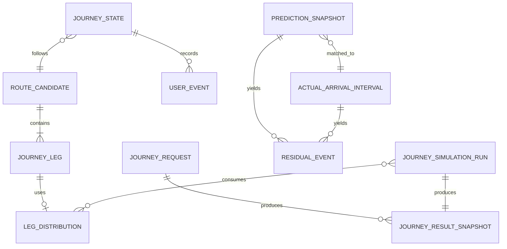

# Canonical Data Contract

## 1. 목적

Provider별 raw field를 그대로 서비스 도메인에 흘리지 않는다.
Raw → Canonical Observation → Derived Event → Distribution → JourneyResult로 분리한다.

## 2. Data Layer

```text
Bronze: immutable raw request/response
Silver: canonical observation + mapping + quality
Gold: actual/residual/travel-time/distribution/evaluation
Serving: Journey/Result snapshot
```

## 3. Canonical Entities

### ENT-016 GeoPoint

```yaml
lat: float
lon: float
label: string|null
coordinate_source: USER_INPUT | ROUTE_PROVIDER | SEOUL_MASTER | TMAP | MANUAL_VERIFIED
coordinate_role: ORIGIN_POINT | BUS_STOP | STATION_CENTER | STATION_EXIT | PLATFORM_REFERENCE | POI
```

`coordinate_role`은 필수다. station center와 exit/platform을 암묵적으로 동일시하지 않는다.

### ENT-017 NodeRef

```yaml
node_namespace: SEOUL_BUS_STOP | SEOUL_SUBWAY_REALTIME | SEOUL_MIXED_ROUTE | TMAP_POI | INTERNAL
provider_node_id: string|null
name: string|null
mode: WALK | BUS | SUBWAY
line_or_route_id: string|null
coordinate: GeoPoint|null
mapping_version: string|null
```

### ENT-018 RouteLeg

```yaml
sequence: int
mode: BUS | SUBWAY
route_or_line_id: string|null
route_or_line_name: string|null
from_node: NodeRef
to_node: NodeRef
provider_metadata: object|null
```

RouteLeg는 structural topology이며 Reliability distribution 자체가 아니다.

### ENT-001 Observation

```yaml
observation_id: string
provider: enum
api_name: string
mode: BUS | SUBWAY | WALK | ROUTE | SUPPORT
entity_type: string
entity_key: string
source_generated_at: datetime|null
requested_at: datetime
received_at: datetime
payload_hash: string
raw_ref: string
collector_version: string
quality_flags: [string]
schema_version: string
```

`source_generated_at`이 null이어도 raw는 보존한다.

### ENT-002 PredictionSnapshot

```yaml
prediction_id: string
mode: BUS | SUBWAY
route_or_line_id: string
vehicle_or_train_id: string|null
target_node_id: string
predicted_arrival_at: datetime|null
eta_seconds: int|null
source_generated_at: datetime
received_at: datetime
observation_id: string
quality_flags: [string]
```

Provider raw field와 canonical mapping은 `41_OBSERVATION_ACTUAL_RESIDUAL.md`.

### ENT-003 ActualArrivalInterval

```yaml
actual_id: string
mode: BUS | SUBWAY
route_or_line_id: string
vehicle_or_train_id: string
node_id: string
lower_exclusive_at: datetime
upper_inclusive_at: datetime
midpoint_at: datetime
interval_width_sec: float
trigger_rule_version: string
source_observation_ids: [string]
quality_flags: [string]
```

### ENT-004 ResidualEvent

```yaml
residual_id: string
prediction_id: string
actual_id: string
lead_time_sec: float|null
residual_lower_sec: float
residual_mid_sec: float
residual_upper_sec: float
context:
  time_bucket: string|null
  weekday_type: string|null
  route_or_line: string
  node_pair: string|null
quality_flags: [string]
```

### ENT-005 RouteCandidate

```yaml
route_candidate_id: string
provider: string
provider_rank: int|null
selection_status: SELECTED | ALTERNATIVE | REJECTED_UNSUPPORTED
selection_reason: PROVIDER_FIRST_SUPPORTED | EVIDENCE_FIXTURE | null
origin: GeoPoint
destination: GeoPoint
legs: [RouteLeg]
provider_time_min: int|null
provider_distance_m: int|null
raw_ref: string
resolved_mapping_version: string|null
support_status: SUPPORTED | PARTIAL | UNSUPPORTED
```

`provider_time_min`은 Reliability Ground Truth가 아니다.

### ENT-006 JourneyLeg

Base:

```yaml
leg_id: string
sequence: int
leg_type: ACCESS_WALK | WAIT | TRANSIT_RIDE | TRANSFER | FINAL_WALK
mode: WALK | BUS | SUBWAY
origin_node: NodeRef
destination_node: NodeRef
planned_start_at: datetime|null
planned_end_at: datetime|null
state: PLANNED | AVAILABLE | IN_PROGRESS | COMPLETED | SKIPPED | MISSED | UNAVAILABLE
```

### ENT-007 TransferLeg

```yaml
transfer_type: BUS_TO_SUBWAY | SUBWAY_TO_BUS | SUBWAY_TO_SUBWAY
from_mode: BUS | SUBWAY
to_mode: BUS | SUBWAY
street_time_source: TMAP | NONE
station_internal_time_source: SEOUL_STATIC | FIXED_FALLBACK | NONE
street_point_time_sec: float|null
station_internal_point_time_sec: float|null
point_time_sec: float|null
uncertainty_model: EMPIRICAL | PARTIAL | UNMODELED
fallback_level: string|null
limitations: [string]
```

### ENT-008 WaitLeg

```yaml
wait_mode: BUS | SUBWAY
boarding_node: NodeRef
candidate_service_id: string|null
wait_source_type: REALTIME_CANDIDATE | TIMETABLE | EMPIRICAL_HEADWAY | FIXED_FALLBACK
distribution_ref: string|null
source_version: string|null
observed_state: string|null
```

### ENT-009 TransitRideLeg

```yaml
transit_mode: BUS | SUBWAY
route_or_line_id: string
from_node: NodeRef
to_node: NodeRef
candidate_service_id: string|null
distribution_ref: string|null
```

### ENT-010 LegDistribution

```yaml
distribution_id: string
leg_id: string
distribution_kind: EMPIRICAL_SAMPLES | QUANTILE_MODEL | DETERMINISTIC_POINT | STATIC_REFERENCE
sample_count: int|null
observation_start_at: datetime|null
observation_end_at: datetime|null
value_semantics: DURATION_SECONDS
quantiles_sec:
  p10: float|null
  p50: float|null
  p90: float|null
samples_ref: string|null
fallback_level: string|null
confidence_label: HIGH | MEDIUM | LOW | INSUFFICIENT
uncertainty_coverage: MODELED | PARTIAL | UNMODELED
rule_version: string
artifact_version: string
validation_scope: UNVALIDATED | COMPONENT_ONLY | CORRIDOR_REPLAY | END_TO_END
```

### ENT-011 JourneyRequest

```yaml
journey_request_id: string
origin: GeoPoint
destination: GeoPoint
target_arrival_at: datetime
target_reliability: float
requested_at: datetime
```

### ENT-012 JourneyState

```yaml
journey_id: string
route_candidate_id: string
active_leg_id: string|null
state: PRE_TRIP_READY | ACTIVE | REFORECASTING | ARRIVED | ABORTED
completed_leg_ids: [string]
user_events: [UserEventRef]
state_version: int
updated_at: datetime
```

### ENT-013 UserEvent

```yaml
event_id: string
journey_id: string
event_type: BUS_SKIPPED | BOARD_CONFIRMED | TRANSFER_MISSED
occurred_at: datetime
target_service_id: string|null
idempotency_key: string
source: USER | SYSTEM_RULE
```

### ENT-014 JourneySimulationRun

```yaml
simulation_run_id: string
journey_id: string|null
route_candidate_id: string
input_state_version: int|null
seed: int
n_requested: int
n_executed: int
engine_version: string
distribution_versions: [string]
route_version: string
wait_source_versions: [string]
started_at: datetime
completed_at: datetime
```

### ENT-015 JourneyResultSnapshot

```yaml
result_id: string
journey_id: string|null
simulation_run_id: string
target_arrival_at: datetime
p50_arrival_at: datetime|null
p90_arrival_at: datetime|null
on_time_probability: float|null
planned_connection_success_probability: float|null
recommended_departure_at: datetime|null
recommended_departure_status: AVAILABLE | INSUFFICIENT_DATA | NOT_COMPUTED
confidence_label: HIGH | MEDIUM | LOW | INSUFFICIENT
validation_scope: UNVALIDATED | COMPONENT_ONLY | CORRIDOR_REPLAY | END_TO_END
model_coverage: FULL | PARTIAL
fallback_summary: [string]
limitations: [string]
calculated_at: datetime
result_version: int
```

## 4. Identity

### Bus

Verified:
- route: `busRouteId` / Position `routeId`
- vehicle: Arrival `vehId1/vehId2` ↔ Position `vehId`

Not yet canonicalized citywide:
- Arrival stop fields vs Position `sectionId/lastStnId`

따라서 stop-level mapping은 검증되지 않은 direct equivalence를 만들지 않는다.

### Subway

Verified/corridor:
- line: `subwayId`
- train: Arrival `btrainNo` ↔ Position `trainNo`
- station: realtime `statnId`

Mixed-route code는 별도 namespace.

## 5. Demo Crosswalk

| Station | Line | Mixed code | Realtime statnId |
|---|---|---|---|
| 안국 | 3 | 03180 | 1003000328 |
| 교대 | 3 | 03300 | 1003000340 |
| 교대 | 2 | 02230 | 1002000223 |
| 역삼 | 2 | 02210 | 1002000221 |

`mapping_scope=CORRIDOR_A`.
citywide table로 오인하지 않는다.

## 6. Timestamp Contract

| Provider/API | Raw time | Canonical meaning |
|---|---|---|
| Bus Arrival | `mkTm` | call-level source time |
| Bus Position | `dataTm` | vehicle-level source time |
| Subway Arrival | `recptnDt` | train-level source time |
| Subway Position | `recptnDt` | train-level source time |
| Collector | — | `requested_at`, `received_at` |

모든 datetime은 timezone-aware Asia/Seoul 또는 UTC 저장 후 명시 변환한다.
naive datetime 금지.

## 7. ERD



## 8. Versioning

다음은 immutable version으로 취급한다.

- raw payload
- ActualArrivalInterval
- ResidualEvent
- DistributionArtifact
- JourneySimulationRun
- JourneyResultSnapshot

재계산은 overwrite가 아니라 새 version을 만든다.
