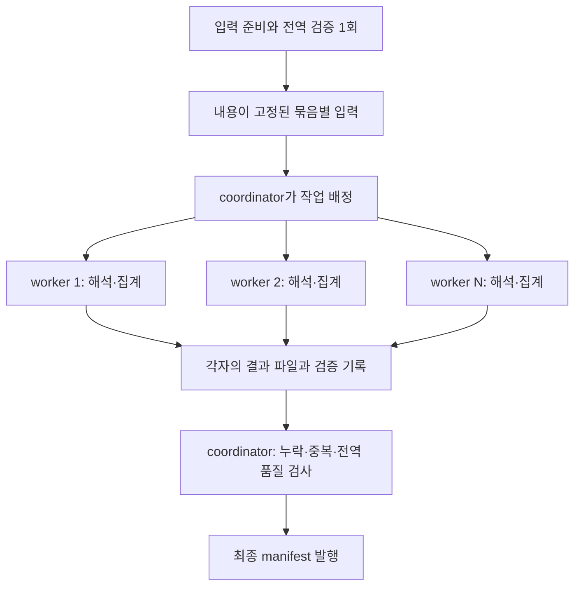

# 25. 대상 패키지별 병렬 계산 구조 계획

## 요청과 현재 상태

2026-09-11 사용자 요청은 **병렬 구조 구현에 앞서 계획을 수립하는 것**이다. 이 문서의 P0~P6는
모두 미실행 계획이다. 이번에 변경하는 것은 계획·문서 연결·작업 일지뿐이며 계산 코드를 수정하지 않는다.

비교 기준은 `1ec693cfe2f77b2757d072a95a0c84abd2702ea2`다. 이 커밋의 실제 CPU/GPU 집계 연결과
32개 target×229개 기준일 검증은 [24 결과](24-cpu-gpu-production-integration.md)에 있다.
기존 전체 회귀 281개(건너뜀 1개), 커밋 직전 CUDA 포함 13개 검사와 측정 코드의 원본 바이트를 보존했다.
전체 99,996개 target의 완료 시간은 아직 모른다. 기존 9시간 단순 환산과 철회한 1~3시간을 목표나 근거로 쓰지 않는다.

## 목표와 보존할 계산 의미

- 선정 목록의 고유 target 이름 99,996개를 대상으로 한다. 참조하는 source는 전체 적격 패키지·버전을 유지한다.
- `(target package_id, version, snapshot)`별 서로 다른 source 패키지·버전 수를 계산한다.
- 일반 `dependencies`만 계산하며 배포일 NULL 제외, 기존 안정 버전·npm 범위·동순위 선택 정책을 유지한다.
- 229개 기준일 전체를 같은 고정 관측 입력에서 재구성한다. 같은 source의 중복 선언은 같은 target count에 중복 반영하지 않는다.
- 미해석 상태·원본 품질 정보를 유지하고 성공 관계만 센 `PARTIAL`, `ready_for_load=false`를 유지한다.
- 저장은 양수 count와 0을 복원할 target 모집단을 유지한다. H6의 DB 키 연결·0 보완, H7의 실제 DB 적재는 별도다.

근거: [선정 정책과 입력 연결](../../../pipeline/version_dependents/historical_production_input.py),
[집계 정책](../../../pipeline/version_dependents/historical_production_events.py),
[공통 metric 정의](../../../pipeline/version_dependents/historical_artifact.py), [작업 범위](01-scope.md).

## 확인된 현재 구조

| 확인 사항 | 현재 코드 근거 | 계획에 미치는 영향 |
| --- | --- | --- |
| 입력 준비 시 기본 128개 논리 파티션을 정하지만 각 테이블은 공통 Parquet 하나로 저장한다 | `historical_production_input.py:198,247,311` | 작업자별 읽기를 물리 파일로 분리해야 반복 읽기와 디스크 경쟁을 줄일 수 있다 |
| 하나의 run 잠금을 잡고 파티션을 순서대로 계산한다 | `historical_production.py:360,405` | 기존 run을 여러 번 동시에 실행하지 않고 coordinator 내부에 worker pool을 둔다 |
| 각 파티션은 이미 별도 working.duckdb·attempt·receipt를 갖는다 | `historical_production.py:410,435` | 계산 단위를 재사용하고 완료 발행 권한을 정리한다 |
| 같은 파티션에서도 패키지마다 공통 후보·요구조건 view를 조회한다 | `historical_production_resolver.py:125,134` | 해당 묶음을 한 번 열고 이름순으로 순차 처리한다 |
| 전역 입력 검사 뒤에도 파티션 검사에서 전체 후보를 검사한다 | `historical_production_events.py:253`, `historical_production_sql.py:112,119` | 전역 입력 검사와 새 결과 검사를 분리한다 |
| 모든 파티션 뒤에 source 품질 병합과 날짜별 파일 생성을 수행한다 | `historical_production.py:450`, `historical_production_quality.py:166`, `historical_production_writer.py:109` | count 저장은 분할할 수 있지만 source 품질은 전역 합성이 필요하다 |
| 한 batch의 정규화→숫자 계산→구간 변환→삽입이 순차다 | `historical_production_resolver.py:145` | GPU 담당 프로세스와 CPU 준비·정리의 작업을 겹칠 수 있다 |

위 코드는 모두 [현재 production 모듈](../../../pipeline/version_dependents/historical_production.py),
[입력 모듈](../../../pipeline/version_dependents/historical_production_input.py),
[resolver](../../../pipeline/version_dependents/historical_production_resolver.py),
[SQL 검증](../../../pipeline/version_dependents/historical_production_sql.py),
[품질 병합](../../../pipeline/version_dependents/historical_production_quality.py),
[writer](../../../pipeline/version_dependents/historical_production_writer.py)에서 확인했다.

## 설계 선택

**대상 패키지 경계를 지키는 작업 묶음 + 독립 프로세스 + 단일 완료 발행자**를 선택한다.
한 패키지의 모든 후보·요구조건·source 선언·229개 날짜는 같은 작업 묶음에 속한다.
작업 묶음 개수와 동시에 실행하는 worker 개수는 별개다. worker는 장기간 살아 있으면서 완료 후 다음 묶음을 받는다.
첫 구현은 기존 기본값인 SHA 기반 128개 논리 파티션을 작업 묶음으로 사용한다.
membership과 파일 구조를 동시에 바꾸지 않고, 가장 오래 걸리는 묶음이 확인되면 별도 새 입력 plan에서만 재분배한다.

| 대안 | 판단 |
| --- | --- |
| 기존 실행기에 프로세스만 추가 | 공통 파일 반복 읽기·전역 검사·잠금 문제가 남는다. 비교용 최소 변경은 가능하지만 최종 구조로 선택하지 않는다 |
| 묶음별 입출력 + CPU worker pool | 기존 계산 함수를 재사용하고 병렬도·메모리·재개를 제어할 수 있어 우선 구현한다 |
| GPU·입력·출력·분산 실행을 한 번에 변경 | 성능·정확성 회귀 원인을 구분하기 어려워 단계별로 나눈다 |
| Spark 전체 재작성 | 현재 계획의 필수 조건이 아니다. 새 런타임·분산 전송·SemVer worker 통합을 추가하기 전에 기존 엔진의 묶음 병렬 성능을 측정한다 |

## P0. 기준 결과와 새 실행 계약 고정

1. 코드 변경 전에 기준 커밋의 검증기로 `data/vd-i32`의 입력·CPU/GPU 결과·생성 계약을 다시 확인한다.
   실제 비교 표본·입력 SHA·환경·출력 목록을 고정하고 기존 파일을 새 생성 코드로 다시 서명하지 않는다.
2. 새 병렬 실행기는 별도 진입점과 새 manifest format을 사용한다. 기존 순차 CLI와 기본 backend는 유지한다.
   기존 입력을 변환할 경우 원래 검증기로 검증한 변환 이력을 남긴다. 새 준비 입력을 만들 경우 원본 H1·profile·선정 목록을 다시 연결한다.
3. 작업 의미를 고정하는 plan에는 입력·선정·calendar·정책·코드·backend·수치 설정과 묶음 소유권을 기록한다.
   worker 수·호스트 경로·실행 순서는 별도의 실행 기록에 둔다. 2→4 worker 재개가 같은 계산을 이어갈 수 있어야 한다.

변경 예정: 새 `historical_parallel.py`의 plan/manifest 계약, 기존 비교 도구의 재사용 함수.
완료 기준: 기준 결과 보호 목록 확보, 같은 논리 작업의 순서 변경 허용, 다른 입력·코드·backend 혼합 거부 테스트 통과.

## P1. 묶음별 입력과 전역 검사 분리

1. 기존 H1/profile/raw 연결·선정 의미를 재사용한다. 입력 준비를 패키지마다 다시 실행하지 않는다.
   전역 검증된 준비 테이블에서 묶음 파일을 직접 만든다. 전체 공통 Parquet를 쓰고 다시 읽어 분할하는 중간 단계를 기본 경로에 추가하지 않는다.
2. 첫 구현은 기존 SHA 기반 128개 partition_id와 패키지 membership을 보존한다.
   V(후보)·Q(요구조건)·D(source 선언)와 파일 크기는 무거운 묶음을 먼저 배정하는 참고값으로 쓴다.
   V×Q를 실제 처리 시간으로 간주하지 않는다. 극단 3개는 별도 진단 표본으로 측정하되 첫 입력 재분배의 선행 조건으로 삼지 않는다.
3. 묶음 membership을 manifest에 저장해 입력 준비 후 바꾸지 않는다. 동적 스케줄링은 이 고정 묶음의 배정 순서만 바꾼다.
4. `target_names`, `target_population`, `lookups`, `declarations`를 묶음별로 저장한다.
   패키지 조회용 자료는 이름별 정렬 스트리밍으로 읽고, 집계용 선언은 기존 source 식별자·lookup ID를 보존한다.
5. 전체 identity·관계·후보 검사는 준비 시 수행하고 검증 영수증을 입력 SHA에 연결한다.
   worker는 담당 파일의 SHA·schema·소유권과 새 해석 결과를 검사한다. 재개 시에도 이 검사를 생략하지 않는다.

첫 format의 물리 계약은 `partition_id 1개 = 작업 1개 = 입력 디렉터리 1개`로 고정한다.
`input/partition=NNN/{target_names,target_population,lookups,declarations}.parquet`의 네 파일을 사용하며
행의 partition_id는 바꾸지 않는다. 여러 partition을 같은 물리 파일에 합치는 기능은 첫 구현에 넣지 않는다.
128개 slot 중 선정 이름이 없는 slot은 manifest에 EMPTY로 명시하고 계산하지 않는다. 이름이 있으나 후보/선언이 없는
partition은 해당 테이블의 빈 schema 파일을 포함한다. 기대되는 slot을 아무 기록 없이 누락한 것은 오류다.
전체 `(package_id,version)`·`lookup_id` 유일성, 원본 선언 키 유일성, source birth/error flag의 cross-partition
일관성은 준비 단계에서 전역 검사한다. 원본 네 관계와 모든 shard의 `UNION ALL`을 양방향 대조한다.

기준 표본 비교에는 원래 검증기로 확인한 `data/vd-i32/input`을 새 디렉터리로 변환하는 경로를 둔다.
이 변환은 원본 manifest SHA를 이력에 남기고 원본 파일을 수정하지 않는다. 새 전체 입력의 기본 생성은 앞서 정한
준비 테이블→shard 직접 저장 경로다. 표본 변환 비용과 전체 입력 신규 준비 비용을 구분한다.

변경 예정: 새 `historical_parallel_input.py`, 입력 준비 함수의 최소 재사용 경계, 전역/파티션 검증 함수.
완료 기준: 기존 입력 4개 관계와 새 묶음 파일 전체의 양방향 `EXCEPT ALL` 차이 0;
선정 이름·후보·lookup·선언의 누락/중복 0; 다른 묶음 파일을 읽지 않는 I/O 계측 확인; 변조 거부.

## P2. CPU 작업자 병렬화와 중단 후 재개

1. 기존 루프의 파티션 한 회분을 독립 함수로 분리하고 worker 1개에서 기존 결과와 먼저 대조한다.
   이 단계가 통과한 뒤 병렬도를 높인다. coordinator만 run 전체 잠금과 최종 완료 표식을 소유한다.
   각 worker는 자기 attempt의 DuckDB·Node·출력·임시 폴더만 사용한다.
2. Windows `spawn` 방식으로 프로세스를 시작한다. DB connection, Node pipe, CUDA context를 프로세스 사이에 공유하지 않는다.
3. 무거운 묶음을 먼저 배정하고 먼저 끝난 worker가 다음 묶음을 받는다. 초기 동시성은 2개, 검증 후 4개와 비교한다.
4. P2에서는 개선 CPU backend와 기존 전역 병합·날짜 writer를 사용해 계산 병렬화 효과만 분리한다.
   npm은 작은 정답 비교 경로로 보존하고, GPU는 P4 전까지 기존 순차 비교 경로로 유지한다.
5. worker는 파일을 닫은 뒤 receipt 후보를 반환한다. coordinator가 task/attempt 식별자, 파일 지문과 소유권을 확인한 뒤에만 완료를 발행한다.
   같은 묶음이 재계산될 수는 있어도 최종 결과에는 한 번만 채택한다. 충돌하는 두 결과는 덮어쓰지 않고 오류로 남긴다.
6. worker 실패 시 다른 완료 결과는 보존한다. 일시적 worker 종료는 새 attempt로 제한된 재시도 1회,
   입력 변조·코드/정책 불일치·잘못된 계산은 재시도 없이 실패한다. 실패·취소 상태에서 최종 COMPLETE는 발행하지 않는다.
7. coordinator 강제 종료 시 자식이 남아 계속 계산하지 않도록 Windows Job Object 등 프로세스 트리 종료 경계를 구현·검증한다.
   재개 시 새 실행 식별자를 부여하고 과거 attempt의 늦은 응답을 채택하지 않는다. 기존 `_run_lock`을 제거하지 않는다.

**작업 상태와 복구 계약:** task_id는 고정 partition_id이고, attempt_id는 실행 시도마다 다르다.
coordinator는 task_id·attempt_id·input_sha256·plan_sha256·실행 epoch·state를 상태 기록에 남긴다.
상태는 `PENDING → RUNNING → CANDIDATE → ACCEPTED`이며 실패는 `FAILED`, 채택되지 않은 과거 시도는 `ORPHANED`다.
worker는 파일을 닫은 후 불변 candidate receipt만 쓰고, coordinator가 불변 `complete.json`을 발행한다.
상태 기록은 진단용이며 **검증된 complete 포인터가 채택 여부의 정본**이다. 포인터 발행 직후 상태 기록 전에 종료돼도
재시작은 해당 task를 완료로 복원한다. 상태에 ACCEPTED만 있고 유효한 포인터가 없으면 완료로 취급하지 않는다.

재개 시 이전 자식이 종료됐음을 확인한 후 다음 순서로 복구한다.

1. 유효한 complete 포인터의 모든 파일을 검증해 재사용한다. 해당 task는 2→4 worker 재개에서도 다시 계산하지 않는다.
2. 포인터가 없는 task의 candidate receipt를 읽고 같은 plan/input/소유권, 닫힌 파일 SHA·schema·행을 검증한다.
   정상 candidate가 하나이면 coordinator가 채택할 수 있다. 여러 개이면 파티션 의미 행을 대조해 같을 때만
   attempt_id 사전순 첫 결과를 채택하고 나머지를 ORPHANED로 기록한다. 서로 다르면 실패하고 결과를 보존한다.
3. receipt가 없거나 잘린 attempt는 ORPHANED로 기록하고 새 attempt로 다시 계산한다. 명시적인 SHA 변조나
   다른 plan 결과 혼입은 재계산으로 숨기지 않고 오류로 처리한다. ORPHANED 파일은 자동 삭제하지 않으며 최종 reader는 읽지 않는다.
4. 위 복구 이후 새 epoch의 배정만 받는다. 이전 epoch 또는 이미 채택된 task에 대한 늦은 응답은 진단 이벤트로 기록하고 버린다.
   같은 현재 task의 충돌하는 정상 응답은 오류로 처리한다. 기존 complete 포인터를 교체하지 않는다.

**단일 worker 선행 비교:** 동일한 `data/vd-i32/input`의 논리 행·128개 membership·개선 CPU 설정으로
기준 `1ec693c` 순차 실행과 새 worker 1개 실행을 비교한다. 입력 네 관계, partition의 lookup/count 구간·source summary·
status delta 네 관계, cache의 target/count/quality 세 관계, daily count/quality 두 관계의 **기존 13개 의미 그룹**을
양방향 대조한다. 실행 ID·경로·새 format 이력은 각자의 검증기로 따로 확인한다. 원본 SHA를 새 코드로 바꾸지 않는다.
이 비교를 통과한 뒤에만 worker 2/4 검증을 시작한다.

변경 예정: 새 `historical_parallel.py`, `historical_parallel_worker.py`, 병렬/재개 테스트.
완료 기준: worker 1/2/4의 count·lookup 구간·source 품질 동일; worker/Node/coordinator 강제 종료 후 재개 시 완료 결과 지문 불변;
중복 작업 배정·지연 응답·동시 coordinator 실행·잘린 파일 거부; 부모 종료 후 해당 자식 프로세스 잔존 0.
candidate receipt 기록 직후 종료, complete 포인터 발행 직후 종료, 같은 task의 두 attempt 동시 완료도 별도로 검사한다.

**첫 구현 묶음은 P0~P2까지로 잡는다.** 작은 실제 데이터의 정확성과 병렬 효과를 보고할 수 있는 첫 체크포인트다.
P3 이후는 이 결과를 바탕으로 진행하는 후속 단계이며, P0~P2 완료를 전체 병렬 전처리 완료로 표현하지 않는다.

## P3. 날짜×묶음별 count 저장

1. 계산이 끝난 묶음의 count 구간으로 `snapshot=<날짜>/part=<묶음>` 파일을 생성한다.
   기존 날짜별 컬럼과 BIGINT count 의미를 유지한다. 같은 target은 한 묶음만 소유하므로 count 전체를 전역 정렬·재직렬화하지 않는다.
2. 작은 패키지마다 229개 파일을 만들지 않는다. P1의 묶음을 출력 단위로 사용하고 빈 결과는 receipt로 표현한다.
   파일 개수·평균 크기·저장 시간을 측정해 묶음 크기를 조정하되, 이미 준비된 run의 membership은 변경하지 않는다.
3. 날짜 파일 목록을 manifest에서 명시적으로 읽는 reader와 독립 검증기를 추가한다. glob에 우연히 잡힌 미완료·과거 attempt 파일은 무시한다.
   target 모집단의 birth_index로 0을 복원하고, 작은 fixture에서 0 포함 키/값까지 기존 결과와 대조한다.
   독립 검증기는 고정된 count 구간에서 날짜별 기대 행을 다시 만들고 실제 shard 행과 대조한다.
   SHA·행 수·합계 일치만으로 실제 버전별 count 검사를 대체하지 않는다.
4. source summary는 source identity 기준으로 전역 병합한다. source 수를 파티션별 수의 단순 합으로 대체하지 않는다.
   날짜별 품질·입력 이력은 전역 자료로 한 번 발행하고 count shard와 연결한다.
5. 모든 count shard·전역 품질·229일 coverage가 검증된 뒤 최종 manifest를 발행한다.
   검증 완료와 `PARTIAL`/DB 적재 가능 상태를 구분한다. 실제 DB writer 수정·적재는 H6/H7에 남긴다.

변경 예정: 새 `historical_parallel_writer.py`, `historical_parallel_verify.py`, 기존 quality 집계의 재사용 경계.
완료 기준: 기존 날짜별 결과와 새 dataset의 양방향 값 대조 차이 0;
중복 target·누락 날짜·누락 shard·조작된 완료 목록·count/quality 불일치 탐지; sparse 및 0 복원 동일.

## P4. CPU 준비·GPU 계산·CPU 집계 겹치기

1. 여러 CPU worker가 Node 정규화와 결과 정리·집계를 맡고, GPU 프로세스 하나가 제한된 요청 큐를 소비한다.
   대기 요청은 task/attempt/batch ID로 식별하고 순서가 바뀌어도 자기 작업에만 반환한다.
2. 후보 정렬·rank/birth 자료는 package 단위로 재사용하고 요청마다 재전송하지 않도록 begin/batch/end 경계를 둔다.
   검증된 수치 배열을 전달한다. 전체 source 선언이나 수백 MB의 결과를 큐에 한 번에 넣지 않는다.
3. 큐 길이와 CPU 전송 바이트, GPU 후보 cache/workspace에 상한을 둔다. 느린 집계가 결과를 받지 못하면 앞 단계도 기다리게 한다.
   작은 작업의 CPU/GPU 자동 라우팅은 이번에 넣지 않는다. GPU 요청 실패를 CPU 성공으로 바꾸지 않는다.
4. GPU 프로세스 장애는 진행 중 GPU 요청을 실패시킨다. 미완료 attempt만 재개하고 과거 응답은 버린다.
   기존 VRAM guard·range framing·runtime/정책 검증을 보존하며 queue/serialization 비용도 계측한다.

변경 예정: 새 GPU 요청 조정 모듈, `historical_production_resolver.py`, `historical_gpu.py`, `historical_gpu_normalize.cjs`의 필요한 경계.
완료 기준: CPU/GPU의 모든 batch·lookup 구간·최종 count/quality 동일;
응답 순서 변경·GPU 종료·큐 포화·과거 attempt 응답 테스트 통과; 종료 후 GPU/Node 자식과 임시 공유 자원 잔존 0.
겹쳐 실행한 전체 시간에 이득이 없으면 기존 GPU 순차 경로를 유지하고 실험 결과를 보고한다.

## P5. 실측과 전체 시간 추정

### 측정 순서

1. **회귀 표본:** 기존 32개×229일, 모든 요구조건·source를 사용한다. P2/P3/P4마다 같은 입력·결과 범위를 비교한다.
2. **대표성 보강:** 고정 seed로 작은·중간·큰 패키지 표본을 정하고 조건 없음/후보 없음/미매핑도 포함한다.
   극단 3개는 모든 후보·모든 요구조건으로 별도 측정한다. 검증 표본에서 요구조건을 잘라 전체 package 처리 시간으로 환산하지 않는다.
3. **확장 측정:** 로컬 코드 검증 이후 전체 선정 입력 준비 1회가 필요한 단계다. 출력·디스크 예산을 확인하고 별도 실행 범위로 보고한다.
   이 입력에서 대표 묶음을 골라 측정한다. 작은 표본용 입력 파일의 속도로 큰 입력 준비·읽기 시간을 대신 추측하지 않는다.
4. **병렬도 비교:** CPU worker 1/2/4, 이후 GPU owner 1개+CPU worker 1/2/4를 비교한다.
   CPU 총 thread 예산·메모리·준비 입력·출력 방식을 통제한다. backend별 순서 영향이 한쪽에 몰리지 않게 실행 순서를 교대한다.
5. **검증과 반복:** 최초 결과는 전수 의미 대조한다. 성능 비교는 가능한 작은 대표 작업으로 구성별 3회 중간값·범위를 기록하고,
   큰 단계의 1회 관측은 반복 통계와 구분한다. 배경 부하·전원 모드·cache 조건도 기록한다.
6. **묶음 불균형:** 일부 묶음만 오래 남으면 작은 패키지 합치기·큰 패키지 분리를 새 input plan에서 평가한다.
   극단 3개를 독립 묶음으로 두는 것은 이 단계의 후보다. 재분배한 경우 기존 파티션 ID까지 같은 입력이라고 주장하지 않고,
   소유권 컬럼을 별도 검증한 뒤 계산 대상의 논리 행이 동일한지 대조한다.

기존 [표본 구성](20-daily-verification-throughput.md)의 전체 V=7,822,819, Q=4,220,751,
D=239,556,025는 workload 구성 근거다. 극단 3개의 V×Q 51.52%는 실행 시간 비율이 아니다.

### 반드시 보고할 값

- wall time: 전역 입력 검증/준비/분할, 묶음 읽기, Node 정규화, CPU/GPU 수치 계산, 큐 대기·전송, 집계,
  묶음 저장, 전역 품질, 별도 검증. 병렬 작업별 초를 합한 값과 실제 완료까지 초를 구분한다.
- 작업자별 CPU 사용·RSS, 전체 프로세스 트리 RSS, GPU allocated/reserved, 임시 디스크와 실제 읽기/쓰기 바이트,
  결과 행 수·파일 수, 가장 오래 걸린 묶음. 샘플링 자원값은 순간 최고값을 놓칠 수 있다고 표시한다.
- 전체 시간 모델: 준비 1회 + 실제 작업 배분으로 예측한 마지막 묶음 완료 시간 + 전역 품질·최종 검증 + 필요 시 서버 전송.
  P3/P4의 중첩 구간은 두 번 더하지 않는다. 별도 holdout 묶음으로 예측 오차를 점검한다.
- 계산 시간만의 추정과 H6/H7까지의 DB 직전 전처리 시간을 구분한다. H6 미측정 시간을 0으로 처리하지 않는다.

**성능 채택 기준:** 정확성/재개 검사 전부 통과가 우선이다. 자원 예산 안에서 대표 작업의 반복 중간값이 직렬보다
최소 10% 줄어드는 구성을 우선 채택하는 제안 기준으로 둔다. 차이가 실행 변동 범위 안이면 개선 확정으로 쓰지 않는다.
통과하지 못하면 병렬 수를 낮추거나 해당 최적화를 선택형으로 남긴다. 전체 99,996개 계산을 이 기준 검증에 자동 포함하지 않는다.

## P6. EC2 두 대 실행으로 확장하는 경계

현재 제공받은 조건은 각 서버 4 vCPU·15GiB RAM·swap 없음이다. 서버 live 상태는 이번에 조회하지 않았다.
첫 구성은 서버당 CPU worker 1개로 시작하고 Node/DB를 합친 CPU·메모리 사용을 확인한 뒤 조정한다.

- 같은 manifest의 서로 겹치지 않는 묶음 집합을 배정하고 담당 입력만 로컬 디스크로 복사한다.
- 파일은 내용 SHA와 상대 경로로 식별한다. Linux/Windows의 절대 경로·worker 수는 실행 이력에 분리한다.
- 서버들은 자기 출력만 기록한다. 완료 receipt·파일을 모은 coordinator가 전체 누락·중복·품질을 검사하고 최종 발행한다.
- 서로 다른 CPU/GPU/라이브러리 결과를 한 run에 혼합하지 않는다. 같은 backend 계약을 맞춘다.
- 먼저 로컬 두 작업 디렉터리로 할당·수집·누락 거부를 검증한다. 실제 EC2 접속·전송·실행은 별도 서버 단계다.

## 자원과 장애 제한

전체 실행에 1시간 같은 경과 시간 종료 제한을 두지 않는다. 기존 Node 요청별 오류 검출 제한과
메모리·디스크 보호는 전체 작업 시간 제한과 구분하고, 큰 패키지는 요청/메모리 예산에 맞게 batch를 나눈다.
정상 계산이 오래 걸린다는 이유만으로 중단하지 않는다.

노트북은 최초 2 worker부터 시작하고 총 CPU·RAM·임시 디스크 예산을 시작 전에 기록한다.
`worker 수 × worker 메모리 + Node/GPU/검증/OS 여유`를 고려한다. DuckDB memory_limit만으로
전체 Python/Node/CUDA 메모리가 제한된다고 가정하지 않는다. 디스크 여유 감소 시 새 작업 배정을 멈추고 완료 결과를 보존한다.
한 디스크가 포화되면 reader/writer 동시성을 낮춘다. 워커마다 전체 스레드 수를 부여하지 않는다.

다음 값은 기존 표본 측정 설정을 바탕으로 한 **로컬 첫 비교의 제안값**이며 최적값 실측이 아니다.
시작 전 가용 자원이 부족하면 실행하지 않고 구성과 부족한 자원을 기록한다.

| 항목 | 첫 비교 설정 |
| --- | --- |
| DuckDB 총 thread 예산 | 4개: worker 1/2/4에 각각 4/2/1개. Node·Python CPU 사용도 별도 계측 |
| DuckDB 총 memory_limit | 4GB: worker 1/2/4에 각각 4GB/2GB/1GB. 준비·전역 품질 단계는 따로 실행 |
| 전체 프로세스 RSS 관측 제한 | 12GiB. 초과 시 새 작업 배정을 중단하고 supervisor가 원인·중단 범위를 기록 |
| 임시 디스크 / 여유 디스크 | 합계 scratch 64GiB 관측 제한 / 여유 20GiB 이상. 임시 DB 크기도 별도 집계 |
| GPU owner / 작업 공간 | 1개 / batch workspace 128MiB, 기존 GPU 6GiB 할당 guard 보존 |
| GPU 요청 대기량 | 초기 최대 2×worker 수와 직렬화 payload 합계 256MiB를 함께 제한. 대기·전송·반환 데이터의 실제 RSS도 계측 |

OS가 먼저 OOM을 일으키지 않도록 관측 한도만 믿지 않고 worker별 예산과 유한 queue를 함께 사용한다.
4 worker가 메모리 부족·spill로 불리하면 이를 측정 결과로 남기고 2 worker를 선택할 수 있다.

장기 계산은 독립 supervisor가 상태·오류·측정값을 파일에 남긴다. Windows background 실행은 숨김 창으로 시작한다.
계산이 자율 진행 가능한 단계에서는 채팅의 반복 확인을 중단한다. 사용자 요청 시 한 번 확인하고, 절전·재부팅을 통과해
계산이 계속된다고 보장하지 않는다. 중단되면 마지막 검증된 묶음 이후부터 재개한다.

## 검증 체크리스트와 단계별 커밋

| 구분 | 완료 기준 |
| --- | --- |
| 의미 | 기준과 양방향 행 대조 차이 0, source distinct·PARTIAL·NULL 제외·229일 경계 유지 |
| 재개 | worker/coordinator/GPU 종료, 완료 직전 종료 후 재개 성공; 완료 파일 지문 불변 |
| 잘못된 입력/출력 | task 중복·누락·다른 input/코드·manifest 변조·경계 밖 날짜·source flag 불일치 모두 거부 |
| 자원 | 예산 초과가 완료로 기록되지 않음; 큐가 무제한 증가하지 않음; 작업 수가 worker 상한 이내 |
| 성능 | 같은 데이터·계산 범위로 단계별 실측과 출력량 제시; 병렬 배수나 10만개 ETA를 패키지 수만으로 단정하지 않음 |
| 보호 | 기존 순차 CLI와 실제 기준 파일 유지; 7번 worktree·Jira·DB·원격 저장소 미변경 |

구현 시 P1 입력 분할, P2 CPU 병렬/복구, P3 출력 분할, P4 GPU 겹치기, P5 측정 결과를 각각 검증 가능한 변경으로 나눈다.
커밋은 사용자 요청 범위에 따라 수행하며 이번 계획 작성에서는 하지 않는다. 첫 구현 때 독립 가능한 입력/검증 모듈과
worker 실행/장애 테스트를 나눠 맡기고, 공통 계약과 최종 비교는 한 담당자가 통합한다. 현재는 구현 에이전트를 실행하지 않았다.

## 근거와 남은 확인 사항

- [DuckDB 병렬도·과도한 thread 주의](https://duckdb.org/docs/current/guides/performance/how_to_tune_workloads#parallelism-multi-core-processing): SQL 내부 병렬과 외부 worker 수를 함께 제어하는 근거.
- [DuckDB 동시성](https://duckdb.org/docs/current/connect/concurrency): 현재 사용 방식에서는 프로세스별 writable DB를 분리한다.
- [Python multiprocessing](https://docs.python.org/3/library/multiprocessing.html#contexts-and-start-methods): Windows spawn과 프로세스 자원 소유권의 구현 근거. 실제 구현은 설치 Python 버전도 확인한다.

미확인: 전체 입력 준비의 실제 시간·용량, 전체 양수 출력 행 수, worker 2/4 실제 개선율, 큐 최적 크기,
극단 3개 전체 처리 시간, 두 EC2 간 전송·동시 처리량. P5/P6 실측 전에는 완료 시간·배속을 확정하지 않는다.

## 계획 검토 기록

독립 설계 검토를 반영해 첫 단계의 128개 membership 보존과 단일 worker 선행 비교를 명시했다.
독립 계획 검토에서 지적한 물리 shard 계약·coordinator 상태 복구·중복 attempt·13개 의미 그룹 비교 기준을
보완했고 재검토에서 진행 가능한 계획으로 판단받았다. 문서의 로컬 연결과 기준 코드 SHA를 확인했으며,
계산 코드·기존 측정 결과는 변경하지 않았다. 구현·성능 검증 결과는 후속 단계에서 기록한다.
