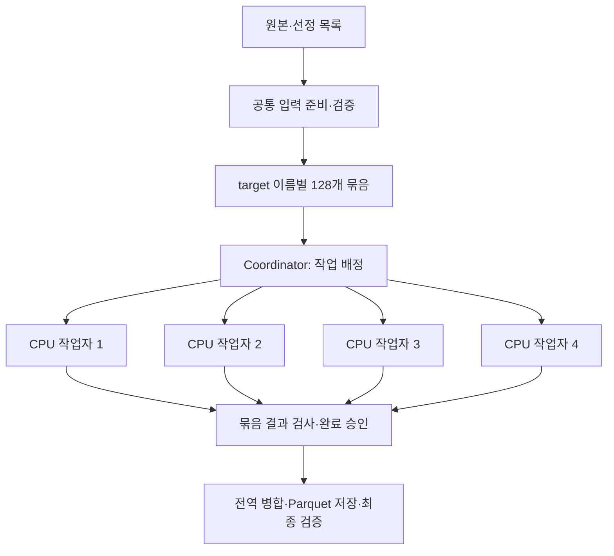

# CPU 병렬처리: 계산을 나눈 뒤 입력·저장·검증의 병목까지 줄이기

## 문제와 처음 가정

버전 해석과 집계 알고리즘을 개선한 뒤에도 여러 패키지를 순차 처리하는 시간이 남았다.
서로 다른 target 패키지는 독립적으로 계산할 수 있으므로, CPU 작업자를 늘리면 전체 전처리도 빨라질 것으로 보았다.
실제로 계산·저장은 빨라졌지만 입력 분할과 검증 비용이 늘어나, 첫 병렬 구현의 전체 시간이 이전 단일 실행 관측보다 길었다.
이 사례는 작업 분할뿐 아니라 입력 준비·저장·검증·재개까지 함께 바꾼 과정이다.

## 분할 기준: 같은 target의 참조는 같은 작업에 모으기

count는 각 target 버전을 참조하는 서로 다른 source 패키지·버전 쌍의 수다.
같은 source 버전의 중복 선언이 서로 다른 작업에 흩어진 채 부분 count를 더하면 중복 집계할 수 있다.
따라서 target 이름의 해시로 **128개 논리 묶음**을 정하고 같은 target을 참조하는 선언을 같은 묶음에 배치했다.
저장 target은 선정 목록으로 제한하되, 이를 참조하는 source는 전체 적격 패키지·버전을 유지했다.

128개 묶음이 곧 128개 프로세스라는 뜻은 아니다. 실행을 조정하는 coordinator가
사용 가능한 CPU 작업자에게 묶음을 배정한다. 작업자는 한 묶음을 마치면 다음 묶음을 맡는다.
실제 32개 패키지 표본에서는 128개 중 데이터가 있는 묶음이 27개였다.

각 묶음의 입력은 `target_names`, `target_population`, `lookups`, `declarations` 네 Parquet다.
후속 개선에서는 입력을 만들 때 전역 내용과 소유권을 한 번 검증하고, 작업자는 자기 파일의 경로·해시를 확인했다.
별도 최종 검증은 유지했다. 원본 준비를 패키지마다 다시 실행하는 구조로 만들지 않았다.
같은 입력을 다른 실행에서 재사용할 때에도 생성 계약·파일 지문 확인은 필요하다.
[분할·실행 구조](../26-parallel-input-cpu-execution.md) · [입력 검사 개선](../27-input-verification-storage-optimization.md)

## 첫 측정: 작업자 수를 늘려도 전체가 비례해서 줄지 않았다

같은 32개 target·229일, 전체 source 선언 10,118,750개를 사용했다.
DuckDB의 **전체 예산 4 threads·메모리 4GB·spill 40GB**를 작업자 수로 나눴다.
각 구성은 1→2→4 순서로 한 번씩 측정했다. 입력 준비 104.246초는 한 번 수행한 공통 비용이다.

| 구성 | 계산·저장 | 별도 결과 검증 | 공통 준비를 더한 전체 |
| --- | ---: | ---: | ---: |
| 작업자 1개 | 99.125초 | 31.574초 | 234.946초 |
| 작업자 2개 | 75.285초 | 32.393초 | 211.925초 |
| 작업자 4개 | 63.605초 | 30.954초 | 198.805초 |

1→4개에서 계산·저장은 **35.8%**, 준비·검증을 포함한 전체는 **15.4%** 줄었다.
4배 빨라진 것이 아니다. 전역 병합, 날짜 파일 저장과 최종 입력 확인, 독립 검증은 그대로 남았다.
작업자별 수행 시간은 동시에 겹치므로 그 합계를 실제 경과 시간으로 해석하지 않았다.
[측정·정확성 원문](../evidence/parallel-cpu-results.json)

더 중요한 문제는 새 4개 작업자의 전체 198.805초가 **이전에 관측한 개선 CPU 경로 156.135초**보다 길었다는 점이다.
이전 수치를 같은 실험에서 다시 측정한 것은 아니므로 엄밀한 동일 조건 비교로 표현하지 않았다.
다만 물리 입력 분할과 강화된 검증 비용까지 포함하면 병렬화만으로 개선을 선언할 수 없다는 판단 근거가 됐다.
당시에는 새 병렬 경로를 선택형으로 두고 입력·저장 비용을 추가로 측정했다.

작업자 4개는 위 자원 예산에서 비교한 구성 중 가장 빨랐던 선택이다.
4개를 넘으면 항상 느리다거나, 현재 노트북·EC2의 최적 개수가 4개라고 검증한 것은 아니다.

## 다음 개선: 반복 스캔과 작은 파일을 줄이기

후속 P3에서는 작업자를 더 늘리는 대신 다음 부분을 바꿨다.

1. 입력 테이블마다 한 번의 분할 저장으로 묶음을 만들고 빈 묶음은 manifest에만 기록했다.
2. 같은 연결에서 파일 메타데이터를 검사하고 중복 검사를 합쳤다. 내용·소유권·변조 검사는 유지했다.
3. 날짜별로 count·quality·lineage 파일을 반복 생성하던 방식에서, **묶음별 여러 날짜의 count**를 한 파일에 저장하도록 바꿨다.
4. 날짜 품질은 한 Parquet에 모으고 입력·생성 이력은 실행 계획에 보존했다. 저장기와 독립 검증기는 다른 날짜 확장 SQL로 값을 대조했다.

32개 표본의 입력 Parquet는 **512개→108개**, 결과 Parquet는 **687개→26개**로 줄었다.
128개 중 비어 있지 않은 입력 27묶음만 네 파일씩 만들었다.
출력은 양수 count가 있는 25묶음과 품질 파일 하나였으며, 나머지 두 묶음의 완료 기록도 남겼다.
파일이 없다는 이유만으로 미계산을 0으로 바꾸지 않았다.

아래 비교는 **직전 병렬 구조와 개선된 병렬 구조**의 비교다. 이전 단일 실행이나 GPU가 대조군이 아니다.
두 구성 모두 CPU 작업자 4개·DuckDB 4 threads·메모리 4GB였다.
준비는 각각 한 번 측정했고 계산·저장·검증은 순서를 교대해 3회 측정한 중간값이다.

| 단계 | 직전 병렬 구조 | 입력·저장 개선 후 |
| --- | ---: | ---: |
| 공통 입력 준비 1회 | 92.899초 | 72.205초 |
| 계산·저장 | 60.078초 | 30.631초 |
| 별도 최종 검증 | 30.867초 | 13.313초 |
| 준비를 포함한 합산 중간값 | **183.844초** | **116.149초** |

합산 시간은 **36.8% 감소**했다. 준비 한 번의 시간을 반복 결과에 더한 값이며, 준비까지 매번 3회 다시 실행한 측정은 아니다.
개발용 결과 대조 쿼리는 합계에서 제외했고 독립 파일 검증은 포함했다.
앞선 표의 준비 104.246초와 이번 대조군의 92.899초도 서로 다른 실행의 관측값이다.
[개선 상세·측정 범위](../27-input-verification-storage-optimization.md) · [반복 측정 원문](../evidence/parallel-storage-results.json)

## 병렬 처리에서 함께 해결한 오류와 재개 문제

| 발견한 문제 | 조치와 확인 |
| --- | --- |
| 별도 DuckDB cursor가 TEMP TABLE을 보지 못함 | 각 작업자 전용 DB의 일반 테이블로 바꾸고 cursor 경계 검사 추가 |
| 여러 묶음의 파일 목록이 같은 테이블 이름으로 덮어써짐 | `partition=NNN/table.parquet` 전체 상대 경로로 식별 |
| Windows에 맞지 않는 프로세스 생존 검사 | POSIX 방식 호출 대신 Windows process handle과 종료 코드로 검사. 실제 자식 프로세스 종료 테스트 수행 |
| 결과 파일은 있지만 완료 승인 전에 중단 | 계산 묶음의 candidate를 검사한 뒤 채택. 서로 다른 candidate 값이나 파일 변조는 거부 |
| 완료 후 같은 실행을 다시 시작 | 완료 포인터와 입력·코드 계약이 같은 묶음만 재사용하고 run lock으로 동시 게시 방지 |

coordinator만 작업 배정과 완료 포인터를 확정하며 작업자는 시도별 별도 폴더에 쓴다.
작업자 개수는 결과의 논리적 계산 계약에서 분리해 **2개→4개로 변경해 재개**할 수 있게 했다.
coordinator나 작업자가 종료되면 그 하위 Node 프로세스도 정리되도록 Windows Job Object로 묶었다.
날짜별 grouped 출력에서 미승인 시도는 보존하고 새 시도로 재처리하는 경계도 별도로 검사했다.
[프로세스·재개 검증](../26-parallel-input-cpu-execution.md) · [출력 재개·변조 검증](../27-input-verification-storage-optimization.md)

## 검증과 최종 전체 실행

32개 표본의 작업자 1/2/4개 결과와 저장 개선 결과를 기존 값과 대조했다.
입력 4종, 묶음 결과 4종, 전역 cache 3종, 날짜 count·quality 2종의 **13개 의미 그룹에서 행 차이 0건**이었다.
실행마다 다른 계획 SHA는 값 비교에서 분리하고 각 실행의 이력·파일 지문 검증으로 확인했다.
양수 count **1,875,271행**, 날짜별 품질 229행이 동일했다. 중단·재개·충돌·변조 회귀도 수행했다.

후속 CPU/GPU 중첩 비교를 거쳐 최종 전체 집계는 CPU 작업자 4개와 묶음 저장으로 실행했다.
99,996개 선정 이름·229일의 준비부터 최종 검증까지 **5,215.125초(1시간 26분 55초)**에 완료했다.
이때 메모리 설정은 16GB로 확대돼 앞선 4GB 표본 실험과 다르다.
[전체 실행 증거](../evidence/full-selected-results.json) · [GPU와 비교한 후속 선택](03-gpu-and-cpu.md)

## 한계와 남은 작업

전체 시간은 **공통 준비 + 병렬 작업이 끝날 때까지의 실제 경과 시간 + 전역 병합·저장·검증**으로 나눠 봤다.
공통 준비를 패키지 수만큼 반복 비용으로 더하거나, 작업자 시간의 합을 실제 경과 시간으로 쓰지 않았다.
큰 묶음 하나가 마지막까지 남으면 전체 종료를 늦출 수 있으므로 작업자 수만으로 ETA를 정할 수도 없다.
최종 1시간 26분 55초는 이 비용을 포함한 전체 실측이며, 앞선 표본의 개선율을 곱해 만든 추정치가 아니다.

- 최초 작업자 수 비교는 구성별 1회 관측이며 CPU 코어를 강제로 고정한 실험이 아니다.
- 저장 개선의 36.8%는 32개 표본의 해당 비교 결과다. 최종 전체 실행의 1-worker 대조군은 측정하지 않았다.
- 입력 준비와 전역 병합·검증을 포함한 모든 단계가 4개 작업자로 병렬화된 것은 아니다.
- 프로세스 메모리·scratch는 1초 간격 관측이며 순간 최고치나 실제 장치 I/O 전체를 보장하지 않는다.
- 병렬화는 기존 dependencies·NULL 배포일 제외·PARTIAL 정책을 유지했다. 미해석 관계를 해결한 작업이 아니다.
- 실행 환경은 한 노트북의 여러 프로세스다. EC2 두 대의 분산 계산이나 Apache Spark로 실행한 경험으로 표현하지 않는다.

작업을 나누는 기준과 완료 승인 방식을 먼저 고정하고, 병렬화 후 남은 입력·저장·검증 비용을 다시 측정한 것이 핵심이다.
처음부터 작업자 수에 비례한 속도 향상을 가정하지 않고, 같은 값이 나오는 전체 처리 시간을 기준으로 구조를 선택했다.
