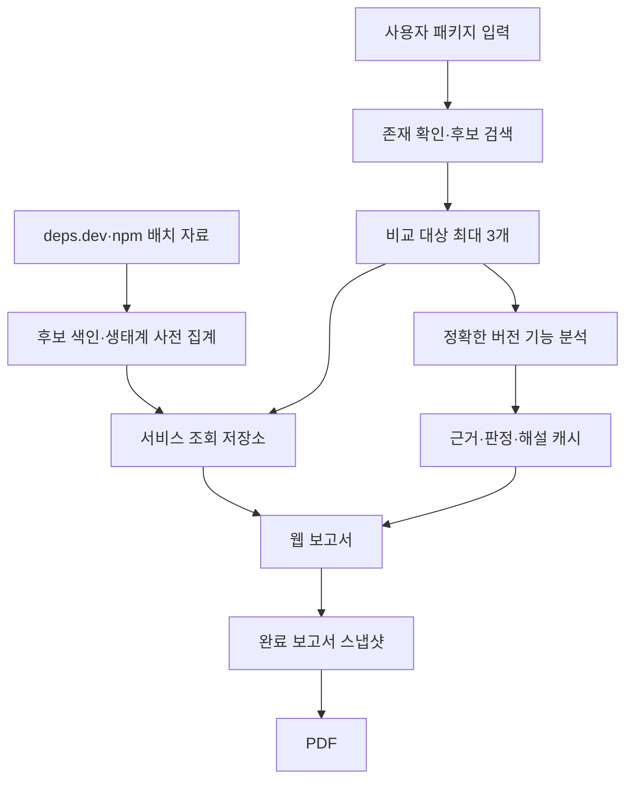

# OSS Shift 기능별 개발 구상안 0902

작성 기준일: 2026-09-02
문서 상태: 최종본
연결 문서: `OSS_Shift_요구사항_명세서_0902.md`, `OSS_Shift_메뉴구조_IA_0902.md`, `OSS_Shift_서비스_기획서_0902.md`

이 문서는 확정된 사용자 경험을 개발 가능한 데이터·상태·처리 계약으로 옮긴다. 특정 프레임워크나 공급자를 강제하는 최종 기술 명세는 아니지만, 화면에서 요구하는 결과와 상태를 누락해서는 안 된다.

표기:

- **제품 계약**: 구현 방식과 무관하게 반드시 만족해야 하는 조건
- **권장 구조**: 현재 검증과 비용·호출 제한을 고려한 우선 구현안
- **실험 필요**: 개발 환경에서 측정 후 수치를 확정할 항목

## 1. 0902 핵심 결론

### 1.1 처리 구조

OSS Shift는 한 방식으로 모든 데이터를 실시간 수집하지 않는다.

| 구역 | 권장 처리 | 이유 |
| --- | --- | --- |
| 후보 검색 | 사전 색인·로컬 검색 | 사용자 요청마다 대량 외부 조회를 하지 않음 |
| 보고서 1페이지 | 배치·사전 집계 중심 | 동일 지표를 반복 계산하지 않음 |
| Downloads | 필요한 기간 캐시 | 호출 제한과 응답 지연 완화 |
| 보고서 2페이지 | 정확한 버전 최초 요청 분석 + 영구 캐시 | 모든 버전 사전 분석 방지 |
| GitHub 커뮤니티 | 짧은 TTL 갱신 캐시 | 최신성과 API 제한 균형 |
| PDF | 완료 보고서 스냅샷 재사용 | 화면과 다른 재계산 방지 |

### 1.2 버전은 세 상태로 분리

1. 후보 단계: 버전 없음
2. Dependency 표시 버전: `Total` 또는 특정 버전
3. 기능 비교 버전: 정확한 최신 안정 버전 또는 사용자 선택 버전

Dependency 표시 버전 변경은 기능 비교 분석·근거 캐시·판정을 무효화하지 않는다.

### 1.3 기능 비교 원칙

- 정확한 버전의 npm Registry 응답과 배포 tarball을 기준 자료로 사용한다.
- 검증된 버전 태그·커밋·문서는 보조 근거로 사용한다.
- 패키지 코드를 설치·빌드·실행하지 않는다.
- AI에는 구조화된 근거와 evidence ID만 제공한다.
- AI 결과는 근거 ID, 패키지, 버전, 허용 판정값을 검증한다.
- 같은 버전 근거가 충돌하면 AI가 승자를 고르지 않는다.

## 2. 사용자 여정과 시스템 책임

| 단계 | 시스템 책임 | 주요 결과 |
| --- | --- | --- |
| 패키지 입력 | npm 패키지 존재 확인 | package, exists, status |
| 후보 선택 | 후보 검색·카드 구성·기본 선택 | 후보 최대 3개, 상위 2개 선택 |
| 비교 대상 확정 | 최대 3개·중복·존재 검증 | comparisonPackages |
| 생태계 변화 | 사전 집계·기간 자료 결합 | Dependency, Activity, Version Share |
| 기능 비교 | 정확한 버전 결정·캐시 조회·분석 | assessment, evidence, narrative |
| 재분석 | 이전 결과 보존·새 실행·차이 생성 | analysisRun, diff |
| Evidence Drawer | 셀 단위 근거 응답 | assessment + grouped evidence |
| GitHub 커뮤니티 | 저장소 검증·수치·논의 요약 | repository scope, discussions |
| PDF | 적격성 검사·스냅샷·문서 생성 | reportSnapshot, pdfJob |

### 기능 번호 연결

| 기능 | 개발 구상 위치 |
| --- | --- |
| 기능-01 패키지 입력 | 2·4장 |
| 기능-02 패키지 존재 확인 | 2·4장 |
| 기능-03 후보 제공 | 4장 |
| 기능-04 비교 대상 확정 | 4장 |
| 기능-05 기간·기준일 | 5장 |
| 기능-06 Downloads | 5.3장 |
| 기능-07 Dependency | 5.1·5.2장 |
| 기능-08 유지·유입·이탈 | 5.1·5.2장 |
| 기능-09 생태계 변화 통합 | 5장 |
| 기능-10 기능 버전·근거 수집 | 6·9장 |
| 기능-11 환경·설치 조건 | 6~8장 |
| 기능-12 기능 비교 | 7·8장 |
| 기능-13 근거·해설·Drawer | 7·8·10장 |
| 기능-14 PDF | 13장 |
| 기능-15 서비스 소개 | 정적 화면, 사용자 문서 기준 |
| 기능-16 자료 상태·오류 | 7·9·11·13장 |
| 기능-17 Version Share | 5.4장 |
| 확장-01 버전 고착 심화 | 12.1장 |
| 확장-02 관측된 교체 흐름 | 12.2장 |
| 확장-03 Issues·GitHub 커뮤니티 | 5.5·12.3·12.4장 |

## 3. 권장 전체 구조



### 역할 분리

| 역할 | 책임 |
| --- | --- |
| 후보 배치 | 패키지 설명·키워드 정제, 임베딩, 색인 갱신 |
| 생태계 배치 | 직접·간접 의존, 유지·유입·이탈, Version Share 집계 |
| 서비스 API | 입력 검증, 후보·보고서 조회, 화면 상태 조합 |
| 분석 Worker | Registry·tarball 수집, 정적 추출, 근거 생성 |
| 비교 Worker | 근거 연결, 판정, 중립 해설 생성·검증 |
| GitHub Worker | 저장소 연결 검증, 시계열·논의 수집, TTL 갱신 |
| PDF Worker | ReportSnapshot을 문서 레이아웃으로 변환 |

## 4. 후보 검색과 선택

### 4.1 후보 색인

기본 텍스트:

- description
- 확보 가능한 keywords

후보 이름은 식별자다. 이름을 임베딩 본문에 포함할지는 다국어·약어·브랜드 효과를 포함해 실험한다.

### 4.2 후보 검색

권장 흐름:

1. 입력 패키지 존재 확인
2. 색인에서 입력 패키지 벡터 조회
3. 유사 후보를 넉넉히 검색
4. 입력 패키지 자신, 폐기 패키지, 명백한 플러그인·어댑터 후보 제외
5. 관련성 기준 정렬
6. 기준 이상 후보 최대 3개 반환
7. 상위 2개를 `defaultSelected=true`로 반환

후보 검색·정렬 과정에 생성형 AI를 호출하지 않는다.

### 4.3 후보 응답 예시

```json
{
  "basePackage": "winston",
  "maxComparisonPackages": 3,
  "candidates": [
    {
      "package": "pino",
      "description": "Fast JSON logger for Node.js",
      "descriptionSimilarity": 0.92,
      "sharedKeywords": ["logger", "json"],
      "publishedAt": "2026-08-21",
      "dataStatus": "READY",
      "defaultSelected": true
    }
  ]
}
```

후보 응답에 기능 비교 버전을 포함하지 않는다.
`candidates`에는 `basePackage`를 포함하지 않는다. 화면의 후보 카드 최대 3개와 최종 비교 대상 최대 3개는 서로 다른 제한이다.

### 4.4 비교 대상 확정 계약

- 기준 패키지는 항상 포함
- 기준 패키지 해제 요청은 거부
- 최종 패키지 수 1~3
- 패키지명 중복 금지
- 네 번째 패키지 요청은 기존 선택을 자동 제거하지 않고 `MAX_SELECTION_REACHED` 반환
- 직접 추가 패키지는 존재 확인 후 `manualSelection`으로 추가하고 후보 검색 순위는 변경하지 않음
- 후보 검색 실패와 유효 후보 0개를 서로 다른 상태로 반환

## 5. 보고서 1페이지

### 5.1 사전 집계

**제품 계약**

- 직접 의존과 간접 의존을 분리한다.
- 유지·유입·이탈에서 자료 없음과 오류를 제외한다.
- 같은 기준일·규칙으로 재실행할 때 결과를 재현할 수 있어야 한다.
- 패키지별 시계열과 자료 상태를 함께 저장한다.

**권장 구조**

- deps.dev BigQuery에서 필요한 npm 관계 열만 읽는다.
- 두 EC2 Spark 작업이 실제 partition을 나눠 처리한다.
- 원본 전체를 장기 저장하지 않고 최종 집계와 검증 기록만 저장한다.
- MVP 사전 집계 범위는 3만 패키지, 확장 성능 목표는 10만 이상으로 둔다.

### 5.2 Dependency 표시 계약

```json
{
  "relationshipType": "DIRECT",
  "packages": [
    {
      "package": "winston",
      "availableDisplayVersions": ["3.19.0", "3.18.3"],
      "selectedDisplayVersion": "TOTAL",
      "series": [],
      "summary": {
        "retained": 12481,
        "inflow": 2143,
        "outflow": 1395
      },
      "dataStatus": "COMPLETE"
    }
  ]
}
```

각 패키지의 `selectedDisplayVersion`은 독립적이며 UI 세션 또는 보고서 필터 상태에 저장한다. 이 값은 기능 분석 캐시 키에 포함하지 않는다.

### 5.3 Downloads

- npm 공식 Downloads 자료 사용
- MVP 최대 18개월
- 기간과 호출 기준일 기록
- 누락 구간은 null/gap으로 보존
- 0은 정상 응답에서 실제 값이 0일 때만 사용

### 5.4 Version Share

집계 결과 예시:

```json
{
  "package": "winston",
  "groups": [
    {"label": "3.x", "count": 5400, "share": 0.54},
    {"label": "2.x", "count": 3100, "share": 0.31},
    {"label": "1.x", "count": 1200, "share": 0.12},
    {"label": "UNRESOLVED", "count": 300, "share": 0.03}
  ],
  "interpretation": "PUBLIC_REQUIREMENT_DISTRIBUTION"
}
```

해석 불가 조건은 임의 주버전에 포함하지 않는다. 실제 설치 버전으로 명명하지 않는다.

### 5.5 Issues 확장

GitHub 저장소 연결이 검증된 패키지만 시계열을 제공한다.

- 패키지와 저장소의 연결 범위 저장
- 저장소 전체 또는 패키지 단위 구분
- 호출 실패·제한 구간을 null로 유지
- GitHub 커뮤니티 페이지와 같은 저장소 검증 결과 사용

## 6. 보고서 2페이지 자료 우선순위

### 6.1 기준 자료

| 우선순위 | 출처 | 역할 |
| --- | --- | --- |
| 1 | npm Registry 정확한 버전 응답 | 버전·dist·tarball·무결성 |
| 2 | 정확한 버전 tarball | package.json, README, 타입 선언, 공개 배포 파일 |
| 3 | deps.dev 버전 자료 | 버전·라이선스·advisory·provenance 보조 확인 |
| 4 | 검증된 GitHub 태그·커밋·버전 문서 | 배포본 부족 근거 보완 |
| 5 | 기본 브랜치 최신 문서 | 최신 참고만 허용, 과거 버전 확정 근거 금지 |

### 6.2 안전 원칙

- Registry가 반환한 tarball 주소만 사용
- dist.integrity 검증
- 상위 경로·절대 경로·위험한 심볼릭 링크 차단
- 압축 해제 크기·파일 수·시간 상한
- install, build, postinstall, 임의 JavaScript 실행 금지
- README의 지시문을 명령으로 실행하지 않음
- tarball과 해제 결과는 기본적으로 임시 사용

## 7. 기능 분석 계약

### 7.1 핵심 엔터티

#### FeatureAssessment

```
assessmentId
package
version
featureId
featureLabel
verdict
dataStatus
summary
analysisRunId
analyzedAt
```

#### EvidenceRecord

```
evidenceId
snapshotId
package
version
sourceType
path
section
excerpt
confirmedContent
verificationLevel
```

#### AssessmentEvidence

```
assessmentId
evidenceId
evidenceRole
displayPriority
defaultExpanded
verdictContribution
```

#### SourceSnapshot

```
snapshotId
package
version
integrityAbbrev
sourceCollectedAt
sourceStatus
officialTagMatch
provenanceStatus
```

#### AnalysisRun

```
analysisRunId
requestedVersions
runStatus
progressStep
analyzerVersion
rulesetVersion
startedAt
completedAt
previousCompletedRunId
```

#### ReanalysisDiff

```
previousRunId
currentRunId
changedAssessments
addedEvidenceIds
removedEvidenceIds
reasonSummary
```

#### ReportSnapshot

```
reportSnapshotId
comparisonPackages
ecosystemPeriod
dependencyDisplayFilters
featureVersions
completedAnalysisRunIds
communitySnapshotIds
dataStatuses
createdAt
```

### 7.2 verdict와 dataStatus 분리

`verdict`는 기능 판정이고 `dataStatus`는 자료·분석 상태다.

```
verdict:
SUPPORTED
CONDITIONALLY_SUPPORTED
LIMITED_SUPPORT
UNCONFIRMED
UNSUPPORTED

dataStatus:
COMPLETE
PARTIAL
NO_DATA
COLLECTION_ERROR
CONFLICT
STALE
```

`UNSUPPORTED`는 공식적인 부정 근거가 연결된 경우에만 허용한다.

### 7.3 evidenceRole

```
SUPPORTS
LIMITS
CONTRADICTS
CONTEXT
SEARCH_TRACE
```

- SUPPORTS: 지원을 직접 뒷받침
- LIMITS: 환경·설정·범위 제한
- CONTRADICTS: 다른 근거와 충돌하거나 지원을 보류하게 함
- CONTEXT: 판정 해석에 필요한 배경
- SEARCH_TRACE: 무엇을 확인했지만 발견하지 못했는지 기록

### 7.4 sourceType 예시

```
REGISTRY_METADATA
TARBALL_PACKAGE_JSON
TARBALL_README
TYPE_DECLARATION
PUBLIC_ENTRYPOINT
VERSIONED_DOC
GITHUB_TAG
GITHUB_COMMIT
DEPS_DEV
STATIC_ANALYZER
```

`verificationLevel`은 숫자 점수가 아니라 `OFFICIAL_VERSIONED`, `OFFICIAL_LATEST`, `DISTRIBUTED_ARTIFACT`, `STATIC_CONFIRMATION`, `SUPPLEMENTARY` 같은 범주형 값으로 둔다.

## 8. 기능 판정·비교 흐름

1. 패키지별 기능 근거 후보 생성
2. 공통 환경 정보 구조화
3. 실제 근거가 있는 기능 질문 후보 생성
4. 비슷한 사용자 목적의 기능만 묶음
5. 패키지별 관련 근거 검색
6. 허용된 verdict 후보 생성
7. evidence ID와 판정 기여 검증
8. 같은 버전 충돌 여부 검사
9. 근거가 충분하면 핵심 5~7개 선정, 부족하면 확인 가능한 수만 반환
10. 구조화 표 생성
11. 근거 ID가 연결된 중립 해설 생성

고정된 HTTP 기능표를 다른 분야에 재사용하지 않는다. 비교 가능한 기능이 부족하면 `COMPARISON_LIMITED` 상태를 반환하고 억지 표를 만들지 않는다.

### 판정 검증 규칙

| verdict | 최소 조건 |
| --- | --- |
| SUPPORTED | SUPPORTS 근거 1개 이상, 치명적 충돌 없음 |
| CONDITIONALLY_SUPPORTED | SUPPORTS와 LIMITS가 함께 존재하거나 명시 조건 존재 |
| LIMITED_SUPPORT | 기능 일부 근거와 범위 제한 근거 존재 |
| UNCONFIRMED | 직접 근거 부족 또는 CONFLICT |
| UNSUPPORTED | 명시적인 공식 부정 근거 존재 |

## 9. 기능 비교 버전과 재분석

### 9.1 최초 진입

- 패키지별 latest dist-tag를 확인하되 사전 배포가 아니면 구체 안정 버전으로 저장
- latest가 사전 배포를 가리키면 공개 버전 목록에서 가장 최근의 비사전 배포 버전을 선택
- 비사전 배포 버전이 하나도 없으면 `NO_STABLE_VERSION`으로 반환하고 사전 배포를 자동 선택하지 않음
- 완료 캐시가 있으면 즉시 결과 표시
- 없으면 비동기 분석 실행

### 9.2 버전 변경

버전 드롭다운 변경은 즉시 분석을 시작하지 않는다.

```
selectedFeatureVersion != completedFeatureVersion
→ uiState = REANALYSIS_REQUIRED
→ 기존 completed result 유지
→ PDF eligibility = BLOCKED
```

### 9.3 재분석 실행

- 동일 요청 중복 실행 방지
- run idempotency 보장
- 기존 완료 run을 `previousCompletedRunId`로 연결
- 성공 시에만 현재 완료 결과 포인터 교체
- 실패하면 기존 완료 결과 유지
- 부분 완료는 영향받는 assessment만 PARTIAL/UNCONFIRMED 처리

### 9.4 진행 상태 전달

권장 방식은 SSE 또는 동등한 단방향 스트리밍이다.

예시 단계:

```
VERSION_VERIFIED
ARTIFACT_COLLECTED
ENVIRONMENT_EXTRACTED
EVIDENCE_EXTRACTED
ASSESSMENTS_LINKED
NARRATIVE_GENERATED
COMPLETED
```

완료되지 않은 단계를 완료로 전송하지 않는다. 재연결 시 현재 run 상태를 조회할 수 있어야 한다.

### 9.5 재분석 변경점

클라이언트에는 직전 완료 결과와 현재 결과의 변경점만 제공한다.

- verdict 변경
- 새 근거·제한 근거 추가
- 버전 자료 변경
- analyzer/ruleset 변경

전체 분석 이력은 내부 감사용으로 유지할 수 있으나 MVP UI에는 제공하지 않는다.

## 10. Evidence Drawer 응답 계약

Drawer는 셀 중심 요청을 사용한다.

```
GET /reports/{reportId}/features/{featureId}/packages/{package}/evidence
```

응답에는 다음을 포함한다.

- 셀 assessment
- 같은 기능의 패키지 탭 정보
- 역할별 evidence groups
- 핵심 근거 defaultExpanded
- 기술 정보 요약
- 허용 복사 필드
- reason-based retry action
- focus return target를 복원할 수 있는 cell identifier

클라이언트 응답에는 원본 URL, 내부 저장 경로, 비밀값, 전체 integrity를 포함하지 않는다. 저장소와 출처 식별자는 표시 문자열로만 반환하며 클릭 가능한 URL 필드는 보고서·Drawer·커뮤니티 응답에 제공하지 않는다.

### 기술 정보 표시 범위

- package@version
- 축약 integrity와 검증 상태
- 파일 수·압축 해제 크기
- 공식 태그 일치 상태
- provenance 상태
- source snapshot ID
- cache ID 축약값
- analyzer/ruleset 버전
- 수집·완료 시각

### 발췌 계약

- 기본 3줄 분량
- 내부 펼침 최대 10줄
- 전체 문서·전체 섹션 반환 금지
- source excerpt와 service interpretation 분리

## 11. 미확인과 재시도 정책

| reasonCode | UI 행동 |
| --- | --- |
| TRANSIENT_FETCH_ERROR | 다시 시도 |
| PARTIAL_SOURCE_FAILURE | 실패 자료 다시 시도 |
| ANALYZER_STALE | 새 분석 |
| SOURCE_ABSENT | 재시도 없음, 확인 범위 표시 |
| EVIDENCE_CONFLICT | 재시도 없음, 충돌 유지 |
| RUNTIME_REQUIRED | 추가 검증 필요 안내 |

단순히 결과가 미확인이라는 이유로 항상 재분석 버튼을 제공하지 않는다.

## 12. 확장 기능

### 12.1 버전 고착 심화

MVP Version Share의 원자료와 버전 조건 해석 결과를 재사용하되, 다음을 별도 분석 결과로 둔다.

- 현재 주버전 조건
- 이전 주버전 조건
- 여러 주버전 허용 조건
- 태그·주소·비표준 조건
- 안전하게 해석할 수 없는 조건

버전 조건 파서는 npm semver 규칙에 맞는 검증된 구현을 사용한다. 결과는 실제 설치 버전·업데이트 의지·위험 점수로 변환하지 않는다.

### 12.2 관측된 교체 흐름

권장 흐름:

1. 같은 공개 패키지의 연속 관측에서 직접 의존 추가·제거를 계산한다.
2. 동일 변화 안에서 제거와 추가가 함께 나타난 패키지 관계를 찾는다.
3. direct에서 peer·optional로 종류만 이동한 관계를 분리한다.
4. 같은 주체의 반복 변화를 과도하게 세지 않도록 중복을 줄인다.
5. 최소 근거 기준을 통과한 관계만 제공한다.

결과에는 관측 수, 기간, 관계 종류, 제외 사유를 함께 저장한다. 원인·완전한 마이그레이션·권장 교체로 해석하지 않는다.

### 12.3 GitHub 저장소 연결 검증

가능한 보조 정보:

- Registry repository
- provenance
- gitHead
- 검증된 tag·commit
- 모노레포 패키지 경로

검증 결과에 repository scope를 저장한다.

```
PACKAGE_SCOPED
REPOSITORY_WIDE
AMBIGUOUS
UNVERIFIED
```

### 12.4 GitHub 두 출력 분리

1. Activity Issues
    - 수치·시계열
    - 짧은 TTL 캐시
    - 부분 구간 상태
2. GitHub 커뮤니티 3페이지
    - 간단한 상단 수치
    - 주요 Issue/PR의 주장·작업 중심 서술
    - 합의 여부와 조회 시점

커뮤니티 snapshot은 비교 패키지별로 분리한다. 보고서 응답은 최종 비교 순서의 package tab 목록과 각 탭의 repository scope·availability reason을 함께 반환한다.

```
AVAILABLE
UNVERIFIED_REPOSITORY
AMBIGUOUS_SCOPE
FETCH_LIMITED
NO_DISCUSSION_DATA
```

첫 `AVAILABLE` 패키지를 기본 탭으로 사용한다. 미검증 패키지에 다른 패키지의 snapshot을 대입하지 않는다.

기본 브랜치 최신 문서를 과거 기능 비교의 확정 근거로 재사용하지 않는다.

## 13. PDF 생성 계약

### 13.1 ReportSnapshot

PDF 생성 요청 시 새 분석을 하지 않고 현재 완료 보고서를 ReportSnapshot으로 고정한다.

포함:

- comparisonPackages
- ecosystem period와 source dates
- package별 dependency display filter
- feature version과 completed run id
- assessment/evidence references
- narrative 결과
- community snapshot이 있으면 포함
- data status summary

제외:

- 현재 탭
- Drawer 상태
- 접힘·스크롤 상태
- 진행 메시지
- 미완료 run

`communitySnapshotIds`에는 현재 UI 탭이 아니라 비교 대상 중 완료된 모든 패키지 snapshot을 넣는다.

### 13.2 적격성

```
READY:
- 최초 핵심 결과 완료
- 선택 feature version과 completed result 일치
- 재분석 진행 중 아님

BLOCKED:
- REANALYSIS_REQUIRED
- ANALYSIS_RUNNING
- INITIAL_RESULT_INCOMPLETE
- VERSION_RESULT_MISMATCH
```

일부 기간 없음, 일부 미확인, 근거 충돌, 보조 자료 실패, narrative 실패는 차단 사유가 아니다. 상태를 PDF에 표시한다.

### 13.3 PDF 작업 상태

```
READY
QUEUED
GENERATING
COMPLETE
FAILED
```

다운로드 실패와 생성 실패를 분리한다. 생성이 완료됐으면 같은 파일을 다시 제공한다.

### 13.4 문서 레이아웃

1. 표지·요약
2. 생태계 변화: Downloads, Dependency·표시 필터, 유지·유입·이탈, Version Share, 가능한 Issues
3. 기능 비교: 분석 버전, 핵심 환경, 핵심 기능표, 중립 해설
4. 판정 또는 narrative에 연결된 근거 요약 부록
5. 완료 snapshot이 있는 비교 패키지별 커뮤니티 구역

페이지 분할 규칙:

- 그래프 분할 금지
- 표 제목과 첫 행 분리 금지
- 다음 용지에서도 표 헤더 반복
- 기능 비교 한 행 분할 금지
- 해설은 문단 경계에서만 분할
- 근거 한 기록 분할 금지
- 자료 상태 경고를 해당 데이터와 분리하지 않음

### 13.5 근거 부록 노출 범위

포함:

- evidence ID
- package@version
- feature label
- source type
- path·section
- confirmed content
- verdict contribution

제외:

- 전체 발췌
- 외부 URL
- 전체 integrity
- cache key
- 내부 경로
- analyzer 내부 상세

### 13.6 파일명

기본 예시:

```
OSS-Shift_winston-pino-bunyan_2026-09-02.pdf
```

파일명 길이·안전 문자 규칙은 개발 시 확정한다.

## 14. 캐시와 저장

### 14.1 기능 분석 캐시 키

키 구성은 `package + version + dist.integrity + analyzerVersion + rulesetVersion`이다.

```
package
+ version
+ dist.integrity
+ analyzerVersion
+ rulesetVersion
```

같은 package@version이라도 무결성·분석기·규칙 버전이 다르면 같은 결과로 취급하지 않는다.

### 14.2 장기 저장

- 후보 검색용 최소 메타데이터·임베딩
- 생태계 최종 집계
- 다운로드 기간 집계
- 기능 assessment와 evidence
- SourceSnapshot·AnalysisRun·ReportSnapshot
- 생성 PDF와 생성 메타데이터
- 검증·실패·재시도 기록

### 14.3 기본 장기 미보관

- BigQuery 원본 전체
- 모든 버전 tarball
- 압축 해제 결과 전체
- GitHub 원문 전체
- Spark 임시 셔플 자료

## 15. 비용·호출 제한 대응

### 후보 검색

- 사용자 요청마다 대량 패키지 API 조회 금지
- 사전 색인 갱신 주기와 단일 패키지 보완 경로 분리

### 보고서 1페이지

- 사전 집계 재사용
- Downloads 기간 캐시
- 실패 구간만 재수집

### 보고서 2페이지

- 정확한 버전 최초 요청 분석
- 영구 캐시 적중 우선
- 전체 문서를 AI에 전달하지 않고 구조화 근거만 전달
- 동일 run 중복 방지

### GitHub

- 저장소 검증 결과 캐시
- 짧은 TTL과 조건부 갱신
- 시계열과 논의 원문 수집을 분리
- rate limit 시 이전 조회 시점과 부분 상태 표시

### PDF

- 완료 snapshot 재사용
- 동일 snapshot의 완료 PDF 재다운로드
- 다운로드 실패로 재생성하지 않음

## 16. 실제 POC 검증 결과

검증 대상:

- winston 3.19.0
- pino 10.3.1
- bunyan 1.8.15

### 16.1 공통 통과

- npm Registry 정확한 버전 응답 확인
- tarball 다운로드와 dist.integrity 검증
- package.json, README, 타입·공개 진입 자료 정적 확인
- GitHub 태그와 package.json/README 대응 확인
- deps.dev 버전 조회 성공
- unsafe tar path 0건
- 위험 심볼릭 링크 0건
- 패키지 설치·빌드·코드 실행 없이 분석
- 온라인 수집 후 완전 오프라인 캐시 추출 성공

### 16.2 개별 확인

| 패키지 | 확인 결과 |
| --- | --- |
| winston 3.19.0 | Node.js `>=12`, CommonJS의 ESM named import 관련 주의 확인 |
| pino 10.3.1 | 최소 Node 조건은 현재 자료에서 미확인, 정적 타입 진입 검사 문제 없음, provenance 확인 |
| bunyan 1.8.15 | 비표준 engine 선언 `>=0.10`, 번들 타입 없음 |

### 16.3 도구별 결과

- publint: 치명 오류 없이 개선 제안 확인
- Are The Types Wrong:
    - pino: 문제 없음
    - winston: named export 경고
    - bunyan: 번들 타입 없음
- provenance:
    - pino 확인
    - winston·bunyan은 현재 자료에서 미확인

### 16.4 POC 해석

세 패키지 시험은 하이브리드 구조와 안전한 정적 분석이 실제로 가능함을 보여준다. 다만 세 패키지 결과를 전체 npm 패키지의 성공률·처리 시간·자료 완성도로 일반화하지 않는다.

## 17. 개발 순서

| 단계 | 작업 | 완료 기준 |
| --- | --- | --- |
| 1 | 공통 스키마·상태·기능 번호 고정 | 4개 문서·Figma 용어 일치 |
| 2 | 패키지 입력·후보 검색·총 3개 선택 | 기본 선택·해제·직접 추가 검수 |
| 3 | 1페이지 사전 집계·조회 API | Total·독립 필터·Downloads·Version Share |
| 4 | 정확한 버전 수집·안전 추출 | 세 POC 재현·실패 상태 |
| 5 | assessment/evidence 계약 | 판정·근거·충돌 검증 |
| 6 | 기능 비교 UI·진행·재분석 | 이전 결과 보존·성공 교체 |
| 7 | Evidence Drawer | 셀 단위·그룹·발췌·복사·외부 이동 없음 |
| 8 | PDF snapshot·생성 상태 | 적격성·부분 완료·재다운로드 |
| 9 | 확장 GitHub | Issues·글 중심 커뮤니티·TTL |
| 10 | 전체 성능·비용·안전 검수 | 반복 실행·호출량·저장량 기록 |

## 18. 필수 시험 시나리오

1. 기준 패키지와 상위 후보 2개 기본 선택
2. 기준 패키지 해제 요청 거부
3. 네 번째 패키지 추가 차단과 수동 해제
4. 후보 0개와 후보 검색 실패 상태 분리
5. Dependency 패키지별 Total·특정 버전 독립 변경
6. 기능 최신 안정 버전 캐시 적중·미적중
7. 정식 버전 없음에서 사전 배포 자동 선택 차단
8. 기능 버전 변경 후 재분석 필요와 PDF 차단
9. 재분석 성공 시 원자적 결과 교체
10. 재분석 실패 시 이전 결과 유지
11. 일부 출처 실패 시 영향 셀만 미확인
12. source absent에서 반복 재분석 미제공
13. 같은 버전 근거 충돌에서 UNCONFIRMED+CONFLICT
14. Drawer·커뮤니티 응답에 외부 URL·전체 원문이 없는지 확인
15. GitHub 패키지 탭별 snapshot 분리와 미검증 탭 비활성
16. PDF에 완료된 모든 커뮤니티 snapshot 포함
17. PDF 부분 결과 생성과 상태 경고
18. PDF 다운로드 실패 후 동일 파일 재다운로드
19. GitHub rate limit 시 이전 조회 시점·부분 상태
20. 악성 tar path·symlink·압축 폭탄·코드 실행 차단

## 19. 공식 자료

- deps.dev BigQuery: https://docs.deps.dev/bigquery/v1/
- BigQuery Storage Read API: https://cloud.google.com/bigquery/docs/reference/storage
- npm Registry API: https://github.com/npm/registry/blob/main/docs/REGISTRY-API.md
- npm package metadata: https://github.com/npm/registry/blob/main/docs/responses/package-metadata.md
- npm Downloads API: https://github.com/npm/registry/blob/main/docs/download-counts.md
- npm package.json: https://docs.npmjs.com/cli/v11/configuring-npm/package-json/
- Node.js packages: https://nodejs.org/api/packages.html
- GitHub REST API: https://docs.github.com/en/rest

> **최종 개발 기준** 후보 단계에서는 패키지만 다루고, 보고서 1페이지의 표시 버전과 2페이지의 기능 분석 버전을 분리한다. 기능 결과는 정확한 버전 근거·판정·자료 상태를 함께 저장하며, 새 분석은 이전 정상 결과를 보존한 채 실행한다. PDF는 완료된 ReportSnapshot을 사용하고 화면과 다른 재계산을 하지 않는다.
